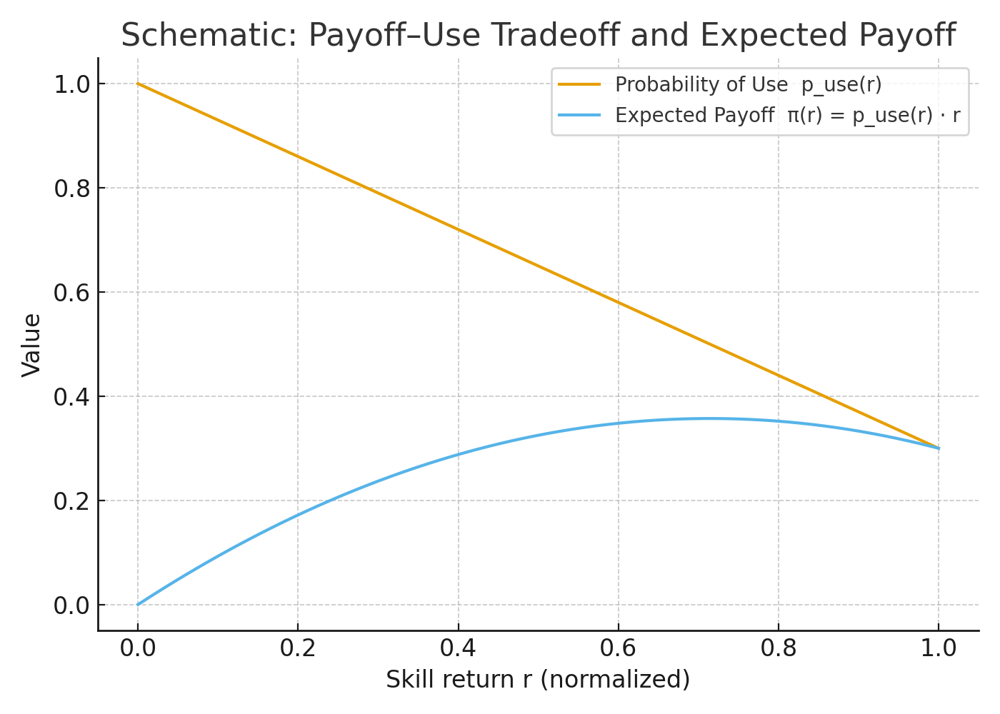

# ABM — {background-color="#2c3e50" color="white" .center .middle}

---

## 1) Purpose

::: {.div style="font-size: 25px; text-align: left; margin-top: 3em;"}
Explain **how and when** asymmetries in skills diffusion (upward/lateral/downward) emerge from four minimal levers:

1. **Status gradient** between source and destination occupations.
2. **Educational/type gate** that penalizes mismatches.
3. **Payoff–use trade-off**: higher-return skills are harder to deploy frequently in lower-status jobs.
4. **Proximity**: local network exposure (with optional global fashion signal).
:::

---

## 2a) Entities

::: {.div style="font-size: 25px; text-align: left; margin-top: 3em;"}

**Occupations and Skills**


$$
\mathcal O=\{1,\dots,O\},\qquad \mathcal S=\{1,\dots,S\}.
$$


**Network**


$$
W=(w_{oo'})\quad w_{oo'}\ge 0,\quad \sum_{o'} w_{oo'}=1.
$$


**Definitions:**

- $\mathcal O$: set of occupations; $o\in\mathcal O$; cardinality $|\mathcal O|=O$.
- $\mathcal S$: set of skills; $s\in\mathcal S$; cardinality $|\mathcal S|=S$.
- $W=(w_{oo'})$: row-stochastic similarity/adjacency; $w_{oo'}$ is the weight of influence/exposure from $o'$ to $o$.
- $\mathcal N_o=\{o'\in\mathcal O: w_{oo'}>0\}$: $o$'s neighborhood in the occupational network.

:::


## 2b) State

::: {.div style="font-size: 25px; text-align: left; margin-top: 3em;"}

**Occupational state and attributes**


$$
S_o(t)\subseteq \mathcal S,\qquad SES_o\in\mathbb R,\qquad k\in\mathbb N.
$$


**Global signal (optional)**


$$
G_s(t)\in[0,1],\qquad \tau_g\in[0,1].
$$


**Definitions:**

- $S_o(t)$: set of skills currently used by occupation $o$ at time $t$.
- $SES_o$: continuous status index of occupation $o$ (e.g., socioeconomic standing).
- $k$: per-period **adoption capacity** (maximum number of *new* skills $o$ can adopt at $t$).
- $G_s(t)$: global prevalence of skill $s$ at time $t$ (normalized to $[0,1]$).
- $\tau_g$: threshold on global prevalence to include $s$ in the consideration set.

:::


## 2c) Scales

::: {.div style="font-size: 25px; text-align: left; margin-top: 3em;"}

**Time**


$$
t\in\{0,1,\dots,T\}.
$$


**Updating**


Synchronous baseline (robustness: test asynchronous/random order).


**Definitions:**

- $t$: discrete period; all decisions at $t$ use information from $t-1$.

:::

## 3) Consideration Set & Exposure

::: {.div style="font-size: 25px; text-align: left; margin-top: 3em;"}
For occupation $o$, the **consideration set** combines local neighbors’ skills and an optional global signal:

$$
\mathcal C_o(t)=\{s:\exists\,o'\; w_{oo'}>0,\ s\in S_{o'}(t-1)\}\ \cup\ \{s: G_s(t-1)>\tau_g\}.
$$

Define the **local exposure**:

$$
Y_{o,s}(t-1)=\sum_{o'} w_{oo'}\,\mathbf 1\{s\in S_{o'}(t-1)\}.
$$

**Local–global mix (with $\rho$):**

$$
E_{o,s}(t-1)=(1-\rho)\,Y_{o,s}(t-1)+\rho\,\mathbf 1\{G_s(t-1)>\tau_g\}.
$$
Use $E_{o,s}$ wherever explicit exposure enters the decision rule.
:::

---

## 4) Payoff–Use Trade-off (Intuition)

::: {.columns}
::: {.column width="40%"}
::: {.div style="font-size: 25px; text-align: left; margin-top: 4em;"}
- Higher-return skills (large $r_s$) tend to be **harder to use frequently** in lower-status destinations.
- Expected gain is maximized at **intermediate** $r_s$ when use is still non-trivial.
:::
:::

::: {.column width="60%"}
::: {.div style="font-size: 25px; text-align: left; margin-top: 3em;"}
{fig-align="center" out-width="100%"}
:::
:::
:::

---

## 5) Payoff–Use Trade-off (Formal)

::: {.div style="font-size: 25px; text-align: left; margin-top: 3em;"}
Let $[x]_+ = \max\{x,0\}$. Define the **probability of use** with a clipped linear form that declines with return and distance, and penalizes mismatches:

$$
 p_{use,o}(s)=\big[1-\kappa\,r_s-\delta\,d_{os}\big]_+\cdot 
 (1-\theta\,\mathbf 1\{\text{education mismatch}\})\cdot
 (1-\psi\,\mathbf 1\{\text{type mismatch}\}).
$$

The **expected utility** of adopting $s$ into occupation $o$:

$$
\pi_{o,s}=p_{use,o}(s)\cdot r_s - \lambda\, d_{os}.
$$
:::

---

## 6) Status Gradient & Directionality

::: {.div style="font-size: 25px; text-align: left; margin-top: 3em;"}
Let $\mathcal N_o=\{o'\,|\,w_{oo'}>0\}$ be $o$'s neighborhood. Define **source-weighted** status gaps for any $s\in\mathcal C_o(t)$:

$$
\Delta^{+}_{o}(s)=\sum_{o'\in\mathcal N_o} w_{oo'}\,\mathbf 1\{s\in S_{o'}(t-1)\}\,\max(0,\, SES_{o'}-SES_o),
$$

$$
\Delta^{-}_{o}(s)=\sum_{o'\in\mathcal N_o} w_{oo'}\,\mathbf 1\{s\in S_{o'}(t-1)\}\,\max(0,\, SES_o-SES_{o'}).
$$
These measure upward vs downward direction **without** imposing legitimacy by type or direction ex ante.
:::

---

## 7) Decision Rule (Logit with "no-adopt")

::: {.div style="font-size: 25px; text-align: left; margin-top: 3em;"}
Latent utility for each candidate skill $s\in\mathcal C_o(t)$:

$$
 u_{o,s}=\alpha_o+\beta\,\pi_{o,s}+\beta^{+}\,\Delta^{+}_{o}(s)-\beta^{-}\,\Delta^{-}_{o}(s)+\mu\,E_{o,s}(t-1).
$$

Set $u_{o,\varnothing}\equiv 0$ unless otherwise stated. Choice probabilities (Multinomial Logit with an explicit **no-adopt** alternative $\varnothing$):

$$
 P_{o}(s)=\frac{\exp(u_{o,s})}{\exp(u_{o,\varnothing})+\sum_{q\in\mathcal C_o(t)}\exp(u_{o,q})}.
$$

**Capacity**: sample up to $k$ adoptions per $o$ **without replacement** according to $P_o(s)$ (or emulate $k$ via a congestion term in utilities).
:::

---

## 8) Process Overview & Scheduling

::: {.div style="font-size: 25px; text-align: left; margin-top: 3em;"}
At each period $t\to t{+}1$:

1. Build $\mathcal C_o(t)$ for all $o$ (neighbors + optional global signal).
2. Compute $d_{os}$, $p_{use,o}(s)$, $\pi_{o,s}$, utilities $u_{o,s}$.
3. Draw up to $k$ adoptions per occupation via the choice probabilities.
4. **Synchronous update**: $S_o(t{+}1)=S_o(t)\cup A_o(t)$.
5. Update global signal $G_s(t)$ if used.
6. With small probability $\epsilon$, add/rewire a **long tie** in $W$.
:::

---

## 9) Design Concepts (ODD-style)

::: {.div style="font-size: 25px; text-align: left; margin-top: 3em;"}
- **Basic principle:** selective imitation constrained by structural fit and costs of use; trade-off yields interior maxima → mid-return skills diffuse most.
- **Emergence:** asymmetric upward/lateral/downward flows arise from $(\kappa,\delta,\theta,\psi,\beta^{\pm})$; no exogenous legitimacy.
- **Sensing/Interaction:** local observation via $W$ and optional global fashion signal.
- **Stochasticity:** in discrete choice and rare long ties.
- **Observation:** adoption rates by type, distribution of $\Delta SES$ in events, decay with $d_{os}$, cascade sizes, trajectories.
:::

---

## 10) Initialization

::: {.div style="font-size: 25px; text-align: left; margin-top: 3em;"}
- Specify $|\mathcal O|,|\mathcal S|$, network $W$.
- Seeds $S_o(0)$: (i) **baseline** sparse; (ii) **stratified** (more high-return skills in high-SES occupations) to study mobility.
- Parameters (illustrative, not calibrated): $\kappa\in[0,1]$, $\delta,\lambda\ge0$, $\theta,\psi\in[0,1]$, $\rho\in[0,1]$, capacity $k\in\{1,2,\dots\}$, and $\beta,\beta^{\pm},\mu$ freely scaled.
:::

---

## 11) Submodels

::: {.div style="font-size: 25px; text-align: left; margin-top: 3em;"}
- **Distance** $d_{os}$: e.g.,
  $$
  d_{os}=\min_{o':\,s\in S_{o'}(t-1)}\,\mathrm{dist}_W(o,o') \quad \text{or} \quad d_{os}=\sum_{o'}w_{oo'}\,\mathbf 1\{s\in S_{o'}(t-1)\}\,\mathrm{dist}_W(o,o').
  $$
- **Education mismatch** (operational): let $edu(o)\in\{0,1,\dots\}$ be the gate in destination and $req(s)\in\{0,1,\dots\}$ the requirement of the skill;
  $$
  \mathbf 1\{\text{education mismatch}\}=\mathbf 1\{\,req(s)>edu(o)\,\}.
  $$
- **Type mismatch** (operational): let $\tau(s)\in\{\mathrm{cog},\mathrm{phy}\}$ and $\theta^{type}(o)$ the dominant type in $o$; parsimoniously,
  $$
  \mathbf 1\{\text{type mismatch}\}=\mathbf 1\{\,\tau(s)\ne \arg\max_{type}\,\theta^{type}(o)\,\}.
  $$
- **Global signal update**: $G_s(t)=f\!\big(\sum_o \mathbf 1\{s\in S_o(t)\}\big)$ or SES-weighted prevalence.
:::

---

## 12) Theoretical Experiments (No Calibration)

::: {.div style="font-size: 25px; text-align: left; margin-top: 3em;"}
- **Univariate sweeps:** $\kappa$ (trade-off steepness), $\theta/\psi$ (gates), $\rho$ (fashion), $k$ (capacity).
- **Mechanism toggles:** on/off $E_{o,s}$; on/off $\Delta^{\pm}$; on/off long ties $\epsilon$.
- **Scheduling:** synchronous vs asynchronous (random order).
- **Functional robustness:** replace clipping with a smooth logistic in $p_{use}$:
  $$
  p_{use,o}(s)=\sigma\big(a-b\,r_s-c\,d_{os}-\theta\,\mathbf 1\{\text{edu mis}\}-\psi\,\mathbf 1\{\text{type mis}\}\big),\ \ \sigma(x)=\frac{1}{1+e^{-x}}.
  $$
:::

---

## 12b) Reproducibility & Runs

::: {.div style="font-size: 25px; text-align: left; margin-top: 3em;"}
- **Seeds:** fix random seed per run; run $R$ replicates per parameter cell; report median and 80% PI.
- **Batch grid (example):** $\kappa\in\{0.2,0.5,0.8\}$, $\rho\in\{0,0.3,0.6\}$, $k\in\{1,2\}$.
- **Outputs:** store time series and event logs (adoptions with $(o,s,t)$ and $\Delta SES$) for diagnostics.
:::

---

## 12c) Rival Mechanisms & Null Models

::: {.div style="font-size: 25px; text-align: left; margin-top: 3em;"}
1) **Fashion-only:** $\beta^{+}=\beta^{-}=0$, utility depends only on $E_{o,s}$ and $r_s$.

2) **Functional-only:** $\beta^{+}=\beta^{-}=0$ and no explicit exposure (drop $E_{o,s}$) → adoption driven by $\pi_{o,s}$.

3) **Network/industry placebo:** rewire $W$ conserving degree (or, when calibrating, add NAICS FE). Compare P1–P5 vs full model.
:::

---

## 13) Outputs & Testable Implications

::: {.div style="font-size: 25px; text-align: left; margin-top: 3em;"}
- **P1 Upward share:** higher for **cognitive** than **physical** skills.
- **P2 Distance robustness:** cognitive adoption decays less with structural distance $d_{os}$.
- **P3 Gate sensitivity:** tightening the education gate reduces **physical** upward flows more.
- **P4 Positive tail:** adopted-event $\Delta SES$ shows a heavier positive tail for cognitive.
- **P5 Comparative statics:** widening $(\beta^{+}-\beta^{-})$ amplifies P1–P4.
- Diagnostics: adoption vs $r_s$; adoption vs $d_{os}$; hazard by $\Delta SES$.
:::

---

## 13b) Operational Definitions (Outcomes)

::: {.div style="font-size: 25px; text-align: left; margin-top: 3em;"}
**Upward share (by type)**

$$
\text{UpShare}_{type}=\frac{\#\{(o,s,t): s\in A_o(t),\ \Delta^{+}_{o}(s)>\Delta^{-}_{o}(s),\ \tau(s)=type\}}{\#\{(o,s,t): s\in A_o(t),\ \tau(s)=type\}}.
$$

**Distance decay (binned)**

Group adoptions by quantiles of $d_{os}$ and plot $\Pr(\text{adopt}|d\in q)$ by type.

**Gate sensitivity**

$$
\Delta\text{UpShare}_{type}(\theta: \theta_0\to\theta_1)=\text{UpShare}_{type}\big|_{\theta_1}-\text{UpShare}_{type}\big|_{\theta_0}.
$$

**Tail of $\Delta SES$ (CCDF)**

For adopted events, compare $\Pr(\Delta SES>x)$ across types.
:::

---

## 14) Minimal Pseudocode

::: {.div style="font-size: 40px; text-align: left; margin-top: 3em;"}
```text
for t in 1:T:
  for each occupation o in O:
    C = consideration_set(o, t, W, G, tau_g)
    for each s in C:
      d = distance(o, s, W)
      p_use = clip(1 - kappa*r[s] - delta*d) \
              * (1 - theta*edu_mismatch(s, o)) \
              * (1 - psi*type_mismatch(s, o))
      pi = p_use * r[s] - lambda*d
      u[s] = alpha[o] + beta*pi + beta_pos*Delta_plus(o, s) \
             - beta_neg*Delta_minus(o, s) + mu*E[o, s]
    A_o = sample_up_to_k_from_softmax(u U {u_null}, k)  # without replacement
  S(t+1) = synchronous_update(S(t), {A_o}_o)
  G = update_global_signal(S(t+1))
```
:::

