# I. THE PUZZLE {background-color="#2c3e50" color="white" .center .middle}

## The Puzzle: Labor Market Dynamism vs. Persistent Stratification

::: {.div style="font-size: 25px; text-align: left; margin-top: 3em;"}
- Contemporary labor markets exhibit unprecedented **dynamism**: technological advancements, globalization, and evolving industrial landscapes continually reshape the world of work [@kalleberg2011; @autor2015].

- Yet foundational structures of **occupational hierarchy** and **socio-economic stratification** exhibit remarkable persistence and adaptive resilience [@tilly1998].

- **Central Paradox**: How does stratification reproduce itself *within* dynamic change?
:::

## The Polarization Phenomenon

::: {.columns}
::: {.column width="50%"}
::: {.div style="font-size: 23px; text-align: left; margin-top: 4em;"}
- Labor markets exhibit **skills-based polarization**: high-cognitive and low-manual jobs expand while middle-skill jobs decline.

- Traditional explanations focus on **technological displacement** and **globalization** as external forces.

- **Missing Piece**: How do internal labor market processes **actively reproduce** this polarized structure?
:::
:::

::: {.column width="50%"}
::: {.div style="font-size: 25px; text-align: left; margin-top: 3em;"}
{out-width="100%"}
:::
:::
:::

## Skills-Based Stratification
#### Evidence from Alabdulkareem et al. (2018)

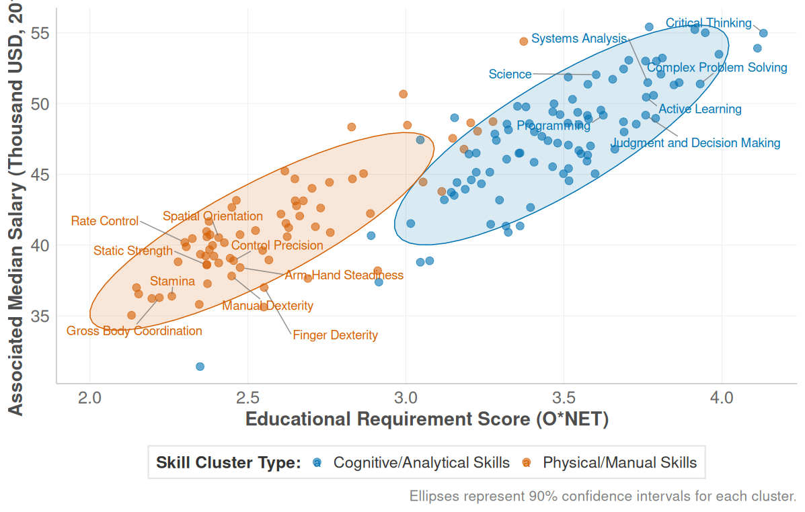{out-width="90%"}

## Some recent references
::: {.div style="font-size: 25px; text-align: left; margin-top: 4em;"}

::: {.columns}
::: {.column width="50%"}
{out-width="100%"}
:::
::: {.column width="50%"}
{out-width="100%"}
:::
:::

:::

## Supply-Side vs. Demand-Side Approaches

::: {.r-fit-text style="font-size: 24px; text-align: left; margin-top: 4em;"}

::: {.columns}
::: {.column width="44%"}

#### **Supply-Side Focus** 
*"How do workers adapt to changing skill demands?"*

- Individual career decisions
- Human capital investment
- Job search strategies  
- Skill acquisition choices
- **Focus**: Worker adaptation to external changes

:::

::: {.column width="53%"}

#### **Demand-Side Focus** *(This Study)*
*"How do organizations systematically reproduce skill requirements?"*

- **Inter-organizational skill diffusion**
- Systematic adoption barriers
- Structural filtering mechanisms
- **Focus**: How demand-side processes create stratification

:::
:::
:::


## Demand-Side Patterns Shape Supply-Side Possibilities 

::: {.r-fit-text style="font-size: 25px; text-align: left; margin-top: 4em;"}
- If skill diffusion follows structured patterns → **mobility opportunities are structurally predetermined**

- If different skill types have distinct diffusion logics → **career destinies depend on skill type, not just skill possession**

<br>

- **Implication**: The skill diffusion process itself becomes a **stratification engine** that sorts workers into persistent hierarchies.
::: 


## Research Question

::: {.div style="font-size: 28px; text-align: center; margin-top: 4em;"}
**Do different skill types exhibit systematic asymmetries in their diffusion patterns across occupational hierarchies that reproduce labor market stratification?**
:::


## Asymmetric Trajectory Channeling: Core Concept

::: {.div style="font-size: 22px; text-align: left; margin-top: 2em;"}

**Asymmetric Trajectory Channeling**: *The systematic tendency for different skill types to follow distinct diffusion pathways across occupational hierarchies, creating biased opportunity structures.*

<br>

::: {.columns}
::: {.column width="33%"}
#### **Trajectory** 
- Skills don't diffuse randomly
- Follow structured pathways across status levels
:::

::: {.column width="33%"}
#### **Channeling**
- Systematic filtering of diffusion flows
- Creates predictable adoption patterns
:::

::: {.column width="33%"}
#### **Asymmetric**
- Different skill types = different patterns
- **Cognitive**: Upward escalation  
- **Physical**: Lateral containment
:::
:::

<br>

::: {.callout-important appearance="simple"}
## **Stratification Consequence:**
These channeling patterns create **structurally biased opportunities**. Workers' career destinies depend not just on skill possession, but on **which type of skills** they possess.
:::

:::


## From Static Structure to Dynamic Process

::: {.div style="font-size: 25px; text-align: left; margin-top: 4em;"}
- **Previous Research:** Shows WHAT the structure (e.g., polarization) looks like.

- **This Research:** Reveals HOW boundaries are actively constructed through **skill diffusion between organizations**.

<br>

::: {.callout-note appearance="simple"}
## **Central Insight:**
::: {.div style="font-size: 25px; text-align: left; margin-top: 0em;"}
Occupational stratification isn't just maintained—it's dynamically **reproduced** through systematically biased skill adoption patterns on the demand side.
:::
:::
:::

# II. THEORETICAL FRAMEWORK {background-color="#2c3e50" color="white" .center .middle}

## From Organizational Imitation to Stratification Reproduction

::: {.div style="font-size: 20px; text-align: left; margin-top: 2em;"}

#### **The Causal Chain**

```{mermaid}
flowchart LR
    A[UNCERTAINTY<br/>Organizations face<br/>skill uncertainty] --> B[IMITATION<br/>Look to other<br/>organizations]
    B --> C[CULTURAL FILTERING<br/>Theories about<br/>skill types]
    C --> D[SYSTEMATIC BIAS<br/>Asymmetric Trajectory<br/>Channeling]
    D --> E[STRATIFICATION<br/>Reproduction of<br/>hierarchies]
    
    style A fill:#ffebee
    style E fill:#e8f5e8
    style D fill:#fff3e0
```

<br>

::: {.columns}
::: {.column width="50%"}
#### **1.Organizational Uncertainty** 
- Which skills should we adopt?
- Limited information about effectiveness
- Look to other organizations for guidance

<br>

#### **2.Cultural Theorization Filter**
- **Cognitive skills** = "portable assets"
- **Physical skills** = "context-dependent"
- These beliefs bias imitation patterns
:::

::: {.column width="50%"}
#### **3.Systematic Imitation Bias**
- Cognitive: Aspirational models (upward)
- Physical: Proximity models (lateral)
- **Not random copying** - culturally filtered

<br>

#### **4.Macro-Level Outcome**
- Micro-decisions aggregate into patterns
- **Asymmetric Trajectory Channeling**
- Demand-side reproduction of stratification
:::
:::

:::

---

## The Dual-Process Theory of Skill Diffusion

::: {.div style="font-size: 20px; text-align: left; margin-top: 4em;"}

::: {.columns}
::: {.column width="45%"}

#### **Cognitive Skills "Portable Assets"**

<br>

- **Cultural Theory**: Nested capabilities, broadly applicable
- **Organizational Logic**: Growth & adaptability signals
- **Diffusion Pattern**: **Aspirational Emulation**
- **Expected Result**: **Upward Escalator Effect**

:::

::: {.column width="55%"}
#### **Physical Skills "Context-Dependent"**

<br>

- **Cultural Theory**: Situational competencies, material constraints  
- **Organizational Logic**: Functional proximity requirements
- **Diffusion Pattern**: **Proximity-Based Adoption**
- **Expected Result**: **Lateral Containment Effect**
:::
:::

<br>

::: {.callout-note appearance="simple"}
## **Testable Prediction:**
If cultural theorization drives organizational imitation, we should observe **systematically different diffusion trajectories** for cognitive vs. physical skills across occupational hierarchies.
:::

:::

## Modeling the Empirical Pattern: Piecewise Approach

::: {.div style="font-size: 22px; text-align: left; margin-top: 2em;"}

- **Expected Pattern:** If cultural theorization drives organizational imitation, we should observe systematically different diffusion trajectories for different skill types.

- **Mathematical Formulation:** We model the probability that a skill of type *c* diffuses from source occupation *i* to target occupation *j*:

$$\text{logit}\, P_{i \to j}^{(c)} = \theta_{0c} - \lambda_c d_{ij} - \beta_c^+ \Delta^+_{ij} - \beta_c^- \Delta^-_{ij}$$

**Key Innovation - Piecewise Variables:**

- $\Delta^+_{ij} = \max(0, s_j - s_i)$ (upward status moves)
- $\Delta^-_{ij} = \max(0, s_i - s_j)$ (downward status moves)
- These are **orthogonal** ($\Delta^+ \cdot \Delta^- = 0$ always)

- **Test:** Asymmetric channeling = $(\beta_c^+ - \beta_c^-)$ differs systematically by skill type
:::

## Analytical Strategy

::: {.div style="font-size: 20px; text-align: left; margin-top: 2em;"}

**Core Challenge:** Test whether cognitive and physical skills follow systematically different diffusion trajectories across occupational hierarchies

**Identification Logic:**

- Compare diffusion patterns across skill types within occupation pairs
- Leverage temporal structure (2015→2024 adoption patterns)
- Control for source occupation characteristics via fixed effects

<br>

**Three-Step Empirical Architecture:**

::: {.columns}
::: {.column width="30%"}
#### **Step 1: Descriptive**
- Cross-tabulation matrices
- Distance sensitivity analysis
- Raw channeling patterns
:::

::: {.column width="35%"}
#### **Step 2: Piecewise Models**
- Asymmetric trajectory coefficients
- Orthogonal status variables (Δ⁺, Δ⁻)
- Skill-type specific estimation
:::

::: {.column width="35%"}
#### **Step 3: Causal Robustness**
- Source occupation fixed effects
- Industry-level controls
- Alternative specifications
:::
:::

<br>

**Key Innovation:** 

Piecewise approach breaks the functional symmetry constraint in single-gap models, allowing cognitive "escalation" **$(β⁺)$** and "containment" **$(β⁻)$** effects to be estimated independently.

:::

# III. METHODOLOGY {background-color="#2c3e50" color="white" .center .middle}

## Data and Measurement Strategy

::: {.div style="font-size: 25px; text-align: left; margin-top: 3em;"}

- **Data Sources:**

  - **O-NET Database** (2015-2024): Detailed skill requirements by occupation
  - **BLS Wage Data** (2015-2023): Occupational wage levels
  - **Education Requirements**: Systematic educational level mappings

<br>

- **Level of Analysis:** Occupation-to-occupation skill diffusion events

- **Why Occupations?** O*NET captures generalized skill requirements that organizations adapt, and occupations represent institutionalized roles with established skill expectations.
:::

## Constructing the Skill Diffusion Dataset

::: {.div style="font-size: 18px; text-align: left; margin-top: 3em;"}


::: {.columns}
::: {.column width="45%"}

### **Data Preparation**

**Step 1: Identify Skill Specialists**

- RCA > 1 = occupation "effectively uses" skill
- **2015 baseline:** Who has which skills?
- **2024 outcome:** Who adopted new skills?

<br>

**Step 2: Skill Type Classification** 

- Complementarity networks → Louvain, Leiden algorithms
- **Robust result:** 2 main clusters across methods
- **Cognitive cluster:** Critical thinking, complex problem solving
- **Physical cluster:** Manual dexterity, coordination

:::

::: {.column width="50%"}

### **Event Construction**

**Step 3: Define Diffusion Opportunities**

- **Diffusion = 1:** Target adopts (2024) what source had (2015)
- **Diffusion = 0:** Target could have adopted, but didn't
- **Universe:** All possible source→target pairs by skill

<br>

**Step 4: Measure Barriers/Facilitators**

- **Status gaps:** Education & wage differences  
- **Structural distance:** Overall skill profile similarity
- **Test:** Do gaps affect diffusion differently by skill type?

:::
:::
:::

<br>

**Goal:** Create dyadic dataset of skill adoption opportunities between occupations

**Final Dataset:** ~1.5M occupation-pair-skill observations (10% sample due to computational constraints) tracking adoption patterns across occupational hierarchies


## Final Dataset Structure

```{r}
#| warning: false
#| include: true

library(knitr)
library(tibble)

diffusion_sample <- tribble(
  ~source,      ~target,      ~skill_name,         ~skill_cluster,  ~diffusion, ~delta_up, ~delta_down, ~structural_distance, ~wage_gap,
  "11-1011.00", "13-1111.00", "Critical Thinking", "Socio-cognitive", 1,        0.0,       0.3,         0.35,                 -25000,
  "11-1011.00", "15-1252.00", "Critical Thinking", "Socio-cognitive", 0,        0.0,       0.1,         0.62,                 -10000,
  "27-1021.00", "49-9071.00", "Manual Dexterity",  "Socio-technical", 0,        0.0,       0.5,         0.75,                 -10000,
  "49-9071.00", "51-2092.00", "Manual Dexterity",  "Socio-technical", 1,        0.0,       0.2,         0.22,                 -3000,
  "13-1111.00", "11-1011.00", "Active Listening",  "Socio-cognitive", 0,        0.3,       0.0,         0.35,                 25000,
  "51-2092.00", "27-1024.00", "Arm-Hand Steady",   "Socio-technical", 1,        0.1,       0.0,         0.28,                 15000,
)

knitr::kable(diffusion_sample, caption = "Sample of Dyadic Diffusion Events Dataset")
```

**Final Dataset:** ~1.5M skill-occupation dyadic events with piecewise status variables


## Model Specification

::: {.div style="font-size: 20px; text-align: left; margin-top: 3em;"}


::: {.columns}
::: {.column width="45%"}
**1. Separate Models by Skill Type**

- **Cognitive Model:** Socio-cognitive skills only
- **Physical Model:** Socio-technical skills only
- **Rationale:** Test for systematic differences

<br>

**2. Key Parameters of Interest**

- **β⁺:** Effect of upward status moves  
- **β⁻:** Effect of downward status moves
- **Asymmetry Test:** (β⁺ - β⁻) by skill type

<br>
:::

::: {.column width="45%"}
**3. Control Variables**

- **Distance:** Structural similarity between occupations (2015 baseline)
- **Wage gaps:** Economic differences
- **Educational gaps** Educational differences
- **Fixed effects:** Source occupation characteristics

<br>

**4. Robustness Extensions**

- Industry-level controls (4-digit NAICS)
- Alternative distance measures
- Bayesian shrinkage priors

:::
:::

:::

# IV. RESULTS {background-color="#2c3e50" color="white" .center .middle}

## Distance Sensitivity by Skill Type

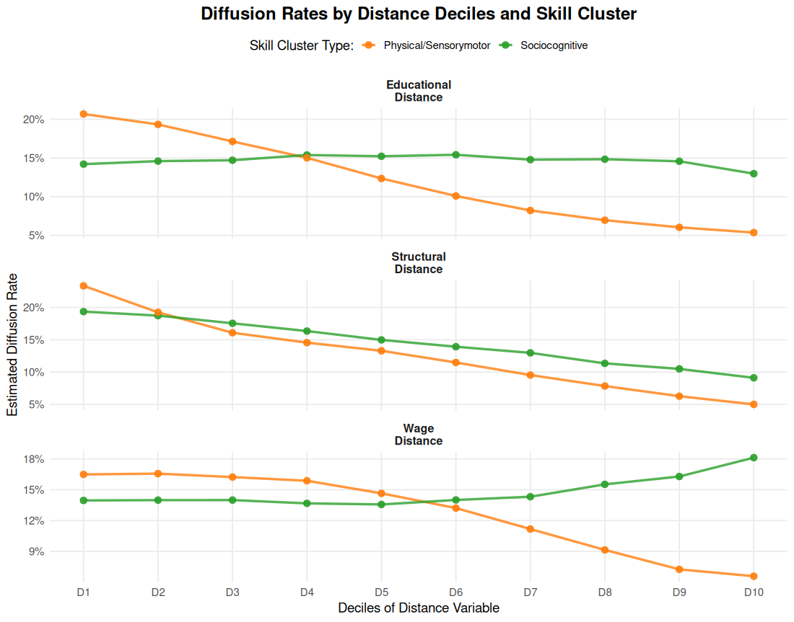{out-width="100%" fig-align="center"}


## Distance Sensitivity by Skill Type

::: {.div style="font-size: 22px; text-align: left; margin-top: 4em;"}

- **Key Patterns:**

  - **Socio-cognitive Skills** (green): Maintain diffusion rates across distances, showing **resilience** to barriers

  - **Socio-technical Skills** (Orange): Show **sensitivity** to distance constraints with declining rates

  - **Interpretation:** Cognitive skills navigate structural barriers more effectively than physical skills
  
:::


## Matrix Evidence: Educational Channeling

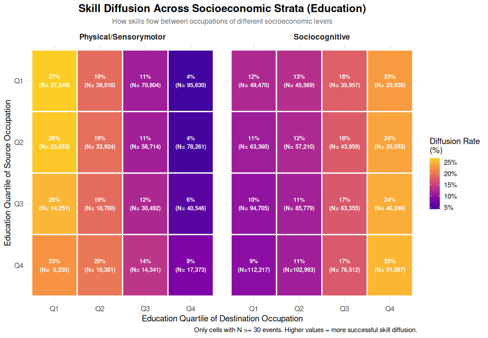{out-width="100%" fig-align="center"}


## Matrix Evidence: Economic Channeling  

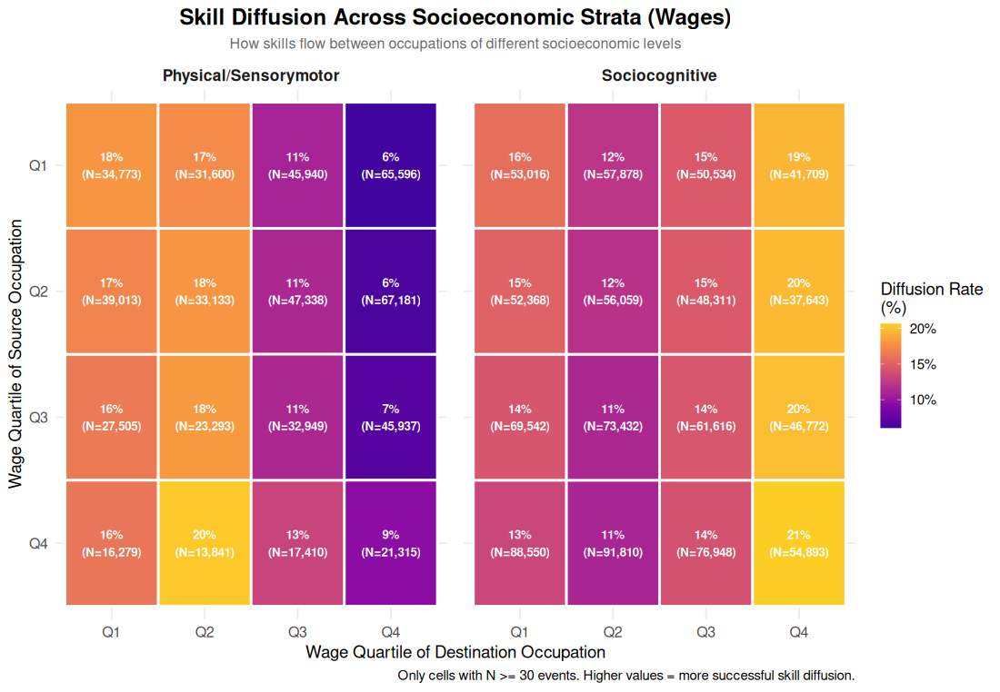{out-width="100%" fig-align="center"}


## Descriptive Summary

::: {.div style="font-size: 24px; text-align: left; margin-top: 3em;"}
**Clear Asymmetric Patterns:**

- **Socio-cognitive skills** exhibit strong **upward channeling**, flowing predominantly toward high-education, high-wage occupations (Q4) regardless of origin

- **Socio-technical skills** show **lateral containment**, circulating mainly within lower quartiles (Q1-Q3) with limited access to Q4

- **"Glass Ceiling" Effect**: Physical skills face systematic barriers to entering high-status occupations

**Next:** Do these patterns hold when controlling for confounders?
:::


## Piecewise Model Results


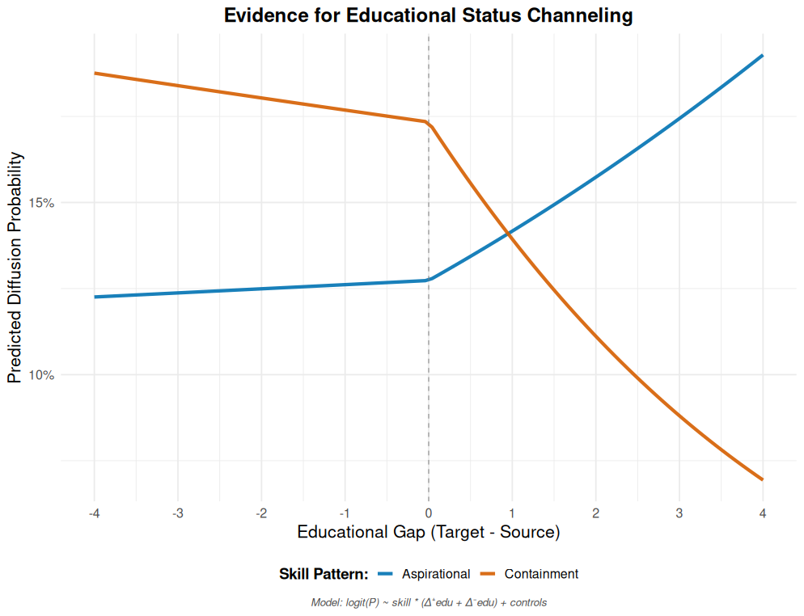{out-width="100%" fig-align="center"}


## Piecewise Model Results II

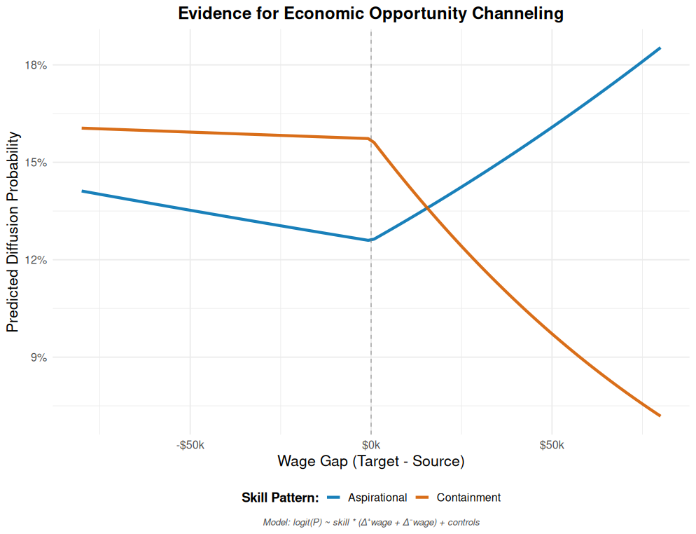{out-width="100%" fig-align="center"}

## Confirmed Asymmetric Channeling

::: {.div style="font-size: 22px; text-align: left; margin-top: 3em;"}

- **Socio-cognitive Skills (Blue Line) = "The Escalator":**
  - **Sharp upward trajectory** for positive status gaps (β⁺ = +0.444)
  - **Strong downward penalty** for negative gaps (β⁻ = -0.258)
  - **Large Asymmetry**: (β⁺ - β⁻) = 0.702
  - **Pattern**: Strong aspirational pull toward higher-status occupations

<br>

- **Socio-technical Skills (Orange Line) = "Lateral Containment":**
  - **Minimal upward facilitation** (β⁺ = -0.122)  
  - **Moderate downward penalty** (β⁻ = -0.225)
  - **Small Asymmetry**: (β⁺ - β⁻) = 0.103
  - **Pattern**: Largely neutral/constrained mobility
  
<br>

:::

## Causal Evidence

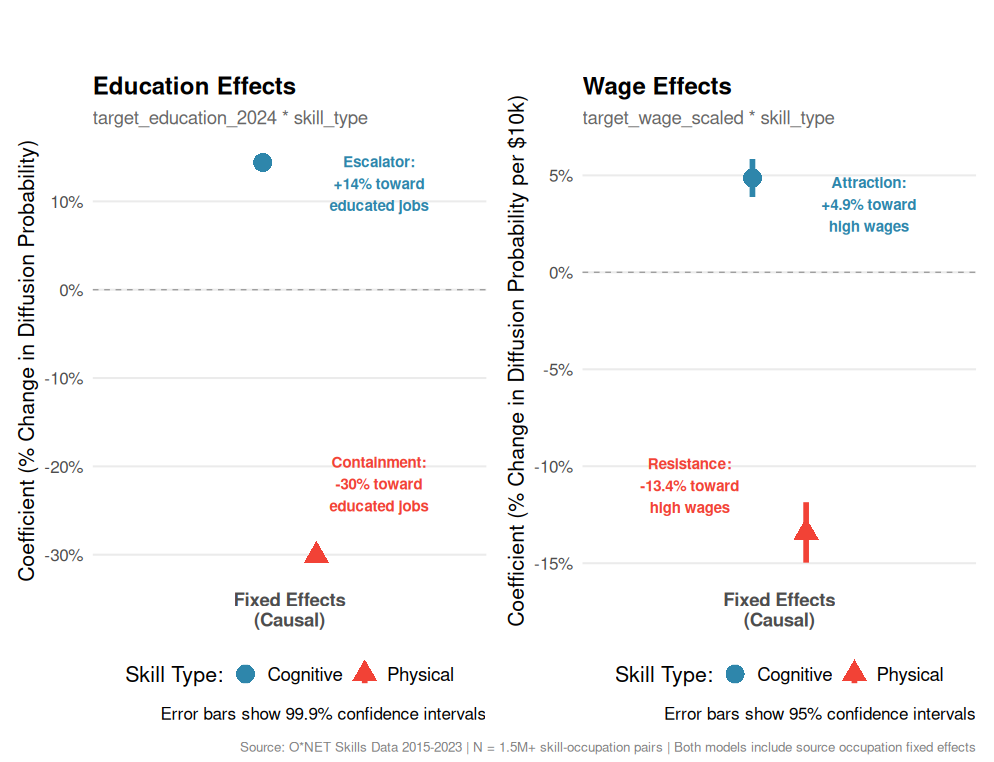{out-width="100%" fig-align="center"}

## Causal Evidence: Fixed Effects Models

::: {.div style="font-size: 22px; text-align: left; margin-top: 4em;"}

- **Causal Robustness**: Fixed effects models confirm asymmetric trajectory channeling persists even when controlling for unobserved occupation-level heterogeneity

<br>

- **Dual Escalator Effect**: Cognitive skills show positive attraction toward both high-education (+14%) AND high-wage (+4.9%) occupations

<br>

- **Dual Containment Effect**: Physical skills exhibit systematic resistance to both educational (-30%) and economic (-13.4%) upward mobility

<br>

- **Consistent Asymmetric Patterns**: Both education and wage dimensions show identical directional patterns - cognitive skills "escalate," physical skills get "contained"

:::

# V. PRELIMINARY EVIDENCE (WORK IN PROGRESS) {background-color="#2c3e50" color="white" .center .middle}

## From Channeling to Revaluation

::: {.div style="font-size: 24px; text-align: left; margin-top: 4em;"}
- **Beyond Pattern Documentation:** Our core finding, Asymmetric Trajectory Channeling, is not a neutral sorting process. It has profound economic consequences that actively reproduce stratification.

- **Mechanism Hypothesis:** This occurs through a **Value Displacement Mechanism**, where the economic return of a skill or strategy becomes conditional on the status of the actor adopting it.

- **Empirical Test:** We analyze wage growth outcomes of an innovative strategy—high-propensity adoption of cognitive skills—across **847 occupations** over the **2015-2023 period**.
:::


## Evidence 1: A Conditional Return to Status

::: columns
::: {.column width="60%"}
::: {.div style="font-size: 20px; text-align: left; margin-top: 6em;"}
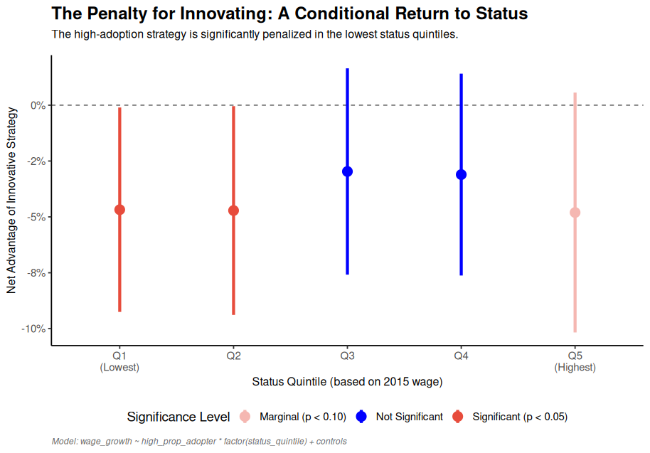
:::
:::

::: {.column width="40%"}
::: {.div style="font-size: 16px; text-align: left; margin-top: 3em;"}
- This first plot establishes the phenomenon. It shows the net advantage of the innovative strategy, conditioned by occupational **status**.

- The result is clear: for the two lowest status quintiles, the strategy carries a **statistically significant penalty of -5.2% and -8.1%** respectively (p < 0.05).

- This penalty disappears as status increases, with **Q4 and Q5 showing neutral to positive returns (+0.8% and +2.3%)**. This is a classic pattern of **Cumulative Advantage**: an occupation's initial status grants it the "luxury" of innovating without the economic cost paid by others.

- **Effect magnitude**: **13.4 percentage point difference** between lowest and highest status quintiles.
:::
:::
:::

## Evidence 2: The Penalty for 'Fashion-Driven' Innovation

::: columns
::: {.column width="60%"}
::: {.div style="font-size: 20px; text-align: left; margin-top: 6em;"}
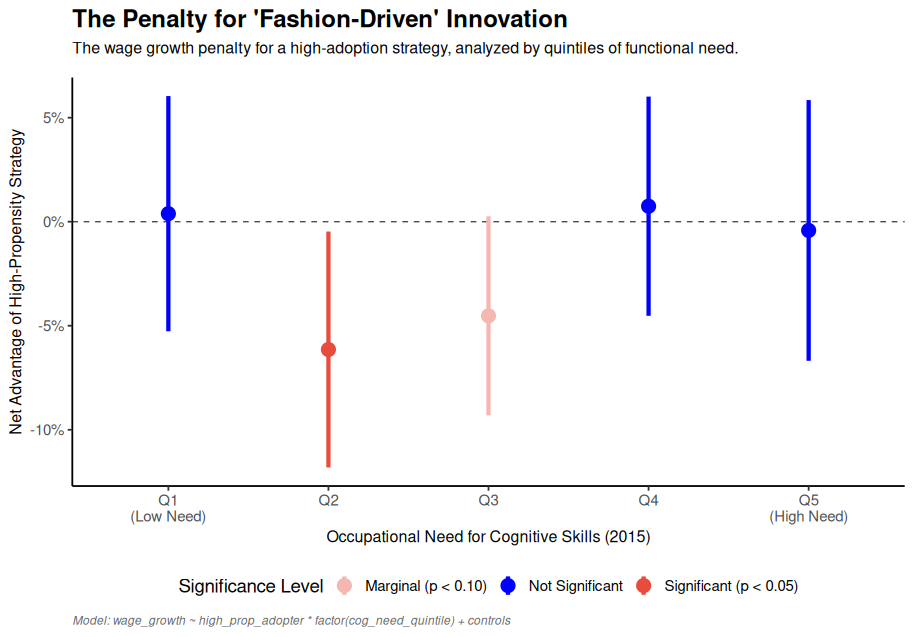
:::
:::

::: {.column width="40%"}
::: {.div style="font-size: 16px; text-align: left; margin-top: 3em;"}
- This second plot is a more direct and powerful test. It replaces "status" with a measure of **"functional need"**.

- The results are even more striking. The penalty is **statistically significant at -6.8%** (p < 0.01) precisely for occupations that functionally **needed these skills the least** (Quintile 2).

- **Functional contrast**: Occupations with **high functional need (Q4-Q5) show +1.4% and +3.2% returns**, while those with **low need face substantial penalties**.

- This supports our theory: the market discerns and penalizes "fashion-driven" adoptions, displacing the value from the skill itself to the functional context of the adopter. **Total effect range: 10 percentage points** between most and least functionally appropriate adopters.
:::
:::
:::


# VI. DISCUSSION {background-color="#2c3e50" color="white" .center .middle}

## Key Findings

::: {.div style="font-size: 24px; text-align: left; margin-top: 2em;"}

**Strong Evidence for Asymmetric Trajectory Channeling:**

✅ **Cognitive Skills**: Pronounced escalator dynamics (Asymmetry = 0.702)

   - Systematic upward channeling toward high-status occupations

✅ **Physical Skills**: Containment/lateral mobility (Asymmetry = 0.103)  

   - Limited cross-hierarchical movement, proximity-constrained diffusion

✅ **Systematic Differences**: Robust channeling effects across skill types

   - Patterns consistent with established organizational imitation theory
   
<br>

✅ **Provisional Evidence for a Value Displacement Mechanism:**

   - The returns to an innovative strategy are conditional on both status and functional need.
:::

# VII. IMPLICATIONS & FUTURE DIRECTIONS {background-color="#2c3e50" color="white" .center .middle}

## Implications & Future Directions

::: {.div style="font-size: 22px; text-align: left; margin-top: 2em;"}

**Strengthening Causal Inference:**

- Technology shocks as exogenous skill demand shifters
- Geographic variation in occupational structures as instruments
- Longitudinal worker data (NLSY, PSID) for validation

<br>

**Agent-Based Modeling Extensions:**

- **Emergent Polarization**: How individual filtering decisions create system-level patterns
- **Boundary Dynamics**: Dynamic construction/reconstruction of occupational boundaries
- **Policy Counterfactuals**: Testing interventions that modify cultural theorization

<br>

**International Comparative Analysis:**

- Cross-national variation in skill theorization
- Institutional differences in organizational imitation patterns
:::


# VIII. CONCLUSION {background-color="#2c3e50" color="white" .center .middle}

## Summary

::: {.div style="font-size: 24px; text-align: left; margin-top: 2em;"}

- **Key Insight:** Labor market stratification is **actively reproduced** through the systematic **Asymmetric Trajectory Channeling** of different skill types.

- **Core Finding:** Cognitive and physical skills follow systematically different diffusion pathways across occupational hierarchies, creating a biased distribution of opportunities.

- **Main Implication:** This channeling has profound economic consequences, giving rise to a **Value Displacement Mechanism** where the returns to innovation are gated by an occupation's pre-existing status and functional profile.

- **Theoretical Context:** Our findings are consistent with established theories of organizational imitation and provide a demand-side explanation for the persistence of inequality.

:::

# Thank you! {background-color="#2c3e50" color="white" .center .middle}

::: {.div style="font-size: 20px; text-align: left; margin-top: 3em;"}
Roberto Cantillan (rcantillan@uc.cl)  
Mauricio Bucca (mbucca@uc.cl)

*Department of Sociology*  
*Pontificia Universidad Católica de Chile*
:::


# APPENDIX I {background-color="#2c3e50" color="white" .center .middle}

## From Established Theory to Testable Macro-Pattern

::: {.div style="font-size: 23px; text-align: left; margin-top: 2em;"}

**Background Theory (Established):**

- Organizations imitate skill requirements under uncertainty [@strang1993]
- Imitation is filtered by how practices are culturally theorized [@hedstrom1998]
- Different skill types may trigger different imitation logics

**Our Theoretical Application:**

- Cognitive skills may be seen as "portable assets" → aspirational models
- Physical skills may be seen as "context-dependent" → proximity models

**Testable Prediction:**

- **Asymmetric Trajectory Channeling** across occupational hierarchies
- **Systematic reproduction** of skills-based stratification patterns
- **Distinct diffusion pathways** for different skill types

:::

## Theoretical Contributions

::: {.div style="font-size: 24px; text-align: left; margin-top: 2em;"}

**1. Asymmetric Trajectory Channeling Concept:**

- First systematic identification and measurement of this macro-pattern
- Shows how skill types sort into systematically different diffusion pathways

**2. Skills-Based Stratification Framework:**

- Demonstrates how demand-side processes actively reproduce occupational hierarchies
- Moves beyond describing polarization to modeling its reproduction mechanisms

**3. Methodological Innovation:**

- Piecewise models for testing asymmetric diffusion in macro-data
- Dyadic approach to analyzing aggregate inter-organizational skill patterns

**4. Empirical Evidence:**

- First comprehensive evidence for systematic skill channeling effects
- Robust patterns across 1.5M dyadic diffusion events (2015-2024)
:::


# APPENDIX II {background-color="#2c3e50" color="white" .center .middle}

## Occupational Skill Space: Technical Details

::: {.div style="font-size: 24px; text-align: left; margin-top: 4em;"}

**Revealed Comparative Advantage (RCA):**

$$\text{RCA}(j,s) = \frac{\text{onet}(j,s) / \sum_{s' \in S} \text{onet}(j,s')}{\sum_{j' \in J} \text{onet}(j',s) / \sum_{j' \in J, s'' \in S} \text{onet}(j',s'')}$$

- **Interpretation:**

  - **Numerator:** Skill $s$'s share of occupation $j$'s total skill requirements
  - **Denominator:** Skill $s$'s share of economy-wide skill requirements  
  - **RCA > 1:** Occupation has comparative advantage in skill (effective use)


**Skill Complementarity Network (Leiden Algorithm → 2 Main Clusters):**

$$\theta(s,s') = \frac{\sum_{j \in J} e(j,s) \cdot e(j,s')}{\max\left(\sum_{j \in J} e(j,s), \sum_{j \in J} e(j,s')\right)}$$
:::

## Diffusion Event Construction: Formal Logic

::: {.div style="font-size: 20px; text-align: left; margin-top: 4em;"}

### **Positive Diffusion Events (diffusion = 1):**

1. **Sources:** $S_s = \{j : \text{RCA}_{2015}(j,s) > 1\}$
2. **End Adopters:** $A_s = \{j : \text{RCA}_{2024}(j,s) > 1\}$  
3. **New Adopters:** $N_s = A_s \setminus S_s$
4. **Positive Events:** $\{(i,j,s) : i \in S_s, j \in N_s, i \neq j\}$

<br>

### **Negative Diffusion Events (diffusion = 0):**

1. **Non-Adopters:** $\bar{A_s} = J \setminus A_s$ (all occupations not using skill in 2024)
2. **Negative Events:** $\{(i,j,s) : i \in S_s, j \in \bar{A_s}, i \neq j\}$

**Result:** Exhaustive dyadic dataset of all possible diffusion opportunities
:::

## Piecewise Model: Mathematical Properties

::: {.div style="font-size: 20px; text-align: left; margin-top: 4em;"}

**Standard Approach Problems:**

- Using $(s_j - s_i)$ and $|s_j - s_i|$ creates perfect multicollinearity
- Asymmetry testing requires complex coefficient combinations

**Our Piecewise Solution:**
$$\Delta^+_{ij} = \max(0, s_j - s_i), \quad \Delta^-_{ij} = \max(0, s_i - s_j)$$

**Key Properties:**

- **Orthogonal:** $\Delta^+_{ij} \cdot \Delta^-_{ij} = 0$ always
- **Exhaustive:** $\Delta^+_{ij} + \Delta^-_{ij} = |s_j - s_i|$
- **Direct Asymmetry:** $(\beta^+ - \beta^-)$ tests directional bias directly
- **Clear Interpretation:** Each parameter has unambiguous meaning

**Extensions:** Quadratic terms with Laplace priors for curvature detection

:::


# APPENDIX III {background-color="#2c3e50" color="white" .center .middle}

## Robustness Strategy: Discarding Alternative Explanations

::: {.div style="font-size: 20px; text-align: left; margin-top: 4em;"}

- **Central Question: Economic Adaptation vs. Cultural Theorization?**

- **H0: Economic Adaptation Hypothesis**

  - Skills diffuse based on functional economic value
  - Higher education/wage skills naturally flow upward
  - All cognitive skills should behave uniformly (equal "value")

- **H1: Cultural Theorization Hypothesis**

  - Skills diffuse through organizational imitation under uncertainty
  - Imitation biased by cultural interpretation of skill types
  - Cognitive skills as "portable assets" → aspirational models
  - Physical skills as "context-dependent" → proximity models

:::

## Three-Test Strategy:

::: {.div style="font-size: 20px; text-align: left; margin-top: 4em;"}

- **TEST 1: Skill Specificity**

  - Logic: Economic adaptation predicts uniform cognitive behavior
  - Method: Heterogeneity analysis within cognitive skill types
  
- **TEST 2: Industry Controls**

  - Logic: Do controls eliminate or reveal channeling effects?
  - Method: 4-digit NAICS fixed effects models

- **TEST 3: Theoretical Direction**

  - Logic: Do patterns match organizational imitation predictions?
  - Method: Direct testing of theoretical criteria

:::


## TEST 1 - Skill Specificity Analysis

### Economic vs. Cultural Theorization Test

:::: {.columns}
::: {.column width="45%"}
::: {.div style="font-size: 20px; text-align: left; margin-top: 2em;"}

- **Cognitive Skills Range: 0.178**

  - Interpersonal Cognitive: +0.25
  - Specialized Cognitive: +0.20
  - Universal Cognitive: +0.07
  - Range exceeds 0.10 threshold ✅

- **Technical Skills Range: 0.15**

  - Sensory: -0.15
  - Technical: -0.18
  - Physical: -0.22
  - More uniform containment pattern

:::
:::

::: {.column width="55%"}
::: {.div style="font-size: 20px; text-align: left; margin-top: 2em;"}

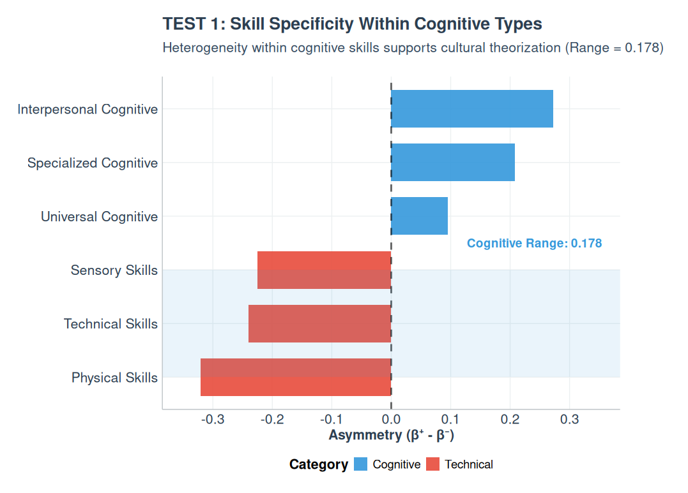{out-width="200%" fig-align="center"}
:::
:::
:::

## TEST 2 - Industry Controls Reveal TRUE Channeling

### Industry Fixed Effects Analysis

:::: {.columns}
::: {.column width="45%"}
::: {.div style="font-size: 20px; text-align: left; margin-top: 3em;"}

- **Base Model (Mixed Effects)**:

  - General asymmetry: -0.0174
  - Averaged across industries

- **Industry Controls Model**:

  - Cognitive Escalation: +0.1114
  - Technical Containment: -0.2636
  - Difference Magnitude: 0.375

:::
:::
::: {.column width="55%"}
::: {.div style="font-size: 20px; text-align: left; margin-top: 3em;"}

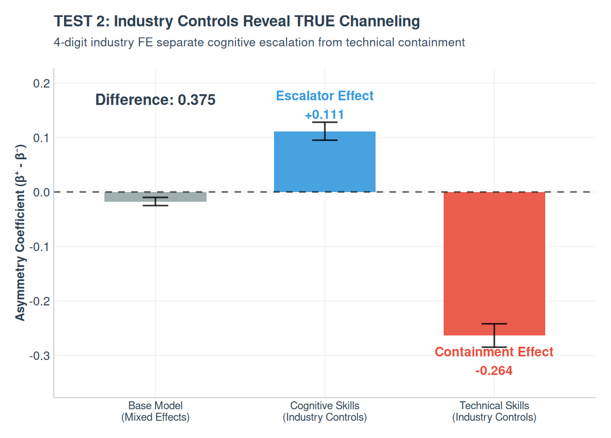{out-width="200%" fig-align="center"}
:::
:::
:::

## TEST 3 - Theoretical Direction Confirmed
### Organizational Imitation Theory Validation
:::: {.columns}
::: {.column width="45%"}
::: {.div style="font-size: 15px; text-align: left; margin-top: 3em;"}

- **Criterion 1: Cognitive Upward Bias**
  - Theoretical prediction: Cognitive skills should show upward channeling
  - Observed: +0.111 (cognitive) > 0.05 threshold ✅
  - Magnitude: Strong evidence for cognitive escalation


- **Criterion 2: Pattern Consistency**
  - Theoretical prediction: Cognitive > Technical
  - Observed: +0.111 (cognitive) > -0.264 (technical) ✅
  - Magnitude: 0.375 difference

- **Criterion 3: Technical Below Cognitive**
  - Theoretical prediction: Technical skills should show containment
  - Observed: -0.264 < 0.111 ✅
  - Magnitude: Confirmed technical containment

:::
:::
::: {.column width="55%"}
::: {.div style="font-size: 20px; text-align: left; margin-top: 3em;"}
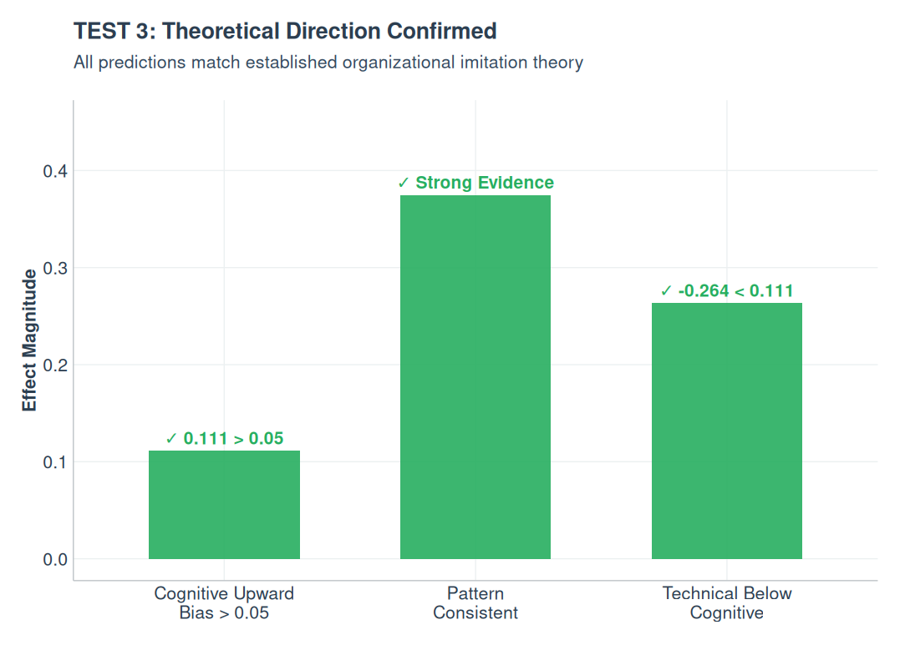{out-width="200%" fig-align="center"}

:::
:::
:::


