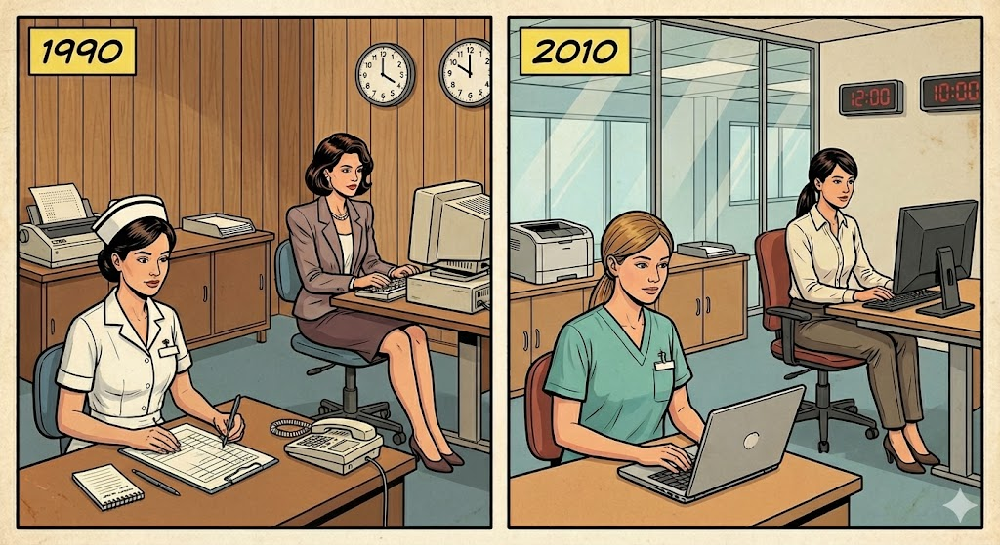
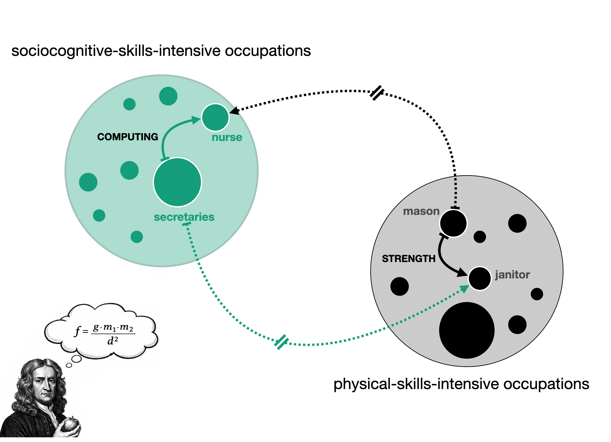
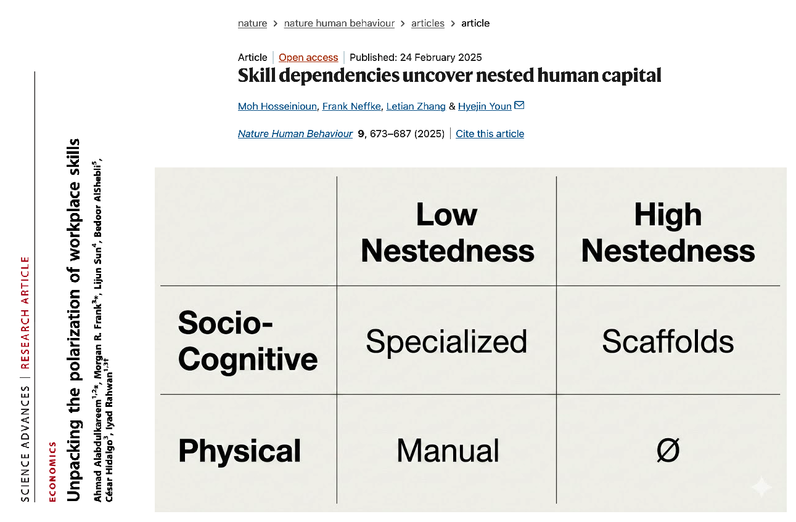
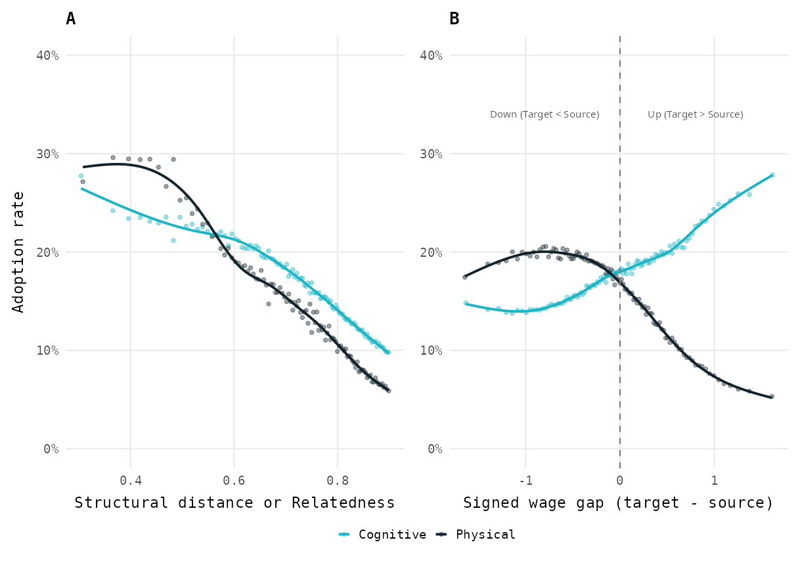
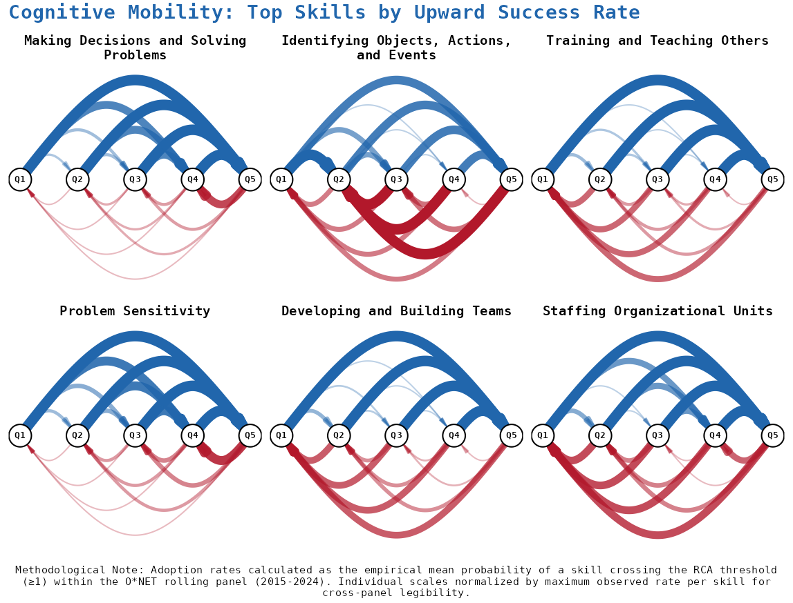
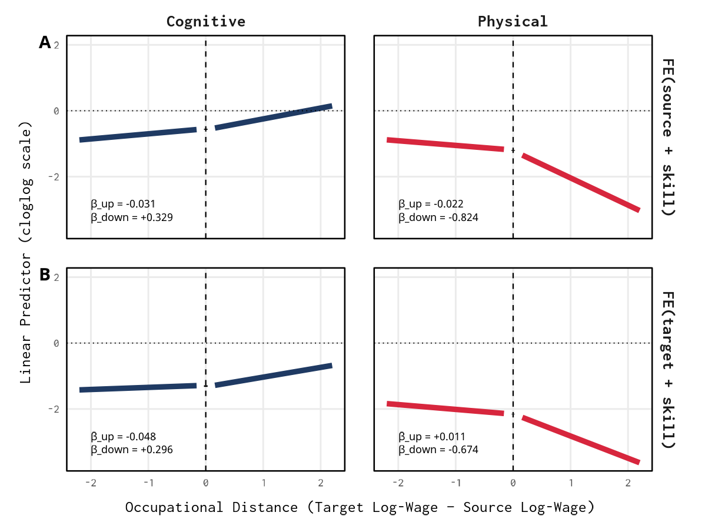
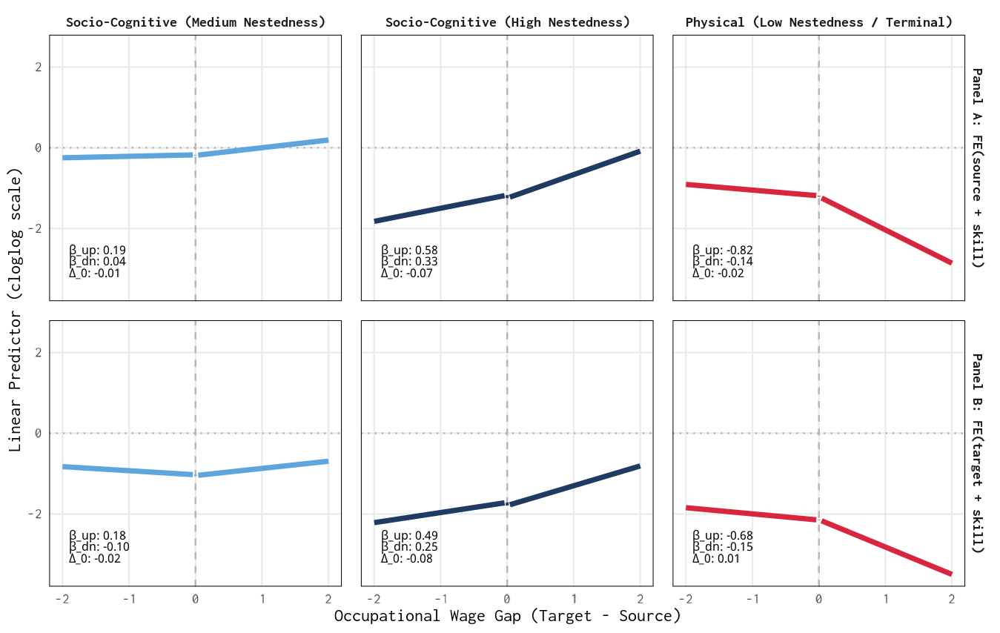

## The Puzzle {.smaller}

::: {style="font-size: 26px; margin-top: 3em;"}
**What we know:**

-   Labor markets are organized around **unequal occupations** differing
    in skills, wages, and credentials
-   A **polarized skill space**: socio-cognitive vs. sensory/physical
    domains align with education and wages
-   A **nested hierarchy**: enabling capabilities sit higher, command
    wage premia, require longer education

**What we don't know:**

> How do skill requirements **propagate** between occupations — and why
> does this process **reproduce** hierarchies?
:::

## 

::: {style="font-size: 26px; margin-top: 3em;"}
{width="70%"}
:::

```{r tabla_computacion, echo=FALSE, message=FALSE, warning=FALSE}
library(knitr)
library(tidyverse)
library(kableExtra)

# Crear el data frame
datos_computacion <- data.frame(
  Occupation = c("Secretary", "Nurse"),
  `1990` = c("✓", "✗"),
  `2010` = c("✓", "✓"),
  check.names = FALSE
)


datos_computacion %>%
  kbl() %>%
  kable_styling(bootstrap_options = c("striped", "hover", "condensed"))
```

## The Architecture We Build Upon {.smaller}

::::::::: columns
::::: {.column width="50%"}
:::: {style="font-size: 24px;"}
::: {style="font-size: 26px; margin-top: 3em;"}
**Polarization** (Alabdulkareem et al. 2018)

-   Skills cluster into two domains
-   Socio-cognitive: high education, high wages
-   Sensory/physical: lower education, lower wages
:::
::::
:::::

::::: {.column width="50%"}
:::: {style="font-size: 24px;"}
::: {style="font-size: 26px; margin-top: 3em;"}
{width="95%"}
:::
::::
:::::
:::::::::

## The Architecture We Build Upon {.smaller}

::::::::: columns
::::: {.column width="50%"}
:::: {style="font-size: 24px;"}
::: {style="font-size: 26px; margin-top: 3em;"}
**Nestedness** (Hosseinioun et al. 2025)

-   Asymmetric dependencies: some skills "enable" others
-   Nested architecture has **intensified** over time
-   Position in hierarchy predicts wages, automation risk
:::
::::
:::::

::::: {.column width="50%"}
:::: {style="font-size: 24px;"}
::: {style="font-size: 26px; margin-top: 3em;"}
{width="95%"}
:::
::::
:::::
:::::::::

# I. A GRAVITY MODEL FOR SKILL DIFFUSION {.center .middle background-color="#0a4e58"}

## 

### Skill diffusion as a gravity process

::::::: columns
:::: {.column width="65%"}
::: {style="font-size: 26px; margin-top: .5em;"}
{width="100%"}
:::
::::

:::: {.column width="35%"}
::: {style="font-size: 21px; margin-top: 8em;"}
-   Skill specific diffusivity (g)

-   Masses (m) <br>

-   Distance (d)

    -   Task similarity (symmetric)
    -   Status gap (asymmetric)
:::
::::
:::::::

## Our theory: Asimmetric trayectory channeling

::: {style="font-size: 25px; margin-top: 6em;"}
-   **Socio-cognitive** requirements are preferentially adopted by
    occupations of higher status than the source, successfully climbing
    the status gradient.

-   **Physical** requirements face a structural "upward veto," being
    predominantly relegated to adoption paths toward lower-status
    occupations.

-   This asymmetric dynamic would explain the observed polarized skill
    architecture of the labor market.
:::

## Our theory: Asimmetric trayectory channeling

<br>

::: {style="font-size: 25px; margin-top: 4em;"}
### Alternative accounts

-   Skills travel between similar occupations: We control for
    occupational **task relatedness** (structural distance).
-   Diffusion is driven by occupation size, not skills: We account for
    **occupational "mass"** using occupation fixed effects (Source and
    Target).
-   Some skills travel more easily than others: We account for
    **intrinsic diffusivity** using skill-level fixed effects ($g_s$).
:::

# II. DATA & METHODS {.center .middle background-color="#0a4e58"}

## Data

::: {style="font-size: 26px; margin-top: 5em;"}
-   __O\*NET__ 2015-2024 (161 skill taxonomy)
-   __BLS__ wages and education
-   About 17M dyadic opportunities

:::


## Measures I

::: {style="font-size: 25px; margin-top: 1em;"}

- **Dependent Variable**: Skill Adoption ($Y_{ijs}$). Where $Y=1$ if a target (2024) adopts a skill previously held by a source (2015), and $Y=0$ if the opportunity for adoption was not taken.
:::


::: {style="font-size: 25px; margin-top: 1em;"}
- **Main Independent Variables**:
    - Wage Gap (Piecewise):
        - $\text{wage_gap}_{ij}{\uparrow} = \max(0, G_{ij})$
        - $\text{wage_gap}_{ij}{\downarrow} = \min(0, G_{ij})$
        - Where $G_{ij} = \log(\overline{W}_{target}) - \log(\overline{W}_{source})$
:::


::: {style="font-size: 25px; margin-top: 1em;"}
- **Critical control variables**:     
    - Structural Proximity: Occupational Task Relatedness calculated via cosine similarity 
    - Source, Target and Skill fixed effects. 

:::


## Measures II

#### Skill type: Skill types might respond to wage gaps differently

::: {style="font-size: 70px; margin-top: 1em;"}
{width="70%"}

:::


## The ATC Model

::: {style="font-size: 25px; margin-top: 4em;"}

For each skill type, I estimate a linearized version of the gravity model

$$
\begin{aligned}
\mathrm{logit}\,P(Y_{ijs}=1) = \, & \beta_{\text{up}}(\text{wage_gap}_{ij})^\uparrow + \beta_{\text{down}}(\text{wage_gap}_{ij})^\downarrow \\
& + \delta \cdot \text{relatedness}_{ij} \\
& + \text{source}_{i} / \text{target}_{j} + \text{skill}_{s}
\end{aligned}
$$

-   $\beta_{\text{up}}/ \beta_{\text{down}}$  measure the specific
    resistance (or facilitation) encountered when the target occupation
    has a higher ($\uparrow$) or lower ($\downarrow$) wage status than
    the source.
-   $\delta$ is the effect for the task-relatedness between occupations.
-   $\text{source}_i, \text{target}_j, \text{skill}_s$ are fixed
    effects measuring occupational emission/absorption mass and
    intrinsic "diffusivity" of each skill[^1].
    
    
    
[^1]: Source and taregt fixed effects are introduced separately to break perfect colinearity
:::


# III. FINDINGS {.center .middle background-color="#0a4e58"}

## Raw Patterns {.smaller}

::: {style="text-align: center;"}
{width="85%"}
:::

## Polarized Diffusion: Flow Networks {.smaller}

::: {style="font-size: 26px; margin-top: 1em;"}
{width="100%"}
:::


## 

::: {style="text-align: center;"}
{width="85%"}
:::

## 

::: {style="text-align: center;"}
{width="85%"}
:::

# III. REGRESSION RESULTS {.center .middle background-color="#0a4e58"}

## 

### Asymmetric trajectory channeling by skill domain

<br>

::: {style="text-align: center; margin-bottom: 6em;"}
{width="75%"}
:::

## 

### by domain & Nestedness

::: {style="text-align: center;"}
{width="93%"}
:::


## Why This Happens: Potential Reasons {.smaller}

::: {style="font-size: 26px; margin-top: 3em;"}

**This asymmetry reflects structural filtering, not chance:**

- **Adoption capacity**  
  High-status occupations have more resources, slack, and organizational capacity to experiment with complex, high-nestedness skills.

- **Market shift**  
  Elite occupations increasingly demand socio-cognitive skills to manage coordination, abstraction, and organizational complexity.

- **Status filtering**  
  High-status occupations actively avoid physical requirements to preserve professional distinction and symbolic boundaries.

:::


## Conclusion {.smaller}

::: {style="font-size: 26px; margin-top: 2em;"}

**Main finding:**

> Skill diffusion is asymmetric: it pulls socio-cognitive skills upward and
> pushes physical skills downward.

**Key takeaways:**

- **Directional filtering**  
  Physical skills face a barrier that prevents them from entering high-wage occupations.

- **Nestedness matters**  
  Skills that anchor and enable other skills exhibit the strongest asymmetries.

- **Systemic Reproduction**  
  This selective channeling acts as the dynamic engine that maintains and reinforces the labor market's polarized skill architecture.

:::


# Thank You {.center .middle background-color="#0a4e58"}

**Roberto Cantillan**

Department of Sociology, PUC Chile

rcantillan\@uc.cl

Paper and Replication:
[github.com/rcantillan/skill_diffusion](https://github.com/rcantillan/skill_diffusion)

# Backup Slides {.center .middle background-color="#2d3e50"}

## B1: Formal Definitions {.smaller}

::: {style="font-size: 22px;  margin-top: 3em;"}
**Revealed Comparative Advantage:**

$$\mathrm{RCA}(j,s) = \frac{\mathrm{onet}(j,s)/\sum_{s'}\mathrm{onet}(j,s')}{\sum_{j'}\mathrm{onet}(j',s)/\sum_{j',s''}\mathrm{onet}(j',s'')}$$

**Event definitions for skill s:**

-   Specialists at baseline: RCA greater than 1 at t0
-   Users at follow-up: RCA greater than 1 at t1
-   New adopters: Users minus Specialists

**Directional gaps:**

$$\Delta^{\uparrow}_{ij} = \max(0, \text{status}_j - \text{status}_i)$$

$$\Delta^{\downarrow}_{ij} = \max(0, \text{status}_i - \text{status}_j)$$
:::

## B2: Nestedness Definition {.smaller}

::: {style="font-size: 22px;  margin-top: 2em;"}
**Contribution to nestedness (cs):**

$$c_s = \frac{\mathrm{NODF}_{\text{obs}} - \mathbb{E}[\mathrm{NODF}^{(s)}_{\text{rand}}]}{\mathrm{sd}[\mathrm{NODF}^{(s)}_{\text{rand}}]}$$

**Interpretation:**

-   cs high: Skill acts as scaffolding (analytics, management,
    communication)
-   cs low: Terminal or narrow capability (specific technique)

**Reach:**

-   Size of forward-reachable set in dependency network
-   High reach means skill enables many downstream capabilities

**In our models:**

-   Terciles: Low, Mid, High nestedness
-   Interact with directional gaps
-   High nestedness **amplifies** ATC asymmetry
:::

## B3: Full Coefficient Table {.smaller}

:::: {style="font-size: 18px; margin-top: 4em;"}
| Term                | Coefficient | SE     |
|---------------------|-------------|--------|
| Upward (base)       | +0.08       | 0.04   |
| Downward (base)     | +0.13       | 0.11   |
| Domain: Physical    | +0.72       | 0.30   |
| Upward × Physical   | −0.42       | 0.07   |
| Downward × Physical | +0.52       | 0.18   |
| Structural distance | −1.90       | 0.20   |
| Distance × Physical | −1.33       | 0.52   |
| Nestedness: Mid     | +0.00       | 0.04   |
| Nestedness: High    | −0.13       | 0.05   |
| Upward × Nest-Mid   | +0.12       | 0\. 03 |
| Upward × Nest-High  | +0. 07      | 0.04   |

::: {style="font-size: 22px; text-align: center; margin-top: 2em;"}
ClogLog link. Two-way FE (source, target). Clustered SE.
:::
::::

## B4: Complete Gravity Model Derivation {.smaller}

::: {style="font-size: 20px;"}
**Step 1: Classic Gravity**
$$T_{ij} = k \cdot \frac{M_i M_j}{D_{ij}^{\gamma}} \quad \Rightarrow \quad \log \mathbb{E}[T_{ij}] = \beta_0 + \alpha_i + \beta_j - \gamma \log D_{ij}$$

**Step 2: Triadic Extension (adding skill** $k$)
$$\lambda_{ijk} \propto \frac{M_i \cdot M_j \cdot S_k}{D_{ij}^{\gamma}} \quad \Rightarrow \quad \log \lambda_{ijk} = \beta_0 + \alpha_i + \beta_j + \delta_k - \gamma \log D_{ij}$$

**Step 3: Asymmetric Frictions**
$$\Delta^{\uparrow}_{ij} = \max(G_{ij}, 0), \quad \Delta^{\downarrow}_{ij} = \max(-G_{ij}, 0)$$

**Step 4: Skill Mass via Attributes**
$$\text{SkillMass}_k = \eta_0 + \eta_D D_k + \eta_N N_k + \eta_{DN} D_k N_k$$

**Step 5: Full Specification**
$$\text{cloglog}\big(\Pr(T_{ijk}=1)\big) = \beta_0 + \alpha_i + \beta_j + \eta_0 + \eta_D D_k + \eta_N N_k + \eta_{DN} D_k N_k + \beta^{\uparrow} \Delta^{\uparrow}_{ij} + \beta^{\downarrow} \Delta^{\downarrow}_{ij}$$
:::

## B5: Key Magnitudes {.smaller}

::: {style="font-size: 24px; margin-top: 4em; text-align: left;"}
**Coefficients (wage gap, cloglog scale):**

| Term     | Cognitive   | Physical | Interaction |
|:---------|:------------|:---------|:------------|
| Upward   | +0.08.      | −0.34    | −0.42\*\*\* |
| Downward | +0.13 (ns)  | +0.65    | +0.52\*\*   |
| Distance | −1.90\*\*\* | −3.23    | −1.33\*     |

**Interpretation:**

-   Upward gap **slightly boosts** cognitive adoption, **penalizes**
    physical
-   Downward gap has **no effect** on cognitive, **strongly boosts**
    physical
-   Distance decay is **70% steeper** for physical skills
:::

## B6: Robustness Summary {.smaller}

:::: {style="font-size: 25px; margin-top: 4em;"}
| Test           | Specification                     | Result               |
|----------------|-----------------------------------|----------------------|
| Thresholds     | RCA 0.9, 1.0, 1.1                 | Pattern unchanged    |
| Distances      | Shortest path, resistance, cosine | Same relative slopes |
| Periods        | 2015-18, 2019-21, 2022-24         | ATC persists         |
| Bootstrap      | Node-level B=1000 vs clustered SE | Ratio around 1.0     |
| Representation | Skill-skill vs occ-occ network    | Ordinal match        |

::: {style="font-size: 25px; margin-top: 2em;"}
The asymmetry is **not** an artifact of thresholds, distance measures,
or time periods.
:::
::::


