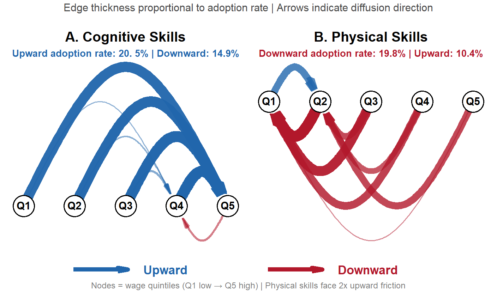
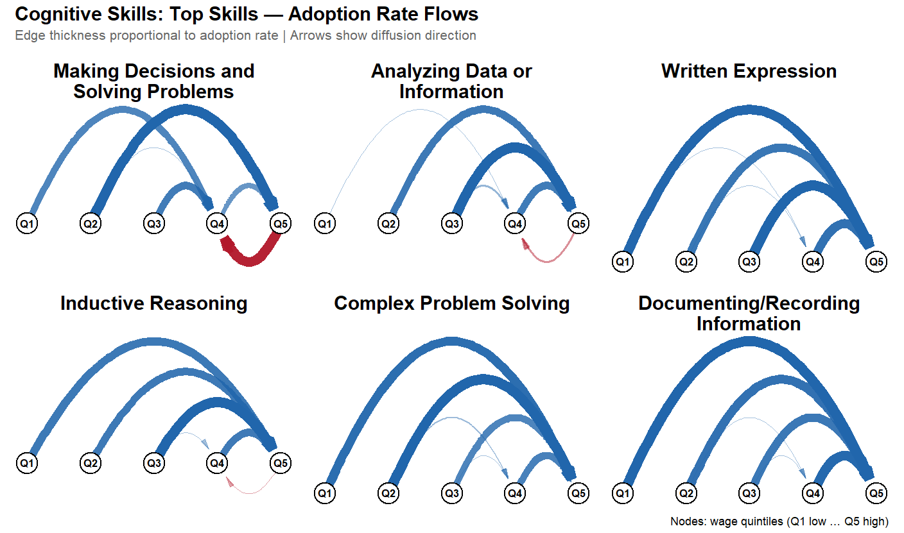
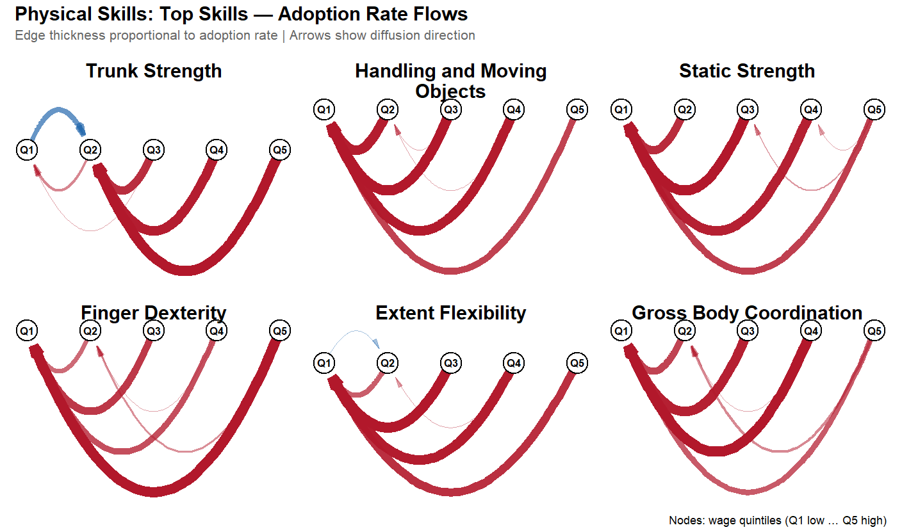
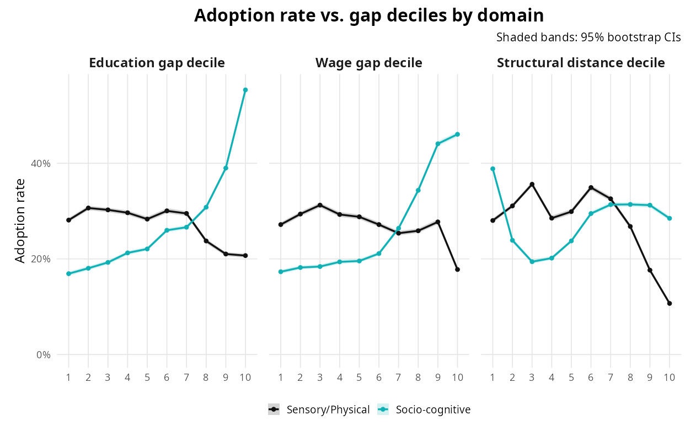
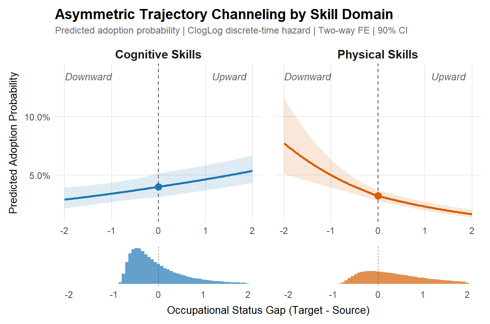
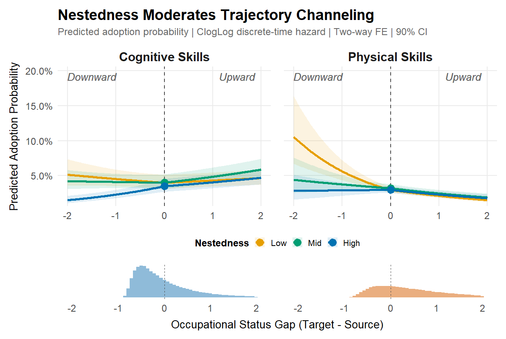

## The Puzzle {.smaller}

:::{style="font-size: 26px; margin-top: 3em;"}

**What we know:**

- Labor markets are organized around **unequal occupations** differing in skills, wages, and credentials
- A **polarized skill space**: socio-cognitive vs. sensory/physical domains align with education and wages
- A **nested hierarchy**: enabling capabilities sit higher, command wage premia, require longer education

**What we don't know:**

> How do skill requirements **propagate** between occupations — and why does this process **reproduce** hierarchies? 

:::

## The Architecture We Build Upon {.smaller}

:::{.columns}
:::{.column width="50%"}
:::{style="font-size: 24px;"}
:::{style="font-size: 26px; margin-top: 3em;"}

**Polarization** (Alabdulkareem et al.  2018)

- Skills cluster into two domains
- Socio-cognitive: high education, high wages
- Sensory/physical: lower education, lower wages

:::
:::
:::

:::{.column width="50%"}
:::{style="font-size: 24px;"}
:::{style="font-size: 26px; margin-top: 3em;"}

{width="95%"}
:::
:::
:::
:::

## The Architecture We Build Upon {.smaller}

:::{.columns}
:::{.column width="50%"}
:::{style="font-size: 24px;"}
:::{style="font-size: 26px; margin-top: 3em;"}

**Nestedness** (Hosseinioun et al. 2025)

- Asymmetric dependencies: some skills "enable" others
- Nested architecture has **intensified** over time
- Position in hierarchy predicts wages, automation risk

:::
:::
:::

:::{.column width="50%"}
:::{style="font-size: 24px;"}
:::{style="font-size: 26px; margin-top: 3em;"}

{width="95%"}
:::
:::
:::
:::

# I. THE PHENOMENON {.center .middle background-color="#0a4e58"}

## Polarized Diffusion: Flow Networks {.smaller}

:::{style="font-size: 26px; margin-top: 3em;"}
{width="80%"}
:::

## The Asymmetry: Directional Friction by Domain {.smaller}

::: {style="font-size: 22px; margin-top: 4em; margin-bottom: 2em;"}
**Asymmetry** means skills face different "friction" when diffusing up vs. down the wage ladder.  The direction of this friction **reverses** between cognitive and physical skills. 
:::

::: {style="font-size: 22px;"}

| | Cognitive | Physical | Interpretation |
|---|:---:|:---:|---|
| **Upward rate** | **20. 5%** | 10.4% | Cognitive climbs easily |
| **Downward rate** | 14.9% | **19.8%** | Physical falls easily |
| **Gap (Up - Down)** | **+5.6 p.p.** | **-9.4 p.p. ** | Opposite signs |
| **Implication** | Facilitates ascent | Blocks ascent | Polarizing force |

:::

::: {style="font-size: 20px; text-align: center; margin-top: 1em;"}
Physical skills face **1.9x more friction** going up than going down
:::

## 

::: {style="text-align: center;"}
{width="100%"}
:::

::: {style="font-size: 20px; text-align: center;"}
Average shift in wage quintiles (destination - origin).  Core cognitive skills drift **upward**
:::

## 

::: {style="text-align: center;"}
{width="100%"}
:::

::: {style="font-size: 20px; text-align: center;"}
Most physical skills drift **downward** or lateral (static strength, inspection, coordination)
:::

## Raw Gravity Patterns {.smaller}

::: {style="text-align: center;"}
{width="90%"}
:::

::: {style="font-size: 22px; text-align: center;"}
Adoption rate by **education gap**, **wage gap**, and **structural distance** deciles
:::

# II. THE MODEL {.center .middle background-color="#0a4e58"}

## Gravity Logic for Skill Diffusion {.smaller}

:::{style="font-size: 24px; margin-top: 3em;"}

**Classic Gravity Model:**

The expected flow from origin $i$ to destination $j$ follows:

$$T_{ij} = k \cdot \frac{M_i M_j}{D_{ij}^{\gamma}}$$

where $M_i, M_j$ = origin/destination mass, $D_{ij}$ = distance, $\gamma$ = distance sensitivity.

**Log-linear form:**

$$\log \mathbb{E}[T_{ij}] = \beta_0 + \alpha_i + \beta_j - \gamma \log D_{ij}$$

**Application to skill diffusion:**

- Some occupations are stronger **senders** (innovation-intensive)
- Others are more capable **receivers** (high absorptive capacity)
- Diffusion declines with cognitive, educational, or wage/status **distance**

:::

## Triadic Gravity: Incorporating Skills {.smaller}

:::{style="font-size: 23px; margin-top: 3em;"}

Skill diffusion is inherently **triadic**: source occupation $i$, target occupation $j$, and skill $k$.

**Binary outcome:**

$$T_{ijk} = \begin{cases} 1 & \text{if skill } k \text{ is newly adopted in } j \text{ after being established in } i \\ 0 & \text{otherwise} \end{cases}$$

**Triadic gravity with skill-specific mass** $S_k$:

$$\lambda_{ijk} \propto \frac{M_i \cdot M_j \cdot S_k}{D_{ij}^{\gamma}}$$

**Log-linear form:**

$$\log \lambda_{ijk} = \beta_0 + \alpha_i + \beta_j + \delta_k - \gamma \log D_{ij}$$

:::

## Asymmetric Frictions: The ATC Mechanism {.smaller}

:::{style="font-size: 23px; margin-top: 3em;"}

Standard gravity assumes **symmetric** distance costs.  In occupational diffusion, this is unrealistic.

**Directional decomposition of wage/status gap** $G_{ij}$:

$$\Delta^{\uparrow}_{ij} = \max(G_{ij}, 0) \quad \text{(upward: target higher than source)}$$

$$\Delta^{\downarrow}_{ij} = \max(-G_{ij}, 0) \quad \text{(downward: target lower than source)}$$

**Core hypothesis — Asymmetric Trajectory Channeling (ATC):**

> Socio-cognitive skills face **low upward friction**; physical skills face **high upward friction**

This decomposition enables distinct coefficients for upward vs. downward flows — the central feature of ATC.

:::

::: {.aside}
* **Sayer, A.** (2000). *Realism and Social Science*. Sage.
* **Hidalgo, C.** (2015). *Why Information Grows*. Basic Books.
:::

## Modeling Skill Diffusibility {.smaller}

:::{style="font-size: 23px; margin-top: 3em;"}

Instead of absorbing skill heterogeneity via unrestricted fixed effects ($\delta_k$), we model skill "mass" structurally:

**Two theoretically grounded attributes:**

- **Domain** ($D_k$): Physical vs. cognitive/socio-cognitive
- **Nestedness** ($N_k$): Low vs. high dependency in skill hierarchy

**Skill mass parameterization:**

$$\text{SkillMass}_k = \eta_0 + \eta_D D_k + \eta_N N_k + \eta_{DN} D_k N_k$$

This enforces **meaningful structure** in the skill space, rather than treating each skill as categorical noise.

:::

## Triadic Logistic Gravity Specification {.smaller}

:::{style="font-size: 21px; margin-top: 3em;"}

With a binary outcome, we map latent intensity into probability via logistic link:

$$\text{logit}\big(\Pr(T_{ijk}=1)\big) = \beta_0 + \alpha_i + \beta_j + \eta_0 + \eta_D D_k + \eta_N N_k + \eta_{DN} D_k N_k$$
$$+ \beta^{\uparrow} \Delta^{\uparrow}_{ij} + \beta^{\downarrow} \Delta^{\downarrow}_{ij} + \text{(interactions)}$$

**Interactions** (e.g., $D_k \cdot \Delta^{\uparrow}_{ij}$, $N_k \cdot \Delta^{\downarrow}_{ij}$) reveal whether:

- Certain skill types face **penalties** in upward diffusion
- Physical/nested skills are preferentially **funneled downward**

**Fixed effects:**

- $\alpha_i$: Source sending capacity
- $\beta_j$: Target receiving capacity
- No full $\delta_k$: Skill heterogeneity explained via domain × nestedness

:::

## Identification Strategy {.smaller}

:::{.columns}
:::{.column width="55%"}
:::{style="font-size: 24px;  margin-top: 3em;"}

**Challenge:** O*NET rolling panel creates "false zeros"

**Solution: Interval-Censored Design**

- Adoption = latent event within window
- Opportunity: source specializes, target does not
- Outcome: target crosses threshold

**Estimation:**

- Two-way fixed effects (source, target)
- Node-level bootstrap (B=1000) for valid inference

:::
:::
:::{.column width="45%"}
:::{style="font-size: 22px; margin-top: 5em;"}

**Diagnostics:**

- Placebo leads (future gaps have no effect)
- Within-cluster permutation
- Worker-flow distances replication
- Out-of-sample prediction (2015-19 to 2020-24)

**Data:**

- O*NET 2015-2024 (161 descriptors)
- BLS wages and education
- About 5M dyadic opportunities

:::
:::
:::

# III. MODEL RESULTS {.center .middle background-color="#0a4e58"}

## 

::: {style="text-align: center;"}
{width="95%"}
:::

::: {style="font-size: 22px; text-align: center;"}
ClogLog discrete-time hazard.  Two-way FE.  90% CI from node bootstrap
:::

## 

::: {style="text-align: center;"}
{width="95%"}
:::

::: {style="font-size: 22px; text-align: center;"}
High-nestedness physical skills face more than 30 p.p. penalty at 2-quartile upward gap
:::

## Key Magnitudes {.smaller}

:::{style="font-size: 24px; margin-top: 4em;"}

**Coefficients (education gap, log-odds scale):**

| Term | Cognitive | Physical | Interaction |
|------|-----------|----------|-------------|
| Upward | +0.43 | -0.79 | -1.22 |
| Downward | +0.05 (ns) | +1.98 | +1.93 |
| Distance | -0.18 | -0.49 | -0.31 |

**Interpretation:**

- Upward gap **boosts** cognitive adoption, **penalizes** physical
- Downward gap has **no effect** on cognitive, **strongly boosts** physical
- Distance decay is **steeper** for physical skills

:::

## Robustness Summary {.smaller}

:::{style="font-size: 25px; margin-top: 4em;"}

| Test | Specification | Result |
|------|---------------|--------|
| Thresholds | RCA 0.9, 1.0, 1.1 | Pattern unchanged |
| Distances | Shortest path, resistance, cosine | Same relative slopes |
| Periods | 2015-18, 2019-21, 2022-24 | ATC persists |
| Bootstrap | Node-level B=1000 vs clustered SE | Ratio around 1.0 |
| Representation | Skill-skill vs occ-occ network | Ordinal match |

:::{style="font-size: 25px; margin-top: 2em;"}

The asymmetry is **not** an artifact of thresholds, distance measures, or time periods. 

:::
:::

# IV. IMPLICATIONS {.center .middle background-color="#0a4e58"}

## What This Tells Us {.smaller}

:::{style="font-size: 22px; margin-top: 2em;"}

**The asymmetry is structural, not incidental:**

- Physical skills don't just *happen* to stay low — they face systematic friction
- Cognitive skills don't just *happen* to climb — the path is smoother
- Nestedness *amplifies* these differences

**This reframes polarization:**

> Not just *what* skills exist where, but *how* skill requirements **flow** — and why certain flows are blocked

**Open questions:**

- Does reducing occupational distance (via training, credentialing) actually change diffusion? 
- Which specific skills are "near the boundary" and most amenable to intervention? 
- How do firm-level decisions interact with these macro patterns?

:::

## Conclusion {.smaller}

:::{style="font-size: 25px; margin-top: 2em;"}

**Main finding:**

> Skill diffusion follows an **asymmetric gravity rule** that actively filters physical requirements out of high-status occupations

**Three key mechanisms:**

1. **Directional friction**: Physical upward friction much greater than cognitive
2. **Distance decay**: Steeper for physical than cognitive skills
3.  **Nestedness amplification**: Enabling skills show strongest asymmetries

**Contribution:**

- Provides the **missing bridge** from static architecture to dynamic reproduction
- Specifies **testable propagation rules** with concrete policy levers
- Demonstrates that stratification is reproduced through **selective diffusion**

:::

# Thank You {.center .middle background-color="#0a4e58"}

**Roberto Cantillan**

Department of Sociology, PUC Chile

rcantillan@uc.cl

Paper and Replication: [github.com/rcantillan/skill_diffusion](https://github.com/rcantillan/skill_diffusion)

# Backup Slides {.center .middle background-color="#2d3e50"}

## B1: Formal Definitions {.smaller}

:::{style="font-size: 22px;  margin-top: 3em;"}

**Revealed Comparative Advantage:**

$$\mathrm{RCA}(j,s) = \frac{\mathrm{onet}(j,s)/\sum_{s'}\mathrm{onet}(j,s')}{\sum_{j'}\mathrm{onet}(j',s)/\sum_{j',s''}\mathrm{onet}(j',s'')}$$

**Event definitions for skill s:**

- Specialists at baseline: RCA greater than 1 at t0
- Users at follow-up: RCA greater than 1 at t1
- New adopters: Users minus Specialists

**Directional gaps:**

$$\Delta^{\uparrow}_{ij} = \max(0, \text{status}_j - \text{status}_i)$$

$$\Delta^{\downarrow}_{ij} = \max(0, \text{status}_i - \text{status}_j)$$

:::

## B2: Nestedness Definition {.smaller}

:::{style="font-size: 22px;  margin-top: 2em;"}

**Contribution to nestedness (cs):**

$$c_s = \frac{\mathrm{NODF}_{\text{obs}} - \mathbb{E}[\mathrm{NODF}^{(s)}_{\text{rand}}]}{\mathrm{sd}[\mathrm{NODF}^{(s)}_{\text{rand}}]}$$

**Interpretation:**

- cs high: Skill acts as scaffolding (analytics, management, communication)
- cs low: Terminal or narrow capability (specific technique)

**Reach:**

- Size of forward-reachable set in dependency network
- High reach means skill enables many downstream capabilities

**In our models:**

- Terciles: Low, Mid, High nestedness
- Interact with directional gaps
- High nestedness **amplifies** ATC asymmetry

:::

## B3: Full Coefficient Table {. smaller}

:::{style="font-size: 18px;  margin-top: 4em;"}

| Term | Coefficient | SE | HR | 95% CI |
|------|-------------|-----|-----|--------|
| Upward (base) | +0.43 | 0.08 | 1.54 | 1.32, 1.79 |
| Downward (base) | +0.05 | 0.09 | 1.05 | 0.88, 1.25 |
| Upward x Physical | -1.22 | 0.11 | 0.30 | 0.24, 0.37 |
| Downward x Physical | +1.93 | 0.14 | 6.89 | 5.23, 9.08 |
| Structural distance | -0.18 | 0.04 | 0.84 | 0.77, 0.91 |
| Distance x Physical | -0.31 | 0.06 | 0.73 | 0.65, 0.82 |
| Upward x Nest-Mid | +0.12 | 0.07 | 1.13 | 0.98, 1.30 |
| Upward x Nest-High | +0.28 | 0.08 | 1.32 | 1.13, 1.54 |

::: {style="font-size: 22px; text-align: center; margin-top: 2em;"}

ClogLog link. Two-way FE (source, target). Node bootstrap B=1000
:::
:::

## B5: Complete Gravity Model Derivation {.smaller}

::: {style="font-size: 20px;"}

**Step 1: Classic Gravity**
$$T_{ij} = k \cdot \frac{M_i M_j}{D_{ij}^{\gamma}} \quad \Rightarrow \quad \log \mathbb{E}[T_{ij}] = \beta_0 + \alpha_i + \beta_j - \gamma \log D_{ij}$$

**Step 2: Triadic Extension (adding skill $k$)**
$$\lambda_{ijk} \propto \frac{M_i \cdot M_j \cdot S_k}{D_{ij}^{\gamma}} \quad \Rightarrow \quad \log \lambda_{ijk} = \beta_0 + \alpha_i + \beta_j + \delta_k - \gamma \log D_{ij}$$

**Step 3: Asymmetric Frictions**
$$\Delta^{\uparrow}_{ij} = \max(G_{ij}, 0), \quad \Delta^{\downarrow}_{ij} = \max(-G_{ij}, 0)$$

**Step 4: Skill Mass via Attributes**
$$\text{SkillMass}_k = \eta_0 + \eta_D D_k + \eta_N N_k + \eta_{DN} D_k N_k$$

**Step 5: Full Specification**
$$\text{logit}\big(\Pr(T_{ijk}=1)\big) = \beta_0 + \alpha_i + \beta_j + \eta_0 + \eta_D D_k + \eta_N N_k + \eta_{DN} D_k N_k + \beta^{\uparrow} \Delta^{\uparrow}_{ij} + \beta^{\downarrow} \Delta^{\downarrow}_{ij}$$

:::