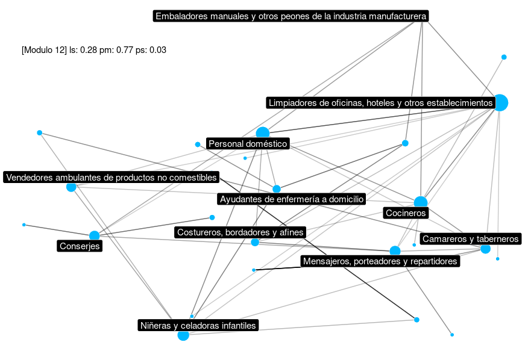
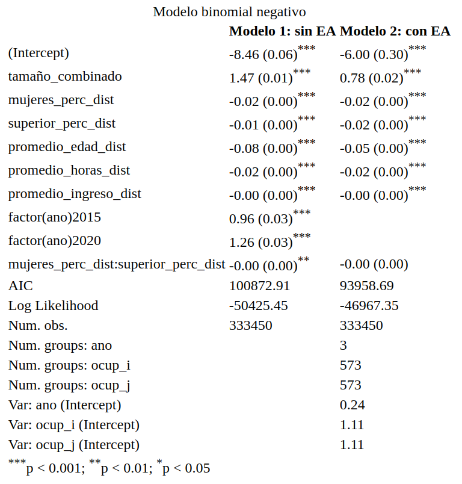
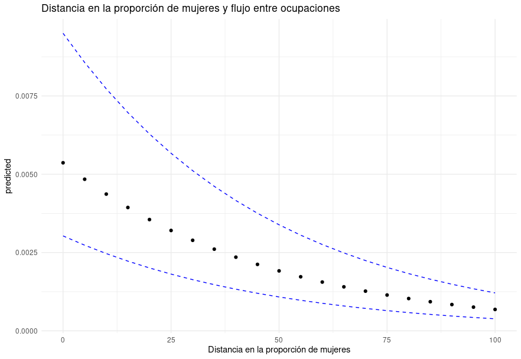
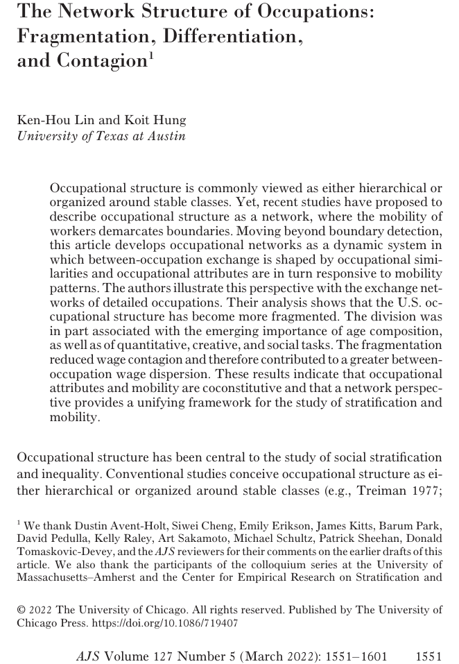
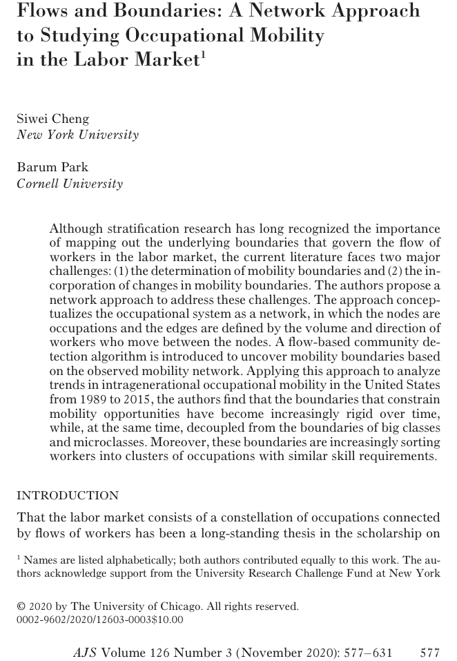
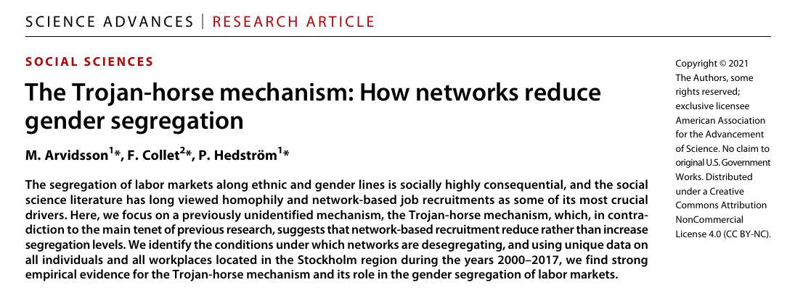
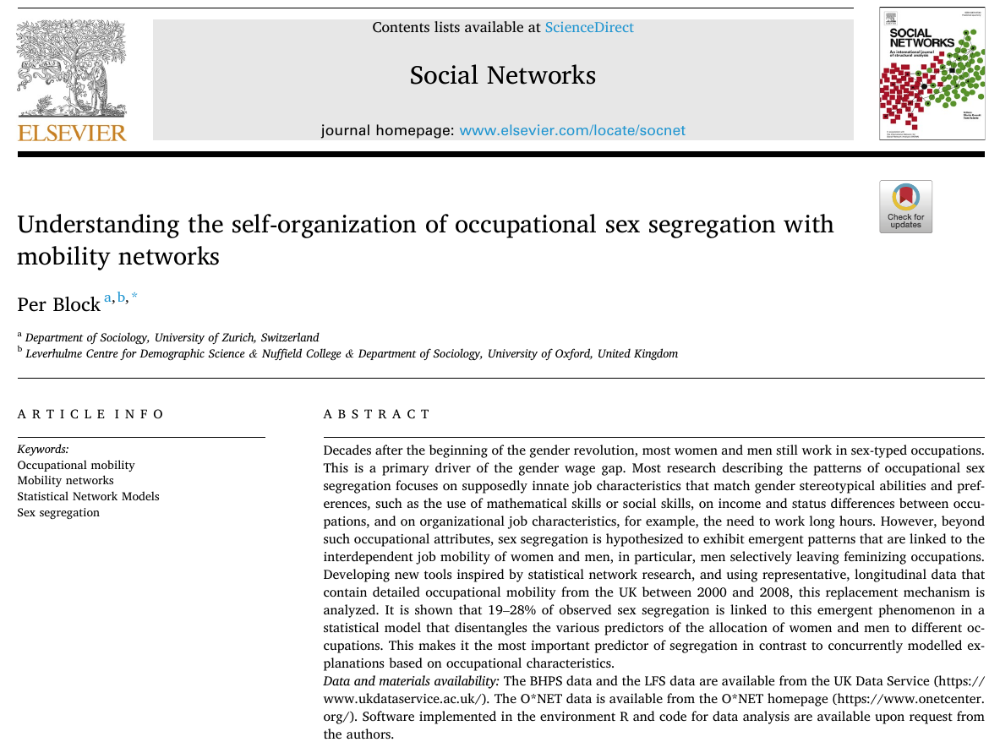

```{r setup, include=FALSE}
options(htmltools.dir.version = FALSE)
options(kableExtra.latex.load_packages = FALSE)
library(kableExtra)
```

```{r xaringan-themer, include=FALSE}
library(xaringanthemer)
style_duo_accent(
  footnote_font_size = "0.5em",
  primary_color = "#28282B",
  #primary_color = "#7393B3",
  secondary_color = "#2c8475",
  black_color = "#424242",
  white_color = "#FFF",
  base_font_size = "22px",
  # text_font_family = "Jost",
  # text_font_url = "https://indestructibletype.com/fonts/Jost.css",
  header_font_google = google_font("Libre Franklin", "200", "400"),
  header_font_weight = "200",
  inverse_header_color = "#eaeaea",
  title_slide_text_color = "#FFFFFF",
  text_slide_number_color = "#9a9a9a",
  text_bold_color =  "#2E8B57", #"#4169e1", # "#810541", # "#f79334",
  code_inline_color = "#B56B6F",
  code_highlight_color = "transparent",
  link_color = "#2c8475",
  table_row_even_background_color = lighten_color("#345865", 0.9),
  extra_fonts = list(
    "https://indestructibletype.com/fonts/Jost.css",
    google_font("Amatic SC", "400")
  ),
  colors = c(
    green = "#31b09e",
    "green-dark" = "#2c8475",
    highlight = "#87f9bb",
    purple = "#887ba3",
    pink = "#B56B6F",
    orange = "#D462FF",# "#810541", # "#f79334",
    red = "#dc322f",
    `blue-dark` = "#002b36",
    `text-dark` = "#202020",
    `text-darkish` = "#424242",
    `text-mild` = "#606060",
    `text-light` = "#9a9a9a",
    `text-lightest` = "#eaeaea"
  ),
  extra_css = list(
    ".remark-slide-content h3" = list(
      "margin-bottom" = 0, 
      "margin-top" = 0
    ),
    ".smallish, .smallish .remark-code-line" = list(`font-size` = "0.7em")
  )
)
xaringanExtra::use_xaringan_extra(c("tile_view", "animate_css", "tachyons", "share_again"))
xaringanExtra::use_extra_styles()
```

```{r metadata, echo=FALSE}
library(metathis)
meta() %>% 
  meta_description("Movilidad ocupacional intrageneracional y segregación de género en Chile, Congresio Sociología, Mayo, 2024") %>% 
  meta_social(
    title = "Movilidad ocupacional intrageneracional y segregación de género en Chile 2009- 2020",
    url = "https://github.com/rcantillan/slides/tree/main/gender_segregation/index",
    image = "https://github.com/rcantillan/slides/tree/main//gender_segregation/intro/home_screen.png",
    twitter_card_type = "summary_large_image",
    twitter_creator = "ricantillan"
  )
```

```{r components, include=FALSE}
slides_from_images <- function(
  path,
  regexp = NULL,
  class = "hide-count",
  background_size = "contain",
  background_position = "top left"
) {
  if (isTRUE(getOption("slide_image_placeholder", FALSE))) {
    return(glue::glue("Slides to be generated from [{path}]({path})"))
  }
  if (fs::is_dir(path)) {
    imgs <- fs::dir_ls(path, regexp = regexp, type = "file", recurse = FALSE)
  } else if (all(fs::is_file(path) && fs::file_exists(path))) {
    imgs <- path
  } else {
    stop("path must be a directory or a vector of images")
  }
  imgs <- fs::path_rel(imgs, ".")
  breaks <- rep("\n---\n", length(imgs))
  breaks[length(breaks)] <- ""

  txt <- glue::glue("
  class: {class}
  background-image: url('{imgs}')
  background-size: {background_size}
  background-position: {background_position}
  {breaks}
  ")

  paste(txt, sep = "", collapse = "")
}
options("slide_image_placeholder" = FALSE)
```

class: left title-slide
background-image: url('andrej-lisakov-g3z-CgUiPtg-unsplash.jpg')
background-size: cover
background-position: left


[ricantillan]: https://twitter.com/ricantillan
[rbind]: https://rcantillan.rbind.io

#  

.side-text[
[&commat;ricantillan][ricantillan] | [rcantillan.rbind.io][rbind]
]

.title-where[
### **Movilidad ocupacional intrageneracional y segregación de género en Chile 2009 - 2020**
#### Roberto Cantillan / Mauricio Bucca <br> 
Instituto de Sociología PUC <br> Millennium Nucleus for the Study of Labor Market Mismatch  
Mayo, 2024
]

```{css echo=FALSE}
.title-slide h1 {
  font-size: 70px;
  font-family: Jost, sans;
  animation-name: title-text;
  animation-direction: alternate;
  animation-iteration-count: infinite;
}

.side-text {
  color: white;
  transform: rotate(90deg);
  position: absolute;
  font-size: 18px;
  top: 150px;
  right: -110px;
  transition: opacity 0.5s ease-in-out;
  animation-name: enter-right;
  animation-direction: alternate;
  animation-iteration-count: infinite;
}

.side-text:hover {
  opacity: 1;
}

.side-text a {
  color: white;
}

.title-where {
  font-family: Jost, sans;
  font-size: 30px;
  position: absolute;
  bottom: 30px;
  animation-name: enter-left;
  animation-direction: alternate;
  animation-iteration-count: infinite;
  animation-timing-function: ease-in-out;
}
```


```{r logo, echo=FALSE}
library(xaringanExtra)
use_logo(
  image_url = "ins--sociologia-traz-04.png",
  exclude_class = c("title-slide","hide_logo","inverse"),
  width = "150px",
  height = "150px")
```


---

class: middle right
background-image: url('sarah-dao-GFIou2AVG3Q-unsplash.jpg')
background-size: cover

### **Motivación**


---
class: left middle

### **Motivación**

- A pesar de décadas de avances en igualdad de género, la mayoría de mujeres y hombres siguen trabajando en ocupaciones típicas para su sexo (Charles y Grusky, 2005; Levanon y Grusky, 2016). Esto es un factor clave en la brecha salarial de género (Blau y Kahn, 2017; Charles, 2011).

Las principales explicaciones actuales se basan en:

- **Segregación vertical**: Discriminación hacia las mujeres en acceso a trabajos de mayor estatus (Ridgeway, 2001; Charles y Grusky, 2005; England, 2010).
- **Segregación horizontal**: Diferencias asumidas en habilidades y preferencias por tipo de ocupación (Levanon y Grusky, 2016; Cech, 2013; Leslie et al., 2015).
- **División del trabajo**: Limitación de empleo femenino por responsabilidades domésticas y de crianza (Becker, 1985; Eccles, 1994; England, 2010).


Sin embargo, algunos patrones empíricos no pueden explicarse por estos modelos (Charles y Grusky, 2005; Ku, 2011; Seron et al., 2016; Reskin y Roos, 1990; Murphy y Oesch, 2016; Pan, 2015).

---
class: center middle

.w-50.fl[
### 


]

.w-50.fr[
### 


]


---

class: center middle

.w-50.fl[
### 


]

.w-50.fr[
### 




]

---

class: center middle


.w-50.fl[
### 



]

.w-50.fr[



]

---

class: left middle

### **Motivación II: Interdependencia**


- Disparidad en composición por sexo entre especializaciones muy similares (Ku, 2011; Seron et al., 2016).
- Grandes cambios en composición por sexo de algunas ocupaciones a lo largo del tiempo (Reskin y Roos, 1990; Murphy y Oesch, 2016; Pan, 2015).
- Se sugiere un mecanismo adicional: Los hombres tienden a evitar y abandonar ocupaciones que se están feminizando (Reskin y Roos, 1990; England et al., 2007b; England, 2008; Goldin, 2014). Vinculado a perspectivas sobre devaluación y "contaminación" de ocupaciones feminizadas.


Preguntas centrales:

- **¿Puede generalizarse este mecanismo de reemplazo a todo un mercado laboral?** (England et al., 2007a)
- **¿Cuánto contribuye este fenómeno a la segregación ocupacional por sexo en comparación con las explicaciones basadas en características ocupacionales?**

---
class: center middle

.w-50.fl[
### 


]

.w-50.fr[
### 




]

---

class: center middle


.w-50.fl[
### 


]

.w-50.fr[
### 




]

---


class: left middle 
### **Teoría y objetivo del estudio**

- El estudio aplica un enfoque de redes de movilidad para comprender los mecanismos que impulsan la segregación ocupacional por sexo.
- Se analiza si los hombres abandonan ocupaciones cuando ingresan más mujeres, controlando por un conjunto amplio de características ocupacionales.
- Si se observa una relación entre el flujo de entrada de mujeres y el flujo de salida de hombres, se evalúa en qué medida esto produce segregación por sexo.
- El concepto de red de movilidad permite relacionar empíricamente la movilidad de diferentes sexos entre sí, representando la estructura de los cambios ocupacionales (Breiger, 1990; Cheng y Park, 2020; Lin & Hung, 2023).


---

class: middle right
background-image: url('sarah-dao-GFIou2AVG3Q-unsplash.jpg')
background-size: cover

### **Metodología**

---
class: left middle

### **Datos**

Se utilizan datos longitudinales y una metodología estadística no estándar, inspirada en la investigación de redes, para modelar la movilidad ocupacional interdependiente de mujeres y hombres (Snijders, 2011).

- Se emplean datos de corte longitudinal de la Encuesta de Protección Social (EPS Chile) para los años 2009, 2012, 2015 y 2020. 
- La muestra total entre los 4 años es de aproximadamente [N] 15452 individuos ocupados. 
- 59 ocupaciones (o micro clases) siguiendo a Jonsson et. al. (2009) (se usan equivalencia CIUO 1988)

---

class: left middle

### **Metodología II: Estrategia analítica**

- Se utiliza una nueva variante de un modelo de familia exponencial que permite incorporar predictores flexibles basados en características individuales y ocupacionales, así como estructuras emergentes (Block et al., 2022). La probabilidad de observar una red de movilidad específica $x$ está dada por:

$$Pr(X = x) = \frac{\exp(Q(s(x); \theta))}{\kappa}$$

- donde $Q$ es un predictor lineal que depende de las estadísticas suficientes $s(x)$ del modelo y un parámetro estadístico $\theta$. La constante de normalización $\kappa$ asegura que todas las probabilidades sumen uno.

- El predictor lineal $Q$ permite incorporar diversos predictores basados en variables y predictores endógenos en el modelo de movilidad.

- A diferencia de los modelos log-lineales clásicos, este enfoque permite incluir parámetros que representan la interdependencia de las observaciones. Así, la probabilidad de observar un sistema de movilidad emergente es más que la suma de partes independientes.

---
class: left middle

### **Parámetro de interés: Segregación**

- `crowding_out_prop_covar_bin`: Este parámetro modela la tendencia de individuos de un tipo (definido por una covariable binaria) a permanecer o abandonar una ubicación en función de la proporción de individuos de otro tipo que ingresan a esa ubicación.

Matemáticamente, el estadístico asociado a este parámetro se define como:

$$s(x) = \sum_{i \in B} \frac{\sum_{i' \in B} I(d_{i'} = o_i) w_{i'}}{\sum_{i' \in B} I(d_{i'} = o_i)} I(o_i = d_i) (1 - w_i)$$

Donde:
- $B$ es el conjunto de individuos móviles
- $o_i$ y $d_i$ son las ubicaciones de origen y destino del individuo $i$, respectivamente
- $w_i$ es el valor de la covariable binaria para el individuo $i$
- $I(.)$ es una función indicadora que toma el valor 1 si la condición entre paréntesis es verdadera y 0 en caso contrario

---
class: left middle

### **Parámetro de interés: Segregación II**

- Sustantivamente, un parámetro positivo asociado a este estadístico indica que los individuos de un tipo $(w_i = 0)$ tienden a permanecer en su ubicación actual cuando una mayor proporción de individuos del otro tipo $(w_i = 1)$ se mueven a esa ubicación. Por el contrario, un parámetro negativo indica que los individuos de un tipo tienden a abandonar las ubicaciones cuando una mayor proporción de individuos del otro tipo ingresan. 

- Es importante destacar que este parámetro modela la interdependencia de la movilidad de diferentes grupos sin necesidad de datos longitudinales. 

- En lugar de modelar explícitamente el tiempo, captura la relación contemporánea entre la proporción de individuos de un tipo que ingresan a una ubicación y la tendencia de los individuos del otro tipo a permanecer o irse. Esto permite analizar patrones emergentes de segregación a partir de datos transversales de redes de movilidad.

.footnote[
[1] Block, P. (2023). Understanding the self-organization of occupational sex segregation with mobility networks. Social Networks, 73, 42–50. https://doi.org/10.1016/j.socnet.2022.12.004

[2] Block, P., Stadtfeld, C., & Robins, G. (2022). A statistical model for the analysis of mobility tables as weighted networks with an application to faculty hiring networks. Social Networks, 68, 264–278. https://doi.org/10.1016/j.socnet.2021.08.003

]

---

class: middle left

### **Modelo III**

- `loops`: Este término captura la tendencia general de los individuos a permanecer en su ubicación actual en lugar de moverse a una nueva ubicación.
- `reciprocity_min`: Este término representa la tendencia de los individuos a moverse entre ubicaciones que tienen flujos de movilidad bidireccionales, es decir, donde hay individuos que se mueven en ambas direcciones entre las ubicaciones.
- `loops_resource_covar` con el atributo "sex": Este término captura si los individuos de un sexo específico (hombres o mujeres) tienen una tendencia diferente a permanecer en su ubicación actual en comparación con el otro sexo.
- `staying_by_prop_bin_inflow` con el atributo "sex": Este término modela si la tendencia de los individuos a permanecer en su ubicación actual depende de la proporción de individuos del mismo sexo que se mueven hacia esa ubicación.
- `crowding_out_prop_covar_bin` con el atributo "sex": Este término captura si los individuos de un sexo tienen una tendencia a abandonar las ubicaciones a medida que una mayor proporción de individuos del otro sexo se mueven hacia esas ubicaciones.
- `resource_covar_to_node_covar` con los atributos "size" y "sex": Este término representa si los individuos de un sexo específico tienen una tendencia a moverse hacia ubicaciones de un tamaño particular (por ejemplo, organizaciones más grandes o más pequeñas) en comparación con el otro sexo.

---

class: left middle

### **Metodología III**

- El modelo va más allá de los métodos estadísticos de redes establecidos (Butts, 2007; Lusher et al., 2013), al acomodar (i) pesos en los lazos de la red sin especificar una distribución de conteos en díadas a priori, (ii) auto-lazos ponderados y (iii) atributos de aristas, que representan el número de individuos móviles y no móviles, así como su sexo.

- Los parámetros que modelan explícitamente la interdependencia se estiman a partir de los datos y no se imponen exógenamente. Por lo tanto, si no hay interdependencia, el modelo se reduce a un modelo logit multinomial estándar para el análisis de movilidad.

- En general, este diseño de investigación interdisciplinario combina ventajas clave de los diseños clásicos de ciencias sociales y de redes, permitiendo probar múltiples explicaciones en un modelo y analizar patrones que resultan de procesos sociales.


---
class: left middle

### **Resultados preliminares**

- `loops`: El parámetro estimado es 1.82936, lo que indica una tendencia positiva de los individuos a permanecer en su ubicación actual en lugar de moverse a una nueva ubicación.
- `reciprocity_min`: El parámetro estimado es -1.13797, lo que sugiere que la movilidad recíproca (individuos que se mueven entre dos ubicaciones en ambas direcciones) es menos frecuente de lo esperado por azar.
- `loops_resource_covar` con el atributo "sex": El parámetro estimado es 2.59736, lo que indica que los hombres (codificados como 1) tienen una mayor tendencia a permanecer en su ubicación actual en comparación con las mujeres.
- `staying_by_prop_bin_inflow` con el atributo "sex": El parámetro estimado es 1.86210, lo que sugiere que la tendencia de los individuos a permanecer en su ubicación actual aumenta a medida que una mayor proporción de individuos del mismo sexo (en este caso, hombres) se mueven hacia esa ubicación.
- `crowding_out_prop_covar_bin` con el atributo "sex": El parámetro estimado es 0.03314, lo que indica una leve tendencia de los hombres a abandonar las ubicaciones a medida que una mayor proporción de mujeres se mueve hacia esas ubicaciones. Sin embargo, el efecto parece ser relativamente pequeño.
- `resource_covar_to_node_covar` con los atributos "size" y "sex": El parámetro estimado es -0.00307, lo que sugiere que las mujeres tienen una leve tendencia a moverse hacia ubicaciones más pequeñas en comparación con los hombres. Sin embargo, el efecto parece ser muy pequeño.

---

class: left middle

### **Limitaciones y pasos futuros**

- El estudio se basa en datos de un período específico (2009 - 2020) en Chile. 
- Las características ocupacionales se miden en un solo punto en el tiempo, asumiendo estabilidad durante el período analizado. Cambios no observados podrían sesgar los parámetros.
- El modelo no captura explícitamente la dimensión temporal de la movilidad, sino que se basa en patrones contemporáneos de flujos de entrada y salida.

---

class: left middle

### **Limitaciones y pasos futuros II**

- Puede ser pertinente Realizar análisis comparativos en diferentes países y períodos para evaluar la consistencia de los patrones de movilidad interdependiente entre sexos.
- Investigar cómo cambian las características percibidas de las ocupaciones (estatus, ingresos, habilidades requeridas) a lo largo del tiempo, siguiendo los cambios en la composición por sexo (Goldin, 2014).
- Víncular teoricamente con modelos que expliquen los mecanismos psicológicos y sociales detrás de la tendencia masculina a evitar ocupaciones en proceso de feminización.

---
class: middle right
background-image: url('sarah-dao-GFIou2AVG3Q-unsplash.jpg')
background-size: cover

### **Muchas Gracias**
#### **Esta presentación fue realizada con el paquete [Xaringan](https://slides.yihui.org/xaringan), diseñado para entorno  [R](https://www.r-project.org/)** 


