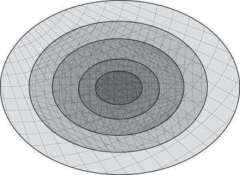
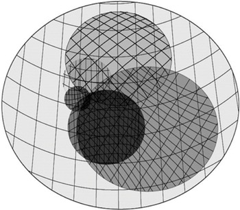
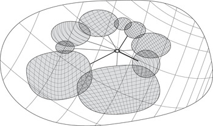
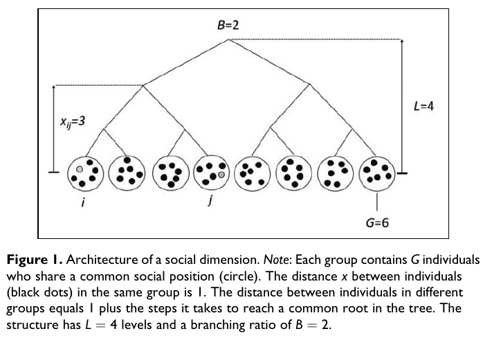
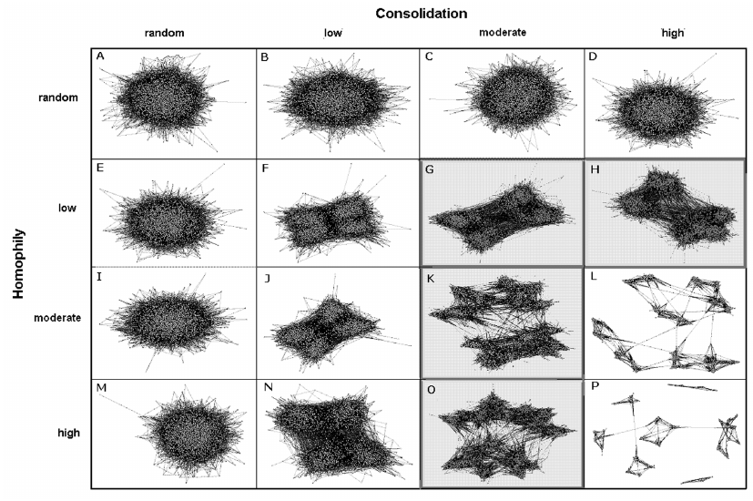

```{r setup, include=FALSE}
options(htmltools.dir.version = FALSE)
```

```{r xaringan-themer, include=FALSE}
library(xaringanthemer)
style_duo_accent(
  footnote_font_size = "0.5em",
  primary_color = "#28282B",
  #primary_color = "#7393B3",
  secondary_color = "#2c8475",
  black_color = "#4242424",
  white_color = "#FFF",
  base_font_size = "22px",
  # text_font_family = "Jost",
  # text_font_url = "https://indestructibletype.com/fonts/Jost.css",
  header_font_google = google_font("Libre Franklin", "200", "400"),
  header_font_weight = "200",
  inverse_header_color = "#eaeaea",
  title_slide_text_color = "#FFFFFF",
  text_slide_number_color = "#9a9a9a",
  text_bold_color = "#D462FF", # "#810541", # "#f79334",
  code_inline_color = "#B56B6F",
  code_highlight_color = "transparent",
  link_color = "#2c8475",
  table_row_even_background_color = lighten_color("#345865", 0.9),
  extra_fonts = list(
    "https://indestructibletype.com/fonts/Jost.css",
    google_font("Amatic SC", "400")
  ),
  colors = c(
    green = "#31b09e",
    "green-dark" = "#2c8475",
    highlight = "#87f9bb",
    purple = "#887ba3",
    pink = "#B56B6F",
    orange = "#D462FF",# "#810541", # "#f79334",
    red = "#dc322f",
    `blue-dark` = "#002b36",
    `text-dark` = "#202020",
    `text-darkish` = "#424242",
    `text-mild` = "#606060",
    `text-light` = "#9a9a9a",
    `text-lightest` = "#eaeaea"
  ),
  extra_css = list(
    ".remark-slide-content h3" = list(
      "margin-bottom" = 0, 
      "margin-top" = 0
    ),
    ".smallish, .smallish .remark-code-line" = list(`font-size` = "0.7em")
  )
)
xaringanExtra::use_xaringan_extra(c("tile_view", "animate_css", "tachyons", "share_again"))
xaringanExtra::use_extra_styles()
```

```{r metadata, echo=FALSE}
library(metathis)
meta() %>% 
  meta_description("Mobility classes in Chile 2009- 2020, DEMOSAL, Agosto 16, 2023") %>% 
  meta_social(
    title = "Mobility classes in Chile 2009- 2020",
    url = "https://github.com/rcantillan/slides/tree/main/interseccionalidad/intro",
    image = "https://github.com/rcantillan/slides/tree/main//interseccionalidad/intro/home_screen.png",
    twitter_card_type = "summary_large_image",
    twitter_creator = "ricantillan"
  )
```

```{r components, include=FALSE}
slides_from_images <- function(
  path,
  regexp = NULL,
  class = "hide-count",
  background_size = "contain",
  background_position = "top left"
) {
  if (isTRUE(getOption("slide_image_placeholder", FALSE))) {
    return(glue::glue("Slides to be generated from [{path}]({path})"))
  }
  if (fs::is_dir(path)) {
    imgs <- fs::dir_ls(path, regexp = regexp, type = "file", recurse = FALSE)
  } else if (all(fs::is_file(path) && fs::file_exists(path))) {
    imgs <- path
  } else {
    stop("path must be a directory or a vector of images")
  }
  imgs <- fs::path_rel(imgs, ".")
  breaks <- rep("\n---\n", length(imgs))
  breaks[length(breaks)] <- ""

  txt <- glue::glue("
  class: {class}
  background-image: url('{imgs}')
  background-size: {background_size}
  background-position: {background_position}
  {breaks}
  ")

  paste(txt, sep = "", collapse = "")
}
options("slide_image_placeholder" = FALSE)
```

class: left title-slide
background-image: url('marc-sendra-martorell-2BrdNFxW0UY-unsplash.jpg')
background-size: cover
background-position: left


[ricantillan]: https://twitter.com/ricantillan
[rbind]: https://rcantillan.rbind.io

#  

.side-text[
[&commat;ricantillan][ricantillan] | [rcantillan.rbind.io][rbind]
]

.title-where[
### Interseccionalidad 
Instituto de Sociología PUC <br> 
Octubre 18, 2023
]

```{css echo=FALSE}
.title-slide h1 {
  font-size: 80px;
  font-family: Jost, sans;
  animation-name: title-text;
  animation-direction: alternate;
  animation-iteration-count: infinite;
}

.side-text {
  color: white;
  transform: rotate(90deg);
  position: absolute;
  font-size: 22px;
  top: 150px;
  right: -130px;
  transition: opacity 0.5s ease-in-out;
  animation-name: enter-right;
  animation-direction: alternate;
  animation-iteration-count: infinite;
}

.side-text:hover {
  opacity: 1;
}

.side-text a {
  color: white;
}

.title-where {
  font-family: Jost, sans;
  font-size: 25px;
  position: absolute;
  bottom: 10px;
  animation-name: enter-left;
  animation-direction: alternate;
  animation-iteration-count: infinite;
  animation-timing-function: ease-in-out;
}
```


```{r logo, echo=FALSE}
library(xaringanExtra)
use_logo(
  image_url = "ins--sociologia-traz-04.png",
  exclude_class = c("title-slide","hide_logo","inverse"),
  width = "150px",
  height = "150px")
```


---

class: left middle

### **Temas** 


- Resumen ideas centreales de los textos leídos

--

- Elementos para la discusión   

--

- Preguntas 


---

class: middle right
background-image: url('sarah-dao-GFIou2AVG3Q-unsplash.jpg')
background-size: cover

### ** Ideas centreales de los textos**

---


class: middle left

### **Introducción**

- **Definición**: La interseccionalidad es un enfoque que analiza cómo las relaciones de poder interconectadas influyen en las interacciones sociales y las experiencias individuales en la vida cotidiana.

--

- **Relaciones de poder interconectadas**: La interseccionalidad considera categorías como raza, clase, género, sexualidad, nación, habilidad, etnia y edad como interrelacionadas y mutuamente conformantes.

--

-  **Herramienta comprensiva**: Ejemplifica cómo estas categorías se superponen y cómo su comprensión es fundamental para abordar la complejidad en la sociedad y las experiencias humanas.


---

class: middle left

### **Aplicación de la Interseccionalidad**

- **Influencia en la educación superior**: Destaca cómo las relaciones de poder interseccionales afectan la educación superior, con un enfoque en la inclusión de estudiantes que históricamente enfrentaron barreras discriminatorias.

--

- **Movimientos sociales**: Muestra cómo, a menudo, los movimientos sociales han priorizado una categoría de análisis sobre otras, lo que llevó a la necesidad de utilizar la interseccionalidad como herramienta analítica. La interseccionalidad tiene su origen en el activismo de movimientos sociales.

--

- **Deporte**: Se utiliza como herramienta analítica para examinar cómo las relaciones de poder organizan un deporte en particular y destaca la importancia de comprender cómo se entrelazan las diferencias nacionales y raciales (FIFA).

--

- Necesidad de mantener una relación activa y sinérgica entre la teoría (la conceptualización y el análisis) y la praxis (la acción y la implementación).

---

class: middle left

### **Desafíos y usos**

- **Dominios de poder**: Explica cómo los dominios estructural, cultural, disciplinario e interpersonal son fundamentales para comprender cómo las relaciones de poder afectan diferentes aspectos de la sociedad.

--

- **Desafíos en la Aplicación de la Interseccionalidad**: Se critica la tendencia a simplificar la interseccionalidad mediante el uso de términos abreviados como "raza, clase y género".

--

- **Relación con la desigualdad global y políticas públicas**: Muestra cómo la interseccionalidad arroja luz sobre la creciente desigualdad global y cómo puede influir en las políticas públicas para reducir o agravar esta desigualdad.

---

class: middle right
background-image: url('sarah-dao-GFIou2AVG3Q-unsplash.jpg')
background-size: cover

### **Elementos para la discusión:**
**La construcción teórica de una medida de interseccionalidad a nivel contextual**

---

class: middle left

#### **Simmel: web of group affiliations**

.w-50.fl[
### 





]

.w-40.fr[

.footnote[
[1] Concentrico (premoderno), intersecting circles, Radio. 

[2] Pescosolido, B. A., & Rubin, B. A. (2000). The Web of Group Affiliations Revisited: Social Life, Postmodernism, and Sociology. American Sociological Review, 65(1), 52–76. https://doi.org/10.1177/000312240006500104

]



]

---

class: middle left

#### **Blau: Crosscutting social circles**

- “Simmel’s concept of crosscutting circles centers attention on these numerous lines of differentiation and their implications. His microsociological focus is on the significance of crosscutting circles for individuals, whereas our macrosociological focus is on their significance for the patterns of social relations in large populations.” (Blau and Schwartz, 1997, p. 83)

--

- “The strength of the relationship of two or more social differences can vary from complete independence to perfect association. Strongly related dimensions consolidate social positions and differences, thus reinforcing the barriers to social intercourse. The intersecting social differences resulting from weak relationships of the population distributions along various lines make group boundaries more permeable, status distinctions more easily bridged, and intergroup relations more frequent. Consolidated social differences and positions solidify ingroups and intensify group pressures.” (Blau and Schwartz, 1997, p. 83) 


.footnote[

[1] Blau, P. M., & Schwartz, J. E. (1997). Crosscutting social circles: Testing a macrostructural theory of intergroup relations. Transaction Publishers.

]

---
class: left middle

#### **Centola: The orginis of the networks and diffusion**


.w-50.fl[
### 




]

.w-40.fr[



.footnote[
[1] Centola, D. (2015). The Social Origins of Networks and Diffusion. American Journal of Sociology, 120(5), 1295–1338. https://doi.org/10.1086/681275

[2] Watts, D. J., Dodds, P. S., & Newman, M. E. J. (2002). Identity and Search in Social Networks. Science, 296(5571), 1302–1305. https://doi.org/10.1126/science.1070120
]
]


---

class: middle left

#### **Zhao: Context, Consolidation and intersectionality I**


.w-50.fl[
### 

La interseccionalidad implica que la combinación de dos o más atributos sociales tiene un impacto conjunto en las dinámicas sociales (fenómenos emergentes). La experiencia de ser una mujer negra no es la suma de las experiencias promedio de ser negra y ser mujer (limitaciones del enfoque aditivo) (Warikoo and Carter, 2009, p. 381) 

Se propone el concepto de **consolidación** como una medida estructural de **interseccionalidad** a nivel de grupos sociales, no individuos. Se relaciona con la **superdiversidad** de Vertovec (2007) y representa la falta relativa de interseccionalidad.


]

.w-40.fr[


.footnote[
[1] Collins, P. H. (2015). Intersectionality’s Definitional Dilemmas. Annual Review of Sociology, 41(1), 1–20. https://doi.org/10.1146/annurev-soc-073014-112142

[2] Warikoo, N., & Carter, P. (2009). Cultural Explanations for Racial and Ethnic Stratification in Academic Achievement: A Call for a New and Improved Theory. Review of Educational Research, 79(1), 366–394. https://doi.org/10.3102/0034654308326162

[3] Vertovec, S. (2007). Super-diversity and its implications. Ethnic and Racial Studies, 30(6), 1024–1054. https://doi.org/10.1080/01419870701599465
]

]


---

class: middle left

#### **Zhao: Context, Consolidation and intersectionality II**

- **Consolidación** indica fronteras más claras, mientras que la **interseccionalidad** sugiere fronteras más difusas y menos salientes. 

--

- Caso de estudio: Predicción de Amistades Interétnicas. La consolidación, en lugar de la etnicidad sola, predice las amistades interétnicas. Se argumenta que la consolidación como interseccionalidad estructural ayudan a resistir la tendencia a tratar a los grupos étnicos como homogéneos y claramente definidos.

--

- Diferencia entre Interseccionalidad Individual y Estructural: Se ilustra cómo la consolidación afecta la integración social en el aula a nivel estructural y no solo individual.


.footnote[
[1] Zhao, L. (2023). From Superdiversity to Consolidation: Implications of Structural Intersectionality for Interethnic Friendships. American Journal of Sociology, 128(4), 1114–1157. https://doi.org/10.1086/723435

[2] Zhao, L., & Garip, F. (2021). Network Diffusion Under Homophily and Consolidation as a Mechanism for Social Inequality. Sociological Methods & Research, 50(3), 1150–1185. https://doi.org/10.1177/00491241211014237

]

---

class: middle right
background-image: url('sarah-dao-GFIou2AVG3Q-unsplash.jpg')
background-size: cover

#### **"Las redes sociales proveen acceso a recursos sociales. Entonces, cualquier proceso de influya en el proceso de formación de redes tendra implicancias para el desarrollo de la desigualdad"** 


---

class: left middle

#### **Preguntas para la discusión**

- ¿Es pertinente considerar el continuo **consolidación - interseccionalidad** como un parámetro estructural determinante para la organización social? ¿Cuales pueden ser sus efectos a nivel individual y de organización social? (Topologías de red)

- ¿Cuál es el límite del foco de análisis de la interseccionalidad a nivel contextual?

- ¿Cual es el límite del foco en la afiliación (múltiple o no) a categorías desaventajadas por parte de lo sindividuos? A propósito de los resultados de Cech (2022) ¿Que otras técnias de análisis podemos utilizar? (ej. técnicas de clasificación de grandes cantidades de datos) 

- ¿Como se relaciona la interseccionalidad con otros parámetros estructurales como la distancia social (sociodemográfica) u homofilia? (Interacción y resultados emergentes)

- ¿Cómo puede vincularse la movilidad social, la interseccionalidad y la incertidumbre, en los procesos de integración social? Y cuales pueden ser sus efectos en términos de cohesión social? 

- A propósito del poder y su concentración (o exclusión): Si entendemos al poder como la "capacidad de influencia" de actores u entidades colectivas como puede vincularse el nivel individual y el contextual en análisis de "interlocking". 


.footnote[
[1] Cech, E. A. (2022). The intersectional privilege of white able-bodied heterosexual men in STEM. Science Advances, 8(24), eabo1558. https://doi.org/10.1126/sciadv.abo1558

]

---

class: middle right
background-image: url('sarah-dao-GFIou2AVG3Q-unsplash.jpg')
background-size: cover

### **Muchas Gracias**
#### **Esta presentación fue realizada con el paquete  [Xaringan](https://slides.yihui.org/xaringan), diseñado para entorno  [R](https://www.r-project.org/)** 


