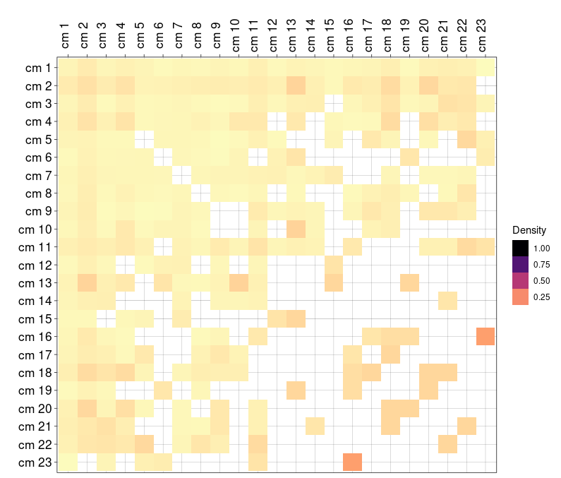

```{r setup, include=FALSE}
options(htmltools.dir.version = FALSE)
```

```{r xaringan-themer, include=FALSE}
library(xaringanthemer)
style_duo_accent(
  footnote_font_size = "0.5em",
  primary_color = "#28282B",
  #primary_color = "#7393B3",
  secondary_color = "#2c8475",
  black_color = "#4242424",
  white_color = "#FFF",
  base_font_size = "25px",
  # text_font_family = "Jost",
  # text_font_url = "https://indestructibletype.com/fonts/Jost.css",
  header_font_google = google_font("Libre Franklin", "200", "400"),
  header_font_weight = "200",
  inverse_header_color = "#eaeaea",
  title_slide_text_color = "#FFFFFF",
  text_slide_number_color = "#9a9a9a",
  text_bold_color = "#f79334",
  code_inline_color = "#B56B6F",
  code_highlight_color = "transparent",
  link_color = "#2c8475",
  table_row_even_background_color = lighten_color("#345865", 0.9),
  extra_fonts = list(
    "https://indestructibletype.com/fonts/Jost.css",
    google_font("Amatic SC", "400")
  ),
  colors = c(
    green = "#31b09e",
    "green-dark" = "#2c8475",
    highlight = "#87f9bb",
    purple = "#887ba3",
    pink = "#B56B6F",
    orange = "#f79334",
    red = "#dc322f",
    `blue-dark` = "#002b36",
    `text-dark` = "#202020",
    `text-darkish` = "#424242",
    `text-mild` = "#606060",
    `text-light` = "#9a9a9a",
    `text-lightest` = "#eaeaea"
  ),
  extra_css = list(
    ".remark-slide-content h3" = list(
      "margin-bottom" = 0, 
      "margin-top" = 0
    ),
    ".smallish, .smallish .remark-code-line" = list(`font-size` = "0.7em")
  )
)
xaringanExtra::use_xaringan_extra(c("tile_view", "animate_css", "tachyons", "share_again"))
xaringanExtra::use_extra_styles()
```

```{r metadata, echo=FALSE}
library(metathis)
meta() %>% 
  meta_description("Mobility classes in Chile 2009- 2020, DEMOSAL, Agosto 16, 2023") %>% 
  meta_social(
    title = "Mobility classes in Chile 2009- 2020",
    url = "https://github.com/rcantillan/slides/tree/main/mobility_class/intro",
    image = "https://github.com/rcantillan/slides/tree/main//mobility_class/intro/home_screen.png",
    twitter_card_type = "summary_large_image",
    twitter_creator = "ricantillan"
  )
```

```{r components, include=FALSE}
slides_from_images <- function(
  path,
  regexp = NULL,
  class = "hide-count",
  background_size = "contain",
  background_position = "top left"
) {
  if (isTRUE(getOption("slide_image_placeholder", FALSE))) {
    return(glue::glue("Slides to be generated from [{path}]({path})"))
  }
  if (fs::is_dir(path)) {
    imgs <- fs::dir_ls(path, regexp = regexp, type = "file", recurse = FALSE)
  } else if (all(fs::is_file(path) && fs::file_exists(path))) {
    imgs <- path
  } else {
    stop("path must be a directory or a vector of images")
  }
  imgs <- fs::path_rel(imgs, ".")
  breaks <- rep("\n---\n", length(imgs))
  breaks[length(breaks)] <- ""

  txt <- glue::glue("
  class: {class}
  background-image: url('{imgs}')
  background-size: {background_size}
  background-position: {background_position}
  {breaks}
  ")

  paste(txt, sep = "", collapse = "")
}
options("slide_image_placeholder" = FALSE)
```

class: left title-slide
background-image: url('shapelined-K9QHL52rE2k-unsplash.jpg')
background-size: cover
background-position: left


[ricantillan]: https://twitter.com/ricantillan
[rbind]: https://rcantillan.rbind.io

# Mobility classes <br> in Chile 2009- 2020

.side-text[
[&commat;ricantillan][ricantillan] | [rcantillan.rbind.io][rbind]
]

.title-where[
Instituto de Sociología PUC <br> 
Núcleo Milenio para el Estudio de Desajustes del Mercado Laboral (LM²C²) <br> 
**DEMOSAL** <br>
Agosto 16, 2023
]

```{css echo=FALSE}
.title-slide h1 {
  font-size: 80px;
  font-family: Jost, sans;
  animation-name: title-text;
  animation-direction: alternate;
  animation-iteration-count: infinite;
}

.side-text {
  color: white;
  transform: rotate(90deg);
  position: absolute;
  font-size: 22px;
  top: 150px;
  right: -130px;
  transition: opacity 0.5s ease-in-out;
  animation-name: enter-right;
  animation-direction: alternate;
  animation-iteration-count: infinite;
}

.side-text:hover {
  opacity: 1;
}

.side-text a {
  color: white;
}

.title-where {
  font-family: Jost, sans;
  font-size: 25px;
  position: absolute;
  bottom: 10px;
  animation-name: enter-left;
  animation-direction: alternate;
  animation-iteration-count: infinite;
  animation-timing-function: ease-in-out;
}
```


```{r logo, echo=FALSE}
library(xaringanExtra)
use_logo(
  image_url = "ins--sociologia-traz-04.png",
  exclude_class = c("title-slide","hide_logo","inverse"),
  width = "150px",
  height = "150px")
```


---

class: left middle

# **Temas** 


- Teoría

--

- Metodología 

--

- Datos 

--

- Resultados preliminares

--

---
class: left middle

### **Obejtivo** 

- Detectar clases de movilidad ocupacional intrageneracional en un intervalo de 10 años en Chile. 
- Evaluar el contagio salarial en las redes ocupacionales en Chile. 


---

class: middle right
background-image: url('tina-dawson-Kim9COAIEGc-unsplash.jpg')
background-size: cover

# **Teoría**

---


class: middle left

### **Estratificación y movilidad ocupacional** 

- La investigación sobre estratificación y movilidad ocupacional se ha centrado en comprender los factores que influencian los cambios de ocupación en el mercado laboral. En esete sentido, **una preocupación fundamental ha estado puesta en identificar límites que restringen la movilidad entre clases ocupacionales (y ocupaciones). Algunos enfoques prominentes han sido**

---

class: middle left

### **Estratificación y movilidad ocupacional II** 


- **Análisis de límites y flujo laboral**: Se examinan cómo los vínculos entre ocupaciones influyen en la probabilidad de cambio de trabajo y cómo estos vínculos pueden ser más fuertes o más débiles según el período y otros factores (Villarreal, 2020; Cheng, 2020).

--

- **Factores influyentes**: Factores como la educación, la desigualdad económica y la similitud de requisitos de estatus afectan la movilidad laboral (Hauser, 1980; Hout, 1984; DiPrete, 1987; Stier & Grusky, 1990). 
  
--

- **Agrupación de ocupaciones** (Goodman, 1981; Snipp, 1985; Breiger, 1974).

---
class: middle left

### **Estratificación y movilidad ocupacional III** 


- **Modelo de logro de estatus**: Se ha examinado cómo las oportunidades de moverse entre ocupaciones afectan la movilidad intrageneracional y el logro socioeconómico de los individuos (Blau, 1978; Sorensen, 1977; Erikson 1992; DiPrete, 2002; Kambourov & Manovskii, 2009; Cheng, 2014) 

--

- **Efecto de la estructura ocupacional**: Investigaciones han demostrado que la estructura del sistema ocupacional tiene un impacto significativo en los patrones de movilidad y en los ingresos de los trabajadores (DiPrete, 2002; Kambourov & Manovskii, 2009; Cheng, 2014).

--

- **Perspectiva de redes y capital social** (Villarreal, 2020; Cheng, 2020; Lin 2022; Fernandez & Fernandez-Mateo, 2006).

---
class: middle left

### **Limitaciones del Esquema de Clases Ocupacionales en el Análisis de Movilidad**

- El análisis clásico de movilidad ocupacional, fundamentado en esquemas jerárquicos de clase basados en características como prestigio, estatus, habilidades y autoridad ({Blau, 1978; Breiger, 1981), 

  - a menudo omite la atención detallada a los flujos entre ocupaciones. 
  - los cuales son cruciales para detectar límites "latentes" que restringen la movilidad individual a un nivel micro (Cheng & Park, 2020, p. 579).

---
class: middle left

### **Desafíos**

- **Identificación de heterogeneidad y límites emergentes**: Puede pasarse por alto efectos de límites entre ocupaciones al no considerar las diferencias emergentes dentro de las clases.

--

- **Sesgo de clasificación errónea**: Asignar individuos a clases puede no reflejar con precisión sus características ocupacionales reales.

--

- **Falta de sensibilidad a cambios en el mercado laboral**: Evolución de estructuras ocupacionales introduce nuevas ocupaciones o cambia existentes, volviendo obsoletas las clases predefinidas.

--

- **Problemas en la comparación entre contextos diversos**: Diferentes estudios que usan clases agregadas dificultan comparaciones y conclusiones sólidas.

---
class: middle left

### **Mobility classes**

- Es vital analizar la movilidad entre ocupaciones detalladas y distinguir las clases de movilidad de las classes ocupacionales. 

--

- Las clases de movilidad, derivadas directamente de flujos entre ocupaciones, permiten un análisis dinámico y actualizado de la movilidad ocupacional (Chen & Park, 2020).

---

class: middle right
background-image: url('tina-dawson-Kim9COAIEGc-unsplash.jpg')
background-size: cover

### **El Mercado Ocupacional como Red**


---
class: middle left

### **El Mercado Ocupacional como Red**

- Una Perspectiva Analítica: 
  - Complejidad / Procesos dinámicos
  - Estructura como fenómeno emergente 
  - Flujos y límites

--

- En comparación con enfoques más prominentes, el enfoque basado en redes destaca: 
  - los límites latentes que restringen y facilitan la movilidad
  - cambios en el tiempo 
  - cómo los límites afectan la variabilidad de habilidades e ingresos. 

--

- La movilidad entre ocupaciones es esencial para entender la estructura ocupacional y constituye a la estructura, lo que refuta la noción de falta de estructura en la movilidad ocupacional (Cheng & Park, 2020).

---

class: middle left

### **El Mercado Ocupacional como Red II **

.w-50.fl[
### 

- La estructura ocupacional se puede ver como un **sistema adaptativo de intercambio generalizado** (Bearman, 1997) 

- las ocupaciones con atributos variables se conectan mediante el movimiento de trabajadores, respondiendo a choques exógenos y procesos de red endógenos.

- El mercado ocupacional se puede concebir como una red dirigida y valorada, con ocupaciones como nodos y flujos de trabajadores como enlaces que reflejan oportunidades y limitaciones (Cheng & Park, 2020).


]

.w-40.fr[
### 


.footnote[
[1] Bearman, P. (1997). Generalized Exchange. American Journal of Sociology, 102(5), 1383–1415. https://doi.org/10.1086/231087

[2] Cheng, S., & Park, B. (2020). Flows and Boundaries: A Network Approach to Studying Occupational Mobility in the Labor Market. American Journal of Sociology, 126(3), 577–631. https://doi.org/10.1086/712406

]

]

---

class: middle left

### **Clases de movilidad**

- Grupos de ocupaciones que están juntas debido a cómo las personas se mueven entre ellas: Clases de movilidad

- Las clases de movilidad se definen en función de cómo las personas se mueven, mientras que las clases ocupacionales (de manera clásica) a menudo no tienen que ver con esto. 

- Por lo tanto, las fronteras de movilidad pueden cruzar las fronteras de las clases ocupacionales, lo que significa que trascender las fronteras de movilidad no siempre implica cambios en la posición laboral, y cambiar de posición laboral no siempre implica moverse entre fronteras de movilidad. 

- Las clases de movilidad y las clases ocupacionales capturan diferentes aspectos del sistema laboral. Es importante entdner como se relacionan.  


.footnote[

[1] Cheng, S., & Park, B. (2020). Flows and Boundaries: A Network Approach to Studying Occupational Mobility in the Labor Market. American Journal of Sociology, 126(3), 577–631. https://doi.org/10.1086/712406

]


---
class: middle center


.footnote[
[1] Cheng, S., & Park, B. (2020). Flows and Boundaries: A Network Approach to Studying Occupational Mobility in the Labor Market. American Journal of Sociology, 126(3), 577–631. https://doi.org/10.1086/712406

]


---

class: middle left


<html>
<head>
<style>
table {
  border-collapse: collapse;
  width: 100%;
}

th, td {
  border: 1px solid black;
  padding: 6px;
  text-align: left;
}

th {
  background-color: #f2f2f2;
}
</style>
</head>
<body>


<table>
  <tr>
    <th>Limitaciones</th>
    <th>Descripción</th>
  </tr>
  <tr>
    <td>Ocupaciones como unidad de análisis</td>
    <td>Considerar perspectivas individuales y niveles contextuales adicionales.</td>
  </tr>
  <tr>
    <td>Atributos ocupacionales no varían en el tiempo</td>
    <td>Es difícil determinar si el ascenso de ocupaciones se debe a productividad o diferencias de habilidades.</td>
  </tr>
  <tr>
    <td>Confianza en la matriz de transición</td>
    <td>Usar datos longitudinales para análisis más complejos y movimientos de múltiples pasos.</td>
  </tr>
  <tr>
    <td>Necesidad de datos longitudinales</td>
    <td>Datos extensos permitirían un análisis completo y dependencias de orden superior.</td>
  </tr>
  <tr>
    <td>Variaciones de subgrupos</td>
    <td>Explorar diferencias por género, raza, estatus migratorio y educación.</td>
  </tr>
</table>

</body>
</html>


---
class: middle right
background-image: url('tina-dawson-Kim9COAIEGc-unsplash.jpg')
background-size: cover

### **Objetivo**

---
class: middle left


### **Obejtivo** 

- Detectar clases de movilidad ocupacional en un intervalo de 10 años en Chile. 
- Evaluar el contagio salarial en las redes ocupacionales en Chile. 


---
class: middle right
background-image: url('tina-dawson-Kim9COAIEGc-unsplash.jpg')
background-size: cover

### **Metodología**


---
class: middle left


.w-40.fl[

### **Metodología** 

- Ponderar overlap por periodo
- Construir cluster con algoritmo **Infomap**. 
- Evaluar la rigidez con algoritmo **LinkRank modularity**. 
- Utilizo el 
- Descrbir patrones generales
- Evaluar patrones de contagio siumple. 

.footnote[
[1] https://www.mapequation.org/

[2] Kim, Y., Son, S.-W., & Jeong, H. (2010). Finding communities in directed networks. Physical Review E, 81(1), 016103.
]

]

.w-50.fr[
### 


]

---

class: middle left


.w-50.fl[

### **Datos y ocupaciones** 

- Utilizo datos de la Encuesta de Protección Social EPS

- La encuesta busca obtener información detallada sobre diferentes áreas de protección social, como empleo, educación, salud, vivienda y otros aspectos del bienestar.

- Encuesta panel con muestra probabilística para toda la población chilena. 

- Utilizo un N total de 39660

- Para ambos años utlizo la muestra completa (Panel y refresco) 

- CIUO 08 (2009 = 250; 2020 = 265 informadas)

]

.w-40.fr[
### 


.footnote[
[1] https://previsionsocial.gob.cl/datos-estadisticos/documentos-eps-y-otras-encuestas/
]
]

---
class: middle center


.w-50.fl[

#### **2009**


]

.w-50.fr[
#### **2020**


]


---

class: middle center

#### **Mobility classes 2009** 


---

class: middle center

#### **Mobility classes II 2009** 


---
class:middle center

#### **Class relations 2009**


---
class: middle center

#### **Mobility classes 2020** 


---
class: middle center

#### **Mobility classes II 2020** 


---

class:middle center

#### **Class relations 2020**




---
class: middle left

### **Resultados preliminares**

- Las redes ocupacionales tienden a reducir el nivel de diversidad pero no el de segregación.  

- Aumenta levemente el número de clases de movilidad: **de 22 cluster en el 2009 a 23 en el 2019**. 

- Adicionalmente, la medida de **`linkModularity` aumenta de 0.31 a 0.34**. Esto denota mayor rigidez en la estructura de clases de movilidad en general. 

- La tendencia muestra que los grupos ocupacionales de alto estatus tienden a integrarse mejor, con una mayor diversidad ocupaciones, aunque similares en estatus. 

- Mayor especialización y mayor diversidad en ocupaciones de alto estatus en el año 2020.  


---

class: middle left

### **Análisis futuro** 

- Atributos individuales y ocupaciones afectan la formación de límites ocupacionales (ej. Capital social). 

- Atributos contribuyen a desarrollo de contagio entre ocupaciones en el tiempo. 

- El rol que juega la consolidación y la homofilia en la formación de la topología de las redes ocupacionales. 

- Análisis con datos panel 


---

class: middle right
background-image: url('tina-dawson-Kim9COAIEGc-unsplash.jpg')
background-size: cover

### **Muchas Gracias**
#### **Esta presentación fue realizada con el paquete  [Xaringan](https://slides.yihui.org/xaringan), diseñado para entorno  [R](https://www.r-project.org/)** 


