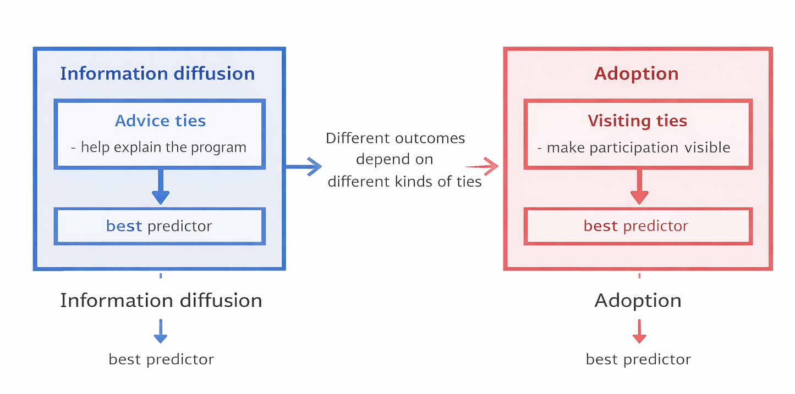
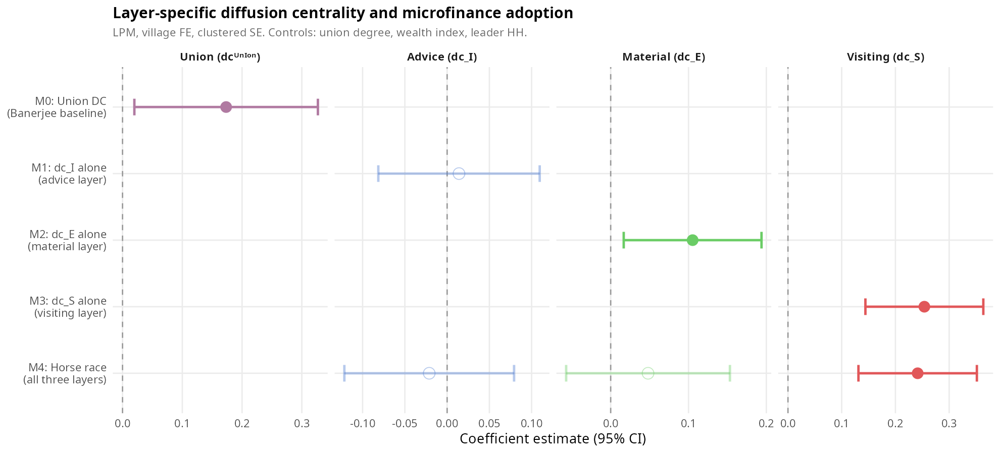
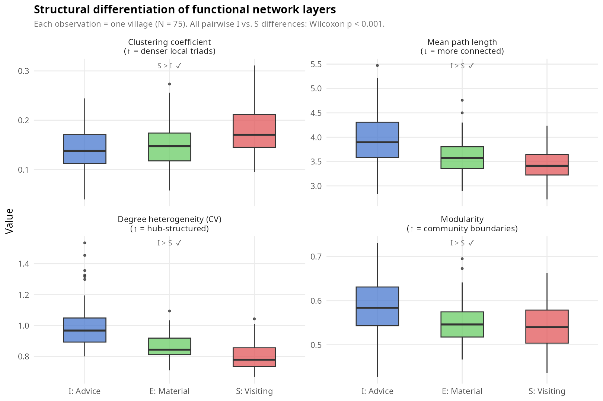
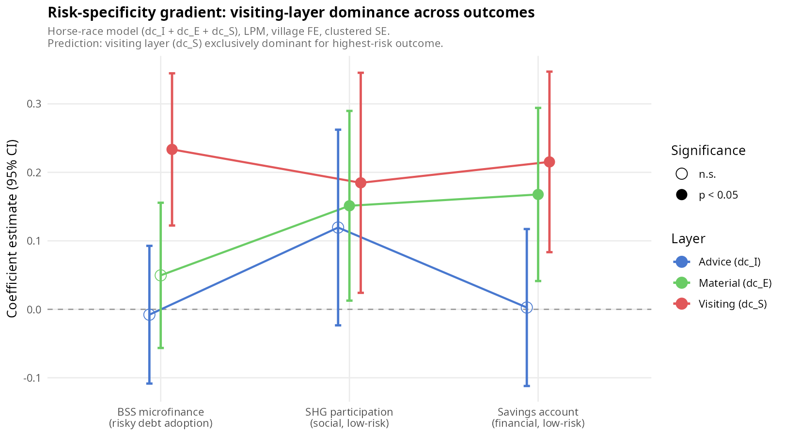

# I. THE PUZZLE {background-color="#14b1ab"}

## The Standard Account

::: columns

::: {.column width="58%"}
:::{style="font-size: 20px; margin-top: 1em;"}

The dominant explanation is simple:

> **Networks predict adoption because they transmit information.**

In the classic microfinance study, **Banerjee, Chandrasekhar, Duflo, and Jackson (2013)** show that the centrality of the **first-informed leaders** predicts **village-level** microfinance participation.

\bigskip

Their analysis treats social ties as carriers of information diffusion:

- leaders are informed first,
- information spreads through the network,
- and more central injection points predict broader village participation.

\bigskip

**What remains unresolved:**  
when all ties are pooled into one network, the analysis cannot distinguish whether adoption is organized through **informational, material, or co-presence relationships**.
:::
:::

::: {.column width="42%"}

{width="92%" fig-align="center" fig-alt="Science article The Diffusion of Microfinance"}

:::

:::


## What this account implies

:::{style="font-size: 22px; margin-top: 3em;"}
If adoption is organized **through information transmission**, then the argument implies a sharper expectation:

\bigskip

> **The layer that best spreads information should also be the layer that best predicts adoption.**

\bigskip

Information and adoption are different outcomes.

But under an informational account, they should still be organized by the **same relational layer**.
:::

## The informational layer is now observable
:::{style="font-size: 26px; margin-top: 3em;"}

A recent study in the **same Karnataka villages** directly tracks who receives information through different kinds of ties \parencite{chandrasekhar2025}.

\bigskip

::: columns

::: {.column width="52%"}

### Information diffusion

| Layer | b | p |
|:--|--:|--:|
| **Advice** | **6.41** | **0.010** |
| Visiting | 4.27 | 0.022 |
| Union (all ties) | 1.11 | 0.529 |

:::

::: {.column width="48%"}

### Main implication

**Advice is the dominant channel of information diffusion.**  
**Visiting also carries information, but less strongly.**

\bigskip

If adoption follows information, the advice layer should also predict adoption.

:::

:::
:::

## But it does not

Same villages. Same network data. Different outcomes.

\bigskip

::: columns

::: {.column width="35%"}
:::{style="font-size: 20px; margin-top: 1em;"}

### Information diffusion  
*\parencite{chandrasekhar2025}*

| Layer | Result |
|:--|:--|
| **Advice** | **strongest** |
| Visiting | weaker |
| Union | null |

\bigskip

**Advice wins for information.**

\bigskip

### Microfinance adoption

| Layer | b | p |
|:--|--:|--:|
| Advice | -0.021 | 0.68 |
| Material | 0.048 | 0.37 |
| **Visiting** | **0.241** | **<0.001** |

\bigskip

**Visiting wins for adoption.**
:::
:::

::: {.column width="65%"}

:::{style="font-size: 22px; margin-top: 6em;"}
> - The dominant informational layer does not predict adoption. 
> - The strongest adoption layer is not the dominant informational layer.
:::

:::

:::


## Why this cannot be explained away

| Objection | Response |
|:--|:--|
| *Advice and visiting are correlated, so advice is just noisy* | They are correlated, but advice remains **null** in the joint model. Noise does not explain a coefficient this close to zero. |
| *Advice is null because everyone was already informed by leaders* | In villages with **few** leaders, advice is still null. Information saturation does not explain the result. |
| *The advice layer has no signal in this dataset* | It does. In the same villages, advice predicts **information diffusion**. It predicts a different outcome. |
| *This is a power problem* | The sample is large, the visiting effect is strong, and the null on advice is stable. This is not a weak-data result. |

\bigskip

**Implication:** being well positioned to receive information does not predict risky adoption.  
Something beyond information transmission is doing the work.


# II. THEORY {background-color="#0a4e58"}


## What multiplexity means here

:::{style="font-size: 18px; margin-top: 1em;"}

Multiplexity means something simple:

> **the same households are connected through different kinds of relationships.**

In these villages, households can be linked through:

- **advice ties,**
- **money ties,**
- **visiting ties.**

\bigskip

Our claim is not that all layers do the same thing.

Our claim is:

> **different layers are good at different social tasks.**

\bigskip

The key question is therefore not just how connected households are.

It is:

> **which kind of tie matters for which outcome?**
:::

## Risky adoption involves more than information

:::{style="font-size: 22px; margin-top: 2em;"}

The standard account treats networks mainly as channels of information.

That is too narrow for **risky adoption**.

Joining a microfinance program is not just a matter of hearing about it.

It also involves judging whether participation is:

- manageable,
- socially acceptable,
- and practically sustainable.

\bigskip

So risky adoption involves at least **two different problems**:

1. **understanding the program,**
2. **judging what participation may imply in everyday life.**
:::

## Two uncertainties, two relational functions


::: columns

::: {.column width="50%"}

### Understanding the program

What is the program?  
How does it work?  
What are the terms?

\bigskip

This is a problem of **information and explanation**.

Advice ties are well suited to this kind of task.

:::

::: {.column width="50%"}

### Judging participation

What will happen if I join?  
Will this be manageable for a household like mine?

\bigskip

This is a problem of **practical consequences**.

It is harder to resolve through words alone.

:::

:::

\bigskip

> **The ties that help explain a program are not necessarily the ties that make participation look viable.**


## Why visiting ties matter

Visiting ties provide something that advice ties do not.

They give repeated access to other households' ordinary lives.

Through visiting ties, people can observe whether participation appears:

- manageable,
- compatible with household routines,
- and socially survivable.

\bigskip

That does not mean visiting ties are non-informational.

They also carry information.

But they additionally provide something else:

> **direct social observation of consequences.**


## The core theoretical argument

The argument of the paper is not:

> more ties always increase adoption.

And it is not:

> all layers must work together as a strict package.

\bigskip

It is this:

> **adoption depends on layer-specific relational environments.**

For risky adoption, the most relevant environment is not simply the one that moves information best.

It is the one that makes the consequences of participation more visible through repeated social contact.


## Relation to diffusion theory

This paper stays close to the diffusion tradition, but shifts the question.

Most diffusion theories ask:

- how much exposure people receive,
- how many adopters surround them,
- how fast signals move.

We ask:

> **through which kind of tie does exposure matter most for adoption?**

\bigskip

So the contribution is not a new general model of contagion.

It is a sociological claim about **relational differentiation**:

> **network layers are not interchangeable.**


## Relation to prior sociological work

This argument builds on a familiar sociological intuition:

- information can travel through one set of ties,
- while commitment depends on another.

\bigskip

It is especially consistent with work showing that:

- lower-risk participation can spread through looser informational ties,
- but higher-risk commitment depends on stronger forms of embeddedness and social accountability.

\bigskip

Our contribution is to show this logic in a multiplex network setting:

> **the informational layer and the adoption layer are not the same.**


## A proposed account of the divergence

{width="88%" fig-align="center"}

\bigskip

The figure summarizes the argument:

- **advice ties** are especially useful for understanding the program,
- **visiting ties** make participation more visible in everyday life.

\bigskip

The key idea is simple:

> **information diffusion and risky adoption depend on different relational environments.**


## Three predictions

### Prediction 1 — Layer horse race

For microfinance adoption, the **visiting layer** should outperform the **advice layer**.

\bigskip

### Prediction 2 — Structural differentiation

If layers do different things, they should also look different structurally.

The visiting layer should be **denser** and **more locally cohesive** than the advice layer.

\bigskip

### Prediction 3 — Outcome gradient

The visiting layer should matter most clearly for the **riskiest outcome**.

For lower-risk financial behaviors, other layers — especially **money ties** — may also matter.


# III. DATA & DESIGN {background-color="#14b1ab"}

## A prospective design

The design is prospective:

\bigskip

```{=html}
<div style="text-align:center; font-size:1.35em; line-height:1.5;">
2006 network census  
↓  
the microfinance program enters the villages  
↓  
adoption is recorded later
</div>
````

\bigskip

This matters because the networks are measured **before** the program becomes available.

So adoption cannot be creating the network pattern that later predicts it.

## Setting, sample, and unit of analysis

::: columns

::: {.column width="56%"}

### Setting

Rural villages in Karnataka, India.

The data come from the same network setting used in the classic microfinance study.

\bigskip

### Unit of analysis

The **household**.

The original survey records ties between individuals, but the analysis is conducted at the **household level**.

:::

::: {.column width="44%"}

### Sample

|                                  |        |
| :------------------------------- | :----: |
| Households                       | 10,618 |
| Villages in regressions          |   49   |
| Villages in topology comparisons |   75   |

\bigskip

### Why 49 in regressions?

All 75 villages have network data.

Only **49** have both network data **and** the microfinance adoption outcome used in the regression sample.

:::

:::

## From survey questions to three layers

We group six survey relations into three substantively distinct layers.

::: columns

::: {.column width="33%"}

### Advice

* gives advice
* helps with decisions

\bigskip

Main role:
**explanation and guidance**

:::

::: {.column width="33%"}

### Money

* lends money
* borrows money

\bigskip

Main role:
**material support**

:::

::: {.column width="33%"}

### Visiting

* visits your home
* whose home you visit

\bigskip

Main role:
**repeated co-presence**

:::

:::

\bigskip

Each layer is built as a **household-level network**.

## Main variables

### Main outcome

Whether a household **joins the microfinance program**.

\bigskip

### Main explanatory variables

For each household, we measure its network position in:

* the **advice layer**,
* the **money layer**,
* the **visiting layer**.

\bigskip

The analysis asks:

> **within the same village, which layer-specific position best predicts adoption?**

## Main model

Our core test is a **horse race** across the three layers.

\bigskip

We estimate whether adoption is associated with:

* position in the **advice** layer,
* position in the **money** layer,
* position in the **visiting** layer,

while also adjusting for:

* **village fixed effects,**
* overall connectedness,
* wealth,
* and leader status.

\bigskip

The goal is not to ask whether networks matter in general.

It is to ask:

> **which kind of network position matters most?**

## Why village fixed effects matter

Villages differ in many ways that could affect adoption:

* local institutions,
* implementation of the program,
* leader presence,
* social norms,
* and baseline levels of connectedness.

\bigskip

Without village fixed effects, the result could simply mean:

> some villages are both more socially connected and more likely to adopt.

\bigskip

With village fixed effects, we ask a harder question:

> **among households living in the same village, which relational layer best predicts adoption?**

## What the design tests

The design evaluates three predictions.

\bigskip

### Prediction 1

The **visiting layer** should outperform the **advice layer** in predicting microfinance adoption.

\bigskip

### Prediction 2

The visiting layer should be structurally more **dense** and **locally cohesive** than the advice layer.

\bigskip

### Prediction 3

The visiting layer should matter most clearly for the **highest-risk outcome**.


# IV. RESULTS {background-color="#0a4e58"}

## The main result

{width="100%" fig-align="center"}

\bigskip

:::{style="font-size: 20px; margin-top: 1em;"}
The result is straightforward:

- **advice ties** do not predict adoption,
- **money ties** matter on their own, but not in the full comparison,
- **visiting ties** are the strongest predictor of microfinance adoption.

\bigskip

The strongest adoption layer is **not** the dominant informational layer.
:::

## The coefficients in one table

:::{style="font-size: 22px; margin-top: 3em;"}

| Model | Advice ties | Money ties | Visiting ties | N |
|:--|--:|--:|--:|--:|
| Advice only | 0.014 |  |  | 10,618 |
| Money only |  | 0.105* |  | 10,618 |
| Visiting only |  |  | 0.254*** | 10,618 |
| **All three together** | **-0.021** | **0.048** | **0.241*** | **10,618** |
| Non-leaders only | -0.021 | 0.032 | 0.234*** | 9,337 |

:::

\bigskip

:::{style="font-size: 22px; margin-top: 3em;"}

Village fixed effects and clustered standard errors.

\bigskip

The key point is not only that visiting ties are significant.

It is that **their association remains strong when the other layers are included at the same time.**
:::

## This result is stable across villages

:::{style="font-size: 22px; margin-top: 3em;"}

The visiting-layer result is not driven by one or two unusual villages.

Across leave-one-village-out estimates, it remains:

- **positive in every case,**
- and **statistically significant in every case.**

\bigskip

So the result is not a fragile artifact of local outliers.

\bigskip

> **The strongest adoption layer is a stable result across villages.**
:::

## The layers are structurally different

::: columns

::: {.column width="70%"}
:::{style="font-size: 22px; margin-top: 1em;"}

::: {style="display:flex; align-items:center; justify-content:center; height:68vh;"}
{width="100%" fig-align="center"}
:::
:::
:::

::: {.column width="30%"}
:::{style="font-size: 18px; margin-top: 6em;"}

If layers do different things, they should not look the same.

\bigskip

That is exactly what we find:

- the **visiting layer** is denser,
- more clustered,
- and more connected overall,

while the **advice layer** is more uneven and more segmented.

:::
:::

:::


## Topology in one table

:::{style="font-size: 22px; margin-top: 3em;"}

| Metric | Advice | Money | Visiting |
|:--|--:|--:|--:|
| Density | 0.018 | 0.023 | **0.028** |
| Clustering | 0.140 | 0.149 | **0.178** |
| Mean path length | **3.97** | 3.60 | 3.42 |
| Degree dispersion | **0.994** | 0.863 | 0.797 |
| Modularity | **0.588** | 0.549 | 0.545 |
| Largest component | 0.785 | 0.855 | **0.894** |
:::


\bigskip
:::{style="font-size: 22px; margin-top: 3em;"}

> - The visiting layer is structurally more compatible with repeated local contact.
> - The advice layer is more compatible with selective and uneven informational exchange.
:::

## The pattern changes across outcomes

{width="78%" fig-align="center"}

\bigskip

The advice layer is weak across all three outcomes.

The visiting layer is strongest for **microfinance adoption**, while money ties become more relevant for lower-risk financial behaviors.


## Gradient across outcomes

:::{style="font-size: 22px; margin-top: 3em;"}

| Outcome | Advice ties | Money ties | Visiting ties |
|:--|--:|--:|--:|
| Microfinance adoption | -0.008 | 0.050 | **0.234*** |
| SHG participation | 0.120 | 0.151* | **0.185*** |
| Savings account | 0.003 | 0.168** | **0.215** |
:::
\bigskip
:::{style="font-size: 22px; margin-top: 3em;"}

Three points matter:

- **advice is weak throughout,**
- **visiting is strongest for the riskiest outcome,**
- **money ties matter more as the outcome becomes less risky.**

:::

## What is doing the work?

A key robustness result is that the visiting-layer measure is closely related to **having more visiting ties**.

So the result should not be read as evidence that abstract network position alone drives adoption.

\bigskip

It is more accurate to say:

> households that are more embedded in the **visiting layer** are more likely to adopt.

\bigskip

That is consistent with the theory.

The mechanism is not global reach.  
It is **local, repeated social contact.**

# V. Q&A / APPENDIX {background-color="#14b1ab"}

## How are the three layers constructed?

The original survey records **individual-level ties** through name generators.

Respondents name people they:

- give advice to,
- borrow money from,
- visit at home,
- and so on.

\bigskip

For the analysis, ties are aggregated to the **household level**.

A tie between households exists when **any member** of one household names any member of the other.

\bigskip

The three layers are built from six raw networks:

| Layer | Raw networks |
|:--|:--|
| Advice | give advice + help with decisions |
| Money | borrow money + lend money |
| Visiting | visit come + visit go |


## What is the network-position measure?

The paper uses **diffusion centrality**, introduced by Banerjee et al. (2013).

It captures how well positioned a household is to reach others through a diffusion process.

\bigskip

It is computed **separately for each layer**, so each household receives three scores:

- one for the **advice** layer,
- one for the **money** layer,
- one for the **visiting** layer.

\bigskip

A critical diagnostic is that, in the visiting layer, this measure is very closely related to **degree**.

So the operative predictor is better understood as **local embeddedness**, not abstract global position. :contentReference[oaicite:1]{index=1}


## What is the main estimating equation?
:::{style="font-size: 18px; margin-top: 1em;"}

The core specification is a **horse race** across the three layers.

Adoption is modeled as a function of:

- position in the **advice** layer,
- position in the **money** layer,
- position in the **visiting** layer,

plus:

- overall connectedness,
- wealth,
- leader status,
- and **village fixed effects**.

\bigskip

The full sequence is:

- pooled network baseline,
- single-layer models,
- horse race,
- overidentified model,
- non-leaders sample. 
:::

## Why use a linear probability model?

Three reasons:

1. **Comparability.**  
   Coefficients can be compared directly across layers.

2. **Fixed effects.**  
   Village fixed effects are easy to absorb cleanly.

3. **Replication.**  
   This matches the estimator used in the original Banerjee et al. analysis. :contentReference[oaicite:3]{index=3}


## Why do the regressions use 49 villages while topology uses 75?

All **75 villages** have network data.

The adoption regressions use **49 villages** because only those villages have both:

- the network data,
- and the village-level files needed to construct the microfinance adoption outcome and leader indicators.

\bigskip

So this is **not** a discretionary sample restriction.

The 49 villages are the full set with usable adoption data.

The remaining 26 villages contribute to the **topology analysis**, but not to the adoption regressions. :contentReference[oaicite:4]{index=4}


## Why do village fixed effects matter?

Villages differ in many ways that could affect adoption:

- baseline adoption rates,
- network density,
- program rollout,
- wealth,
- and institutional context.

\bigskip

Village fixed effects absorb those village-level differences.

So identification comes from **within-village variation**.

The substantive question becomes:

> **Among households in the same village, does being more embedded in the visiting layer predict a higher probability of adoption?** :contentReference[oaicite:5]{index=5}


## Why not treat all ties as one network?

Pooling all ties replicates the classic result: the union network predicts adoption.

But pooling hides **which layer** is doing the work.

\bigskip

Once the layers are separated, the key pattern appears:

- the layers are structurally distinct,
- and the visiting layer is the one most strongly associated with adoption. :contentReference[oaicite:6]{index=6}


## Is the visiting result just local density?

Partly, yes — and this is acknowledged directly.

In the visiting layer, the network-position measure is highly correlated with **degree**.

When the positional component is separated from degree, the abstract positional part becomes null.

\bigskip

So the result is best interpreted as:

> **embeddedness in the visiting layer, together with local observability, predicts adoption.**

That is consistent with the argument about repeated local contact and social observation. :contentReference[oaicite:7]{index=7}


## Is the result driven by leaders, caste, or information saturation?

No single robustness check overturns the pattern.

The result survives:

- exclusion of leader households,
- low-information villages,
- caste checks,
- leave-one-village-out estimation,
- and degree-based counterfactual tests. :contentReference[oaicite:8]{index=8}


## Do the layers have to work together as a strict package?

No.

The evidence does **not** support a strong conjunctive interpretation in which all layers must be jointly present.

\bigskip

Additive specifications fit better than strict complementarity.

So the claim is **not** that all layers are simultaneously necessary.

The claim is that they have **different relational functions**, and that the visiting layer is the dominant relational infrastructure for risky adoption. :contentReference[oaicite:9]{index=9}


## What the paper ultimately shows

Three results matter most:

1. **Layer dissociation**  
   The layer that best spreads information does not predict adoption.

2. **Structural differentiation**  
   Advice and visiting layers are topologically different.

3. **Robustness**  
   The main visiting-layer result survives multiple alternative explanations.

\bigskip

> **The ties that best spread information are not the ties that best predict risky adoption.**

For consequential adoption, what matters most is embeddedness in a relational environment of repeated local contact. :contentReference[oaicite:10]{index=10}