## The Puzzle {.smaller}

::: {style="font-size: 26px; margin-top: 3em;"}
**Standard expectation:**

-   Technological change should spread cognitive requirements broadly
-   Lower-status occupations face the strongest pressure to upskill
-   Evidence from postings suggests diversification is sharpest at the bottom

**What we find:**

> Cognitive skills diffuse **upward**, physical skills diffuse **downward**.
> Skill change widens the cognitive-physical divide instead of closing it.
:::

## From Upskilling Pressure to Realized Change {.smaller}

::::::::: columns
::::: {.column width="45%"}
::: {style="margin-top: 8em;"}
{width="100%"}
:::
:::::

::::: {.column width="55%"}
::: {style="font-size: 24px; margin-top: 2em;"}
Pressure to change is not the same as realized occupational skill content.

> Whether, how, and for whom skill change occurs depends on an
> occupation's position within a relational domain of task similarity,
> training proximity, and productive complementarity.

**We ask:** which skills move, and in which direction, relative to
the status of the occupations that already hold them?
:::
:::::
:::::::::

## Two Different Objects: Demand Signals vs. Realized, Directional Change {.smaller}

::::::::: columns
::::: {.column width="50%"}
::: {style="font-size: 22px; margin-top: 3em;"}
**Job-ad studies** (Tong et al. 2025; Han \& Cheng 2026)

-   **Data:** employer demand signals in job postings — aspirational, not verified realized change
-   **Object:** aggregate *magnitude* of skill-vector change (Tong) or within-job skill *diversity* (Han \& Cheng)
-   Neither asks whether a skill moves toward a higher- or lower-status **specific partner occupation**
:::
:::::

::::: {.column width="50%"}
::: {style="font-size: 22px; margin-top: 3em;"}
**This paper** (O\*NET, 2015--2024)

-   **Data:** incumbent-reported requirements — realized occupational skill content
-   **Object:** *signed direction* of dyadic flow, $G_{ij} = \sigma_j - \sigma_i$
-   Asks whether skill $s$ moves toward or away from status, relative to the occupation that already holds it
:::
:::::
:::::::::

## Demand Signals vs. Realized Change — Schematic {.smaller}

::: {style="text-align: center; margin-top: 2em;"}
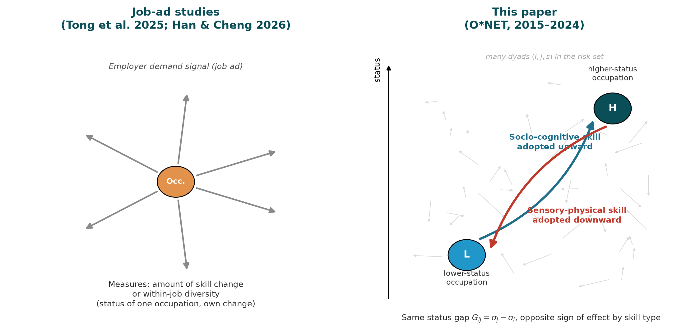{width="85%"}
:::

::: {style="font-size: 20px; margin-top: 1em; text-align: center;"}
Job-ad studies measure how much one occupation's skill profile changes, using its own status as a predictor.
We measure which direction a specific skill moves between two occupations — and that direction reverses
by skill type: cognitive skills flow up, physical skills flow down.
:::

## The Architecture We Build Upon {.smaller}

::::::::: columns
::::: {.column width="50%"}
::: {style="font-size: 22px; margin-top: 1em;"}
**Polarization** (Alabdulkareem et al. 2018)

-   Skills cluster into two domains
-   Socio-cognitive: high education, high wages
-   Sensory/physical: lower education, lower wages

{width="72%"}
:::
:::::

::::: {.column width="50%"}
::: {style="font-size: 22px; margin-top: 1em;"}
**Nestedness** (Hosseinioun et al. 2025)

-   Asymmetric dependencies: some skills "enable" others
-   Nested architecture has **intensified** over time
-   Position in hierarchy predicts wages, automation risk

{width="65%"}
:::
:::::
:::::::::

# I. DIRECTIONAL SKILL DIFFUSION {.center .middle background-color="#0a4e58"}

## Two Elementary Events

::: {style="text-align: center; margin-top: 3em;"}
{width="64%"}
:::

::: {style="font-size: 20px; margin-top: 1em; text-align: center;"}
We do not observe direct transmission — we model how event hazards vary with
**profile distance**, **signed status gap**, and **skill class**.
:::

## Theory: Directed Assortative Mixing

::: {style="font-size: 23px; margin-top: 2em;"}
We treat skill diffusion as **assortative mixing** (Newman 2002) —
occupations connect preferentially with similar others — but
**asymmetric with respect to status**.

-   **Symmetric fit** (task similarity, training overlap) says a skill
    *can* travel between two occupations — it does not say in which
    direction.
-   A nurse is closely tied to physicians by tasks and training, yet a
    nurse's odds of adopting a physician's skill are **not the mirror
    image** of a physician's odds of adopting a nurse's.
-   Diffusion depends on the **signed status distance** between
    neighbors: the same relatedness yields different probabilities
    depending on **who ranks higher**.
:::

::: {style="font-size: 24px; margin-top: 0.8em;"}
**Result:** socio-cognitive requirements channel upward; sensory-physical
requirements channel downward. Adoption and abandonment compound rather
than offset, producing a Matthew effect among occupations.
:::

## Mechanisms Behind the Directional Gap

 

::: {style="font-size: 25px; margin-top: 4em;"}
-   **Emulation:** occupations look upward, but not all can absorb what they emulate.
-   **Task allocation:** complex content is retained/deepened where it already sits.
-   **Absorptive capacity:** high-status holders provide scaffolding and legitimacy.
-   **Credentialist closure:** requirements held above become protected.
-   **Valuation asymmetry:** identical content is rewarded differently depending on who holds it.
:::

# II. DATA & METHODS {.center .middle background-color="#0a4e58"}

## Data

::: {style="font-size: 26px; margin-top: 5em;"}
-   **O\*NET** 2015-2024: 741 occupations, 160 skill requirements
-   **BLS OEWS** wages + O\*NET education and cognitive task content
-   About **40M directed diffusion opportunities**
    -   21.5M adoption dyads
    -   18.6M abandonment dyads

:::

## Measures I: Diffusion Events

::: {style="font-size: 26px; margin-top: 2em;"}

- **Unit:** directed triple $(i,j,s)$: source occupation, target occupation, skill.

- **Adoption risk set:** source $i$ holds skill $s$ in 2015; target $j$ does not.
  $Y^{adopt}_{ijs}=1$ if $j$ crosses RCA $\geq 1$ by 2024.

- **Abandonment risk set:** source $i$ and target $j$ both hold skill $s$ in 2015.
  $Y^{aband}_{ijs}=1$ if $j$ falls below RCA $\geq 1$ by 2024.
:::

::: {style="font-size: 26px; margin-top: 2em;"}
- **Status gap**:
    - $\sigma_i$: baseline occupational status from PCA of wages, education, and cognitive content
    - $G_{ij} = \sigma_j - \sigma_i$
    - $G_{ij} > 0$: target ranks above source &nbsp;&nbsp;|&nbsp;&nbsp; $G_{ij} < 0$: target ranks below source
:::

## Measures I: Identification Strategy

::: {style="font-size: 27px; margin-top: 4em;"}
- **Skill-profile distance:** one minus cosine similarity of baseline RCA vectors — nets out ordinary task relatedness

- **Skill fixed effects:** absorb intrinsic diffusibility of each requirement

- **Source + skill FE** and **target + skill FE** estimated as complementary strategies, since $G_{ij}$ is linear in endpoint status and both cannot be absorbed at once

- **Three-way clustered SE** by source, target, and skill accounts for network dependence in the triadic data
:::

## Measures II: Skill Classes

#### Crossing domain x specificity yields three functional classes

::: {style="text-align: center; margin-top: 0.3em;"}
{width="46%"}
:::

::: {style="font-size: 19px; color:#4b5661; text-align: center; margin-top: 0.1em;"}
Domain: Alabdulkareem et al. 2018 &nbsp;·&nbsp; Nestedness/specificity: Hosseinioun et al. 2025
:::

::: {style="font-size: 22px; margin-top: 0.3em;"}
-   **General socio-cognitive** (49 skills): $c_s$ at/above within-domain median — broad, scaffolding
-   **Specialized socio-cognitive** (48 skills): $c_s$ below median — narrower, dependent
-   **Sensory-physical** (63 skills): $c_s < 0$ throughout — high-nestedness cell empirically absent
:::

## Directional Gravity Model

::: {style="font-size: 24px; margin-top: 2.5em;"}

For each flow and skill class, we estimate a gravity-hazard model:

$$
\begin{aligned}
\eta_{ijs} = \operatorname{cloglog}\,P(Y^f_{ijs}=1)
= \, & \alpha_i + \alpha_j + \alpha_s \\
& + \beta^{\uparrow}_{g}\Delta^{\uparrow}_{ij}
  + \beta^{\downarrow}_{g}\Delta^{\downarrow}_{ij}
  + \kappa_g \mathbb{1}[G_{ij}>0] \\
& + \delta_g \mathrm{dist}_{ij}
\end{aligned}
$$

-   $f \in \{\mathrm{adoption}, \mathrm{abandonment}\}$
-   $g \in \{\text{Spec. SC}, \text{Gen. SC}, \text{Phys}\}$
-   $\Delta^{\uparrow}_{ij}=\max(0,G_{ij})$; $\Delta^{\downarrow}_{ij}=\min(0,G_{ij})$
-   Source and target fixed effects are introduced in separate specifications because $G_{ij}$ is a linear function of endpoint status.
:::

# III. DESCRIPTIVE PATTERNS {.center .middle background-color="#0a4e58"}

## Adoption and Abandonment Gradients {.smaller}

::: {style="text-align: center; margin-top: 4em;"}
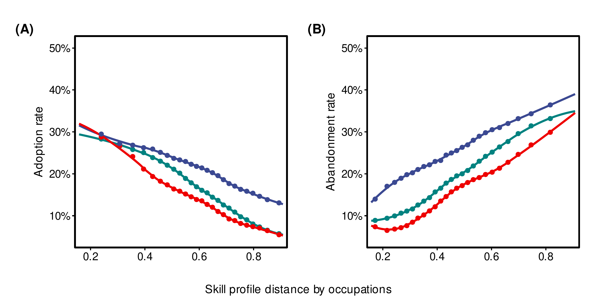{width="80%"}

::: {style="font-size: 18px; margin-top: 0.5em;"}
▬▬ General socio-cognitive &nbsp;&nbsp;
▬▬ Specialized socio-cognitive &nbsp;&nbsp;
▬▬ Sensory-physical
:::
:::

## Status-Gap Gradients and Flow Networks {.smaller}

::: {style="text-align: center; margin-top: 4em;"}
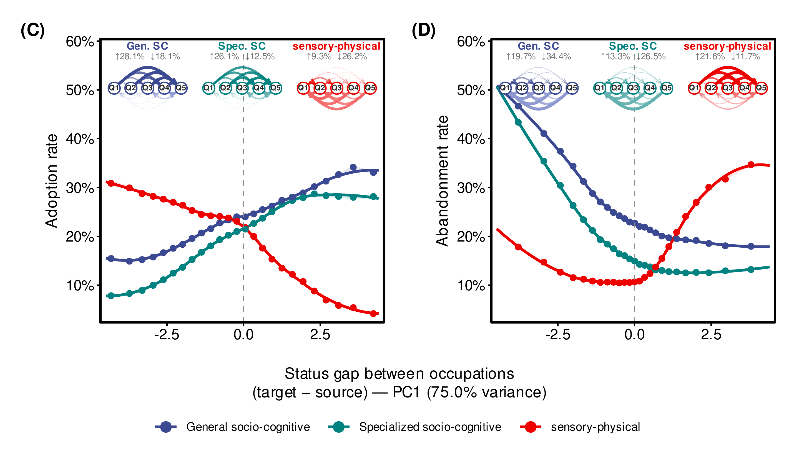{width="80%"}
:::

## Descriptive Result {.smaller}

::: {style="font-size: 27px; margin-top: 3em;"}
-   Profile distance matters symmetrically:
    -   adoption falls with distance
    -   abandonment rises with distance

-   Status gaps matter directionally:
    -   socio-cognitive adoption rises when target is above source
    -   sensory-physical adoption rises when target is below source
    -   abandonment reinforces the same divide
:::

# IV. GRAVITY MODEL RESULTS {.center .middle background-color="#0a4e58"}

## Fixed-Effects Gravity Estimates {.smaller}

::: {style="text-align: center;"}
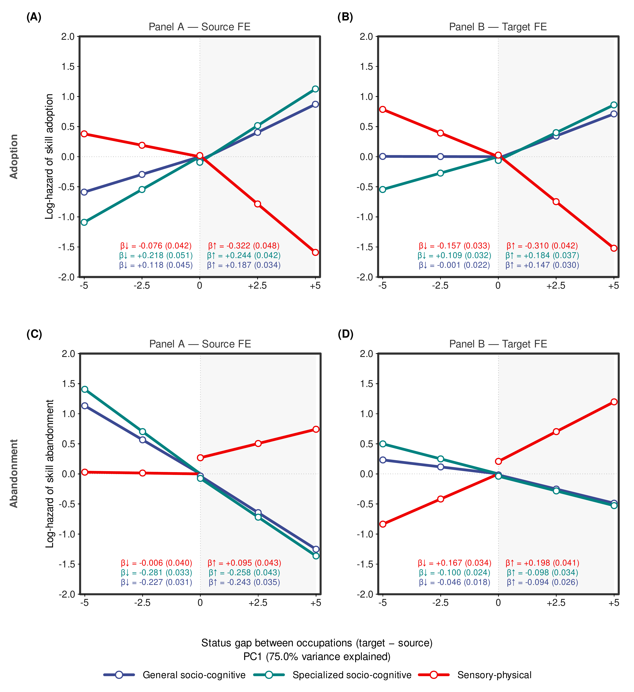{width="55%"}
:::

## What the Model Shows {.smaller}

::: {style="font-size: 27px; margin-top: 3em;"}
-   **Adoption:** cognitive skills move up the status gap; physical skills move down.

-   **Abandonment:** cognitive skills are shed down the gap; physical skills are shed up.

-   The pattern survives complementary FE strategies:
    -   source + skill FE
    -   target + skill FE

-   Direction matters beyond profile similarity, endpoint propensities, and skill diffusibility.
:::

## From Dyads to Occupational Stratification (I) {.smaller}

::: {style="text-align: center; margin-top: 3em;"}
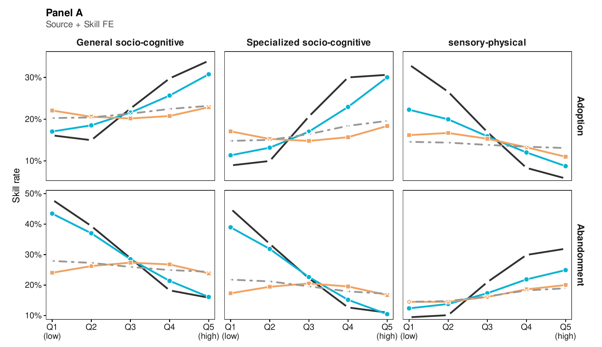{width="80%"}

::: {style="font-size: 17px; margin-top: 0.4em;"}
▬▬ Observed &nbsp;&nbsp;
▬▬ Model &nbsp;&nbsp;
▬▬ Symmetric null &nbsp;&nbsp;
╌╌ Distance-only null
:::
:::

## From Dyads to Occupational Stratification (II) {.smaller}

::: {style="text-align: center; margin-top: 2em;"}
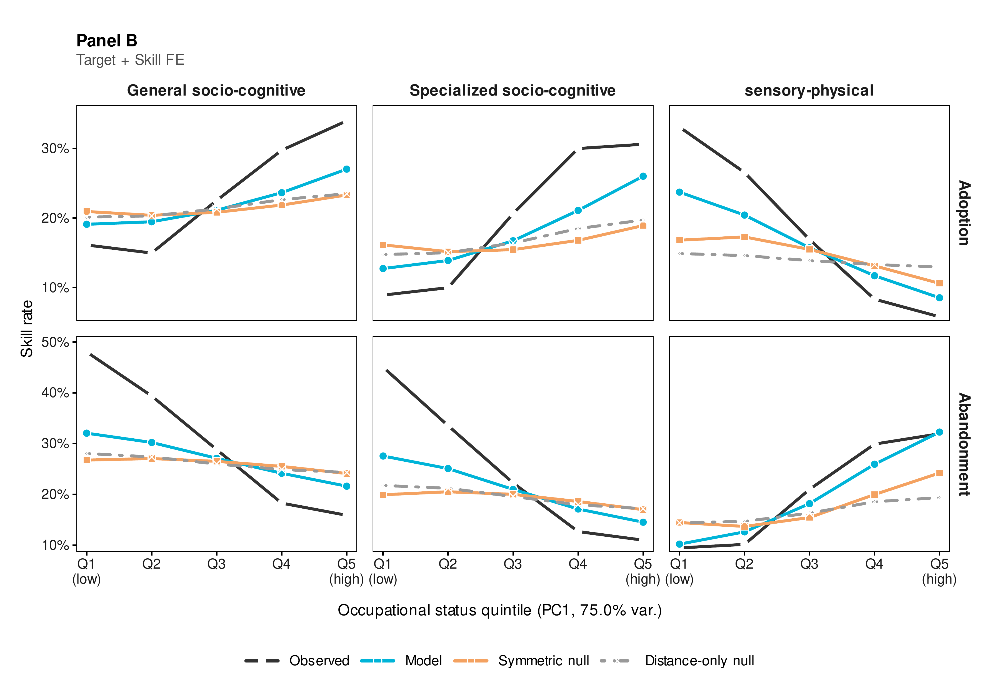{width="80%"}
:::

## Threats to Inference {.smaller}

::: {style="font-size: 25px; margin-top: 2.5em;"}
**Four threats, each targeted by a dedicated check:**

-   Mechanical index artifact → frozen-denominator / raw-importance re-estimation
-   Confounded by stable occupation/skill propensities → fixed effects + permutation test
-   Arbitrary measurement choices → thresholds, status index, taxonomy each varied independently
-   One disruptive period driving it → replicated across three sub-periods

**All four checks preserve the directional asymmetry** (full results: backup B6–B12).
:::

## Why This Matters {.smaller}

::: {style="font-size: 26px; margin-top: 3em;"}

**The dyadic directional rule scales up:**

- **Observed macro-gradient**
  Socio-cognitive skills concentrate in higher-status occupations.

- **Mirror gradient**
  Sensory-physical skills concentrate in lower-status occupations.

- **Counterfactuals fail**
  Distance-only and direction-blind status models stay close to flat.

:::

## Implications: AI and a Compounding Barrier {.smaller}

::: {style="font-size: 26px; margin-top: 3em;"}
-   LLMs expose roughly half the U.S. workforce to task-level substitution;
    productivity gains concentrate in cognitively intensive tasks

-   Substitution potential is highest for well-specified physical and
    routine-cognitive tasks — precisely the skills our results confine
    to the bottom of the hierarchy

-   Workers displaced from physical-intensive occupations face a
    **compounded barrier**: their skills are both most exposed to
    substitution and least able to cross into cognitive destinations

-   Consistent with external mobility evidence: transitions from
    declining to growing occupations account for only ~5% of moves
    over two decades
:::

## Limitations {.smaller}

::: {style="font-size: 25px; margin-top: 3em;"}
-   **Occupational level:** we do not observe the organizational decisions
    behind individual adoptions, nor general-equilibrium responses to shifting demand

-   **Observational design:** cannot fully rule out occupations responding
    independently to a shared shock — though a shock would not by itself
    reverse direction across cognitive and physical domains

-   **U.S. data only:** the magnitude of directional channeling is likely
    institutionally contingent — credentialing regimes, wage-setting, union
    density plausibly moderate it; cross-national tests are needed

-   We identify the **direction** of skill flow as a function of relative
    status — we do not adjudicate **which** relational mechanism
    (emulation, task allocation, absorptive capacity, credentialist closure,
    valuation asymmetry) produces it
:::

## Conclusion {.smaller}

::: {style="font-size: 26px; margin-top: 2em;"}

**Main finding:**

> Skill diffusion is not generalized cognitive upgrading. It is a status-sorted
> process that pulls socio-cognitive skills upward and sensory-physical skills
> downward.

**Key takeaways:**

- **Two flows, one process**
  Adoption and abandonment compound rather than offset.

- **Status gap direction matters**
  Knowing the size of the gap is not enough; which occupation ranks higher is decisive.

- **Matthew effect**
  Occupations already rich in cognitive content gain more, while physical content is retained below.

:::

# Thank You {.center .middle background-color="#0a4e58"}

**Roberto Cantillan**

Department of Sociology, PUC Chile

rcantillan\@uc.cl

Paper and Replication:
[github.com/rcantillan/skill_diffusion](https://github.com/rcantillan/skill_diffusion)

# Backup Slides {.center .middle background-color="#2d3e50"}

## B1: Formal Definitions {.smaller}

::: {style="font-size: 22px;  margin-top: 3em;"}
**Revealed Comparative Advantage:**

$$\mathrm{RCA}(j,s) = \frac{\mathrm{onet}(j,s)/\sum_{s'}\mathrm{onet}(j,s')}{\sum_{j'}\mathrm{onet}(j',s)/\sum_{j',s''}\mathrm{onet}(j',s'')}$$

**Event definitions for skill s:**

-   Baseline specialist: RCA $\geq 1$ at $t_0=2015$
-   Endline specialist: RCA $\geq 1$ at $t_1=2024$
-   Adoption: target crosses from below to above RCA threshold
-   Abandonment: target falls from above to below RCA threshold

**Directional gaps:**

$$G_{ij} = \sigma_j - \sigma_i$$

$$\Delta^{\uparrow}_{ij} = \max(0, G_{ij}), \qquad
\Delta^{\downarrow}_{ij} = \min(0, G_{ij})$$
:::

## B2: Skill Taxonomy {.smaller}

::: {style="font-size: 22px;  margin-top: 2em;"}
**Functional domain:**

-   Louvain communities on the 2015 RCA co-specialization network
-   Socio-cognitive: 97 skills
-   Sensory-physical: 63 skills

**Functional specificity:**

$$c_s = \frac{\mathrm{NODF}_{\text{obs}} - \mathbb{E}[\mathrm{NODF}^{(s)}_{\text{rand}}]}{\mathrm{sd}[\mathrm{NODF}^{(s)}_{\text{rand}}]}$$

**Three-class taxonomy:**

-   General socio-cognitive: 49 skills
-   Specialized socio-cognitive: 48 skills
-   Sensory-physical: 63 skills

The high-nestedness sensory-physical cell is empirically absent.
:::

## B3: Key Coefficients {.smaller}

:::: {style="font-size: 18px; margin-top: 2em;"}
**Adoption, Panel A: source + skill FE**

| Skill type          | Downward slope | Upward slope |
|---------------------|---------------:|-------------:|
| General SC          | +0.118         | +0.187       |
| Specialized SC      | +0.218         | +0.244       |
| Sensory-physical    | -0.076         | -0.322       |

**Abandonment, Panel A: source + skill FE**

| Skill type          | Downward slope | Upward slope |
|---------------------|---------------:|-------------:|
| General SC          | -0.227         | -0.243       |
| Specialized SC      | -0.281         | -0.258       |
| Sensory-physical    | -0.006         | +0.095       |

::: {style="font-size: 22px; text-align: center; margin-top: 2em;"}
Cloglog hazard scale. Full tables include both FE strategies and boundary terms.
:::
::::

## B4: Complete Gravity Model Derivation {.smaller}

::: {style="font-size: 20px;"}
**Step 1: Classic Gravity**
$$T_{ij} = k \cdot \frac{M_i M_j}{D_{ij}^{\gamma}} \quad \Rightarrow \quad \log \mathbb{E}[T_{ij}] = \beta_0 + \alpha_i + \beta_j - \gamma \log D_{ij}$$

**Step 2: Triadic Extension**
$$\Lambda^f_{ijs} \propto \frac{M_i \cdot M_j \cdot S_s}{D_{ij}}$$

**Step 3: Asymmetric Frictions**
$$\Delta^{\uparrow}_{ij} = \max(G_{ij}, 0), \quad \Delta^{\downarrow}_{ij} = \min(G_{ij}, 0)$$

**Step 4: Flow-specific distance**
$$-\log D^f_{ij} = \beta^{\uparrow}_{g}\Delta^{\uparrow}_{ij} + \beta^{\downarrow}_{g}\Delta^{\downarrow}_{ij} + \kappa_g \mathbb{1}[G_{ij}>0] + \delta_g \mathrm{dist}_{ij}$$

**Step 5: Full Specification**
$$\operatorname{cloglog}\big(P(Y^f_{ijs}=1)\big) = \alpha_i + \alpha_j + \alpha_s - \log D^f_{ij}$$
:::

## B5: Key Magnitudes {.smaller}

::: {style="font-size: 24px; margin-top: 4em; text-align: left;"}
**Main directional signs:**

| Flow        | Socio-cognitive | Sensory-physical |
|:------------|:----------------|:-----------------|
| Adoption    | Upward          | Downward         |
| Abandonment | Shed downward   | Shed upward      |

**Interpretation:**

-   Cognitive content accumulates at the top through gains and retention
-   Physical content accumulates below through gains and retention
-   The pattern is visible descriptively and in FE gravity estimates
:::

## B6: Robustness Summary {.smaller}

:::: {style="font-size: 20px; margin-top: 1.5em;"}
| Test           | Specification                     | Result               |
|----------------|-----------------------------------|----------------------|
| RCA denominator | Frozen 2015 denominator, raw importance | Core signs preserved |
| Source weighting | Frequency weights $1/n_{js}$ for source multiplicity | 24/24 signs preserved, <12% shift |
| Permutation     | Within skill type x source-status quintile | Observed far outside null |
| Thresholds      | RCA 0.90, 1.00, 1.10, 1.25 | Directional pattern preserved |
| Status          | Wage, education, cognitive content separately | Same asymmetry |
| Skill taxonomy  | 10-20% random misclassification | Signs overwhelmingly preserved |
| Periods         | 2015-18, 2019-21, 2022-24 | Not driven by one phase |

::: {style="font-size: 20px; margin-top: 1em;"}
The asymmetry is not an artifact of RCA construction, status measurement,
skill classification, or one historical subperiod.
:::
::::

## B7: Robustness — RCA Threshold Sensitivity {.smaller}

::: {style="text-align: center;"}
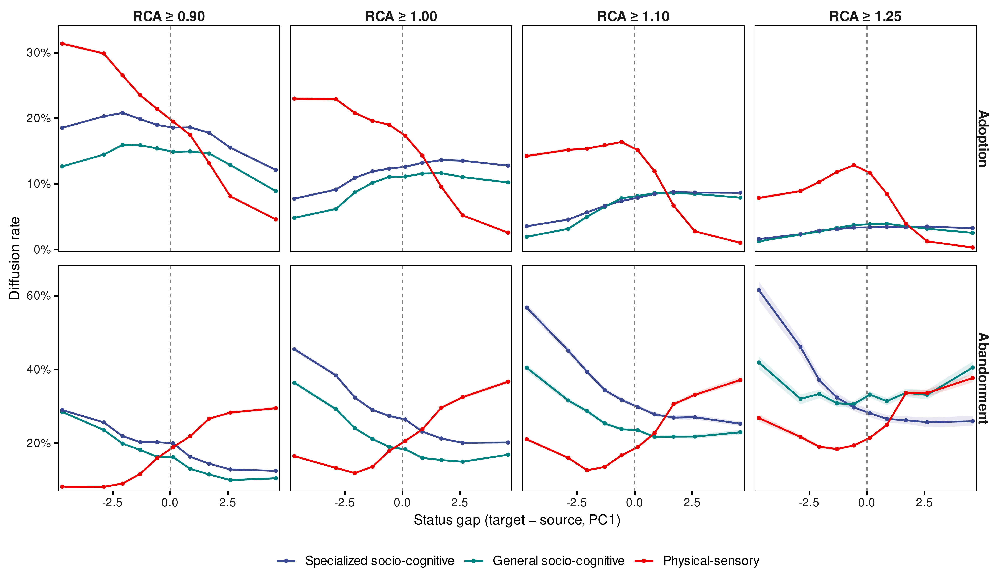{width="76%"}
:::

## B8: Robustness — Within-Stratum Permutation Test {.smaller}

::: {style="text-align: center;"}
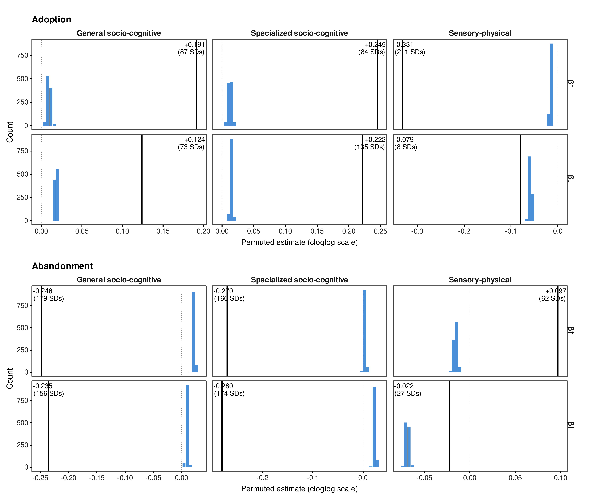{width="58%"}
:::

## B9: Robustness — Sub-Period Stability {.smaller}

::: {style="text-align: center;"}
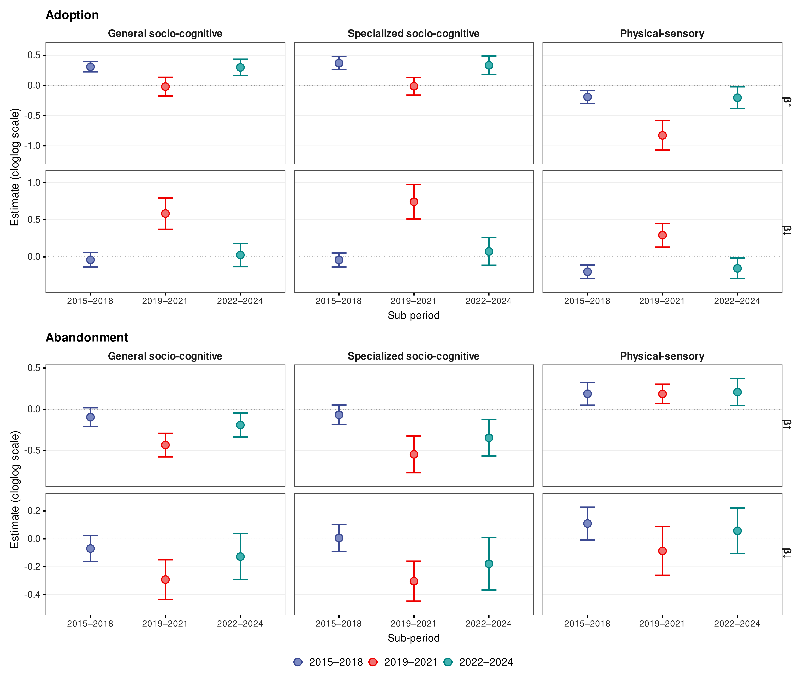{width="58%"}
:::

## B10: Occupational Status — PCA Construction {.smaller}

::: {style="text-align: center;"}
{width="66%"}
:::

## B11: Robustness — Misclassification (Adoption) {.smaller}

::: {style="text-align: center;"}
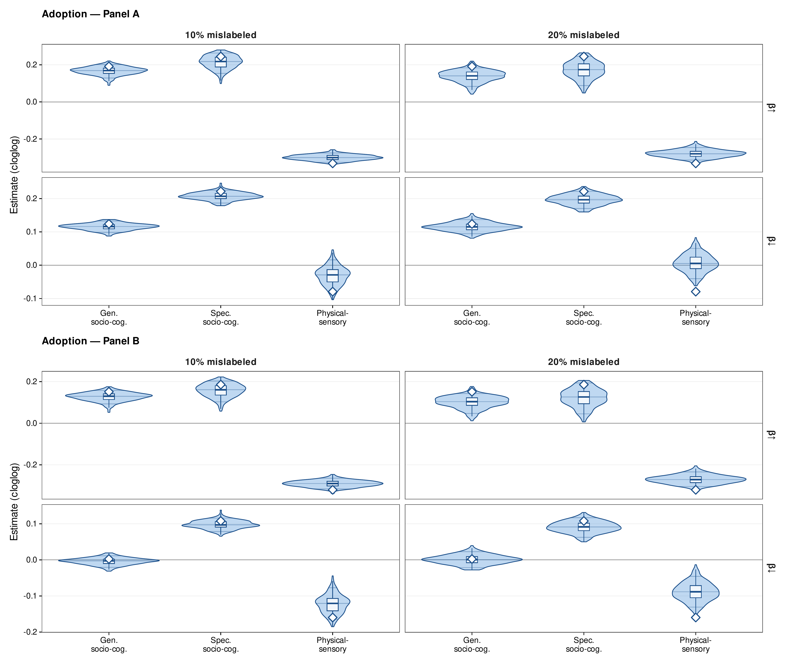{width="58%"}
:::

## B12: Robustness — Misclassification (Abandonment) {.smaller}

::: {style="text-align: center;"}
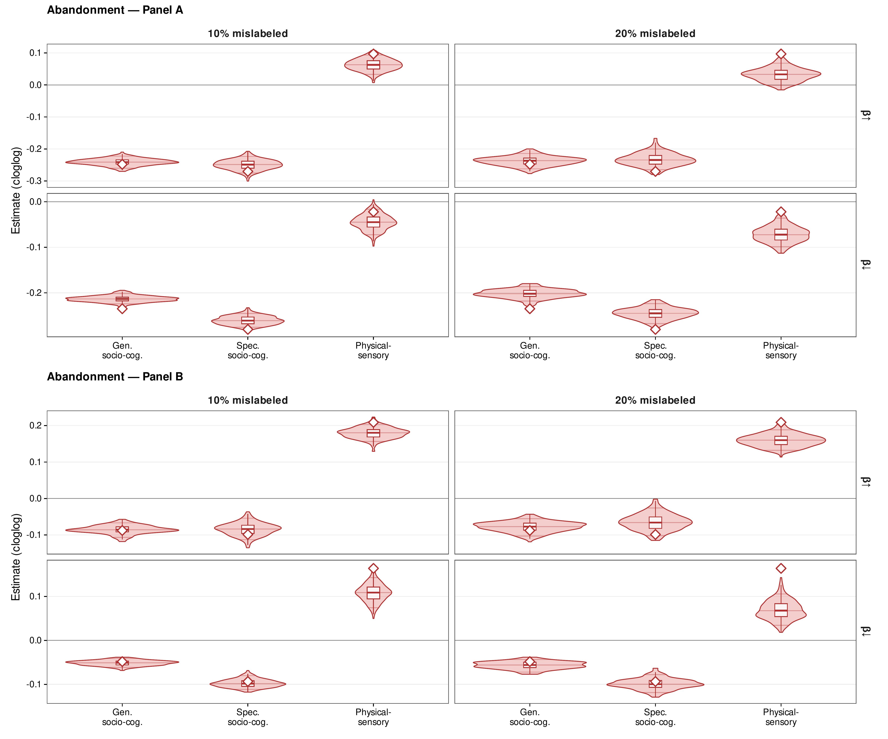{width="58%"}
:::
