## Occupations Are in Constant Transformation {.smaller}

::: {style="font-size: 29px; margin: 3.1em auto 0; max-width: 1050px;"}
Occupations are evolving **bundles of tasks and skills**.

-   Occupational titles may persist while their content changes
-   Tasks and skills are added, recombined, retained, or abandoned
-   This continuously recomposes what occupations require and do

::: {.takeaway style="margin-top: 1.8em;"}
How is occupational skill content **recomposed over time**?
:::

::: {style="font-size: 16px; margin-top: 0.8em; color:#777b87;"}
Weeden & Grusky 2005; Labussière & Bol 2026
:::
:::

## Technological Change Raises the Pressure to Update {.smaller}

::::::::: columns
::::: {.column width="57%"}
::: {style="font-size: 25px; margin-top: 1.55em;"}

-   Technological change has increased the returns to cognitive and
    analytical capabilities
-   It has contributed to occupational polarization and the hollowing of
    routine middle-skill work
-   More recently, AI has renewed expectations of broad occupational
    upskilling

::: {.takeaway style="margin-top: 1.35em;"}
Technological change makes the recomposition of occupational content
increasingly consequential for inequality.
:::

::: {style="font-size: 15px; margin-top: 0.65em; color:#777b87;"}
Autor, Levy & Murnane 2003; Acemoglu & Autor 2011; Goos, Manning & Salomons
2014; Eloundou et al. 2024
:::
:::
:::::

::::: {.column width="43%"}
::: {style="text-align:center; margin-top: 1.05em;"}
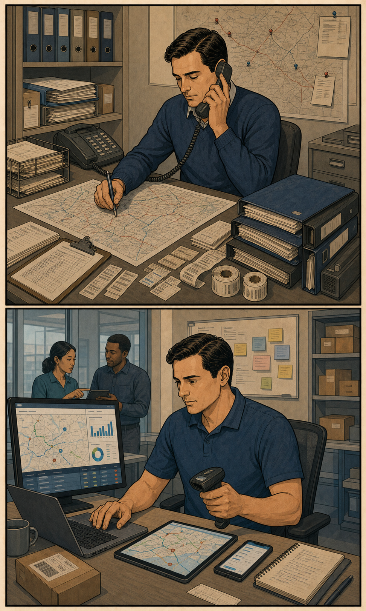{style="height:425px; width:auto; max-width:100%; object-fit:contain; border-radius:4px;"}
:::
:::::
:::::::::

## Upskilling Pressure May Be Strongest at the Bottom {.smaller}

::::::::: columns
::::: {.column width="57%"}
::: {style="font-size: 25px; margin-top: 1.55em;"}

-   Lower-status occupations face greater pressure to adapt to replacement
    and devaluation
-   Recent job-posting evidence finds substantial skill diversification in
    low-wage jobs
-   But pressure to update does not determine what content becomes
    incorporated or retained

::: {.takeaway style="margin-top: 1.7em;"}
Upskilling pressure may be widespread, but **realized occupational updating
need not be uniform**.
:::

::: {style="font-size: 15px; margin-top: 0.65em; color:#777b87;"}
Autor 2015; Acemoglu & Restrepo 2020; Tong, Wu & Evans 2025; Han & Cheng 2026
:::
:::
:::::

::::: {.column width="43%"}
::: {style="text-align:center; margin-top: 1.05em;"}
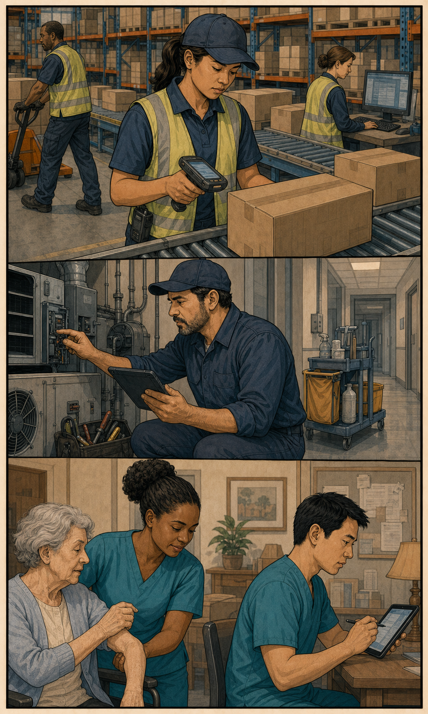{style="height:425px; width:auto; max-width:100%; object-fit:contain; border-radius:4px;"}
:::
:::::
:::::::::

## Occupational Skills Are Polarized and Hierarchically Organized {.smaller}

::::::::: columns
::::: {.column width="50%"}
::: {style="font-size: 22px; margin-top: 1em;"}
**Polarization** (Alabdulkareem et al. 2018)

-   Skills cluster into two domains
-   Socio-cognitive: high education, high wages
-   Sensory/physical: lower education, lower wages

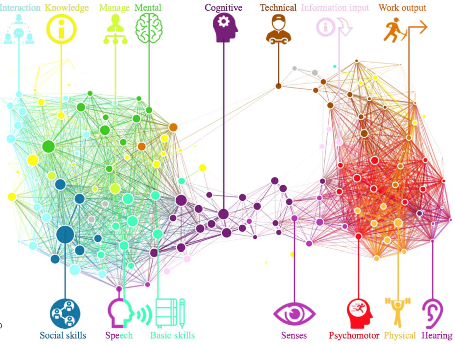{width="72%"}
:::
:::::

::::: {.column width="50%"}
::: {style="font-size: 22px; margin-top: 1em;"}
**Hierarchical organization** (Hosseinioun et al. 2025)

-   Asymmetric dependencies: some skills "enable" others
-   Nested architecture has **intensified** over time
-   Position in hierarchy predicts wages, automation risk

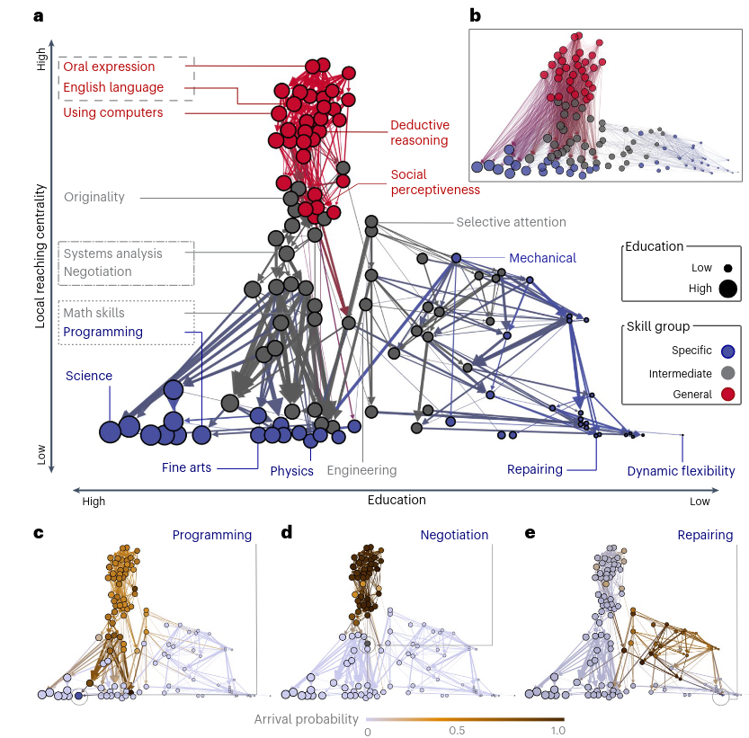{width="65%"}
:::
:::::
:::::::::

::: {.takeaway style="margin-top: 0.4em;"}
Occupational change begins inside an already
**polarized and unequal skill structure**.
:::

# I. Argument {.center .middle background-color="#302a78"}

::: {style="font-size: 28px; color: white; text-align: center; margin-top: 1em;"}
**Relatedness connects; status directs.** 
Skill change is associated with where targets sit relative to current holders.
:::

## Skill Change in a Relational Field {.smaller}

::::::::: columns
::::: {.column width="42%"}
::: {style="text-align:center; margin-top:0.35em;"}
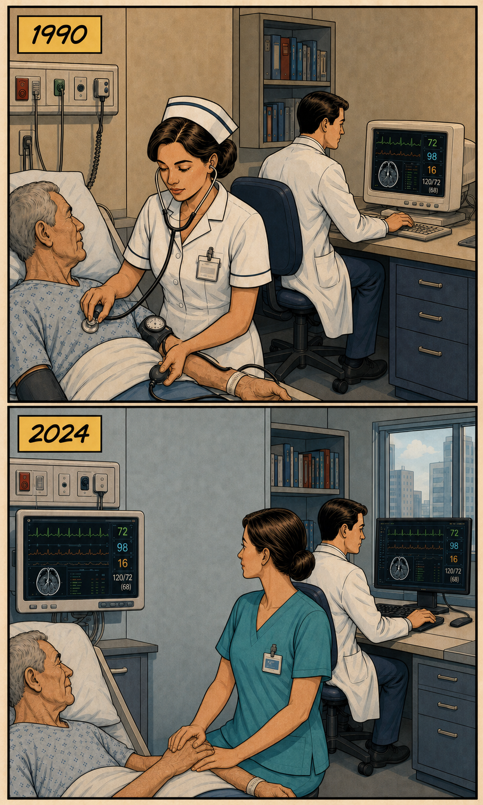{width="76%"}
:::
:::::

::::: {.column width="58%"}
::: {style="font-size:24px; line-height:1.38; margin-top:1.15em;"}
**What we observe**

Nursing changes its skill content over time.

**What makes the change relational**

The same capability is already distributed across other occupations,
including medicine.

**What we compare**

The changing occupation's position relative to those **current holders**.
:::

::: {.takeaway style="margin-top:0.75em; font-size:22px;"}
**Diffusion** means directional updating relative to occupations that already
hold the requirement.
:::
:::::
:::::::::

::: {style="font-size:15px; margin-top:0.25em; color:#717583; display:flex; justify-content:space-between; gap:1.5em;"}
Illustration only: we observe occupational updating, not
physician-to-nurse transmission.
Strang & Meyer 1993; Wimmer 2021
:::

## Proximity and Direction {.smaller}

::::::::: columns
::::: {.column width="50%"}
::: {style="font-size: 24px; text-align: center; margin-top: 0.55em; color:#302a78;"}
**Task-profile proximity**
:::

::: {style="text-align:center; margin-top: 0.1em;"}
<svg viewBox="0 0 500 250" width="455" height="228" role="img"
aria-label="Two occupation nodes connected by one undirected curved edge">
  <path d="M112 142 Q250 38 388 142" fill="none" stroke="#0b7566"
        stroke-width="6" stroke-linecap="round"/>
  <text x="250" y="57" text-anchor="middle" font-size="17" fill="#0b7566">same proximity</text>
  <circle cx="88" cy="158" r="35" fill="#302a78"/>
  <circle cx="412" cy="158" r="35" fill="#302a78"/>
  <text x="88" y="166" text-anchor="middle" font-size="24" font-weight="700" fill="#ffffff">N</text>
  <text x="412" y="166" text-anchor="middle" font-size="24" font-weight="700" fill="#ffffff">D</text>
  <text x="88" y="215" text-anchor="middle" font-size="19" font-weight="600" fill="#302a78">Nurses</text>
  <text x="412" y="215" text-anchor="middle" font-size="19" font-weight="600" fill="#302a78">Doctors</text>
</svg>
:::

::: {style="font-size: 20px; text-align: center; margin-top: 0.25em; color:#353847;"}
One undirected relation 
$\mathrm{dist}_{ij}=\mathrm{dist}_{ji}$
:::
:::::

::::: {.column width="50%"}
::: {style="font-size: 24px; text-align: center; margin-top: 0.55em; color:#302a78;"}
**Relative occupational status**
:::

::: {style="text-align:center; margin-top: 0.1em;"}
<svg viewBox="0 0 500 250" width="455" height="228" role="img"
aria-label="Two occupation nodes connected by two oppositely directed curved arrows">
  <defs>
    <marker id="arrowUp" markerWidth="13" markerHeight="13" refX="11" refY="6.5"
            orient="auto" markerUnits="userSpaceOnUse">
      <path d="M0,0 L10,5 L0,10 Z" fill="#0b7566"/>
    </marker>
    <marker id="arrowDown" markerWidth="13" markerHeight="13" refX="11" refY="6.5"
            orient="auto" markerUnits="userSpaceOnUse">
      <path d="M0,0 L10,5 L0,10 Z" fill="#756fb3"/>
    </marker>
  </defs>
  <path d="M120 137 Q250 35 380 112" fill="none" stroke="#0b7566"
        stroke-width="5.5" stroke-linecap="round" marker-end="url(#arrowUp)"/>
  <path d="M380 148 Q250 238 120 173" fill="none" stroke="#756fb3"
        stroke-width="5.5" stroke-linecap="round" marker-end="url(#arrowDown)"/>
  <text x="250" y="53" text-anchor="middle" font-size="17" fill="#0b7566">target above source</text>
  <text x="250" y="226" text-anchor="middle" font-size="17" fill="#756fb3">target below source</text>
  <circle cx="88" cy="158" r="35" fill="#302a78"/>
  <circle cx="412" cy="122" r="35" fill="#302a78"/>
  <text x="88" y="166" text-anchor="middle" font-size="24" font-weight="700" fill="#ffffff">N</text>
  <text x="412" y="130" text-anchor="middle" font-size="24" font-weight="700" fill="#ffffff">D</text>
  <text x="88" y="215" text-anchor="middle" font-size="19" font-weight="600" fill="#302a78">Nurses</text>
  <text x="412" y="77" text-anchor="middle" font-size="19" font-weight="600" fill="#302a78">Doctors</text>
</svg>
:::

::: {style="font-size: 20px; text-align: center; margin-top: 0.25em; color:#353847;"}
Two directed comparisons 
$G_{ij}=-G_{ji}$
:::
:::::
:::::::::

::: {.takeaway style="margin-top: 0.45em; font-size:23px;"}
Proximity defines **who is connected**. Relative status defines **which
direction is being evaluated**.
:::

::: {style="font-size: 14px; margin-top: 0.35em; color:#717583; text-align:center;"}
Product-space relatedness: Hidalgo et al. 2007. Proximity and prestige in diffusion:
Bail, Brown & Wimmer 2019.
:::

## Which Direction Should Predominate? {.smaller}

::::::::: columns
::::: {.column width="50%"}
::: {style="font-size: 24px; margin-top: 1.6em;"}
**Generalized upskilling**

-   Valued cognitive capabilities may become standardized and spread downward
-   Lower-status occupations may update more because replacement pressure is
    greater
:::
:::::

::::: {.column width="50%"}
::: {style="font-size: 24px; margin-top: 1.6em;"}
**Cumulative advantage and closure**

-   Resources, discretion, and credential closure may consolidate valued
    cognitive content upward
-   Sensory-physical content may become progressively concentrated downward
:::
:::::
:::::::::

::: {.takeaway style="margin-top: 1.7em;"}
We do not identify these mechanisms directly. We establish whether updating
is symmetric or status-directed — and which direction predominates.
:::

## One Process, Two Movements: Adoption and Abandonment

::: {style="text-align: center; margin-top: 2.2em;"}
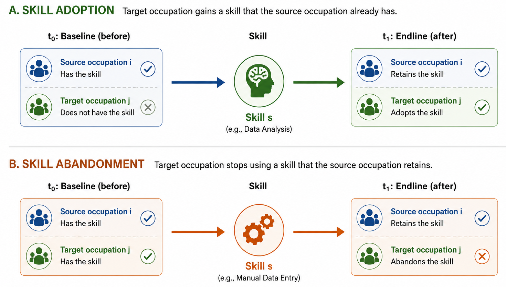{width="64%"}
:::

::: {style="font-size: 22px; margin-top: 0.8em; text-align: center;"}
**Holders:** occupations that already have a skill. 
**Target:** the occupation whose content changes.  
**Adoption:** the target *gains* a skill its holders already have. 
**Abandonment:** the target *sheds* a skill its holders retain.
:::

# II. Research Design {.center .middle background-color="#302a78"}

::: {style="font-size: 28px; color: white; text-align: center; margin-top: 1em;"}
Testing whether status — net of relatedness — predicts direction.
:::

## Forty Million Opportunities Reveal Where Skills Take Root {.smaller}

::::::::: columns
::::: {.column width="44%"}
::: {style="font-size: 26px; margin-top: 3.2em;"}
**O\*NET + BLS**

-   **O\*NET, 2015–2024:** 741 occupations and 160 requirements
-   **BLS OEWS, 2015:** median annual wages
-   Baseline status combines wages with O\*NET required education and
    cognitive task content
:::
:::::

::::: {.column width="56%"}
::: {style="font-size: 25px; margin-top: 2.2em;"}
**Directed source–target–skill risk sets**

-   **21.5M adoption opportunities:** the source holds the skill; the target does not
-   **18.6M abandonment opportunities:** source and target both hold the skill
-   Event occurs when the target crosses the RCA threshold by 2024

::: {.takeaway style="margin-top: 1.1em;"}
The **source** is always a current holder. 
The **target** is always the occupation that changes.
:::
:::
:::::
:::::::::

## Three Skill Classes Capture Function and Specificity

#### Crossing domain x specificity yields three functional classes

::: {style="text-align: center; margin-top: 0.3em;"}
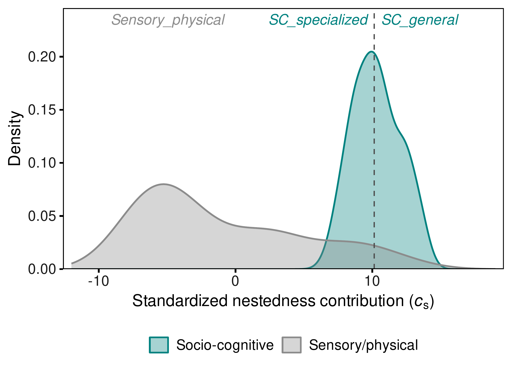{width="46%"}
:::

::: {style="font-size: 19px; color:#666b7a; text-align: center; margin-top: 0.1em;"}
Domain: Alabdulkareem et al. 2018 &nbsp;·&nbsp; Nestedness/specificity: Hosseinioun et al. 2025
:::

::: {style="font-size: 22px; margin-top: 0.3em;"}
-   **General socio-cognitive** (49 skills): $c_s$ at/above within-domain median — broad, scaffolding
-   **Specialized socio-cognitive** (48 skills): $c_s$ below median — narrower, dependent
-   **Sensory-physical** (63 skills): $c_s < 0$ throughout — high-nestedness cell empirically absent
:::

## Two Questions, Two Models: Who Changes — and Relative to Whom? {.smaller}

::::::::: columns
::::: {.column width="50%"}
::: {style="font-size: 23px; margin-top: 2.1em;"}
**First: who changes?**

-   Unit: target occupation $j$ × skill $s$
-   Outcome: adoption or abandonment by the target
-   Target status and mean holder status
-   Mean structural distance
-   Skill fixed effects; coefficients vary by skill class

::: {.takeaway style="margin-top: 1em;"}
Establish the target-side gradient.
:::
:::
:::::

::::: {.column width="50%"}
::: {style="font-size: 23px; margin-top: 2.1em;"}
**Then: relative to whom?**

-   Unit: source $i$ × target $j$ × skill $s$
-   Outcome: the same target-side adoption or abandonment event
-   Predictors: signed source–target status gap and profile distance
-   Complementary source + skill and target + skill fixed effects
-   Three-way clustered standard errors

::: {.takeaway style="margin-top: 1em;"}
Test direction beyond the target gradient.
:::
:::
:::::
:::::::::

## The Gravity Model Isolates Direction Net of Relatedness {.smaller}

::: {style="font-size: 23px; margin-top: 2.2em;"}

For each event $f$ and skill class $g$, the linear predictor is:

$$
\eta^f_{ijs}
=
\underbrace{\alpha_s+\alpha^{(p)}_{e}}_{\text{structural fixed effects}}
+
\underbrace{\beta^f_g\,G_{ij}}_{\text{directional status association}}
+
\underbrace{\delta^f_g\,\mathrm{dist}_{ij}}_{\text{skill-profile distance}},
\qquad
G_{ij}=\sigma_j-\sigma_i
$$

$$
\operatorname{cloglog}\Pr(Y^f_{ijs}=1)=\eta^f_{ijs}
$$

::: {style="font-size: 22px; margin-top: 0.4em; text-align:center; color:#302a78;"}
**In words:** how likely is the target to change, given how *similar* it is
to the source — and whether it sits *above or below* it?
:::

-   $\beta^f_g$: one signed-gap coefficient per event and skill class
-   $\delta^f_g$: profile-distance association
-   Panel A: source + skill FE &nbsp;&nbsp;|&nbsp;&nbsp; Panel B: target + skill FE
-   Fixed effects enter complementary specifications because
    $G_{ij}$ is linear in endpoint status
:::

# III. Results {.center .middle background-color="#302a78"}

::: {style="font-size: 28px; color: white; text-align: center; margin-top: 1em;"}
From target gradients to relational direction and aggregate implications.
:::

## Target Status Predicts Who Adds and Sheds Each Skill Class {.smaller}

::: {style="text-align: center; margin-top: 0.5em;"}
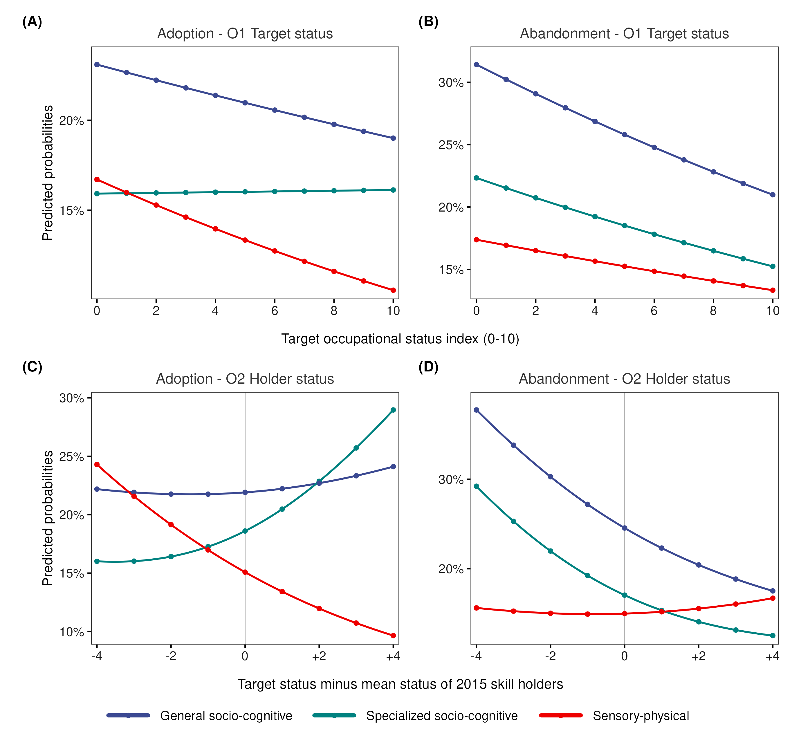{style="height:580px;"}
:::

::: {style="font-size: 19px; color:#666b7a; text-align: center; margin-top: 0.2em;"}
Average marginal predictions from complementary log-log occupation–skill
models with skill fixed effects; these are not raw descriptive rates.
:::

## Target Status Is Only the First Layer {.smaller}

::: {style="font-size: 27px; margin-top: 3em;"}
-   The **target** is the occupation that adopts or abandons a skill.

-   Target status therefore organizes the baseline propensity for change:
    -   socio-cognitive content is retained and accumulated higher in the hierarchy
    -   sensory-physical content is retained and accumulated lower in the hierarchy

-   In Model 2, the association between target status and change is allowed
    to vary with the mean baseline status of existing **skill holders**.

**Next question:** is this only a destination-side gradient, or is change also
organized by the target's position relative to specific sources?
:::

## The Relational Test Uses Two Complementary Comparisons {.smaller}

::: {style="font-size: 27px; margin-top: 2.8em;"}
**Columns compare the two events**

-   Adoption on the left; abandonment on the right

**Rows compare complementary fixed-effect specifications**++

-   Panel A fixes the source and skill: which targets change around the
    same source?
-   Panel B fixes the target and skill: which sources organize change
    around the same target?

**Axes**

-   $x<0$: target below source &nbsp;&nbsp;|&nbsp;&nbsp; $x>0$: target above source
-   $y$: **relative hazard minus one** — how much more (above zero) or less
    (below zero) likely the event is, compared to an equal-status pair
:::

## The Domain Reversal Survives Both Fixed-Effect Comparisons {.compact-title}

::: {style="text-align: center; margin-top: -0.35em;"}
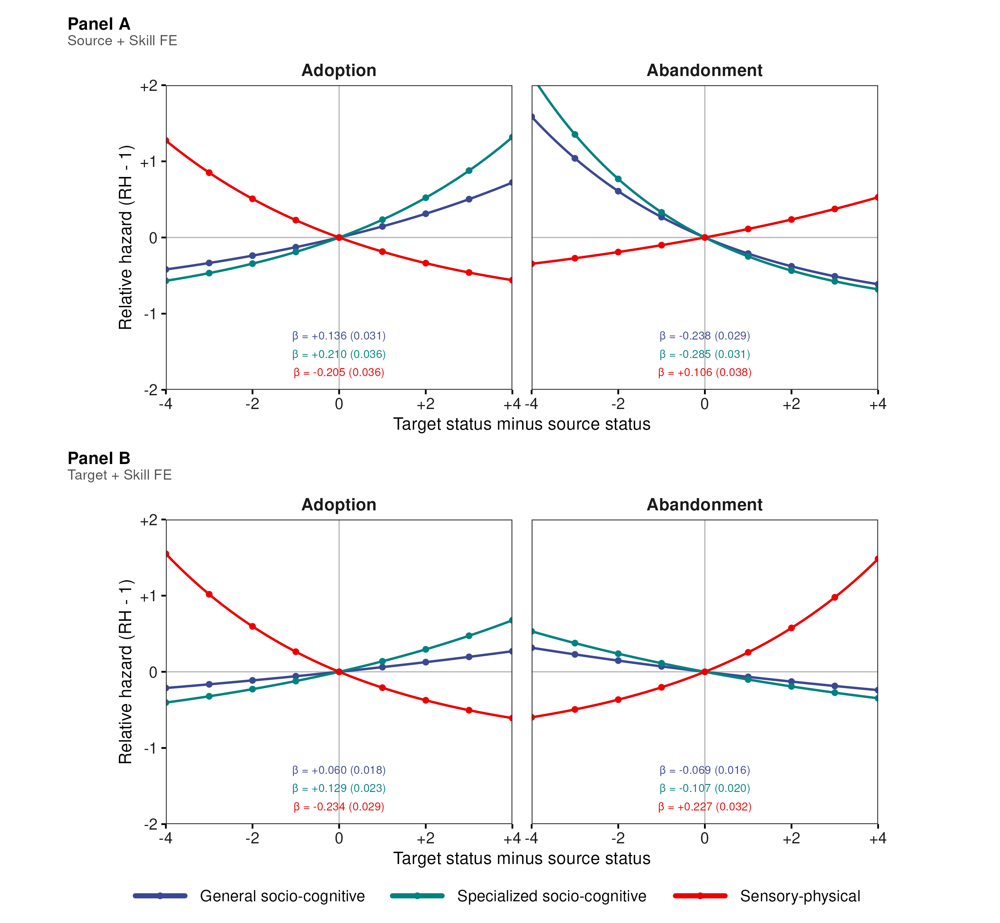{style="height:675px;"}
:::

## The Pattern Cannot Be Reduced to High-Status Targets {.smaller}

::: {style="font-size: 26px; margin-top: 2.2em;"}
**1. Around fixed sources**

Targets above a source are more likely to adopt socio-cognitive skills and
less likely to abandon them. Sensory-physical skills move in the opposite
direction.

**2. Around fixed targets**

The same domain reversal remains when the target and skill are held fixed
and identification comes from variation across sources. The result is
therefore not reducible to “high-status targets adopt cognitive skills.”

**3. Across events**

Adoption and abandonment reinforce rather than cancel one another:
socio-cognitive content becomes concentrated upward, while
sensory-physical content becomes concentrated downward.
:::

## Only the Signed Gap Reproduces the Macro-Gradient {.smaller}

::: {style="text-align: center; margin-top: 0.5em;"}
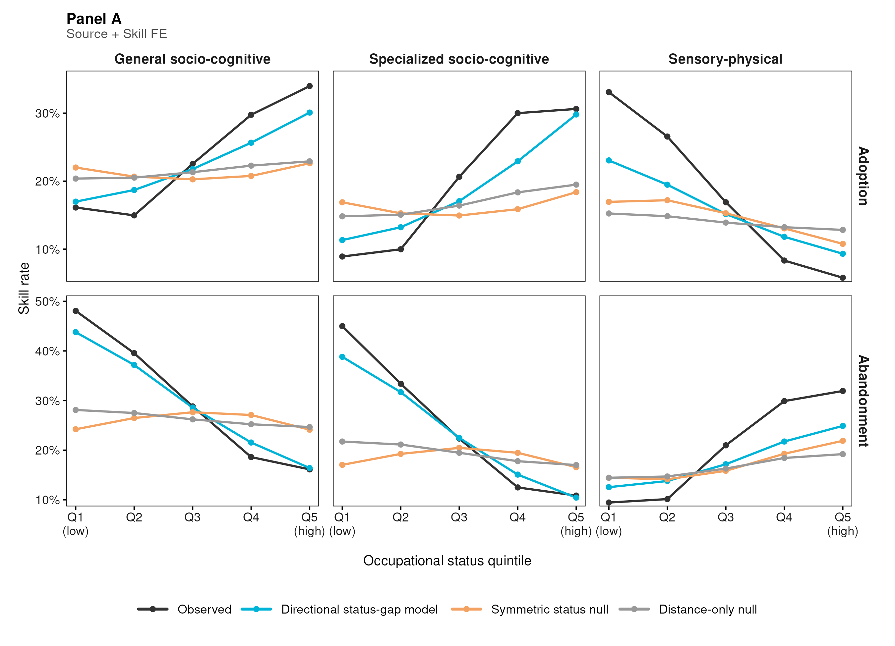{width="76%"}
:::

## Direction Is the Informative Component {.smaller}

::: {style="font-size: 26px; margin-top: 3em;"}

**The null comparisons isolate the informative component:**

- **Observed macro-gradient**
  Socio-cognitive skills concentrate in higher-status occupations.

- **Mirror gradient**
  Sensory-physical skills concentrate in lower-status occupations.

- **Direction-blind counterfactuals fail**
  Distance-only and symmetric status models remain comparatively flat.

- **Directional sufficiency**
  Applying the signed linear gap to the same risk set reproduces the signs
  and much of the magnitude of the aggregate pattern; this is an internal
  sufficiency test against direction-blind alternatives, not out-of-sample
  validation.

:::

# IV. Implications {.center .middle background-color="#302a78"}

::: {style="font-size: 28px; color: white; text-align: center; margin-top: 1em;"}
Even widespread pressure to upskill can reinforce, rather than erode,
the occupational hierarchy.
:::

## AI-Era Upskilling Can Compound Existing Barriers {.smaller}

::: {style="font-size: 26px; margin-top: 3em;"}
-   Technological pressure may raise demand for cognitive capabilities
    without redistributing them evenly across occupations

-   Lower-status occupations can face a **compounded barrier**:
    greater pressure to adapt, but weaker incorporation and retention of
    socio-cognitive content

-   This pattern is consistent with inequality being reproduced
    **inside occupations**, before workers move or jobs disappear
:::

## Connecting to Recent Work on the Bottom of the Distribution {.smaller}

::: {style="font-size: 25px; margin-top: 3em;"}
Using 120M **job postings**, Han & Cheng (2026, *AJS*) show that the
bottom diversifies — but is not rewarded for it: a **skills-value
mismatch**.

Our results are at the **occupation** level, not job postings — a
different unit of analysis. Read as complementary: diversification at
the bottom is disproportionately sensory-physical, and the
socio-cognitive content that does appear there is not retained the way
it is retained above.

::: {.takeaway style="margin-top: 1em;"}
Our findings suggest a complementary possibility: diversification at the
bottom may differ not only in its rewards, but also in the type of content
that is incorporated and retained.
:::

::: {style="font-size: 17px; margin-top: 0.7em; color:#666b7a;"}
Different data and units of analysis; a complementary interpretation, not a
direct test of the same mechanism.
:::
:::

## Limitations {.smaller}

::: {style="font-size: 25px; margin-top: 3em;"}
-   **Occupational level:** we do not observe individual workers or the
    organizational decisions behind skill changes

-   **Observational design:** estimates directional associations, not direct
    pairwise transmission or a unique causal mechanism

-   **Institutional scope:** U.S. occupational data; credentialing,
    wage-setting, and labor-market institutions may moderate the pattern
:::

## Pressure to Upskill Can Reinforce Occupational Hierarchy {.smaller}

::: {style="font-size: 26px; margin-top: 2em;"}

> Realized occupational skill change is not generalized cognitive upgrading.
> It is status-sorted: socio-cognitive content concentrates upward while
> sensory-physical content concentrates downward.

-   **Relatedness connects:** profile similarity identifies plausible
    occupational counterparts
-   **Status orders the association:** adoption and abandonment vary
    directionally with the signed source–target gap
-   **The two margins compound:** cognitive content concentrates upward;
    physical content concentrates downward

::: {.takeaway style="margin-top: 1.2em;"}
The observed pattern is consistent with technological change reproducing
inequality through the changing content of occupational positions.
:::

:::

# Thank You {.center .middle background-color="#302a78"}

**Roberto Cantillan**

Department of Sociology, PUC Chile

rcantillan\@uc.cl

Paper and Replication:
[github.com/rcantillan/skill_diffusion](https://github.com/rcantillan/skill_diffusion)

# Backup Slides {.center .middle background-color="#302a78"}

## B1: Main Threats and What We Do About Them {.smaller}

::: {style="font-size: 20px; margin-top: 2em;"}

| Main threat | Design response |
|:--|:--|
| A target-status gradient may look relational | Complementary source + skill and target + skill fixed-effect comparisons |
| RCA changes may reflect denominator drift | Fixed-2015 denominator check; raw-importance diagnostic |
| Skills with many sources may dominate the risk set | Equal target-skill weighting preserves all 24 slope signs |
| Results may depend on measurement choices | Threshold, status, taxonomy, and period sensitivity checks in the SI |

::: {.takeaway style="margin-top: 1.5em;"}
These checks address measurement and specification sensitivity. They do not
establish direct transmission or a unique causal mechanism.
:::

:::

## B2: Formal Definitions {.smaller}

::: {style="font-size: 22px;  margin-top: 3em;"}
**Revealed Comparative Advantage:**

$$\mathrm{RCA}(j,s) = \frac{\mathrm{onet}(j,s)/\sum_{s'}\mathrm{onet}(j,s')}{\sum_{j'}\mathrm{onet}(j',s)/\sum_{j',s''}\mathrm{onet}(j',s'')}$$

**Event definitions for skill s:**

-   Baseline specialist: RCA $\geq 1$ at $t_0=2015$
-   Endline specialist: RCA $\geq 1$ at $t_1=2024$
-   Adoption: target crosses from below to above RCA threshold
-   Abandonment: target falls from above to below RCA threshold

**Directional gaps:**

$$G_{ij} = \sigma_j - \sigma_i$$

The linear specification estimates one signed coefficient $\beta_g$ for
each skill class: $\beta_g>0$ orients change toward higher-status targets;
$\beta_g<0$ orients it toward lower-status targets.
:::

## B3: Skill Taxonomy {.smaller}

::: {style="font-size: 22px;  margin-top: 2em;"}
**Functional domain:**

-   Louvain communities on the 2015 RCA co-specialization network
-   Socio-cognitive: 97 skills
-   Sensory-physical: 63 skills

**Functional specificity:**

$$c_s = \frac{\mathrm{NODF}_{\text{obs}} - \mathbb{E}[\mathrm{NODF}^{(s)}_{\text{rand}}]}{\mathrm{sd}[\mathrm{NODF}^{(s)}_{\text{rand}}]}$$

**Three-class taxonomy:**

-   General socio-cognitive: 49 skills
-   Specialized socio-cognitive: 48 skills
-   Sensory-physical: 63 skills

The high-nestedness sensory-physical cell is empirically absent.
:::

## B4: Key Coefficients {.smaller}

:::: {style="font-size: 18px; margin-top: 2em;"}
**Linear signed-gap coefficients, Panel A: source + skill FE**

| Skill type          | Adoption β (SE) | Abandonment β (SE) |
|---------------------|----------------:|--------------------:|
| General SC          | +0.136 (0.031)  | −0.238 (0.029)      |
| Specialized SC      | +0.210 (0.036)  | −0.285 (0.031)      |
| Sensory-physical    | −0.205 (0.036)  | +0.106 (0.038)      |

**Linear signed-gap coefficients, Panel B: target + skill FE**

| Skill type          | Adoption β (SE) | Abandonment β (SE) |
|---------------------|----------------:|--------------------:|
| General SC          | +0.060 (0.018)  | −0.069 (0.016)      |
| Specialized SC      | +0.129 (0.023)  | −0.107 (0.020)      |
| Sensory-physical    | −0.234 (0.029)  | +0.227 (0.032)      |

::: {style="font-size: 22px; text-align: center; margin-top: 2em;"}
Cloglog hazard scale. One signed linear coefficient per skill class.
:::
::::

## B5: Complete Gravity Model Derivation {.smaller}

::: {style="font-size: 20px;"}
**Step 1: Classic Gravity**
$$T_{ij} = k \cdot \frac{M_i M_j}{D_{ij}^{\gamma}} \quad \Rightarrow \quad \log \mathbb{E}[T_{ij}] = \beta_0 + \alpha_i + \beta_j - \gamma \log D_{ij}$$

**Step 2: Triadic Extension**
$$\Lambda^f_{ijs} \propto \frac{M_i \cdot M_j \cdot S_s}{D_{ij}}$$

**Step 3: Signed Status Friction**
$$G_{ij}=\sigma_j-\sigma_i$$

**Step 4: Flow-specific distance**
$$-\log D^f_{ij} = \beta_g G_{ij} + \delta_g \mathrm{dist}_{ij}$$

**Step 5: Full Specification**
$$\operatorname{cloglog}\big(P(Y^f_{ijs}=1)\big)
= \alpha_{\mathrm{FE}} + \alpha_s + \beta_g G_{ij}
+ \delta_g\mathrm{dist}_{ij}$$
:::

## B6: Key Magnitudes {.smaller}

::: {style="font-size: 24px; margin-top: 4em; text-align: left;"}
**Main signed-gap gradients:**

| Flow        | Socio-cognitive | Sensory-physical |
|:------------|:----------------|:-----------------|
| Adoption    | Positive β      | Negative β       |
| Abandonment | Negative β      | Positive β       |

**Interpretation:**

-   Cognitive content accumulates at the top through gains and retention
-   Physical content accumulates below through gains and retention
-   The signed gradient persists under source + skill and target + skill FE
:::

## B7: Occupational Status — PCA Construction {.smaller}

::: {style="text-align: center;"}
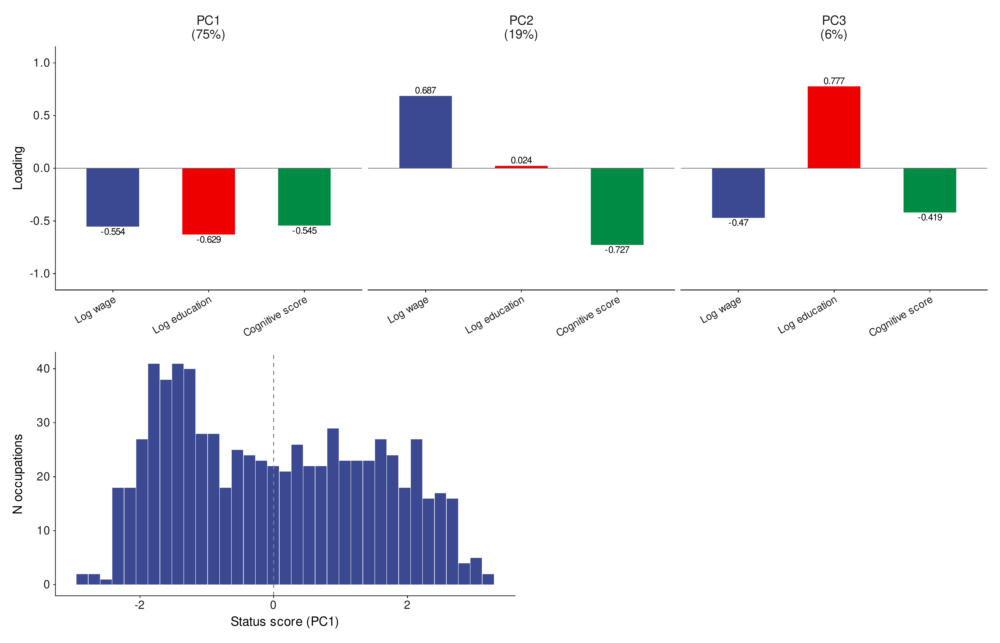{width="66%"}
:::

## B8: References — Technological Change and Updating {.smaller}

::: {style="font-size: 15px; margin-top: 1.2em; line-height:1.25;"}

-   **Autor, D. H., Levy, F., & Murnane, R. J. (2003).** “The Skill Content
    of Recent Technological Change: An Empirical Exploration.” *Quarterly
    Journal of Economics* 118(4):1279–1333.
    doi:10.1162/003355303322552801.

-   **Acemoglu, D., & Autor, D. (2011).** “Skills, Tasks and Technologies:
    Implications for Employment and Earnings.” *Handbook of Labor Economics*
    4:1043–1171. doi:10.1016/S0169-7218(11)02410-5.

-   **Goos, M., Manning, A., & Salomons, A. (2014).** “Explaining Job
    Polarization: Routine-Biased Technological Change and Offshoring.”
    *American Economic Review* 104(8):2509–2526.
    doi:10.1257/aer.104.8.2509.

-   **Autor, D. H. (2015).** “Why Are There Still So Many Jobs? The History
    and Future of Workplace Automation.” *Journal of Economic Perspectives*
    29(3):3–30. doi:10.1257/jep.29.3.3.

-   **Eloundou, T., Manning, S., Mishkin, P., & Rock, D. (2024).** “GPTs are
    GPTs: Labor Market Impact Potential of LLMs.” *Science*
    384(6702):1306–1308. doi:10.1126/science.adj0998.

-   **Tong, D., Wu, L., & Evans, J. A. (2025).** “Lower-Skilled Occupations
    Face Greater Upskilling Pressure in U.S. Job Ads.” *Nature Communications*
    17:1237. doi:10.1038/s41467-025-67992-y.

-   **Han, S., & Cheng, S. (2026).** “Skill Diversification Beyond
    High-Paying Jobs.” *American Journal of Sociology*.
    doi:10.1086/741725.
:::

## B9: References — Occupational Structure and Diffusion {.smaller}

::: {style="font-size: 14px; margin-top: 0.8em; line-height:1.2;"}

-   **Weeden, K. A., & Grusky, D. B. (2005).** “The Case for a New Class
    Map.” *American Journal of Sociology* 111(1):141–212.

-   **Labussière, M., & Bol, T. (2026).** “Are Occupations ‘Bundles of
    Skills’? Identifying Latent Skill Profiles in the Labor Market Using
    Topic Modeling.” *Sociological Science* 13:362–407.
    doi:10.15195/v13.a16.

-   **Alabdulkareem, A., Frank, M. R., Sun, L., AlShebli, B., Hidalgo, C., &
    Rahwan, I. (2018).** “Unpacking the Polarization of Workplace Skills.”
    *Science Advances* 4(7):eaao6030. doi:10.1126/sciadv.aao6030.

-   **Hidalgo, C. A., Klinger, B., Barabási, A.-L., & Hausmann, R. (2007).**
    “The Product Space Conditions the Development of Nations.” *Science*
    317(5837):482–487. doi:10.1126/science.1144581.

-   **Hosseinioun, M., Neffke, F., Zhang, L., & Youn, H. (2025).** “Skill
    Dependencies Uncover Nested Human Capital.” *Nature Human Behaviour*.
    doi:10.1038/s41562-024-02093-2.

-   **Strang, D., & Meyer, J. W. (1993).** “Institutional Conditions for
    Diffusion.” *Theory and Society* 22(4):487–511.
    doi:10.1007/BF00993595.

-   **Cheng, S., & Park, B. (2020).** “Flows and Boundaries: A Network
    Approach to Studying Occupational Mobility in the Labor Market.”
    *American Journal of Sociology* 126(3):577–631.
    doi:10.1086/712406.

-   **Lin, K.-H., & Hung, K. (2022).** “The Network Structure of Occupations:
    Fragmentation, Differentiation, and Contagion.” *American Journal of
    Sociology* 127(5):1551–1601. doi:10.1086/719407.

-   **Bail, C. A., Brown, T. W., & Wimmer, A. (2019).** “Prestige,
    Proximity, and Prejudice: How Google Search Terms Diffuse across the
    World.” *American Journal of Sociology* 124(5):1496–1548.
    doi:10.1086/702007.

-   **Wimmer, A. (2021).** “Domains of Diffusion: How Culture and
    Institutions Travel around the World and with What Consequences.”
    *American Journal of Sociology* 126(6):1389–1438.
    doi:10.1086/714273.
:::
