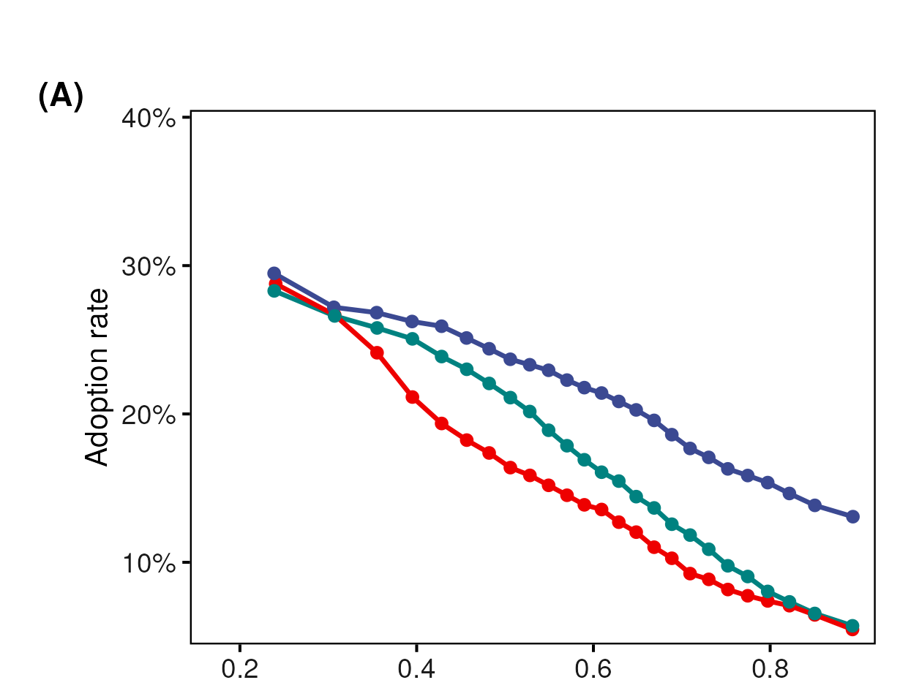
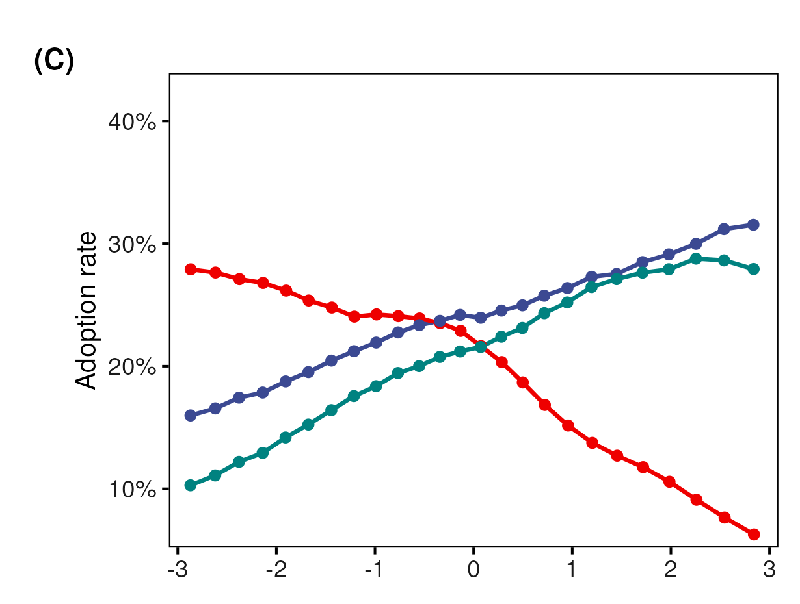

## Technological Upgrading Should Spread Cognitive Skills {.smaller}

::: {style="font-size: 28px; margin-top: 3.4em;"}

-   Technological change raises cognitive and interpersonal requirements
-   Lower-status occupations face especially strong pressure to adapt
-   Broad upgrading should narrow differences in occupational skill content

::: {.takeaway style="margin-top: 1.8em;"}
But pressure to acquire a skill does not determine
**where that skill actually takes root.**
:::
:::

## From Upskilling Pressure to Realized Change {.smaller}

::::::::: columns
::::: {.column width="46%"}
::: {style="margin-top: 0.4em; text-align: center;"}
{style="height:545px; width:auto;"}
:::
::::: 

::::: {.column width="54%"}
::: {style="font-size: 24px; margin-top: 2.2em;"}
Pressure to change is not the same as realized occupational skill content.

> We observe how occupational requirements change over time, not direct
> transmission between workers or occupations.

Related occupations provide plausible comparisons. Their status positions
allow us to ask whether realized changes are directionally patterned.

**We ask:** which skills are adopted or abandoned, and how do those changes
vary with the status of the occupations that already hold them?
:::
:::::
:::::::::

# I. Argument {.center .middle background-color="#302a78"}

::: {style="font-size: 28px; color: white; text-align: center; margin-top: 1em;"}
Relatedness connects occupational counterparts; status orders realized change.
:::

## Relatedness Connects; Status Directs {.smaller}

::::::::: columns
::::: {.column width="50%"}
::: {style="font-size: 24px; text-align: center; margin-top: 0.7em;"}
**Task relatedness: symmetric proximity**
:::

::: {style="text-align: center; margin-top: 0.3em;"}
{width="92%"}
:::

::: {style="font-size: 20px; text-align: center; margin-top: 0.2em;"}
Distance identifies plausible counterparts, but has no orientation:
$\mathrm{dist}_{ij}=\mathrm{dist}_{ji}$.
:::
:::::

::::: {.column width="50%"}
::: {style="font-size: 24px; text-align: center; margin-top: 0.7em;"}
**Occupational status: directional position**
:::

::: {style="text-align: center; margin-top: 0.3em;"}
{width="92%"}
:::

::: {style="font-size: 20px; text-align: center; margin-top: 0.2em;"}
The signed gap orders those counterparts:
$G_{ji}=-G_{ij}$.
:::
:::::
:::::::::

::: {.takeaway style="margin-top: 0.6em;"}
Relatedness selects plausible counterparts; status gives the relation direction.
:::

## Status Predicts Opposite Trajectories Across Skill Domains {.smaller}

::: {style="font-size: 24px; margin-top: 1.8em; text-align:center;"}
For each skill, compare a target occupation with its current holders.
:::

::::::::: columns
::::: {.column width="50%"}
::: {style="font-size: 25px; margin-top: 1.5em;"}
**Socio-cognitive skills**

-   More likely to be adopted **above** current holders
-   More likely to be abandoned **below** current holders
:::
:::::

::::: {.column width="50%"}
::: {style="font-size: 25px; margin-top: 1.5em;"}
**Sensory-physical skills**

-   More likely to be adopted **below** current holders
-   More likely to be abandoned **above** current holders
:::
:::::
:::::::::

::: {.takeaway style="margin-top: 1.5em;"}
Adoption and abandonment combine into a status-sorted pattern 
in occupational skill content.
:::

## Existing Skill Structure Makes Direction Consequential {.smaller}

::::::::: columns
::::: {.column width="50%"}
::: {style="font-size: 22px; margin-top: 1em;"}
**Polarization** (Alabdulkareem et al. 2018)

-   Skills cluster into two domains
-   Socio-cognitive: high education, high wages
-   Sensory/physical: lower education, lower wages

{width="72%"}
:::
:::::

::::: {.column width="50%"}
::: {style="font-size: 22px; margin-top: 1em;"}
**Nestedness** (Hosseinioun et al. 2025)

-   Asymmetric dependencies: some skills "enable" others
-   Nested architecture has **intensified** over time
-   Position in hierarchy predicts wages, automation risk

{width="65%"}
:::
:::::
:::::::::

## Skill Change Has Two Reinforcing Margins

::: {style="text-align: center; margin-top: 3em;"}
{width="64%"}
:::

::: {style="font-size: 20px; margin-top: 1em; text-align: center;"}
We do not observe direct transmission. We model how adoption and abandonment
hazards vary with **profile distance**, **signed status gap**, and **skill class**.
:::

## Mechanisms Consistent With the Directional Pattern

 

::: {style="font-size: 25px; margin-top: 4em;"}
-   **Absorptive capacity:** unequal resources and organizational slack may
    condition which occupations incorporate new requirements.
-   **Credential and licensing closure:** institutional restrictions may
    limit access to higher-status task bundles.
-   **Task allocation and delegation:** authority relations may orient how
    work is reallocated among related occupations.
-   **Valuation asymmetry:** similar content may be recognized differently
    depending on who performs it.

These mechanisms are theoretically consistent with the results; they are not
directly observed in the occupational data.
:::

# II. Data & Methods {.center .middle background-color="#302a78"}

::: {style="font-size: 28px; color: white; text-align: center; margin-top: 1em;"}
Forty million source–target–skill opportunities over 2015–2024.
:::

## Forty Million Opportunities Reveal Where Skills Take Root {.smaller}

::::::::: columns
::::: {.column width="44%"}
::: {style="font-size: 26px; margin-top: 3.2em;"}
**O\*NET, 2015–2024**

-   741 occupations
-   160 requirements
-   Baseline status from wages, education, and cognitive task content
:::
:::::

::::: {.column width="56%"}
::: {style="font-size: 25px; margin-top: 2.2em;"}
**Directed source–target–skill risk sets**

-   **21.5M adoption opportunities:** source holds the skill; target does not
-   **18.6M abandonment opportunities:** source and target both hold the skill
-   Event occurs when the target crosses the RCA threshold by 2024

::: {.takeaway style="margin-top: 1.1em;"}
The target is always the occupation that changes.
:::
:::
:::::
:::::::::

## Three Skill Classes Capture Function and Specificity

#### Crossing domain x specificity yields three functional classes

::: {style="text-align: center; margin-top: 0.3em;"}
{width="46%"}
:::

::: {style="font-size: 19px; color:#666b7a; text-align: center; margin-top: 0.1em;"}
Domain: Alabdulkareem et al. 2018 &nbsp;·&nbsp; Nestedness/specificity: Hosseinioun et al. 2025
:::

::: {style="font-size: 22px; margin-top: 0.3em;"}
-   **General socio-cognitive** (49 skills): $c_s$ at/above within-domain median — broad, scaffolding
-   **Specialized socio-cognitive** (48 skills): $c_s$ below median — narrower, dependent
-   **Sensory-physical** (63 skills): $c_s < 0$ throughout — high-nestedness cell empirically absent
:::

## Two Models Separate Target Gradients from Relational Direction {.smaller}

::::::::: columns
::::: {.column width="50%"}
::: {style="font-size: 23px; margin-top: 2.1em;"}
**First: who changes?**

-   Unit: target occupation $j$ × skill $s$
-   Outcome: adoption or abandonment by the target
-   Target status and mean holder status
-   Mean structural distance
-   Skill fixed effects; coefficients vary by skill class

::: {.takeaway style="margin-top: 1em;"}
Establish the target-side gradient.
:::
:::
:::::

::::: {.column width="50%"}
::: {style="font-size: 23px; margin-top: 2.1em;"}
**Then: relative to whom?**

-   Unit: source $i$ × target $j$ × skill $s$
-   Outcome: the same target-side adoption or abandonment event
-   Predictors: signed source–target status gap and profile distance
-   Complementary source + skill and target + skill fixed effects
-   Three-way clustered standard errors

::: {.takeaway style="margin-top: 1em;"}
Test direction beyond the target gradient.
:::
:::
:::::
:::::::::

## The Gravity Model Isolates Direction Net of Relatedness {.smaller}

::: {style="font-size: 23px; margin-top: 2.2em;"}

For each event $f$ and skill class $g$, the linear predictor is:

$$
\eta^f_{ijs}
=
\underbrace{\alpha_s+\alpha^{(p)}_{e}}_{\text{structural fixed effects}}
+
\underbrace{\beta^f_g\,G_{ij}}_{\text{directional status association}}
+
\underbrace{\delta^f_g\,\mathrm{dist}_{ij}}_{\text{skill-profile distance}},
\qquad
G_{ij}=\sigma_j-\sigma_i
$$

$$
\operatorname{cloglog}\Pr(Y^f_{ijs}=1)=\eta^f_{ijs}
$$

-   $\beta^f_g$: one signed-gap coefficient per event and skill class
-   $\delta^f_g$: profile-distance association
-   Panel A: source + skill FE &nbsp;&nbsp;|&nbsp;&nbsp; Panel B: target + skill FE
-   Fixed effects enter complementary specifications because
    $G_{ij}$ is linear in endpoint status
:::

# III. Results {.center .middle background-color="#302a78"}

::: {style="font-size: 28px; color: white; text-align: center; margin-top: 1em;"}
From target gradients to relational direction and aggregate implications.
:::

## Target Status Predicts Who Adds and Sheds Each Skill Class {.smaller}

::: {style="text-align: center; margin-top: 0.5em;"}
{style="height:580px;"}
:::

::: {style="font-size: 19px; color:#666b7a; text-align: center; margin-top: 0.2em;"}
Average marginal predictions from complementary log-log occupation–skill
models with skill fixed effects; these are not raw descriptive rates.
:::

## Target Status Is Only the First Layer {.smaller}

::: {style="font-size: 27px; margin-top: 3em;"}
-   The **target** is the occupation that adopts or abandons a skill.

-   Target status therefore organizes the baseline propensity for change:
    -   socio-cognitive content is retained and accumulated higher in the hierarchy
    -   sensory-physical content is retained and accumulated lower in the hierarchy

-   In Model 2, the association between target status and change is allowed
    to vary with the mean baseline status of existing **skill holders**.

**Next question:** is this only a destination-side gradient, or is change also
organized by the target's position relative to specific sources?
:::

## The Relational Test Uses Two Complementary Comparisons {.smaller}

::: {style="font-size: 27px; margin-top: 2.8em;"}
**Columns compare the two events**

-   Adoption on the left; abandonment on the right

**Rows compare complementary fixed-effect specifications**

-   Panel A fixes the source and skill: which targets change around the
    same source?
-   Panel B fixes the target and skill: which sources organize change
    around the same target?

**Axes**

-   $x<0$: target below source &nbsp;&nbsp;|&nbsp;&nbsp; $x>0$: target above source
-   $y=\mathrm{RH}-1$: zero is the equal-status reference
:::

## The Domain Reversal Survives Both Fixed-Effect Comparisons {.compact-title}

::: {style="text-align: center; margin-top: -0.35em;"}
{style="height:675px;"}
:::

## The Pattern Cannot Be Reduced to High-Status Targets {.smaller}

::: {style="font-size: 26px; margin-top: 2.2em;"}
**1. Around fixed sources**

Targets above a source are more likely to adopt socio-cognitive skills and
less likely to abandon them. Sensory-physical skills move in the opposite
direction.

**2. Around fixed targets**

The same domain reversal remains when the target and skill are held fixed
and identification comes from variation across sources. The result is
therefore not reducible to “high-status targets adopt cognitive skills.”

**3. Across events**

Adoption and abandonment reinforce rather than cancel one another:
socio-cognitive content becomes concentrated upward, while
sensory-physical content becomes concentrated downward.
:::

## Only the Signed Gap Reproduces the Macro-Gradient {.smaller}

::: {style="text-align: center; margin-top: 0.5em;"}
{width="76%"}
:::

## Direction Is the Informative Component {.smaller}

::: {style="font-size: 26px; margin-top: 3em;"}

**The null comparisons isolate the informative component:**

- **Observed macro-gradient**
  Socio-cognitive skills concentrate in higher-status occupations.

- **Mirror gradient**
  Sensory-physical skills concentrate in lower-status occupations.

- **Direction-blind counterfactuals fail**
  Distance-only and symmetric status models remain comparatively flat.

- **Directional sufficiency**
  Applying the signed linear gap to the same risk set reproduces the signs
  and much of the magnitude of the aggregate pattern; this is an internal
  sufficiency test against direction-blind alternatives, not out-of-sample
  validation.

:::

# IV. Implications {.center .middle background-color="#302a78"}

::: {style="font-size: 28px; color: white; text-align: center; margin-top: 1em;"}
Status-sorted skill change can widen inequality within occupations.
:::

## AI-Era Upskilling Can Compound Existing Barriers {.smaller}

::: {style="font-size: 26px; margin-top: 3em;"}
-   Technological pressure may raise demand for cognitive capabilities
    without redistributing them evenly across occupations

-   Lower-status occupations can face a **compounded barrier**:
    greater pressure to adapt, but weaker incorporation and retention of
    socio-cognitive content

-   This pattern is consistent with inequality being reproduced
    **inside occupations**, before workers move or jobs disappear
:::

## Limitations {.smaller}

::: {style="font-size: 25px; margin-top: 3em;"}
-   **Occupational level:** we do not observe individual workers or the
    organizational decisions behind skill changes

-   **Observational design:** estimates directional associations, not direct
    pairwise transmission or a unique causal mechanism

-   **Institutional scope:** U.S. occupational data; credentialing,
    wage-setting, and labor-market institutions may moderate the pattern
:::

## Pressure to Upskill Can Reinforce Occupational Hierarchy {.smaller}

::: {style="font-size: 26px; margin-top: 2em;"}

> Realized occupational skill change is not generalized cognitive upgrading.
> It is status-sorted: socio-cognitive content concentrates upward while
> sensory-physical content concentrates downward.

-   **Relatedness connects:** profile similarity identifies plausible
    occupational counterparts
-   **Status orders the association:** adoption and abandonment vary
    directionally with the signed source–target gap
-   **The two margins compound:** cognitive content concentrates upward;
    physical content concentrates downward

::: {.takeaway style="margin-top: 1.2em;"}
The observed pattern is consistent with technological change reproducing
inequality through the changing content of occupational positions.
:::

:::

# Thank You {.center .middle background-color="#302a78"}

**Roberto Cantillan**

Department of Sociology, PUC Chile

rcantillan\@uc.cl

Paper and Replication:
[github.com/rcantillan/skill_diffusion](https://github.com/rcantillan/skill_diffusion)

# Backup Slides {.center .middle background-color="#302a78"}

## B1: Formal Definitions {.smaller}

::: {style="font-size: 22px;  margin-top: 3em;"}
**Revealed Comparative Advantage:**

$$\mathrm{RCA}(j,s) = \frac{\mathrm{onet}(j,s)/\sum_{s'}\mathrm{onet}(j,s')}{\sum_{j'}\mathrm{onet}(j',s)/\sum_{j',s''}\mathrm{onet}(j',s'')}$$

**Event definitions for skill s:**

-   Baseline specialist: RCA $\geq 1$ at $t_0=2015$
-   Endline specialist: RCA $\geq 1$ at $t_1=2024$
-   Adoption: target crosses from below to above RCA threshold
-   Abandonment: target falls from above to below RCA threshold

**Directional gaps:**

$$G_{ij} = \sigma_j - \sigma_i$$

The linear specification estimates one signed coefficient $\beta_g$ for
each skill class: $\beta_g>0$ orients change toward higher-status targets;
$\beta_g<0$ orients it toward lower-status targets.
:::

## B2: Skill Taxonomy {.smaller}

::: {style="font-size: 22px;  margin-top: 2em;"}
**Functional domain:**

-   Louvain communities on the 2015 RCA co-specialization network
-   Socio-cognitive: 97 skills
-   Sensory-physical: 63 skills

**Functional specificity:**

$$c_s = \frac{\mathrm{NODF}_{\text{obs}} - \mathbb{E}[\mathrm{NODF}^{(s)}_{\text{rand}}]}{\mathrm{sd}[\mathrm{NODF}^{(s)}_{\text{rand}}]}$$

**Three-class taxonomy:**

-   General socio-cognitive: 49 skills
-   Specialized socio-cognitive: 48 skills
-   Sensory-physical: 63 skills

The high-nestedness sensory-physical cell is empirically absent.
:::

## B3: Key Coefficients {.smaller}

:::: {style="font-size: 18px; margin-top: 2em;"}
**Linear signed-gap coefficients, Panel A: source + skill FE**

| Skill type          | Adoption β (SE) | Abandonment β (SE) |
|---------------------|----------------:|--------------------:|
| General SC          | +0.136 (0.031)  | −0.238 (0.029)      |
| Specialized SC      | +0.210 (0.036)  | −0.285 (0.031)      |
| Sensory-physical    | −0.205 (0.036)  | +0.106 (0.038)      |

**Linear signed-gap coefficients, Panel B: target + skill FE**

| Skill type          | Adoption β (SE) | Abandonment β (SE) |
|---------------------|----------------:|--------------------:|
| General SC          | +0.060 (0.018)  | −0.069 (0.016)      |
| Specialized SC      | +0.129 (0.023)  | −0.107 (0.020)      |
| Sensory-physical    | −0.234 (0.029)  | +0.227 (0.032)      |

::: {style="font-size: 22px; text-align: center; margin-top: 2em;"}
Cloglog hazard scale. One signed linear coefficient per skill class.
:::
::::

## B4: Complete Gravity Model Derivation {.smaller}

::: {style="font-size: 20px;"}
**Step 1: Classic Gravity**
$$T_{ij} = k \cdot \frac{M_i M_j}{D_{ij}^{\gamma}} \quad \Rightarrow \quad \log \mathbb{E}[T_{ij}] = \beta_0 + \alpha_i + \beta_j - \gamma \log D_{ij}$$

**Step 2: Triadic Extension**
$$\Lambda^f_{ijs} \propto \frac{M_i \cdot M_j \cdot S_s}{D_{ij}}$$

**Step 3: Signed Status Friction**
$$G_{ij}=\sigma_j-\sigma_i$$

**Step 4: Flow-specific distance**
$$-\log D^f_{ij} = \beta_g G_{ij} + \delta_g \mathrm{dist}_{ij}$$

**Step 5: Full Specification**
$$\operatorname{cloglog}\big(P(Y^f_{ijs}=1)\big)
= \alpha_{\mathrm{FE}} + \alpha_s + \beta_g G_{ij}
+ \delta_g\mathrm{dist}_{ij}$$
:::

## B5: Key Magnitudes {.smaller}

::: {style="font-size: 24px; margin-top: 4em; text-align: left;"}
**Main signed-gap gradients:**

| Flow        | Socio-cognitive | Sensory-physical |
|:------------|:----------------|:-----------------|
| Adoption    | Positive β      | Negative β       |
| Abandonment | Negative β      | Positive β       |

**Interpretation:**

-   Cognitive content accumulates at the top through gains and retention
-   Physical content accumulates below through gains and retention
-   The signed gradient persists under source + skill and target + skill FE
:::

## B6: Occupational Status — PCA Construction {.smaller}

::: {style="text-align: center;"}
{width="66%"}
:::
