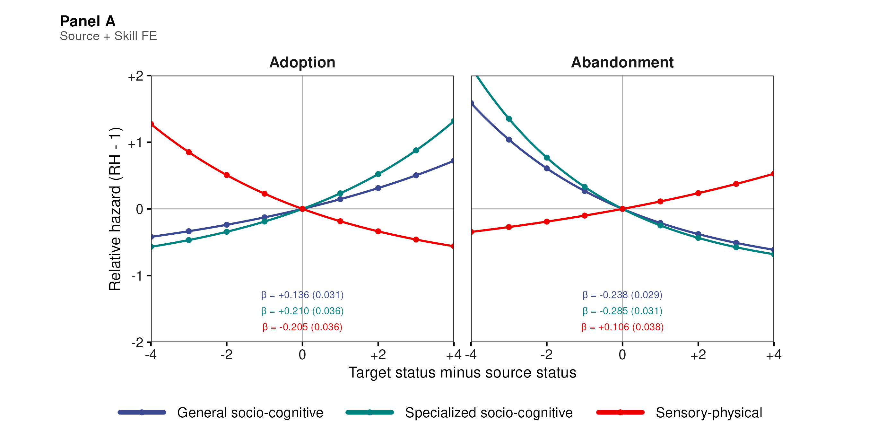
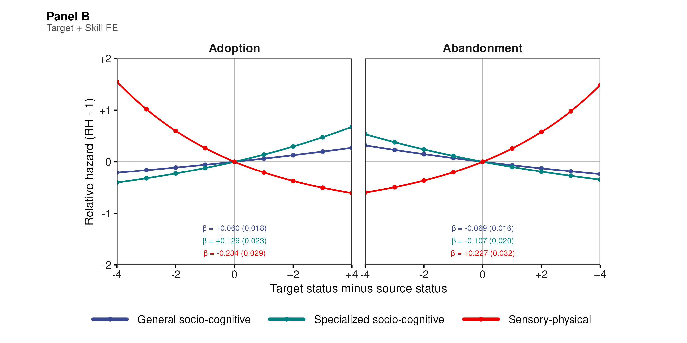

## Occupations Are in Constant Transformation {.smaller}

::: {style="font-size: 29px; margin: 3.1em auto 0; max-width: 1050px;"}
Occupations are evolving **bundles of tasks and skills**.

-   Occupational titles may persist while their content changes
-   Tasks and skills are added, recombined, retained, or abandoned
-   This continuously recomposes what occupations require and do

::: {.takeaway style="margin-top: 1.8em;"}
How is occupational skill content **recomposed over time**?
:::

::: {style="font-size: 16px; margin-top: 0.8em; color:#777b87;"}
Weeden & Grusky 2005; Labussière & Bol 2026
:::
:::

## Technological Change Raises the Pressure to Update {.smaller}

::::::::: columns
::::: {.column width="57%"}
::: {style="font-size: 25px; margin-top: 1.55em;"}

-   Technological change (and, more recently, AI) has increased the returns to
    cognitive and analytical capabilities
-   It has contributed to occupational polarization and the hollowing of
    routine middle-skill work

::: {.takeaway style="margin-top: 1.35em;"}
Technological change makes the recomposition of occupational content
consequential for inequality.
:::

::: {style="font-size: 15px; margin-top: 0.65em; color:#777b87;"}
Autor, Levy & Murnane 2003; Acemoglu & Autor 2011; Goos, Manning & Salomons
2014; Eloundou et al. 2024
:::
:::
:::::

::::: {.column width="43%"}
::: {style="text-align:center; margin-top: 1.05em;"}
{style="height:425px; width:auto; max-width:100%; object-fit:contain; border-radius:4px;"}
:::
:::::
:::::::::

## Upskilling Pressure May Be Strongest at the Bottom {.smaller}

::::::::: columns
::::: {.column width="57%"}
::: {style="font-size: 25px; margin-top: 1.55em;"}

-   Lower-status occupations face greater pressure to adapt to replacement
    and devaluation
-   Recent job-posting evidence finds substantial skill diversification in
    low-wage jobs

::: {.takeaway style="margin-top: 1.7em;"}
But **realized occupational updating may be heterogeneous**.
:::

::: {style="font-size: 15px; margin-top: 0.65em; color:#777b87;"}
Autor 2015; Acemoglu & Restrepo 2020; Tong, Wu & Evans 2025; Han & Cheng 2026
:::
:::
:::::

::::: {.column width="43%"}
::: {style="text-align:center; margin-top: 1.05em;"}
{style="height:425px; width:auto; max-width:100%; object-fit:contain; border-radius:4px;"}
:::
:::::
:::::::::

## Heterogeneity Depends on Skill Type and Specialization {.smaller}

::: {.takeaway style="margin: 0.45em auto 0.15em; font-size: 22px; max-width: 1050px;"}
Changes in occupational content may be contingent on the **functional domain**
and **functional specificity** of the skills involved.
:::

::::::::: columns
::::: {.column width="50%"}
::: {style="font-size: 22px; margin-top: 0.65em;"}
**Functional domain**  
**Socio-cognitive vs. sensory-physical**  
Polarization

-   Socio-cognitive: high education, high wages
-   Sensory-physical: lower education, lower wages

{width="72%"}

::: {style="font-size: 14px; margin-top: 0.15em; color:#717583; text-align:center;"}
Alabdulkareem et al. 2018
:::
:::
:::::

::::: {.column width="50%"}
::: {style="font-size: 22px; margin-top: 0.65em;"}
**Functional specificity**  
**General vs. specialized**  
Hierarchical organization

-   General skills scaffold many occupational profiles
-   Specialized skills are narrower and more dependent

{width="55%"}

::: {style="font-size: 14px; margin-top: 0.15em; color:#717583; text-align:center;"}
Hosseinioun et al. 2025
:::
:::
:::::
:::::::::

# I. Skill Diffusion {.center .middle background-color="#302a78"}

::: {style="font-size: 28px; color: white; text-align: center; margin-top: 1em;"}
**Relatedness connects; status directs.** 
Skill change depends on where an occupation sits relative to the skill's
current holders.
:::

## Skill Diffusion Is Directional Updating {.smaller}

::::::::: columns
::::: {.column width="42%"}
::: {style="text-align:center; margin-top:0.35em;"}
{width="76%"}
:::
:::::

::::: {.column width="58%"}
::: {style="font-size:24px; line-height:1.38; margin-top:1.15em;"}
**What we observe**

Occupations gain and lose skill requirements over time.

**What makes the change relational**

Each changing skill is already held by a set of other occupations.

**What we compare**

The changing occupation's position relative to those **current holders**.
:::

::: {.takeaway style="margin-top:0.75em; font-size:22px;"}
**Skill diffusion** is the changing distribution of skill requirements across
occupations, traced through gains and losses relative to the skill's current
holders.
:::
:::::
:::::::::

::: {style="font-size:15px; margin-top:0.25em; color:#717583; display:flex; justify-content:space-between; gap:1.5em;"}
Current holders are plausible sources for adoption and positional
referents for abandonment; we do not observe direct transmission.
Strang & Meyer 1993; Wimmer 2021
:::

## Proximity Facilitates Diffusion {.smaller}

::::::::: columns
::::: {.column width="68%"}
::: {style="font-size: 25px; margin-top: 0.55em;"}
-   Related occupational profiles are more likely to borrow skills from one
    another.
:::

::: {style="font-size: 23px; text-align: center; margin-top: 0.25em; color:#302a78;"}
**Task-profile proximity**
:::

::: {style="text-align:center; margin-top: 0;"}
<svg viewBox="0 0 500 250" width="625" height="313" role="img"
aria-label="Two occupation nodes connected by one undirected curved edge">
  <path d="M112 142 Q250 38 388 142" fill="none" stroke="#0b7566"
        stroke-width="6" stroke-linecap="round"/>
  <text x="250" y="57" text-anchor="middle" font-size="20" font-weight="600" fill="#0b7566">symmetric proximity</text>
  <circle cx="88" cy="158" r="40" fill="#302a78"/>
  <circle cx="412" cy="158" r="40" fill="#302a78"/>
  <text x="88" y="167" text-anchor="middle" font-size="28" font-weight="700" fill="#ffffff">N</text>
  <text x="412" y="167" text-anchor="middle" font-size="28" font-weight="700" fill="#ffffff">D</text>
  <text x="88" y="222" text-anchor="middle" font-size="22" font-weight="600" fill="#302a78">Nurses</text>
  <text x="412" y="222" text-anchor="middle" font-size="22" font-weight="600" fill="#302a78">Doctors</text>
</svg>
:::

::: {style="font-size: 20px; text-align: center; margin-top: -0.2em; color:#353847;"}
Unsigned, symmetric distance:
$\mathrm{dist}_{ij}=\mathrm{dist}_{ji}$
:::
:::::

::::: {.column width="32%"}
::: {style="text-align:center; margin-top: 5.15em;"}
{style="height:185px; width:auto; max-width:100%; object-fit:contain;"}
:::
:::::
:::::::::

::: {.takeaway style="margin-top: 0.35em; font-size:23px;"}
**Standard gravity structure:** interaction increases with origin and
destination mass and decreases with their separation.
:::

::: {style="font-size: 14px; margin-top: 0.3em; color:#717583; text-align:center;"}
Gravity models: Tinbergen 1962; Kolaczyk & Csárdi 2020. Symmetric relatedness
measure: Hidalgo et al. 2007.
:::

## Status Governs Diffusion Direction {.smaller}

::::::::: columns
::::: {.column width="32%"}
::: {style="text-align:center; margin-top: 5em;"}
{style="height:195px; width:auto; max-width:100%; object-fit:contain;"}
:::
:::::

::::: {.column width="68%"}
::: {style="font-size: 24px; margin-top: 0.45em;"}
-   Nurses and doctors have **one symmetric task-profile proximity**.
-   But each **source → target** ordering has a different signed status gap, so
    diffusion may be asymmetric.
:::

::: {style="text-align:center; margin-top: -0.1em;"}
<svg viewBox="0 0 500 250" width="625" height="313" role="img"
aria-label="Two occupation nodes connected by two oppositely directed curved arrows">
  <defs>
    <marker id="arrowUp" markerWidth="20" markerHeight="20" refX="15" refY="8"
            orient="auto" markerUnits="userSpaceOnUse">
      <path d="M0,0 L16,8 L0,16 Z" fill="#0b7566"/>
    </marker>
    <marker id="arrowDown" markerWidth="20" markerHeight="20" refX="15" refY="8"
            orient="auto" markerUnits="userSpaceOnUse">
      <path d="M0,0 L16,8 L0,16 Z" fill="#756fb3"/>
    </marker>
  </defs>
  <path d="M124 135 Q250 28 374 107" fill="none" stroke="#0b7566"
        stroke-width="6" stroke-linecap="round" marker-end="url(#arrowUp)"/>
  <path d="M376 151 Q250 241 126 176" fill="none" stroke="#756fb3"
        stroke-width="6" stroke-linecap="round" marker-end="url(#arrowDown)"/>
  <text x="250" y="43" text-anchor="middle" font-size="20" font-weight="600" fill="#0b7566">Upward</text>
  <text x="250" y="238" text-anchor="middle" font-size="20" font-weight="600" fill="#756fb3">Downward</text>
  <circle cx="88" cy="158" r="40" fill="#302a78"/>
  <circle cx="412" cy="122" r="40" fill="#302a78"/>
  <text x="88" y="167" text-anchor="middle" font-size="28" font-weight="700" fill="#ffffff">N</text>
  <text x="412" y="131" text-anchor="middle" font-size="28" font-weight="700" fill="#ffffff">D</text>
  <text x="88" y="222" text-anchor="middle" font-size="22" font-weight="600" fill="#302a78">Nurses</text>
  <text x="412" y="68" text-anchor="middle" font-size="22" font-weight="600" fill="#302a78">Doctors</text>
</svg>
:::

::: {style="font-size: 22px; text-align: center; margin-top: -0.3em; color:#353847;"}
Opposite directions, opposite status gaps:
$G_{ij}=-G_{ji}$
:::
:::::
:::::::::

::: {.takeaway style="margin-top: 0.2em; font-size:23px;"}
**Our main argument:** skill diffusion is **status-sorted and asymmetric**.
:::

::: {style="font-size: 14px; margin-top: 0.3em; color:#717583; text-align:center;"}
Proximity and prestige in diffusion: Bail, Brown & Wimmer 2019.
:::

## We Ask Two Descriptive Questions {.smaller}

::::::::: columns
::::: {.column width="50%"}
::: {style="font-size: 25px; margin-top: 2.15em; padding-right:1.1em;"}
**1. Symmetry**

Is realized skill updating **symmetric** with respect to occupational status,
or is it **status-directed**?
:::
:::::

::::: {.column width="50%"}
::: {style="font-size: 25px; margin-top: 2.15em; padding-left:1.1em;"}
**2. Direction**

If updating is status-directed, do skills flow predominantly **upward or
downward**—and does this differ by skill type?
:::
:::::
:::::::::

::: {.takeaway style="margin-top: 2em; font-size: 22px;"}
We do not adjudicate among the mechanisms directly. We establish whether
updating is asymmetric and identify its predominant direction.
:::

# II. Data and Research Design {.center .middle background-color="#302a78"}

## Data

::::::::: columns
::::: {.column width="56%"}
::: {style="font-size: 27px; margin-top: 2.1em;"}
-   **O\*NET skill profiles, 2015–2024**
-   **741 occupations × 160 requirements**
-   Skill specialization defined by RCA $\geq 1$
:::
:::::

::::: {.column width="44%"}
::: {style="font-size: 25px; margin-top: 2.1em; padding-left:1.4em; border-left:2px solid #d8dbe4;"}
**Baseline occupational status**

-   2015 BLS wages
-   Required education
-   Cognitive task content
:::
:::::
:::::::::

::: {.takeaway style="margin-top: 1.8em; font-size:23px;"}
We observe how occupational skill portfolios change over a decade.
:::

## Dependent Variables

::: {style="text-align: center; margin-top: 2.2em;"}
{width="64%"}
:::

::: {style="font-size: 22px; margin-top: 0.8em; text-align: center;"}
**Holders:** occupations that already have a skill. 
**Target:** the occupation whose content changes.  
**Adoption:** the target *gains* a skill its holders already have. 
**Abandonment:** the target *sheds* a skill its holders retain.
:::

::: {style="font-size: 14px; margin-top: 0.8em; color:#717583; text-align:center;"}
Conceptual precedent for joint trajectories of adoption and abandonment:
Strang & Macy 2001.
:::

## Three Skill Classes Capture Function and Specificity

#### Crossing domain x specificity yields three functional classes

::: {style="text-align: center; margin-top: 0.3em;"}
{width="46%"}
:::

::: {style="font-size: 19px; color:#666b7a; text-align: center; margin-top: 0.1em;"}
Domain: Alabdulkareem et al. 2018 &nbsp;·&nbsp; Nestedness/specificity: Hosseinioun et al. 2025
:::

::: {style="font-size: 22px; margin-top: 0.3em;"}
-   **General socio-cognitive** (49 skills): $c_s$ at/above within-domain median — broad, scaffolding
-   **Specialized socio-cognitive** (48 skills): $c_s$ below median — narrower, dependent
-   **Sensory-physical** (63 skills): $c_s < 0$ throughout — high-nestedness cell empirically absent
:::

## An Asymmetric Gravity Model for Skill Diffusion {.smaller}

::: {style="font-size: 30px; text-align:center; margin-top: 1.05em; color:#302a78;"}
$$
\Lambda^f_{ijs}
\propto
\frac{M_i M_j}{D^f_{ij}}
$$
:::

::::::::: columns
::::: {.column width="38%"}
::: {style="font-size: 22px; margin-top: 0.7em; padding-right:1.5em; text-align:center;"}
::: {style="font-size:15px; color:#717583; font-weight:700;"}
NUMERATOR
:::

::: {style="font-size: 30px; color:#302a78; margin:0.25em 0;"}
$M_i M_j$
:::

::: {style="font-size:30px; line-height:1; color:#302a78; margin-bottom:0.35em;"}
$\downarrow$
:::

**Occupational masses**

::: {style="font-size:19px; margin-top:0.55em;"}
May capture occupational **size, centrality,** or baseline propensity to
send/receive.
:::

::: {style="font-size:17px; color:#717583; margin-top:0.7em;"}
Absorbed by endpoint fixed effects in our specifications
:::
:::
:::::

::::: {.column width="62%"}
::: {style="font-size: 22px; margin-top: 0.7em; padding-left:1.5em; text-align:center; border-left:2px solid #d8dbe4;"}
::: {style="font-size:15px; color:#717583; font-weight:700;"}
DENOMINATOR
:::

::: {style="font-size: 30px; color:#302a78; margin:0.25em 0;"}
$D^f_{ij}$
:::

::: {style="font-size:19px; color:#353847; margin:0.35em 0 0.65em;"}
**Effective separation** has two components in our model:
:::

i ⟷ j<strong>Profile distance</strong> distᵢⱼ = distⱼᵢ · symmetric proximity

i ⟶ j<strong>Signed status gap</strong> Gᵢⱼ = σⱼ − σᵢ = −Gⱼᵢ · directional

:::
:::::
:::::::::

::: {.takeaway style="margin-top: 1em; font-size:23px;"}
The extension is asymmetric because $G_{ij}=-G_{ji}$, even when profile
distance is unchanged.
:::

## Estimation {.smaller}

::: {style="font-size: 27px; margin-top: 1.2em; text-align:center; color:#302a78;"}
How likely is target occupation $j$ to **adopt or abandon** skill $s$?
:::

::: {style="font-size: 24px; margin-top: 1.6em;"}

$$
\operatorname{cloglog}\Pr(Y^f_{ijs}=1)
=
\underbrace{\alpha_s+\alpha^{(p)}_{e}}_{\text{fixed effects}}
+
\underbrace{\delta^f_g\,\mathrm{dist}_{ij}}_{\text{profile relatedness}}
+
\color{#b33a3a}{
\underbrace{\beta^f_g\,G_{ij}}_{\text{directional status association}}
},
\qquad
G_{ij}=\sigma_j-\sigma_i
$$

::: {style="font-size: 22px; margin-top: 1.3em;"}
-   $f \in \{\text{adoption},\text{abandonment}\}$; coefficients vary by skill
    class $g$
-   $\beta^f_g$ is the parameter of interest: it identifies whether diffusion
    is directed upward or downward
-   Complementary source + skill and target + skill fixed-effect specifications
:::
:::

# III. Findings {.center .middle background-color="#302a78"}

## Panel A: Skill Diffusion Is Directed Around Fixed Sources {.smaller}

::: {style="font-size:18px; color:#666b7a; text-align:center; margin-top:0.15em;"}
$x<0$: target below source — **borrowing from above** &nbsp;&nbsp;|&nbsp;&nbsp;
$x>0$: target above source — **borrowing from below**
:::

::: {style="text-align:center; margin-top:0.1em;"}
{style="height:525px;"}
:::

::: {.takeaway style="margin-top:0.15em; font-size:20px;"}
Socio-cognitive skills are adopted and retained **upward**; sensory-physical
skills are adopted and retained **downward**.
:::

## Panel B: The Same Diffusion Pattern Holds Around Fixed Targets {.smaller}

::: {style="font-size:19px; color:#666b7a; text-align:center; margin-top:0.15em;"}
Holding the target and skill fixed, identification comes from comparing
sources above and below the same target.
:::

::: {style="text-align:center; margin-top:0.1em;"}
{style="height:525px;"}
:::

::: {.takeaway style="margin-top:0.15em; font-size:20px;"}
The signs are unchanged: the directional pattern is not a by-product of
which occupations tend to change more.
:::

## The Pattern Cannot Be Reduced To... {.smaller}

::::::::: columns
::::: {.column width="50%"}
::: {style="font-size:24px; margin-top:2em; padding-right:1.3em;"}
**Occupational characteristics**

Size, centrality, and baseline propensity to send or receive skills cannot
account for the result.

::: {style="font-size:18px; color:#717583; margin-top:1em;"}
Endpoint fixed effects absorb these characteristics in complementary
specifications.
:::
:::
:::::

::::: {.column width="50%"}
::: {style="font-size:24px; margin-top:2em; padding-left:1.3em; border-left:2px solid #d8dbe4;"}
**Intrinsic skill characteristics**

Prevalence, diffusibility, and other stable properties of the skill cannot
account for the result.

::: {style="font-size:18px; color:#717583; margin-top:1em;"}
Skill fixed effects compare relations involving the same skill.
:::
:::
:::::
:::::::::

::: {.takeaway style="margin-top:1.7em; font-size:22px;"}
The same domain reversal survives both fixed-effect comparisons.
:::

## The Signed-Gap Model Recovers the Status Gradient {.smaller}

::: {style="text-align:center; margin-top:0.15em;"}
{style="height:485px; width:auto;"}
:::

::: {.takeaway style="margin-top:0.15em; font-size:20px;"}
The **directional status-gap model** recovers the observed gradient; the
**symmetric** and **distance-only** models do not.
:::

# IV. Discussion {.center .middle background-color="#302a78"}

## Takeaways {.smaller}

::: {style="font-size:25px; margin-top:1.6em;"}
- Occupational content changes through **two margins**: adoption
  (the target adds a skill) and abandonment (the target sheds a skill).

- Both margins are systematically **directed by baseline occupational
  status**.

- Higher-status occupations disproportionately adopt and retain
  **general and specialized socio-cognitive skills**.

- Lower-status occupations disproportionately adopt and retain
  **sensory-physical skills**.

- The directional pattern remains when baseline status is constructed
  **without cognitive content**.
:::

::: {.takeaway style="margin-top:1.15em; font-size:22px;"}
Together, these results reveal a **Matthew-effect pattern in occupational
skill diffusion**: changing skill content accumulates along the
preexisting occupational hierarchy.
:::

::: {style="margin-top:0.85em; font-size:20px; color:#3f4650;"}
**External validation.** ESCO partially reproduces the pattern with independently
constructed skill data; OOH provides a complementary check against independently
measured labor-market outcomes.
:::

## Implications {.smaller}

::: {style="font-size: 26px; margin-top: 3em;"}
-   Technological pressure may raise demand for cognitive capabilities
    without redistributing them evenly across occupations

-   Lower-status occupations can face a **compounded barrier**:
    greater pressure to adapt, but weaker incorporation and retention of
    socio-cognitive content

-   This pattern is consistent with inequality being reproduced
    **inside occupations**, before workers move or jobs disappear
:::

## Limitations {.smaller}

::: {style="font-size: 25px; margin-top: 3em;"}
-   **Occupational level:** we do not observe individual workers or the
    organizational decisions behind skill changes

-   **Observational design:** estimates directional associations, not direct
    pairwise transmission or a unique causal mechanism

-   **Institutional scope:** U.S. occupational data; credentialing,
    wage-setting, and labor-market institutions may moderate the pattern
:::

# Thank You {.center .middle background-color="#302a78"}

**Roberto Cantillan**

Department of Sociology, PUC Chile

rcantillan\@uc.cl

Paper and Replication:
[github.com/rcantillan/skill_diffusion](https://github.com/rcantillan/skill_diffusion)

# Backup Slides {.center .middle background-color="#302a78"}

## B1: Main Threats and What We Do About Them {.smaller}

::: {style="font-size: 20px; margin-top: 2em;"}

| Main threat | Design response |
|:--|:--|
| A target-status gradient may look relational | Complementary source + skill and target + skill fixed-effect comparisons |
| RCA changes may reflect denominator drift | Fixed-2015 denominator check; raw-importance diagnostic |
| Skills with many sources may dominate the risk set | Equal target-skill weighting preserves all 24 slope signs |
| Results may depend on measurement choices | Threshold, status, taxonomy, and period sensitivity checks in the SI |

::: {.takeaway style="margin-top: 1.5em;"}
These checks address measurement and specification sensitivity. They do not
establish direct transmission or a unique causal mechanism.
:::

:::

## B2: Formal Definitions {.smaller}

::: {style="font-size: 22px;  margin-top: 3em;"}
**Revealed Comparative Advantage:**

$$\mathrm{RCA}(j,s) = \frac{\mathrm{onet}(j,s)/\sum_{s'}\mathrm{onet}(j,s')}{\sum_{j'}\mathrm{onet}(j',s)/\sum_{j',s''}\mathrm{onet}(j',s'')}$$

**Event definitions for skill s:**

-   Baseline specialist: RCA $\geq 1$ at $t_0=2015$
-   Endline specialist: RCA $\geq 1$ at $t_1=2024$
-   Adoption: target crosses from below to above RCA threshold
-   Abandonment: target falls from above to below RCA threshold

**Directional gaps:**

$$G_{ij} = \sigma_j - \sigma_i$$

The linear specification estimates one signed coefficient $\beta_g$ for
each skill class: $\beta_g>0$ orients change toward higher-status targets;
$\beta_g<0$ orients it toward lower-status targets.
:::

## B3: Skill Taxonomy {.smaller}

::: {style="font-size: 22px;  margin-top: 2em;"}
**Functional domain:**

-   Louvain communities on the 2015 RCA co-specialization network
-   Socio-cognitive: 97 skills
-   Sensory-physical: 63 skills

**Functional specificity:**

$$c_s = \frac{\mathrm{NODF}_{\text{obs}} - \mathbb{E}[\mathrm{NODF}^{(s)}_{\text{rand}}]}{\mathrm{sd}[\mathrm{NODF}^{(s)}_{\text{rand}}]}$$

**Three-class taxonomy:**

-   General socio-cognitive: 49 skills
-   Specialized socio-cognitive: 48 skills
-   Sensory-physical: 63 skills

The high-nestedness sensory-physical cell is empirically absent.
:::

## B4: Key Coefficients {.smaller}

:::: {style="font-size: 18px; margin-top: 2em;"}
**Linear signed-gap coefficients, Panel A: source + skill FE**

| Skill type          | Adoption β (SE) | Abandonment β (SE) |
|---------------------|----------------:|--------------------:|
| General SC          | +0.136 (0.031)  | −0.238 (0.029)      |
| Specialized SC      | +0.210 (0.036)  | −0.285 (0.031)      |
| Sensory-physical    | −0.205 (0.036)  | +0.106 (0.038)      |

**Linear signed-gap coefficients, Panel B: target + skill FE**

| Skill type          | Adoption β (SE) | Abandonment β (SE) |
|---------------------|----------------:|--------------------:|
| General SC          | +0.060 (0.018)  | −0.069 (0.016)      |
| Specialized SC      | +0.129 (0.023)  | −0.107 (0.020)      |
| Sensory-physical    | −0.234 (0.029)  | +0.227 (0.032)      |

::: {style="font-size: 22px; text-align: center; margin-top: 2em;"}
Cloglog hazard scale. One signed linear coefficient per skill class.
:::
::::

## B5: Complete Gravity Model Derivation {.smaller}

::: {style="font-size: 20px;"}
**Step 1: Classic Gravity**
$$T_{ij} = k \cdot \frac{M_i M_j}{D_{ij}^{\gamma}} \quad \Rightarrow \quad \log \mathbb{E}[T_{ij}] = \beta_0 + \alpha_i + \beta_j - \gamma \log D_{ij}$$

**Step 2: Triadic Extension**
$$\Lambda^f_{ijs} \propto \frac{M_i \cdot M_j \cdot S_s}{D_{ij}}$$

**Step 3: Signed Status Friction**
$$G_{ij}=\sigma_j-\sigma_i$$

**Step 4: Flow-specific distance**
$$-\log D^f_{ij} = \beta_g G_{ij} + \delta_g \mathrm{dist}_{ij}$$

**Step 5: Full Specification**
$$\operatorname{cloglog}\big(P(Y^f_{ijs}=1)\big)
= \alpha_{\mathrm{FE}} + \alpha_s + \beta_g G_{ij}
+ \delta_g\mathrm{dist}_{ij}$$
:::

## B6: Key Magnitudes {.smaller}

::: {style="font-size: 24px; margin-top: 4em; text-align: left;"}
**Main signed-gap gradients:**

| Flow        | Socio-cognitive | Sensory-physical |
|:------------|:----------------|:-----------------|
| Adoption    | Positive β      | Negative β       |
| Abandonment | Negative β      | Positive β       |

**Interpretation:**

-   Cognitive content accumulates at the top through gains and retention
-   Physical content accumulates below through gains and retention
-   The signed gradient persists under source + skill and target + skill FE
:::

## B7: Occupational Status — PCA Construction {.smaller}

::: {style="text-align: center;"}
{width="66%"}
:::

## B8: Possible Pathways Behind Status-Directed Diffusion {.smaller}

::: {style="font-size: 24px; margin-top: 0.65em; text-align:center; color:#353847;"}
Competing directional expectations are consistent with different possible
mechanisms.
:::

::::::::: columns
::::: {.column width="50%"}
::: {style="font-size: 22px; margin-top: 1.1em; padding-right:1.2em;"}
::: {style="font-size: 25px; color:#0b7566; text-align:center;"}
**Downward diffusion**
:::

::: {style="font-size: 24px; text-align:center; color:#0b7566; margin:0.75em 0;"}
Doctor holder $\longrightarrow$ Nurse target
:::

-   **Bottom-up pressure:** lower-status occupations face stronger replacement
    pressure.
-   **Emulation:** lower-status occupations borrow cognitive skills from
    occupations above.

::: {style="font-size: 13px; margin-top: 1.1em; color:#717583; text-align:center;"}
Strang & Macy 2001; Autor 2015; Tong et al. 2025; Han & Cheng 2026.
:::
:::
:::::

::::: {.column width="50%"}
::: {style="font-size: 22px; margin-top: 1.1em; padding-left:1.2em;"}
::: {style="font-size: 25px; color:#756fb3; text-align:center;"}
**Upward diffusion**
:::

::: {style="font-size: 24px; text-align:center; color:#756fb3; margin:0.75em 0;"}
Nurse holder $\longrightarrow$ Doctor target
:::

-   **Selective adoption:** absorptive capacity and valuation favor
    higher-status adopters.
-   **Closure:** licensing and credential boundaries restrict downward
    borrowing.

::: {style="font-size: 13px; margin-top: 1.1em; color:#717583; text-align:center;"}
Cohen & Levinthal 1990; Abbott 1988; Weeden 2002; Kleiner 2013; Deming 2017.
:::
:::
:::::
:::::::::

::: {.takeaway style="margin-top: 1.2em; font-size:22px;"}
These are **interpretive possibilities**, not mechanisms we identify directly.
:::

## B9: From Occupational Data to Directed Risk Sets {.smaller}

::::::::: columns
::::: {.column width="31%"}
::: {style="font-size: 21px; margin-top: 1.25em; padding-right:0.9em;"}
::: {style="font-size: 22px; color:#302a78; margin-bottom:0.7em;"}
01 
**Occupational data**
:::

-   O\*NET skill profiles, **2015–2024**
-   **741 occupations × 160 requirements**
-   2015 BLS wages plus O\*NET education and cognitive content define baseline
    status
:::
:::::

::::: {.column width="34%"}
::: {style="font-size: 21px; margin-top: 1.25em; padding:0 1.25em; border-left:2px solid #d8dbe4;"}
::: {style="font-size: 22px; color:#302a78; margin-bottom:0.7em;"}
02 
**Directed design**
:::

-   Directed unit: source $i$ × target $j$ × skill $s$
-   **Source:** holds the skill at baseline
-   **Target:** may change by 2024
-   RCA $\geq 1$ defines skill specialization
:::
:::::

::::: {.column width="35%"}
::: {style="font-size: 21px; margin-top: 1.25em; padding-left:1.25em; border-left:2px solid #d8dbe4;"}
::: {style="font-size: 22px; color:#302a78; margin-bottom:0.7em;"}
03 
**Flow-specific risk sets**
:::

-   **Adoption:** source holds; target does not (**21.5M**)
-   **Abandonment:** both hold (**18.6M**)
-   Outcome: target moves into or out of specialization
:::
:::::
:::::::::

::: {.takeaway style="margin-top: 1.3em; font-size:22px;"}
The **target changes**. The **source** locates that change relative to current
holders.
:::

::: {style="font-size: 13px; margin-top: 0.45em; color:#717583; text-align:center;"}
Risk-set construction follows the source–target logic of directional diffusion:
Bail, Brown & Wimmer 2019.
:::

## B10: Reading Panels A and B {.smaller}

::::::::: columns
::::: {.column width="50%"}
::: {style="font-size:23px; margin-top:1.7em; padding-right:1.3em;"}
**Panel A: Source + Skill FE**

-   Holds the source and skill fixed
-   Compares targets above and below the same source
-   Absorbs source characteristics and stable skill diffusibility
:::
:::::

::::: {.column width="50%"}
::: {style="font-size:23px; margin-top:1.7em; padding-left:1.3em; border-left:2px solid #d8dbe4;"}
**Panel B: Target + Skill FE**

-   Holds the target and skill fixed
-   Compares sources above and below the same target
-   Absorbs target characteristics and stable skill diffusibility
:::
:::::
:::::::::

::: {style="font-size:21px; margin-top:1.5em; text-align:center;"}
$x<0$: target below source &nbsp;&nbsp;|&nbsp;&nbsp;
$x>0$: target above source

$y$: relative hazard minus one, compared with an equal-status pair
:::

::: {.takeaway style="margin-top:1.2em; font-size:21px;"}
The two panels change which endpoint is held fixed; they test the same signed
source–target status association.
:::

## External Validation: ESCO & OOH {.smaller}

::: {style="font-size:23px; margin-top:1.5em;"}
- **Independent classification.** ESCO provides occupational–skill
  relations across releases from **2018 to 2024**.

- **Independent construction.** Skill communities and functional classes
  are reconstructed entirely within ESCO, without using O\*NET
  classifications or labels.

- **Same design.** We reproduce the directed
  **source–target–skill opportunity design**, using baseline ISEI-08
  status.

- **Patterns reproduced so far.** Higher-status occupations
  disproportionately adopt general and specialized **socio-cognitive
  skills**, while sensory-physical content is consolidated among
  **lower-status occupations** through abandonment toward the top.

- **Patterns not yet reproduced.** Socio-cognitive abandonment and
  sensory-physical adoption gradients are not estimated precisely.

- **Complementary OOH analysis.** BLS **Occupational Outlook Handbook (OOH)**
  outcomes provide independently measured external criteria. This evaluates
  labor-market concordance rather than independently measuring skill change.
:::

::: {.takeaway style="margin-top:1.2em; font-size:21px;"}
ESCO provides **partial external validation**; OOH provides a complementary
check against independently measured labor-market outcomes.
:::

## References — Technological Change and Updating {.smaller}

::: {style="font-size: 15px; margin-top: 1.2em; line-height:1.25;"}

-   **Autor, D. H., Levy, F., & Murnane, R. J. (2003).** “The Skill Content
    of Recent Technological Change: An Empirical Exploration.” *Quarterly
    Journal of Economics* 118(4):1279–1333.
    doi:10.1162/003355303322552801.

-   **Acemoglu, D., & Autor, D. (2011).** “Skills, Tasks and Technologies:
    Implications for Employment and Earnings.” *Handbook of Labor Economics*
    4:1043–1171. doi:10.1016/S0169-7218(11)02410-5.

-   **Goos, M., Manning, A., & Salomons, A. (2014).** “Explaining Job
    Polarization: Routine-Biased Technological Change and Offshoring.”
    *American Economic Review* 104(8):2509–2526.
    doi:10.1257/aer.104.8.2509.

-   **Autor, D. H. (2015).** “Why Are There Still So Many Jobs? The History
    and Future of Workplace Automation.” *Journal of Economic Perspectives*
    29(3):3–30. doi:10.1257/jep.29.3.3.

-   **Eloundou, T., Manning, S., Mishkin, P., & Rock, D. (2024).** “GPTs are
    GPTs: Labor Market Impact Potential of LLMs.” *Science*
    384(6702):1306–1308. doi:10.1126/science.adj0998.

-   **Tong, D., Wu, L., & Evans, J. A. (2025).** “Lower-Skilled Occupations
    Face Greater Upskilling Pressure in U.S. Job Ads.” *Nature Communications*
    17:1237. doi:10.1038/s41467-025-67992-y.

-   **Han, S., & Cheng, S. (2026).** “Skill Diversification Beyond
    High-Paying Jobs.” *American Journal of Sociology*.
    doi:10.1086/741725.
:::

## B12: References — Occupational Structure and Diffusion {.smaller}

::: {style="font-size: 14px; margin-top: 0.8em; line-height:1.2;"}

-   **Weeden, K. A., & Grusky, D. B. (2005).** “The Case for a New Class
    Map.” *American Journal of Sociology* 111(1):141–212.

-   **Labussière, M., & Bol, T. (2026).** “Are Occupations ‘Bundles of
    Skills’? Identifying Latent Skill Profiles in the Labor Market Using
    Topic Modeling.” *Sociological Science* 13:362–407.
    doi:10.15195/v13.a16.

-   **Alabdulkareem, A., Frank, M. R., Sun, L., AlShebli, B., Hidalgo, C., &
    Rahwan, I. (2018).** “Unpacking the Polarization of Workplace Skills.”
    *Science Advances* 4(7):eaao6030. doi:10.1126/sciadv.aao6030.

-   **Hidalgo, C. A., Klinger, B., Barabási, A.-L., & Hausmann, R. (2007).**
    “The Product Space Conditions the Development of Nations.” *Science*
    317(5837):482–487. doi:10.1126/science.1144581.

-   **Tinbergen, J. (1962).** *Shaping the World Economy: Suggestions for an
    International Economic Policy.* New York: Twentieth Century Fund.

-   **Kolaczyk, E. D., & Csárdi, G. (2020).** *Statistical Analysis of Network
    Data with R.* 2nd ed. Cham: Springer. doi:10.1007/978-3-030-44129-6.

-   **Hosseinioun, M., Neffke, F., Zhang, L., & Youn, H. (2025).** “Skill
    Dependencies Uncover Nested Human Capital.” *Nature Human Behaviour*.
    doi:10.1038/s41562-024-02093-2.

-   **Strang, D., & Meyer, J. W. (1993).** “Institutional Conditions for
    Diffusion.” *Theory and Society* 22(4):487–511.
    doi:10.1007/BF00993595.

-   **Strang, D., & Macy, M. W. (2001).** “In Search of Excellence: Fads,
    Success Stories, and Adaptive Emulation.” *American Journal of Sociology*
    107(1):147–182. doi:10.1086/323039.

-   **Cheng, S., & Park, B. (2020).** “Flows and Boundaries: A Network
    Approach to Studying Occupational Mobility in the Labor Market.”
    *American Journal of Sociology* 126(3):577–631.
    doi:10.1086/712406.

-   **Lin, K.-H., & Hung, K. (2022).** “The Network Structure of Occupations:
    Fragmentation, Differentiation, and Contagion.” *American Journal of
    Sociology* 127(5):1551–1601. doi:10.1086/719407.

-   **Bail, C. A., Brown, T. W., & Wimmer, A. (2019).** “Prestige,
    Proximity, and Prejudice: How Google Search Terms Diffuse across the
    World.” *American Journal of Sociology* 124(5):1496–1548.
    doi:10.1086/702007.

-   **Wimmer, A. (2021).** “Domains of Diffusion: How Culture and
    Institutions Travel around the World and with What Consequences.”
    *American Journal of Sociology* 126(6):1389–1438.
    doi:10.1086/714273.
:::
