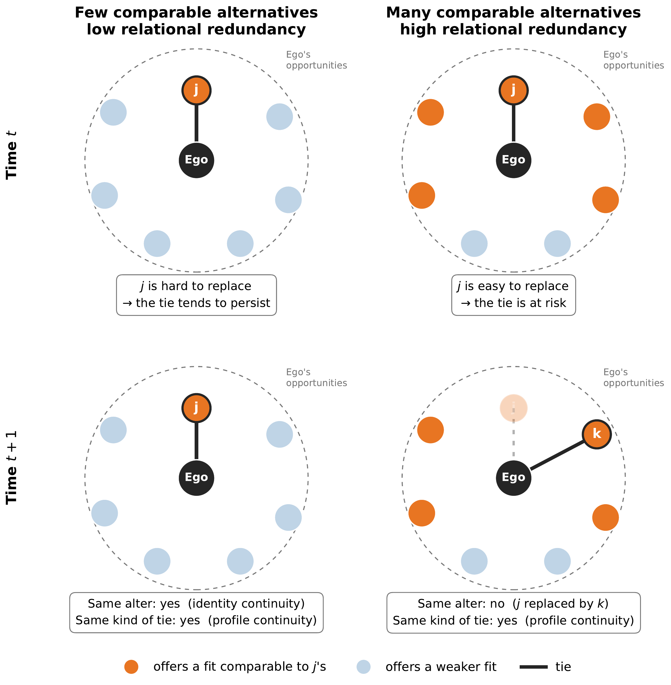
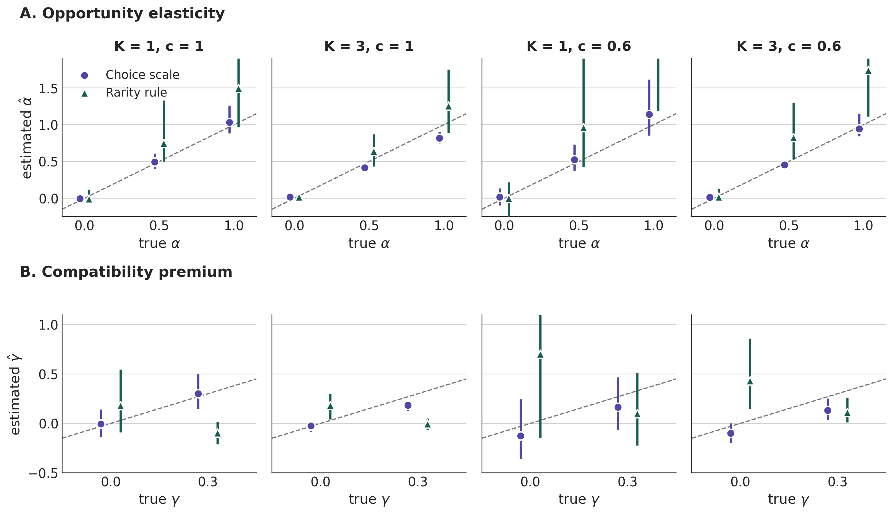
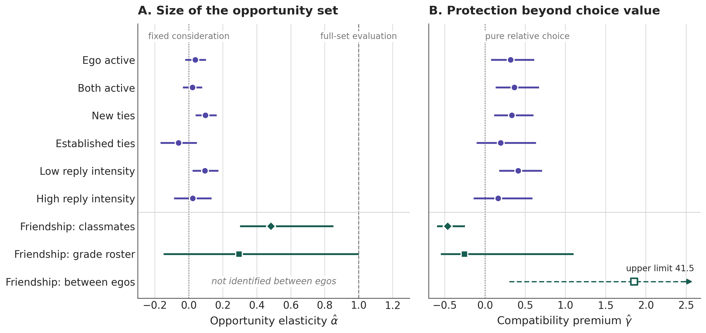
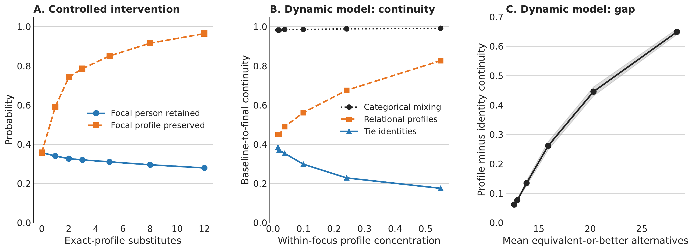

## Homophily Explains Which Ties Form {.smaller}

::: {style="font-size: 29px; margin: 3.1em auto 0; max-width: 1050px;"}
Similarity structures social relations, through **choice** and through
**structured opportunity**.

-   We know a great deal about which kinds of ties occur
-   We know much less about whether a compatible tie **stays attached to
    the same person**

::: {.takeaway style="margin-top: 1.8em;"}
Whether a tie survives depends not only on how well it fits, but on
**what else is available**.
:::

::: {style="font-size: 16px; margin-top: 0.8em; color:#777b87;"}
Feld 1981; McPherson, Smith-Lovin & Cook 2001; Zeng & Xie 2008; Kossinets &
Watts 2009
:::
:::

## Same Fit, Different Replaceability {.smaller}

::::::::: columns
::::: {.column width="52%"}
::: {style="font-size: 25px; margin-top: 1.55em;"}
-   Two ties in which ego and alter share **three characteristics**
-   In the first, few alternatives offer a comparable fit
-   In the second, twenty classmates reproduce it

::: {.takeaway style="margin-top: 1.35em;"}
**Homophily describes fit; relational redundancy describes how
reproducible that fit is.**
:::

::: {style="font-size: 17px; margin-top: 0.7em; color:#717583;"}
A dyadic analysis sees the same tie in both cases. The difference lies
in the opportunity set outside the dyad.
:::
:::
:::::

::::: {.column width="48%"}
::: {style="text-align:center; margin-top: 0.2em;"}
{style="height:560px; width:auto; max-width:100%; object-fit:contain; border-radius:4px;"}
:::
:::::
:::::::::

## Blau: Opportunity as Headcount or as Value? {.smaller}

::::::::: columns
::::: {.column width="50%"}
::: {style="font-size: 24px; margin-top: 1.9em; padding-right:1.1em;"}
**Two premises**

-   Associations are more prevalent between persons in **proximate**
    positions
-   Associations depend on **opportunities** for contact

::: {style="font-size: 15px; margin-top: 0.8em; color:#717583;"}
Blau 1977, *AJS* 83:26–54
:::
:::
:::::

::::: {.column width="50%"}
::: {style="font-size: 24px; margin-top: 1.9em; padding-left:1.3em; border-left:2px solid #d8dbe4;"}
**Two readings**

-   Read literally, the opportunity premise **counts people**
-   Read with proximity, it **weights them**: an alter threatens an
    incumbent to the extent that it approximates the incumbent's fit
:::
:::::
:::::::::

::: {.takeaway style="margin-top: 1.9em; font-size: 24px;"}
Does persistence depend on **how many** alternatives a person has, or
on **how good** they are?
:::

## Alternatives Matter — but How? {.smaller}

::: {style="font-size: 25px; margin: 1.4em auto 0; max-width: 1080px;"}
That alternatives destabilize relationships is not new.

-   **Dependence** is conditional on alternatives
-   Local supply of **spousal alternatives** raises divorce risk
-   **Actor-oriented network models** treat tie maintenance as a choice
    among alternatives
:::

::: {.takeaway style="margin-top: 1.5em; font-size:23px;"}
What is missing is a **tie-level estimand** that separates the number of
alternatives from their value, and a way to test which one matters.
:::

::: {style="font-size: 15px; margin-top: 0.7em; color:#717583; text-align:center;"}
Emerson 1962; Rusbult 1980; South & Lloyd 1995; Snijders 2001; Stadtfeld &
Block 2017
:::

## We Ask Three Questions {.smaller}

::::::::: columns
::::: {.column width="33%"}
::: {style="font-size: 24px; margin-top: 2.1em; padding-right:0.9em;"}
**1. Size**

Does the **number** of alternatives lower persistence once their value
is fixed?
:::
:::::

::::: {.column width="34%"}
::: {style="font-size: 24px; margin-top: 2.1em; padding:0 1em; border-left:2px solid #d8dbe4;"}
**2. Protection**

Does compatibility protect a tie **beyond** its value in choice?
:::
:::::

::::: {.column width="33%"}
::: {style="font-size: 24px; margin-top: 2.1em; padding-left:1em; border-left:2px solid #d8dbe4;"}
**3. Turnover**

When a tie ends, does the **departed alter** shape who replaces them?
:::
:::::
:::::::::

::: {.takeaway style="margin-top: 2em; font-size: 22px;"}
One persistence regression, written in the right variables, answers all
three.
:::

# I. Model {.center .middle background-color="#302a78"}

## Relational Redundancy {.smaller}

::: {style="font-size: 25px; text-align:center; margin-top: 0.9em; color:#302a78;"}
$$
C_{ij}
=
\underbrace{\log n_{ij}}_{\text{volume}}
+
\underbrace{\bar L_{ij}-U_{ij}}_{\text{competitive quality}}
$$
:::

::::::::: columns
::::: {.column width="50%"}
::: {style="font-size: 21px; margin-top: 0.6em; padding-right:1.3em;"}

$U_{ij}$<strong>Compatibility</strong> of ego and incumbent $\sum_q w_q M_{ijq}$ · multidimensional fit

$n_{ij}$<strong>Number</strong> of feasible alternatives opportunity as a headcount

$\bar L_{ij}$<strong>Mean value</strong> of alternatives $\log$ mean of $e^{U_{ik}}$ · value-weighted opportunity

:::
:::::

::::: {.column width="50%"}
::: {style="font-size: 22px; margin-top: 1.3em; padding-left:1.3em; border-left:2px solid #d8dbe4;"}
-   The log-sum of alternatives' utility relative to the incumbent
-   Splits **exactly** into the size of the opportunity set and its
    relational composition
-   Distant alters add almost nothing; proximate alters add most
:::
:::::
:::::::::

::: {.takeaway style="margin-top: 1.1em; font-size:22px;"}
The decomposition separates **how many** alternatives there are from
**how good** they are.
:::

::: {style="font-size: 14px; margin-top: 0.35em; color:#717583; text-align:center;"}
Inclusive value: McFadden 1978
:::

## One Logit, Three Parameters {.smaller}

::: {style="font-size: 25px; margin-top: 0.7em; text-align:center; color:#302a78;"}
$$
\operatorname{logit}\Pr(\text{tie persists})
\approx
\kappa\big[\rho+(1+\color{#175c50}{\gamma})\,U_{ij}
-\color{#b33a3a}{\alpha}\log n_{ij}-\bar L_{ij}\big]
$$
:::

::: {style="font-size: 21px; margin: 0.9em auto 0; max-width: 1000px;"}

$\alpha=\frac{b_{\log n}}{b_{\bar L}}$<strong>Opportunity elasticity.</strong> How competitive pressure scales with the number of alternatives. $\alpha=1$: every alter is weighed; $\alpha=0$: consideration does not grow with opportunity.

$\gamma=-\frac{b_U}{b_{\bar L}}-1$<strong>Compatibility premium.</strong> Protection beyond the value of compatibility in choice.

$\kappa=-b_{\bar L}$<strong>Exposure.</strong> How strongly ties respond to competition at all.

:::

::: {.takeaway style="margin-top: 0.9em; font-size:22px;"}
$\alpha$ and $\gamma$ are **ratios**: pooling protected and contested
ties leaves them unchanged.
:::

## The Classical Hypotheses Are Nested {.smaller}

::::::::: columns
::::: {.column width="33%"}
::: {style="font-size: 22px; margin-top: 1.6em; padding-right:0.9em; text-align:center;"}
::: {style="font-size: 36px; color:#b33a3a; margin-bottom:0.3em;"}
$\alpha=1$
:::

**Full-set evaluation**

::: {style="font-size:19px; margin-top:0.5em;"}
Every available alter competes with the incumbent.
The default of actor-oriented models.
:::

::: {style="font-size:17px; color:#717583; margin-top:0.6em;"}
$b_{\log n}=b_{\bar L}$
:::
:::
:::::

::::: {.column width="34%"}
::: {style="font-size: 22px; margin-top: 1.6em; padding:0 1em; border-left:2px solid #d8dbe4; text-align:center;"}
::: {style="font-size: 36px; color:#175c50; margin-bottom:0.3em;"}
$\alpha=0$
:::

**Bounded consideration**

::: {style="font-size:19px; margin-top:0.5em;"}
Only the value of alternatives matters, not their number.
:::

::: {style="font-size:17px; color:#717583; margin-top:0.6em;"}
$b_{\log n}=0$
:::
:::
:::::

::::: {.column width="33%"}
::: {style="font-size: 22px; margin-top: 1.6em; padding-left:1em; border-left:2px solid #d8dbe4; text-align:center;"}
::: {style="font-size: 36px; color:#302a78; margin-bottom:0.3em;"}
$\gamma=0$
:::

**Pure relative choice**

::: {style="font-size:19px; margin-top:0.5em;"}
Compatibility protects a tie only through its value in choice.
:::

::: {style="font-size:17px; color:#717583; margin-top:0.6em;"}
$b_U=-b_{\bar L}$
:::
:::
:::::
:::::::::

::: {.takeaway style="margin-top: 1.6em; font-size:22px;"}
Each hypothesis is **one linear restriction**; confidence sets follow by
test inversion.
:::

::: {style="font-size: 14px; margin-top: 0.35em; color:#717583; text-align:center;"}
Consideration sets: Manski 1977; Abaluck & Adams-Prassl 2021. Number of
alternatives in the logit: Ackerberg & Rysman 2005. Test inversion: Fieller 1954.
:::

## The Parameters Are Not Scale-Free {.smaller}

::::::::: columns
::::: {.column width="55%"}
::: {style="font-size: 24px; margin-top: 1.5em;"}
-   $\bar L$ is a log-sum: $\bar L(cU)\neq c\,\bar L(U)$
-   Rescaling compatibility changes which alternatives dominate
-   A rule-based score (e.g., rarity weights) mixes the parameters with
    the rule's scale
:::
:::::

::::: {.column width="45%"}
::: {style="font-size: 23px; margin-top: 1.5em; padding-left:1.3em; border-left:2px solid #d8dbe4;"}
**Calibrate from partner choice**

Conditional logit of observed nominations on match indicators, one
stratum per ego.

::: {style="font-size:18px; color:#717583; margin-top:0.7em;"}
Weights cross-fitted: each school's weights come from the other schools.
:::
:::
:::::
:::::::::

::: {.takeaway style="margin-top: 1.8em; font-size:23px;"}
Tests of mechanisms that operate through alternatives are **tests of a
utility scale** as much as of a mechanism.
:::

## After an Exit: Memoryless Entry {.smaller}

::: {style="font-size: 25px; margin-top: 1.1em; text-align:center; color:#302a78;"}
Under relative choice, the entrant is drawn with probability
$\propto e^{U_{ik}}$
:::

::::::::: columns
::::: {.column width="50%"}
::: {style="font-size: 22px; margin-top: 1.1em; padding-right:1.3em;"}
**What the model implies**

-   Who enters does not depend on **who left**
-   Same-profile alternatives do not compete harder, given $\bar L$
:::
:::::

::::: {.column width="50%"}
::: {style="font-size: 22px; margin-top: 1.1em; padding-left:1.3em; border-left:2px solid #d8dbe4;"}
**What would break it**

-   **Durable taste:** ego recruits the kinds of alters it already has
-   **Positional demand:** a vacated position attracts a similar
    entrant
:::
:::::
:::::::::

::: {.takeaway style="margin-top: 1.6em; font-size:22px;"}
Profiles can persist because positions are **sought** — or because the
ecology keeps **supplying** them.
:::

::: {style="font-size: 14px; margin-top: 0.35em; color:#717583; text-align:center;"}
Vacancy chains: White 1970. Turnover with stable composition: Wellman et
al. 1997.
:::

# II. Data and Research Design {.center .middle background-color="#302a78"}

## Two Settings with Observed Opportunity Sets

::::::::: columns
::::: {.column width="50%"}
::: {style="font-size: 23px; margin-top: 1.4em; padding-right:1.2em;"}
**Online discussion (DerStandard)**

-   A decade of threaded replies, **37** three-month windows
-   **914,198** incumbent tie-periods
-   Compatibility: topical similarity
-   Opportunity set: prior co-presence in threads
-   **Ego fixed effects**: opportunity varies within ego
:::
:::::

::::: {.column width="50%"}
::: {style="font-size: 23px; margin-top: 1.4em; padding-left:1.3em; border-left:2px solid #d8dbe4;"}
**School friendship (FIS)**

-   **2,928** pupils, **10** schools, **29** grade-cohorts, six waves
-   **34,126** incumbent tie-periods
-   Compatibility: sex, origin, generation, religiosity, lifestyle
-   Opportunity set: grade roster; every nomination falls inside it
-   Classes change within pupils between waves
:::
:::::
:::::::::

::: {style="font-size: 14px; margin-top: 1em; color:#717583; text-align:center;"}
Fraxanet et al. 2026; Leszczensky et al. 2022
:::

## From Observed Rosters to Parameters {.smaller}

::::::::: columns
::::: {.column width="25%"}
::: {style="font-size: 20px; margin-top: 1.25em; padding-right:0.8em;"}
::: {style="font-size: 21px; color:#302a78; margin-bottom:0.6em;"}
01 
**Opportunity set**
:::

-   Pretreatment $\mathcal O_i$
-   Every tie must fall inside it
:::
:::::

::::: {.column width="25%"}
::: {style="font-size: 20px; margin-top: 1.25em; padding:0 0.9em; border-left:2px solid #d8dbe4;"}
::: {style="font-size: 21px; color:#302a78; margin-bottom:0.6em;"}
02 
**Choice scale**
:::

-   Partner-choice conditional logit
-   Cross-fitted weights
:::
:::::

::::: {.column width="25%"}
::: {style="font-size: 20px; margin-top: 1.25em; padding:0 0.9em; border-left:2px solid #d8dbe4;"}
::: {style="font-size: 21px; color:#302a78; margin-bottom:0.6em;"}
03 
**Decomposition**
:::

-   $U_{ij}$, $\bar L_{ij}$, $\log n_{ij}$
-   All on the choice scale
:::
:::::

::::: {.column width="25%"}
::: {style="font-size: 20px; margin-top: 1.25em; padding-left:0.9em; border-left:2px solid #d8dbe4;"}
::: {style="font-size: 21px; color:#302a78; margin-bottom:0.6em;"}
04 
**One logit**
:::

-   $\hat\kappa$, $\hat\alpha$, $\hat\gamma$ by ratios
-   Test inversion; few-cluster wild bootstrap
:::
:::::
:::::::::

::: {.takeaway style="margin-top: 1.6em; font-size:22px;"}
The same compatibility scale feeds the persistence logit and the
turnover diagnostics.
:::

::: {style="font-size: 14px; margin-top: 0.45em; color:#717583; text-align:center;"}
Wild restricted score bootstrap: Kline & Santos 2012
:::

## The Estimators Recover the Truth — on the Right Scale {.smaller}

::: {style="text-align:center; margin-top:0.1em;"}
{style="height:470px; width:auto;"}
:::

::: {.takeaway style="margin-top:0.15em; font-size:20px;"}
On the choice scale, $\alpha$ is recovered and $\gamma$ is conservative.
On a rarity rule, $\alpha$ is inflated and a premium appears **where
none exists**.
:::

# III. Findings {.center .middle background-color="#302a78"}

## Online: Quality, Not Number {.smaller}

::::::::: columns
::::: {.column width="33%"}
::: {style="text-align:center; margin-top: 2.2em;"}

Opportunity elasticity

.04

95% CI −.02 to .10

:::
:::::

::::: {.column width="34%"}
::: {style="text-align:center; margin-top: 2.2em; border-left:2px solid #d8dbe4; border-right:2px solid #d8dbe4;"}

New ties

.10

95% CI .04 to .16

:::
:::::

::::: {.column width="33%"}
::: {style="text-align:center; margin-top: 2.2em;"}

Compatibility premium

.32

95% CI .07 to .61

:::
:::::
:::::::::

::: {style="font-size: 22px; margin: 1.4em auto 0; max-width: 1050px;"}
-   Full-set evaluation ($\alpha=1$) is rejected decisively, in both halves
    of the decade (.09 and .00)
-   Established ties are less exposed ($\hat\kappa$ .92 → .76) and carry no
    detectable premium
:::

::: {.takeaway style="margin-top: 1.1em; font-size:22px;"}
Persistence responds to **how good** the alternatives are, not to how
many there are.
:::

## Friendship: The Classroom Is the Consideration Set {.smaller}

::::::::: columns
::::: {.column width="48%"}
::: {style="font-size: 23px; margin-top: 1.1em;"}
Pupils may nominate anyone in their grade, yet **81%** of incumbent
friends are classmates.

Within pupils, with separate value and size for each tier:
:::

::: {style="font-size: 21px; margin-top: 0.7em;"}

$-1.10$<strong>Classmates</strong> compete $b_{\bar L}$, $p<.001$

$+.22$<strong>Other grade-mates</strong> do not $b_{\bar L}$, $p=.17$

:::
:::::

::::: {.column width="52%"}
::: {style="text-align:center; margin-top: 1.2em; padding-left:1.2em; border-left:2px solid #d8dbe4;"}

Within-class opportunity elasticity

.48

95% set .30 to .85 (grade-cohort clusters)

::: {style="font-size: 20px; margin-top: 1em; text-align:left;"}
-   Consideration that ignores class size is rejected ($p<.001$)
-   Full evaluation of the class: $p=.024$ by cohort, $p=.076$ by school
:::
:::
:::::
:::::::::

::: {.takeaway style="margin-top: 1em; font-size:22px;"}
Alternatives threaten a friendship when they are **in the setting ego
actually weighs** — and there, value counts twice as much as number.
:::

## Parameters Across Settings {.smaller}

::: {style="text-align:center; margin-top:0.15em;"}
{style="height:500px; width:auto;"}
:::

::: {.takeaway style="margin-top:0.15em; font-size:20px;"}
In both settings, the opportunity that bears on persistence is a
**bounded setting weighted by value**, not a headcount.
:::

## The Friendship Premium Was Who Pupils Are {.smaller}

::::::::: columns
::::: {.column width="50%"}
::: {style="text-align:center; margin-top: 2em; padding-right:1.2em;"}

Between pupils

1.85

95% set .30 to 41.5

::: {style="font-size: 21px; margin-top: 1em;"}
Compatibility appears to protect friendships almost three times more
than choice implies.
:::
:::
:::::

::::: {.column width="50%"}
::: {style="text-align:center; margin-top: 2em; padding-left:1.2em; border-left:2px solid #d8dbe4;"}

Within pupils

−.26

95% set −.55 to 1.10

::: {style="font-size: 21px; margin-top: 1em;"}
With ego fixed effects the premium disappears.
:::
:::
:::::
:::::::::

::: {.takeaway style="margin-top: 1.8em; font-size:22px;"}
Pupils whose friends are more compatible keep friends longer **for
stable reasons of their own**. A premium must be estimated within actors.
:::

## Rule Scales Manufacture Mechanisms {.smaller}

::: {style="font-size: 17px; margin-top: 1.2em;"}

| Apparent finding on a rarity-weighted scale | After calibrating to partner choice |
|:--|:--|
| Pure relative choice holds among weakly embedded ties | Not supported |
| Reciprocity insulates ties from competition | Not supported |
| Entrants resemble the departed alter (vacancy filling) | Vanishes |
| Alternative value lowers persistence within pupils | Detected **only** on the choice scale |

:::

::::::::: columns
::::: {.column width="50%"}
::: {style="font-size: 21px; margin-top: 1.1em; padding-right:1.2em;"}
**What pupils act on**

Sex 1.75 · origin .47 · religiosity .19 · lifestyle .20 · generation .09
:::
:::::

::::: {.column width="50%"}
::: {style="font-size: 21px; margin-top: 1.1em; padding-left:1.2em; border-left:2px solid #d8dbe4;"}
**What the rarity rule assumes**

Every shared category weighted by its local scarcity; utility dispersion
overstated about **threefold**
:::
:::::
:::::::::

::: {.takeaway style="margin-top: 1.2em; font-size:22px;"}
Calibrate compatibility **before** testing anything about alternatives.
:::

## Who Replaces a Departed Friend? {.smaller}

::::::::: columns
::::: {.column width="56%"}
::: {style="font-size: 17px; margin-top: 0.9em;"}
**Distance to the departed alter in entrant choice**

| Specification | Rule weights | Estimated weights |
|:--|--:|--:|
| Non-incumbent risk set | −.261 | −.066 |
| \+ ego's portfolio taste | −.127 | −.036 |
| \+ network inheritance and foci | −.089 | **−.009** |

::: {style="font-size: 15px; color:#717583; margin-top:0.4em;"}
Estimated weights, full model: bootstrap 95% interval [−.058, .061];
11,784 exits, 878,087 candidates.
:::
:::
:::::

::::: {.column width="44%"}
::: {style="font-size: 21px; margin-top: 1.2em; padding-left:1.2em; border-left:2px solid #d8dbe4;"}
**What predicts entry**

-   Compatibility with ego
-   Ego's durable taste (portfolio share .158)
-   Ties to the departed alter and to ego's other friends
-   Sharing ego's classroom
:::
:::::
:::::::::

::: {.takeaway style="margin-top: 1.1em; font-size:22px;"}
With these profiles and controls, **who left adds no detectable
information** about who enters.
:::

## Profiles Persist Because the Ecology Supplies Them {.smaller}

::: {style="text-align:center; margin-top:0.1em;"}
{style="height:330px; width:auto;"}
:::

::::::::: columns
::::: {.column width="50%"}
::: {style="font-size: 20px; margin-top: 0.4em; padding-right:1.2em;"}
**Simulation.** More exact-profile substitutes: the focal person is
retained less (.36 → .28) while the profile is preserved more
(.36 → .97).
:::
:::::

::::: {.column width="50%"}
::: {style="font-size: 20px; margin-top: 0.4em; padding-left:1.2em; border-left:2px solid #d8dbe4;"}
**Friendship.** Identity continuity .563, profile continuity .618 —
**below** its compositional baseline (.628).
:::
:::::
:::::::::

::: {.takeaway style="margin-top: 0.6em; font-size:21px;"}
Stable relational patterns need not be composed of stable relationships.
:::

# IV. Discussion {.center .middle background-color="#302a78"}

## Takeaways {.smaller}

::: {style="font-size:25px; margin-top:1.6em;"}
-   **Size.** Where it can be estimated precisely, the number of
    alternatives adds little once their value is fixed.

-   **Setting.** In friendship, only classmates compete; within the
    class, number matters about half as much as value.

-   **Protection.** Compatibility protects discussion ties a third more
    than choice implies; in friendship the apparent premium is ego
    heterogeneity.

-   **Turnover.** Profile continuity arises from ecological supply,
    without a detectable preference for replacing the previous occupant.
:::

::: {.takeaway style="margin-top:1.15em; font-size:22px;"}
**Relational opportunity:** an opportunity structure bears on tie
persistence through how closely its alternatives approximate the
incumbent's value, not through how many alternatives it contains.
:::

## Implications {.smaller}

::: {style="font-size: 26px; margin-top: 2.4em;"}
-   **For Blau's opportunity premise:** for a particular tie, an
    opportunity is not another available person; its weight is its value
    relative to the incumbent

-   **For actor-oriented models:** the default treats every actor as an
    alternative ($\alpha=1$); the persistence logit is a **diagnostic** of
    that assumption before fitting large or multi-group networks

-   **For measurement:** compatibility scores must be put on the choice
    scale; rule-based scores produce spurious mechanisms
:::

::: {style="font-size: 14px; margin-top: 1.4em; color:#717583; text-align:center;"}
Settings in RSiena: Ripley et al. 2024. SAOMs as random-utility models:
Pink, Kretschmer & Leszczensky 2020.
:::

## Limitations {.smaller}

::: {style="font-size: 25px; margin-top: 3em;"}
-   **Observational design:** ego fixed effects remove stable, not
    time-varying, heterogeneity

-   **Asymmetric precision:** online estimates are precise; the classroom
    estimate excludes full evaluation by cohort but not by school

-   **Interpretation:** $\alpha$ is an elasticity of competitive pressure,
    not a count of the people an actor considers; $\gamma$ assumes a
    shared error scale for choice and maintenance
:::

# Thank You {.center .middle background-color="#302a78"}

**Roberto Cantillan**

Department of Sociology, PUC Chile

rcantillan\@uc.cl

# Backup Slides {.center .middle background-color="#302a78"}

## B1: Proposition — Three Parameters {.smaller}

::: {style="font-size: 21px; margin-top: 1.2em;"}
One slot; Type-I extreme-value errors; consideration set of size
$m_{ij}=\mu n_{ij}^{\alpha}$ drawn uniformly; incumbency premium
$\rho_{ij}=\rho_0+\gamma U_{ij}$; incumbent re-contested with probability $c$.

$$
\Pr(\text{persist})=(1-c)+c\,\Lambda\big(\rho_0-\log\mu+(1+\gamma)U_{ij}-\alpha\log n_{ij}-\bar L_{ij}\big)
$$

Local slopes of the logit:

$$
b_U=\kappa(1+\gamma),\qquad b_{\bar L}=-\kappa,\qquad b_{\log n}=-\kappa\alpha,
\qquad \kappa=\frac{\Lambda}{1-c+c\Lambda}\in(0,1]
$$

-   Uses $\mathbb E\big[\log\sum_{k\in S}e^{U_{ik}}\big]\approx\log m_{ij}+\bar L_{ij}$
-   Ratios are exact pointwise; with several slots $\hat\kappa$ can exceed
    one (1.16–1.33 in simulations)
-   Uniform consideration is one mechanism; other exposure or search
    processes give the same reduced form
:::

## B2: Online Discussion — Full Estimates {.smaller}

::: {style="font-size: 16px; margin-top: 1em;"}

| Sample | $b_U$ | $b_{\bar L}$ | $b_{\log n}$ | $\hat\kappa$ | $\hat\alpha$ [95% CI] | $\hat\gamma$ [95% CI] | $n$ |
|:--|--:|--:|--:|--:|--:|--:|--:|
| Ego active | 1.138 | −.865 | −.033 | .86 | .04 [−.02, .10] | .32 [.07, .61] | 914,198 |
| Both active | 1.214 | −.889 | −.018 | .89 | .02 [−.04, .08] | .37 [.13, .67] | 889,653 |
| New ties | 1.225 | −.919 | −.090 | .92 | .10 [.04, .16] | .33 [.11, .60] | 571,956 |
| Established ties | .901 | −.755 | .046 | .76 | −.06 [−.17, .05] | .19 [−.11, .63] | 331,648 |
| Low reply intensity | 1.290 | −.914 | −.086 | .91 | .09 [.02, .17] | .41 [.18, .71] | 484,864 |
| High reply intensity | .922 | −.793 | −.018 | .79 | .02 [−.09, .13] | .16 [−.15, .59] | 414,650 |

:::

::: {style="font-size: 18px; margin-top: 1em; text-align:center;"}
Ego and window fixed effects; SEs clustered by ego and window; utility
scale from partner choice ($\hat\lambda=1.352$); Fieller intervals.
:::

## B3: School Friendship — Full Estimates {.smaller}

::: {style="font-size: 16px; margin-top: 1em;"}

| Design | Scale | $b_U$ | $b_{\bar L}$ [$p$] | $\hat\kappa$ | $\hat\alpha$ [95% set] | $\hat\gamma$ [95% set] |
|:--|:--|--:|--:|--:|--:|--:|
| Between egos | Rule | .141 | −.072 [.016] | .07 | n.i. | .97 [−.05, 5.5] |
| Between egos | Calibrated rule | .437 | −.592 [.121] | .59 | n.i. | −.26 [−.65, 59] |
| Between egos | Estimated weights | .562 | −.197 [.033] | .20 | n.i. | 1.85 [.30, 41.5] |
| Within ego | Estimated weights | .606 | −.815 [.004] | .82 | .29 [−.15, 1.00] | −.26 [−.55, 1.10] |
| Within ego, classmates | Estimated weights | .589 | −1.103 [<.001] | 1.10 | .48 [.30, .85] | −.47 [−.60, −.25] |
| Within ego, other grade-mates | Estimated weights | | .224 [.17] | — | — | — |

:::

::: {style="font-size: 18px; margin-top: 1em; text-align:center;"}
Wild restricted score bootstrap (10 schools, all $2^{10}$ patterns; or
29 grade-cohorts, 9,999 draws). n.i. = not identified between egos.
:::

## B4: Diagnostic Signatures of Turnover Mechanisms {.smaller}

::: {style="font-size: 18px; margin-top: 1.4em;"}

| Diagnostic | Relative choice | + Durable taste | + Positional demand |
|:--|:-:|:-:|:-:|
| Same-profile alternatives, given $\bar L$ | 0 | < 0 | < 0 |
| Portfolio taste in entrant choice | 0 | > 0 | ≤ 0 |
| Distance to departed alter, net of taste | 0 | small, sign-unstable | < 0 |
| Distance to departed alter, taste omitted | 0 | < 0 | < 0 |

:::

::: {.takeaway style="margin-top: 1.4em; font-size:21px;"}
A negative similarity-to-departed coefficient cannot by itself be read
as vacancy filling.
:::

::: {style="font-size: 16px; margin-top: 0.8em; text-align:center; color:#717583;"}
Signatures established by known-truth simulations (1,500 egos, eight
replications per regime and ecology).
:::

## References {.smaller}

::: {style="font-size: 14px; margin-top: 0.8em; line-height:1.2;"}

-   **Abaluck, J., & Adams-Prassl, A. (2021).** “What Do Consumers
    Consider before They Choose?” *Quarterly Journal of Economics*
    136(3):1611–1663.

-   **Ackerberg, D. A., & Rysman, M. (2005).** “Unobserved Product
    Differentiation in Discrete-Choice Models.” *RAND Journal of
    Economics* 36(4):771–788.

-   **Blau, P. M. (1977).** “A Macrosociological Theory of Social
    Structure.” *American Journal of Sociology* 83(1):26–54.
    doi:10.1086/226505.

-   **Emerson, R. M. (1962).** “Power-Dependence Relations.” *American
    Sociological Review* 27(1):31–41.

-   **Feld, S. L. (1981).** “The Focused Organization of Social Ties.”
    *American Journal of Sociology* 86(5):1015–1035.

-   **Fieller, E. C. (1954).** “Some Problems in Interval Estimation.”
    *Journal of the Royal Statistical Society B* 16(2):175–185.

-   **Fraxanet, E., Gómez, V., Kaltenbrunner, A., & Pellert, M. (2026).**
    “A Decade of News Forum Interactions.” *Scientific Data* 13:1193.

-   **Kline, P., & Santos, A. (2012).** “A Score Based Approach to Wild
    Bootstrap Inference.” *Journal of Econometric Methods* 1(1):23–41.

-   **Kossinets, G., & Watts, D. J. (2009).** “Origins of Homophily in an
    Evolving Social Network.” *American Journal of Sociology*
    115(2):405–450.

-   **Leszczensky, L., Pink, S., Kretschmer, D., & Kalter, F. (2022).**
    “Studying Youth' Group Identities, Intergroup Relations, and
    Friendship Networks.” *European Sociological Review* 38(3):493–506.

-   **Manski, C. F. (1977).** “The Structure of Random Utility Models.”
    *Theory and Decision* 8(3):229–254.
:::

## References (cont.) {.smaller}

::: {style="font-size: 14px; margin-top: 0.8em; line-height:1.2;"}

-   **McFadden, D. (1978).** “Modelling the Choice of Residential
    Location.” In *Spatial Interaction Theory and Planning Models*,
    75–96. Amsterdam: North-Holland.

-   **McPherson, M., Smith-Lovin, L., & Cook, J. M. (2001).** “Birds of a
    Feather: Homophily in Social Networks.” *Annual Review of Sociology*
    27:415–444.

-   **Pink, S., Kretschmer, D., & Leszczensky, L. (2020).** “Choice
    Modelling in Social Networks Using Stochastic Actor-Oriented Models.”
    *Journal of Choice Modelling* 34.

-   **Ripley, R. M., Snijders, T. A. B., Boda, Z., Vörös, A., & Preciado,
    P. (2024).** *Manual for RSiena.* University of Oxford.

-   **Rusbult, C. E. (1980).** “Commitment and Satisfaction in Romantic
    Associations.” *Journal of Experimental Social Psychology*
    16(2):172–186.

-   **Snijders, T. A. B. (2001).** “The Statistical Evaluation of Social
    Network Dynamics.” *Sociological Methodology* 31:361–395.

-   **South, S. J., & Lloyd, K. M. (1995).** “Spousal Alternatives and
    Marital Dissolution.” *American Sociological Review* 60(1):21–35.

-   **Stadtfeld, C., & Block, P. (2017).** “Interactions, Actors, and
    Time: Dynamic Network Actor Models for Relational Events.”
    *Sociological Science* 4:318–352.

-   **Wellman, B., Wong, R. Y., Tindall, D., & Nazer, N. (1997).** “A
    Decade of Network Change.” *Social Networks* 19(1):27–50.

-   **White, H. C. (1970).** *Chains of Opportunity.* Cambridge, MA:
    Harvard University Press.

-   **Zeng, Z., & Xie, Y. (2008).** “A Preference–Opportunity–Choice
    Framework with Applications to Intergroup Friendship.” *American
    Journal of Sociology* 114(3):615–648.
:::
