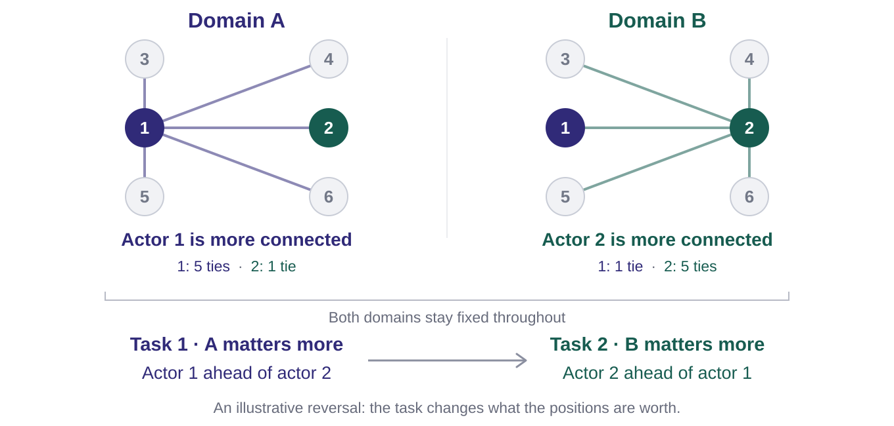
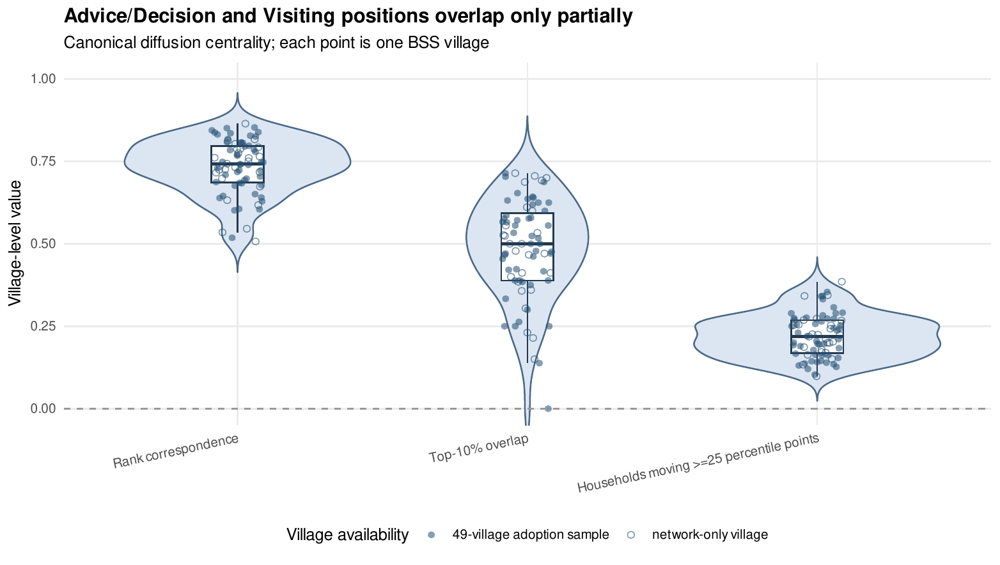
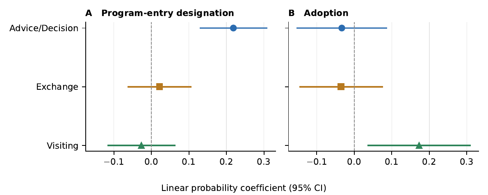
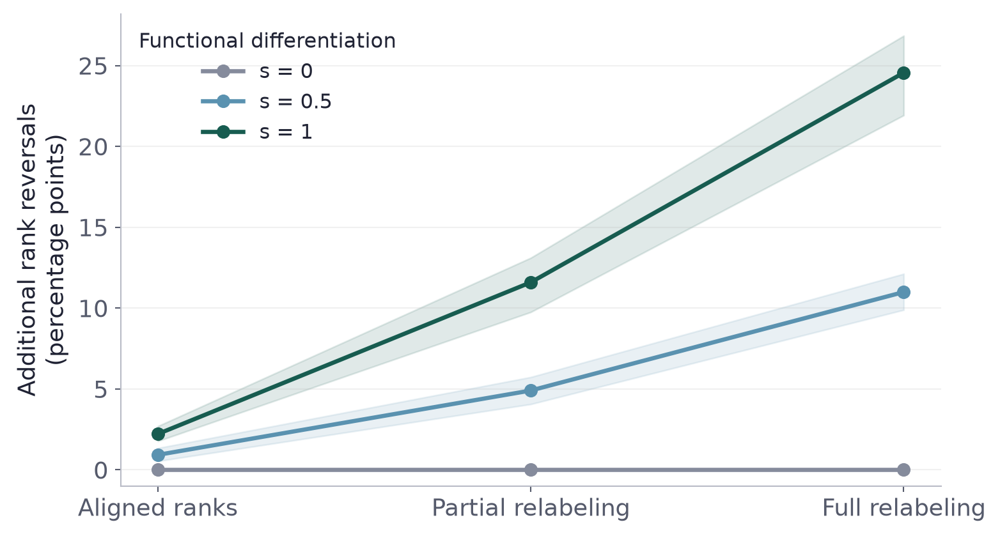
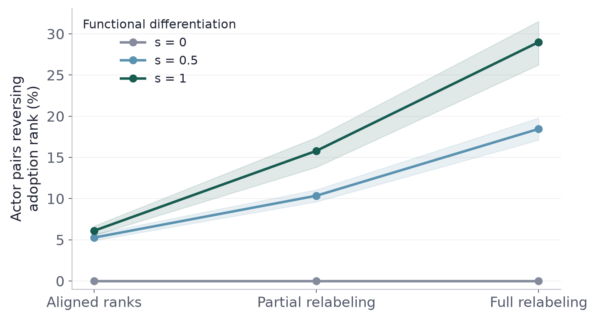
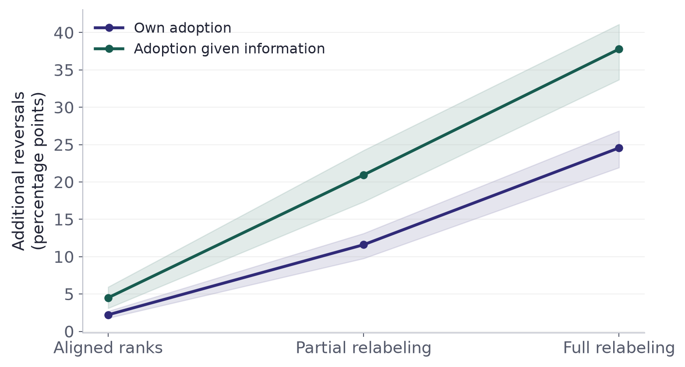
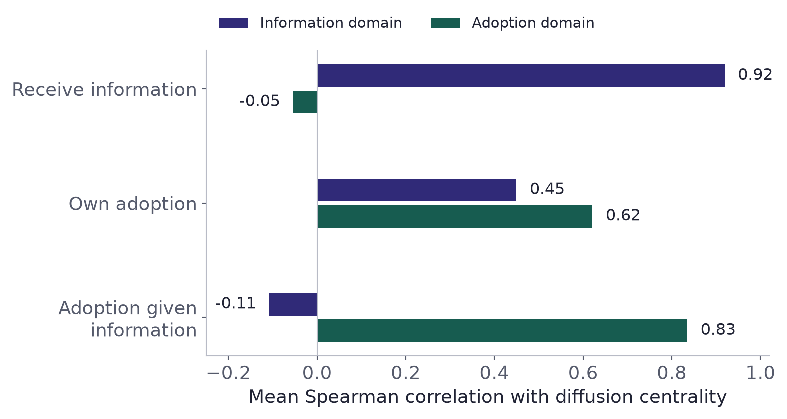
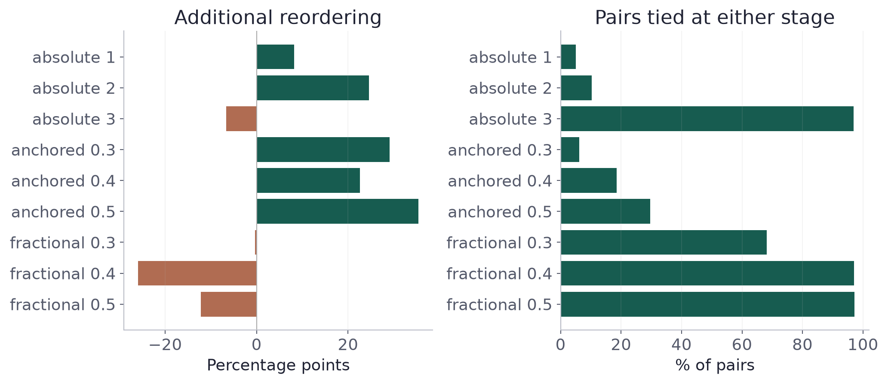

## Who is selected—and who adopts? {#s1 }

:::::::::::::::: {.slide-body}

::::::::::::::: {.eyebrow}

The question

:::::::::::::::

::::::::::::::: {.split .opening}

:::::::::::::: {.col}

<h3>Entry</h3>
An organization selects households as **entry points**.

::::::::::::::

:::::::::::::: {.col .green}

<h3>Adoption</h3>
Households decide whether to **commit** to a costly practice.

::::::::::::::

:::::::::::::::

::::::::::::::: {.takeaway}

Does the relational advantage that helps at entry carry into adoption?

:::::::::::::::

::::::::::::::: {.src}

Katz & Lazarsfeld 1955 · Banerjee et al. 2013, 2019 · Beaman et al. 2021

:::::::::::::::

::::::::::::::::

:::::::::::::::: {.notes}

El trabajo parte de dos resultados distintos: una organización selecciona hogares para entrar a una comunidad y, después, los hogares deciden si adoptan. La pregunta es si las posiciones asociadas con ser seleccionado conservan su relevancia al adoptar. Esto permite estudiar continuidad de ventaja sin asignar de antemano una función a cada relación.

::::::::::::::::

## An opening matters through what follows {#s2  .process-slide}

:::::::::::::::: {.slide-body}

::::::::::::::: {.eyebrow}

Diffusion as a sequence of accomplishments

:::::::::::::::

::::::::::::::: {.process-thesis}

An event acquires consequences through its connections to subsequent action.

:::::::::::::::

::::::::::::::: {.triple .process-steps}

:::::::::::::: {.col}

<h3>Entry</h3>
An opportunity arrives.

::::::::::::::

:::::::::::::: {.col}

<h3>Information</h3>
People become aware.

::::::::::::::

:::::::::::::: {.col .green}

<h3>Adoption</h3>
People decide to commit.

::::::::::::::

:::::::::::::::

::::::::::::::: {.takeaway}

What connects one accomplishment to the next need not be the same relation.

:::::::::::::::

::::::::::::::: {.src}

Conceptual adaptation of Rule, Sabetta & Bearman (2026), “Pathways and Chance,” Sociologica, §4.

:::::::::::::::

::::::::::::::::

:::::::::::::::: {.notes}

Una idea de Rule, Sabetta y Bearman ayuda a formular el problema: una apertura adquiere consecuencias a través de lo que sucede después. Llevada a este caso, nos invita a seguir las conexiones entre entrada, información y adopción. El interés está en cómo se sostiene el proceso cuando lo que debe lograrse empieza a cambiar.

::::::::::::::::

## Fixed networks. Successive tasks. {#s3 .illustration-slide .process-summary-slide}

:::::::::::::::: {.slide-body}

{.process-summary-figure}

::::::::::::::: {.src}

Conceptual illustration, not a simulation result. Both domains coexist; only task relevance changes.

:::::::::::::::

::::::::::::::::

:::::::::::::::: {.notes}

Esta figura reúne el proceso que buscamos explicar. Arriba están las dos redes: los actores conservan su identidad y ubicación entre paneles, y mantienen sus vínculos en A y en B durante toda la secuencia. El actor uno está mejor situado en A; el dos, en B. Las diferencias entre dominios existen antes de que cambie la tarea.

Abajo seguimos las tareas. La primera da más relevancia a A y favorece al actor uno; la siguiente se desplaza hacia B y puede favorecer al dos. La figura representa una inversión posible, no un resultado que deba ocurrir siempre. La formalización precisará cuánto debe cambiar la demanda para superar la ventaja inicial. En el modelo de comportamiento veremos cómo esa idea puede operar mediante contactos, acceso a información y refuerzo para adoptar.

::::::::::::::::

## Relational advantage across tasks {#section-01 .section-divider background-color="#302a78" background-transition="none"}

01

The concept, its antecedents, and the conditions for reordering.

:::::::::::::::: {.notes}

Voy a precisar esta intuición: qué significa que una ventaja sea portable y qué condiciones permiten que deje de serlo.

::::::::::::::::

## Portability is continuity of relational advantage {#s4 .prose-slide}

:::::::::::::::: {.slide-body}

::::::::::::::: {.eyebrow}

The concept

:::::::::::::::

An advantage is **portable** when the position that helps an actor at one task remains advantageous at the next.

A **relation** is a domain of ties, such as advice or visiting.

A **task** is an accomplishment needed for the process to advance. Organizations can perform selection; households can receive information or adopt.

::::::::::::::: {.takeaway}

We compare successive tasks within a process, with the actors’ positions held fixed.

:::::::::::::::

::::::::::::::::

:::::::::::::::: {.notes}

La portabilidad es continuidad de ventaja relativa entre tareas. La tarea puede corresponder a una organización o a un hogar. En la entrada, la organización selecciona: para el hogar, el resultado relevante es ser designado. En adopción, decide el propio hogar. El actor focal no tiene que ejecutar personalmente todas las tareas; seguimos su posición y el resultado que le corresponde en cada una.

::::::::::::::::

## The premises we inherit—and the question we add {#origins-hansen .prose-slide}

:::::::::::::::: {.slide-body}

**Tasks can require different resources.** Learning, gaining access and committing need not draw on the same relations.

**Different networks can work together.** Their overlap and interaction shape diffusion; combining them can hide important differences.

**Network advantage depends on the task.** Hansen and colleagues show that a network beneficial for one task can hinder another.

::::::::::::::: {.takeaway}

We make continuity of relative advantage across successive tasks the object of explanation.

:::::::::::::::

::::::::::::::: {.src}

Coleman 1988 · Gould 1991 · Hansen et al. 2001 · Becker et al. 2020 · Chandrasekhar et al. 2026 · Distinctions: A1.

:::::::::::::::

::::::::::::::::

:::::::::::::::: {.notes}

El punto de partida es conocido: distintas tareas pueden necesitar recursos diferentes, y distintas relaciones pueden actuar juntas. Gould muestra cómo las redes organizacionales y de vecindad sostienen conjuntamente la movilización. Becker y sus colegas conectan influencia personal y difusión por rutas comerciales. Chandrasekhar y sus colegas estudian cómo compartir contactos entre capas modifica la difusión. Hansen es el antecedente más cercano: una configuración ventajosa para una tarea puede perjudicar otra.

La pregunta que organizo aquí es qué ocurre con los mismos actores al pasar a la siguiente tarea: cuándo conservan su ventaja relativa y cuándo cambian de lugar. Dentro del modelo aditivo, cambiar la tarea puede invertir el orden si desplaza suficientemente el peso hacia dominios que favorecen a actores diferentes. A1 distingue compartir contactos, ocupar posiciones semejantes y conservar ventaja. También reconoce los antecedentes sobre secuencias y cambio de canal.

::::::::::::::::

## Advantage depends on what the task values {#s5 .prose-slide}

:::::::::::::::: {.slide-body}

::::::::::::::: {.eyebrow}

Theory · A minimal formalization

:::::::::::::::

For a task, add **position × relevance** across domains. The positions stay fixed; their relevance can change.

$$R_{ir}=\sum_l\omega_{lr}x_{il}.$$

$x_{il}$: actor $i$’s position in domain $l$. $\omega_{lr}$: how much task $r$ values that domain’s capacities.

$R_{ir}$ is a **theoretical score**. This minimal model adds fixed, comparable positions with nonnegative weights.

::::::::::::::: {.takeaway}

Hold the positions fixed. Change what the task values.

:::::::::::::::

::::::::::::::::

:::::::::::::::: {.notes}

La ecuación recoge esa idea de la manera más simple. x indica dónde está situado el actor en cada dominio; omega indica cuánto cuenta ese dominio para la tarea. Multiplicamos cada posición por su peso y sumamos. Los índices sólo ubican la comparación: i identifica al actor, l al dominio y r a la tarea.

R es el valor de ese perfil para una tarea. Al pasar a otra, conservamos las posiciones y cambiamos los pesos. Es una representación aditiva, con posiciones comparables y pesos no negativos. Más adelante veremos cómo esta intuición se lleva a un proceso de comportamiento; aquí todavía hablamos de un puntaje teórico.

::::::::::::::::

## Fixed positions; a different ordering {#formal-example .prose-slide}

:::::::::::::::: {.slide-body}

::::::::::::::: {.eyebrow}

Theory · A minimal formalization

:::::::::::::::

Actor 1 leads in A; actor 2 leads in B. Fixed positions can preserve or reverse the ordering, depending on the weight shift.

| Actor | Position A | Position B | Task 1 | Small shift | Large shift |
|:--|:--:|:--:|:--:|:--:|:--:|
| **Actor 1** | .8 | .2 | **.68** | **.50** | .32 |
| **Actor 2** | .5 | .4 | .48 | .45 | **.42** |

**A’s weight:** .8 initially → .5 (small shift) or .2 (large shift). B receives the remainder.

::::::::::::::: {.takeaway}

The pair ties when A’s weight is .4. Crossing that threshold reverses the order.

:::::::::::::::

::::::::::::::::

:::::::::::::::: {.notes}

Ahora los perfiles son asimétricos. El primer actor está mejor situado en A; el segundo, en B. Si A pesa 0,8, el primero tiene 0,68 y el segundo 0,48. Reducir el peso de A a 0,5 cambia los puntajes, pero conserva el orden: 0,50 frente a 0,45.

La inversión aparece al bajar el peso a 0,2: 0,32 frente a 0,42. El umbral está en 0,4, donde empatan. Así vemos por qué tener perfiles contrapuestos no basta y por qué cambiar la tarea tampoco asegura una inversión.

::::::::::::::::

## When does advantage persist—and when can it reverse? {#s8 .prose-slide}

:::::::::::::::: {.slide-body}

**Similar task weights preserve the basis of advantage.** Exactly unchanged weights preserve the additive ordering.

**Ahead in every relevant domain:** an actor cannot fall strictly behind the same rival under nonnegative weights.

**Opposing domain advantages:** a task-weight shift can reverse the pair, if the shift is large enough to reverse their initial gap.

::::::::::::::: {.takeaway}

Changing tasks alone is insufficient: the change must matter for the actors’ relative profiles.

:::::::::::::::

::::::::::::::: {.src}

Additive benchmark with fixed, comparable positions · Exact pairwise criterion: A4.

:::::::::::::::

::::::::::::::::

:::::::::::::::: {.notes}

La formalización distingue conservación e inversión. Si los pesos no cambian, el orden se mantiene. Si un actor está por delante de otro en todos los dominios relevantes, cambiar pesos no negativos tampoco puede dejarlo estrictamente por detrás.

La inversión se vuelve posible con ventajas contrapuestas, pero requiere un desplazamiento suficiente para superar la brecha inicial. Demandas similares favorecen conservación salvo que las brechas sean pequeñas. Estas condiciones pertenecen al modelo aditivo; A4 presenta el criterio exacto. La simulación examina sus consecuencias bajo otras reglas de comportamiento.

::::::::::::::::

## What would challenge this explanation? {#theory-challenge .prose-slide}

:::::::::::::::: {.slide-body}

::::::::::::::: {.eyebrow}

Evidence needed · Distinguish a possibility from an explanation

:::::::::::::::

Measure **task demands and domain resources independently of the outcomes**; follow the same actors across stages.

If relevance shifts toward domains where actors hold opposing advantages, ask whether those differences explain **who loses or gains relative advantage**.

Repeated conservation despite large, independently established shifts would challenge the proposed explanation. Reordering without a shift would call for **another mechanism**.

::::::::::::::: {.takeaway}

A change in domain associations motivates the explanation; a direct test must connect demands, positions, and individual outcomes.

:::::::::::::::

::::::::::::::::

:::::::::::::::: {.notes}

La explicación exige observar algo más que un cambio de resultados. Una prueba directa mediría qué recursos requiere cada tarea y quién puede acceder a ellos, antes de mirar quién termina aventajando a quién. Si cambios suficientemente grandes y bien medidos no producen el reordenamiento esperado, tendríamos que revisar el modelo. Los datos actuales permiten avanzar hacia esa explicación, aunque no observan todos sus componentes.

::::::::::::::::

## Pooling can hide a task-specific advantage {#s9 .prose-slide}

:::::::::::::::: {.slide-body}

::::::::::::::: {.eyebrow}

Conditional measurement implication

:::::::::::::::

Domain-specific position preserves distinctions between relational infrastructures.

Union-network position pools ties before asking what the task requires.

When an adoption association is concentrated in a particular domain, pooling other relations can dilute that signal.

::::::::::::::: {.takeaway}

The value of aggregation depends on the task and on how actors’ positions correspond.

:::::::::::::::

::::::::::::::::

:::::::::::::::: {.notes}

La misma lógica tiene una consecuencia para la medición. Al reunir todas las relaciones en una sola red, podemos borrar diferencias que importan para una tarea. Dos hogares con una prominencia general parecida pueden estar bien situados en dominios diferentes. Por eso comparo las medidas específicas con la centralidad de la red agregada.

::::::::::::::::

## Empirical design {#section-02 .section-divider background-color="#175c50" background-transition="none"}

02

Two datasets, distinct tasks, and comparable household networks.

:::::::::::::::: {.notes}

Con estas condiciones en mente, paso a la evidencia. Utilizo dos estudios que permiten observar aspectos distintos de la pregunta.

::::::::::::::::

## Different studies observe different stages {#s22 .prose-slide}

:::::::::::::::: {.slide-body}

| Study | Unit and outcomes | Role |
|:--|:--|:--|
| **BSS · 49 villages, 10,618 households** | Household designation and own adoption | Within-setting stage comparison |
| **Information RCT · 68 villages** | Reach generated by randomized sets of 3 or 5 seeds | Information benchmark compared with BSS adoption |
| **Behavioral simulation** | Individual information and adoption probabilities | Sequential-process illustration |

**Designation is not information receipt.** BSS does not observe information; the simulation illustrates the general process rather than reconstructing the BSS sequence.

::::::::::::::::

:::::::::::::::: {.notes}

BSS compara designación y adopción propia para los mismos hogares. El experimento independiente observa alcance informativo generado por conjuntos seleccionados al azar. Comparamos también ese perfil informativo con el perfil de adopción de BSS, manteniendo visibles las diferencias de estudio y unidad. La simulación sigue información recibida y adopción de los mismos actores construidos.

La designación no equivale a informarse. BSS no observa esa etapa intermedia y el experimento corresponde a otras aldeas. El modelo ilustra la lógica de tareas sucesivas mediante una secuencia concreta; no reconstruye la secuencia empírica de BSS. Esta diferencia define cómo se conectan las tres piezas y qué puede aportar cada una.

::::::::::::::::

## Networks precede the arrival of microcredit {#s11 }

:::::::::::::::: {.slide-body}

::::::::::::::: {.eyebrow}

Setting · Karnataka, India

:::::::::::::::

::::::::::::::: {.triple .metrics}

:::::::::::::: {.col}

10,618

Households in the adoption analysis

::::::::::::::

:::::::::::::: {.col}

49 / 75

Adoption villages / network villages

::::::::::::::

:::::::::::::: {.col}

17.3%

Households that took up a BSS loan

::::::::::::::

:::::::::::::::

- Networks measured in **2006**, about six months before entry.
- BSS designated **12%** of households using locally influential roles.
- Designation is **organizational selection**; adoption is the household’s own outcome.

::::::::::::::: {.src}

Banerjee, Chandrasekhar, Duflo & Jackson 2013

:::::::::::::::

::::::::::::::::

:::::::::::::::: {.notes}

Las redes se midieron antes de que llegara el programa. BSS seleccionó hogares usando roles localmente influyentes y sin observar estas redes. Esto establece la temporalidad de la medición, pero no vuelve aleatoria la selección: esos roles pueden estar relacionados con las posiciones medidas.

Por eso una asociación de Advice/Decision con designación resulta plausible dados los criterios organizacionales. El interés empírico está en comparar esa asociación con la de adopción propia, no en tratar la selección como un descubrimiento aislado o como recepción de información.

::::::::::::::::

## Nominations become comparable household networks {#network-construction .prose-slide}

:::::::::::::::: {.slide-body}

::::::::::::::: {.eyebrow}

Network construction · BSS

:::::::::::::::

**Nodes:** households on a common village roster.

**Ties:** combine each pair of name generators. A nomination in either direction creates one binary, undirected tie; self-ties are removed.

**Positions:** compute diffusion centrality separately in each domain, then scale it to $[0,1]$ within village and domain.

::::::::::::::: {.takeaway}

The same households and position measure allow comparisons across relations.

:::::::::::::::

::::::::::::::: {.src}

Diffusion centrality: Banerjee et al. (2013) · Intuition, example and implementation: Appendix A2–A2a.

:::::::::::::::

::::::::::::::::

:::::::::::::::: {.notes}

Construimos una red para cada dominio sobre el mismo conjunto de hogares. Una nominación en cualquiera de las direcciones basta para registrar el vínculo. Después calculamos la centralidad de difusión de Banerjee y sus colaboradores por separado y llevamos cada medida a una escala de cero a uno dentro de aldea y dominio.

Así mantenemos una definición común de posición, pero dejamos que las relaciones sitúen de manera diferente a los mismos hogares.

::::::::::::::::

## Centrality includes what your contacts can reach {#centrality-intuition .prose-slide}

:::::::::::::::: {.slide-body}

::::::::::::::: {.eyebrow}

Measurement · Diffusion centrality

:::::::::::::::

Start a message at one household. Count transmission opportunities to **its contacts**, then through **their contacts**, for a finite number of rounds.

Weight each step by the transmission parameter $q$. A household with well-connected contacts can score higher than another with the same number of ties.

Compute this separately in each domain. **Repeated arrivals count.**

::::::::::::::: {.takeaway}

Degree counts immediate contacts. Diffusion centrality also counts onward transmission opportunities.

:::::::::::::::

::::::::::::::: {.src}

Banerjee et al. (2013), Eq. 5 · Appendix A2–A2a: intuition, worked example and implementation.

:::::::::::::::

::::::::::::::::

:::::::::::::::: {.notes}

La centralidad que usamos empieza con una pregunta sencilla: si un mensaje sale de este hogar, ¿qué oportunidades tiene de circular? Primero contamos los contactos directos. Después, los recorridos que pasan por esos contactos y continúan hacia otros. Por eso dos hogares con el mismo número de vínculos pueden tener centralidades diferentes: importa también dónde están situados sus contactos.

Cada paso recibe un peso q y dejamos de contar después de un número finito de rondas. Calculamos lo mismo en cada dominio. La medida suma oportunidades de transmisión, incluidas llegadas repetidas. En A2–A2a hay un ejemplo que permite seguir el cálculo y revisar los parámetros. Esta es nuestra medida de posición; la adopción sigue siendo un resultado que debemos estudiar.

::::::::::::::::

## The relations we observe {#s12  .domain-slide}

:::::::::::::::: {.slide-body}

::::::::::::::: {.eyebrow}

Measurement · The main comparison

:::::::::::::::

| Domain | Reported ties |
|:--|:--|
| **Advice/Decision** | Advice and decision support |
| **Exchange** | Money lending and borrowing |
| **Visiting** | Visits to each other’s homes |

::::::::::::::: {.takeaway}

These are the focal domains. The SI also examines every remaining BSS relation.

:::::::::::::::

::::::::::::::: {.src}

Paired name generators; undirected layers · Alternative generators and domain composition: A7.

:::::::::::::::

::::::::::::::::

:::::::::::::::: {.notes}

Aquí describimos la medición: consejo y apoyo para decisiones, préstamos monetarios y visitas. Los generadores de nombres identifican relaciones, no los recursos que efectivamente circulan. Advice/Decision combina dos generadores; no supone una capacidad homogénea. A7 explora sus diferencias internas. Las interpretaciones funcionales se presentan después de observar los resultados.

::::::::::::::::

## Entry and adoption use identical comparisons {#s14 }

:::::::::::::::: {.slide-body}

::::::::::::::: {.eyebrow}

Design · Primary evidence

:::::::::::::::

::::::::::::::: {.split}

:::::::::::::: {.col}

<h3>Entry designation</h3>
Was the household in the lender’s **designated entry pool**?

::::::::::::::

:::::::::::::: {.col .green}

<h3>Own adoption</h3>
Did the household **take up a BSS loan**?

::::::::::::::

:::::::::::::::

- The three domain positions enter **together** in each model.
- Compare households **within village**, with identical controls.
- Estimate the two equations jointly; cluster uncertainty by village.

::::::::::::::: {.src}

Controls: union degree, wealth, and network-survey participation. Linear probability models. · Appendix A3: joint equations and contrast.

:::::::::::::::

::::::::::::::::

:::::::::::::::: {.notes}

En BSS comparo los tres dominios simultáneamente, usando los mismos hogares y controles en ambos resultados. Los efectos fijos de aldea mantienen la comparación dentro de cada comunidad. Estimar las ecuaciones conjuntamente permite evaluar el cambio de asociaciones conservando su covarianza. Los errores estándar se agrupan por aldea.

En A3 quedan las ecuaciones y el contraste conjunto que utilizamos para hacer esta comparación.

::::::::::::::::

## Empirical evidence {#section-03 .section-divider background-color="#302a78" background-transition="none"}

03

Which domain is associated with entry—and which with adoption?

:::::::::::::::: {.notes}

Veamos primero si los dominios sitúan de manera diferente a los hogares y después qué ocurre entre entrada y adopción.

::::::::::::::::

## Households rank differently across domains {#s15 }

:::::::::::::::: {.slide-body}

::::::::::::::: {.eyebrow}

Results · Positional differentiation

:::::::::::::::

::::::::::::::: {.split .figure-split}

:::::::::::::: {.col .wide}

{.profile-figure}

::::::::::::::

:::::::::::::: {.col .narrow}

.742

Median rank correlation

50%

Top-decile overlap in the median village

21.8%

Move at least 25 percentile points

::::::::::::::

:::::::::::::::

::::::::::::::: {.src}

75 villages · Advice/Decision versus Visiting · Correlation IQR: .686–.796

:::::::::::::::

::::::::::::::::

:::::::::::::::: {.notes}

Las posiciones están bastante relacionadas, pero hay diferencias relevantes. En la aldea mediana, sólo la mitad de los hogares del decil superior coincide entre Advice/Decision y Visiting. Cerca de un veintidós por ciento cambia al menos veinticinco puntos percentiles. Existe, por tanto, diferenciación suficiente para que conservar una ventaja sea una pregunta empírica.

::::::::::::::::

## Observed pattern · Entry and adoption differ {#s16 }

:::::::::::::::: {.slide-body}

::::::::::::::: {.eyebrow}

Results · Same households, two outcomes

:::::::::::::::

{.reversal-figure}

::::::::::::::: {.split .result-labels}

:::::::::::::: {.col}

**Entry:** Advice/Decision $b=0.219$, $p<.001$

::::::::::::::

:::::::::::::: {.col .green}

**Adoption:** Visiting $b=0.173$, $p=.012$

::::::::::::::

:::::::::::::::

::::::::::::::: {.src}

10,618 households · 49 villages · All three domains in each model · Village-clustered 95% CIs

:::::::::::::::

::::::::::::::::

:::::::::::::::: {.notes}

Los dos paneles usan especificaciones equivalentes. En entrada destaca Advice/Decision; en adopción destaca Visiting. Los intervalos muestran la incertidumbre de esas asociaciones. Para evaluar si el patrón realmente cambia, debemos comparar los coeficientes directamente, en lugar de apoyarnos sólo en cuáles son significativos.

::::::::::::::::

## The domain contrast changes sign {#s17 }

:::::::::::::::: {.slide-body}

::::::::::::::: {.eyebrow}

Results · Beyond a difference in significance

:::::::::::::::

::::::::::::::: {.split .contrast}

:::::::::::::: {.col}

<h3>Visiting minus Advice/Decision</h3>
**At entry:** $-0.246$ 
**At adoption:** $+0.206$

::::::::::::::

:::::::::::::: {.col .green}

Θ = 0.451

Change in the domain association contrast 
SE $0.103$ · $p<.001$

::::::::::::::

:::::::::::::::

::::::::::::::: {.takeaway}

Moving from the 25th to the 75th percentile of Visiting position corresponds to **4.3 pp** more adoption.

:::::::::::::::

::::::::::::::: {.src}

Adoption base rate: 17.3%. Rounded domain gaps may differ slightly from the unrounded joint contrast. · Appendix A3: definition of the contrast.

:::::::::::::::

::::::::::::::::

:::::::::::::::: {.notes}

Eso es lo que hace Theta. Primero calculamos la diferencia entre Visiting y Advice/Decision en cada resultado. Esa diferencia es negativa en entrada y positiva en adopción. Después restamos ambas brechas: el contraste cambia aproximadamente 0,45.

La magnitud sustantiva de Visiting se entiende mejor entre sus percentiles veinticinco y setenta y cinco: esa diferencia de posición corresponde a 4,3 puntos porcentuales más de adopción, frente a una tasa general de 17,3 por ciento.

El apéndice A3 muestra cómo se construye Theta a partir de las dos ecuaciones.

::::::::::::::::

## The Visiting association survives key checks {#s18 }

:::::::::::::::: {.slide-body}

::::::::::::::: {.eyebrow}

Results · Robustness

:::::::::::::::

| Check | Result |
|:--|:--|
| **Leave one village out** | Visiting stays positive and significant in all **49** estimates. |
| **Exclude the entry pool** | Visiting $b=0.168$, $p=.025$. |
| **Small-cluster inference** | Visiting wild-cluster bootstrap $p=.021$. |
| **Alternative measurement** | All **8** reversal contrasts and **16** adoption domain contrasts are positive. |
| **Additional relational layers** | Visiting remains positive: $b=.148$–$.179$, all $p<.05$. |

::::::::::::::: {.src}

Seven of eight reversal tests have p < .05; 15 of 16 adoption contrast intervals exclude zero. A5: rival explanations · A11: medical, temple, kin/nonkin and rice/kerosene layers (separate specifications).

:::::::::::::::

::::::::::::::::

:::::::::::::::: {.notes}

El patrón persiste al retirar el conjunto de entrada, omitir aldeas una a una y cambiar la medición o la inferencia. También añadimos las otras relaciones disponibles en especificaciones separadas o bloques: Visiting mantiene una asociación positiva.

A5 organiza las explicaciones alternativas y sus comprobaciones. A11 muestra los coeficientes de las capas adicionales; allí también se observa una asociación positiva del flujo entrante de arroz o queroseno. Estos análisis evalúan la estabilidad del resultado, sin resolver la exposición no observada o la homofilia.

::::::::::::::::

## Visiting exceeds the union association {#s19 }

:::::::::::::::: {.slide-body}

::::::::::::::: {.eyebrow}

Results · Same sample and controls; separate one-measure models

:::::::::::::::

::::::::::::::: {.split .opening}

:::::::::::::: {.col}

<h3>Union centrality</h3>

−0.025

Association with adoption SE $0.070$ · $p=.72$

::::::::::::::

:::::::::::::: {.col .green}

<h3>Visiting centrality</h3>

+0.156

Association with adoption $p=.030$

::::::::::::::

:::::::::::::::

::::::::::::::: {.takeaway}

Visiting exceeds the union coefficient by **0.181** (SE $0.058$, $p=.003$).

:::::::::::::::

::::::::::::::: {.src}

Two single-measure models estimated jointly. Visiting .156 here; .173 in the joint three-domain model.

:::::::::::::::

::::::::::::::::

:::::::::::::::: {.notes}

Esta comparación utiliza dos modelos de una sola medida, con iguales hogares y controles: Visiting frente a centralidad de la unión. Por eso el coeficiente de Visiting es 0,156 aquí y 0,173 cuando entra junto con los otros dos dominios.

La diferencia entre estos coeficientes es 0,181. Esto documenta que la centralidad agregada no recoge la misma asociación de Visiting en este caso. No demuestra que agregar relaciones siempre empeore la medición ni evalúa capacidad predictiva fuera de muestra.

::::::::::::::::

## The Visiting signal is concentrated in nearby ties {#s20 }

:::::::::::::::: {.slide-body}

::::::::::::::: {.eyebrow}

Results · Main qualification

:::::::::::::::

::::::::::::::: {.split .opening}

:::::::::::::: {.col .green}

<h3>Nearby Visiting ties</h3>

+0.080

$p=.017$

::::::::::::::

:::::::::::::: {.col}

<h3>Other Visiting ties</h3>

+0.019

$p=.71$

::::::::::::::

:::::::::::::::

::::::::::::::: {.takeaway}

Learning from neighbors and neighborhood differences in exposure remain competing explanations.

:::::::::::::::

::::::::::::::: {.src}

Near = within five positions in census enumeration order; 32.9% of Visiting ties. Location proxy, not coordinates. · Appendix A6: composition and secondary test.

:::::::::::::::

::::::::::::::::

:::::::::::::::: {.notes}

Hay una reserva importante: la asociación de Visiting aparece sobre todo en vínculos entre hogares próximos según la enumeración censal. Eso es compatible con aprendizaje entre vecinos, pero también con diferencias de exposición al programa. La medida de proximidad no permite separar ambas explicaciones. Esta limitación delimita lo que podemos afirmar sobre el mecanismo.

A6 amplía esta lectura con los resultados por composición y una prueba secundaria imprecisa. Ayuda a delimitar la explicación; no resuelve la alternativa espacial.

::::::::::::::::

## Benchmark · Information and adoption {#s21 .prose-slide}

:::::::::::::::: {.slide-body}

**Information RCT:** 68 villages, randomized sets of 3 or 5 seeds. **BSS adoption:** 10,618 households in 49 other villages.

| Relational domain | Information · RCT | Own adoption · BSS |
|:--|--:|--:|
| Advice | .362 (.242) | .039 (.024) |
| Decision Support | −.214 (.123) | −.059 (.019) |
| Visiting | −.322 (.196) | .069 (.037) |
| Material exchange | .401 (.264) | .009 (.024) |
| **Visiting − Advice** | **−.684 (.325)** | **+.029 (.043)** |

::::::::::::::: {.takeaway}

Information favors Advice over Visiting. The adoption contrast is small and imprecise.

:::::::::::::::

::::::::::::::: {.src}

Joint four-layer models; predictors and outcomes in SD units; SEs in parentheses. RCT contrast: randomization p = .030. Different studies and units; no observed individual sequence across both stages.

:::::::::::::::

::::::::::::::::

:::::::::::::::: {.notes}

Este benchmark compara información y adopción utilizando cuatro capas separadas y coeficientes estandarizados. La información proviene del RCT de 68 aldeas: las identidades de tres o cinco iniciadores se asignan al azar y el alcance se registra mediante llamadas. La adopción proviene de los 10.618 hogares de BSS en 49 aldeas. El RCT no observa aquí adopción de microcrédito.

En información, la diferencia entre Visiting y Advice es −0,684 desviaciones estándar; la prueba por aleatorización da p igual a 0,030. En adopción, esa diferencia es positiva pero pequeña: 0,029, con error estándar de 0,043. No permite afirmar que Visiting supera a Advice con precisión en esta especificación armonizada. Esto no equivale al contraste principal, que utiliza el dominio combinado Advice/Decision.

Su valor como benchmark es mostrar qué perfil relacional acompaña al alcance informativo en un diseño con iniciadores aleatorios y compararlo con el perfil de adopción. Son estudios y unidades diferentes: conjuntos de iniciadores por aldea frente a hogares. La estandarización facilita presentar los perfiles, pero no convierte la comparación en una secuencia individual observada ni en una estimación de un efecto común. El resultado es evidencia complementaria; no una segunda demostración concluyente de inversión.

::::::::::::::::

## A sequential behavioral model {#section-04 .section-divider background-color="#175c50" background-transition="none"}

04

Fixed actors and layers; changing demands, access, and reinforcement.

:::::::::::::::: {.notes}

Hasta aquí tenemos un patrón empírico. El modelo computacional permite preguntar cómo podría surgir un reordenamiento entre tareas en un proceso explícito.

::::::::::::::::

## What is the model designed to explain? {#model-purpose .prose-slide .model-slide}

:::::::::::::::: {.slide-body}

::::::::::::::: {.eyebrow}

Computational model · Purpose

:::::::::::::::

**Question:** can changing the relevant domain reorder the same actors in a sequential information–adoption process?

**Comparison:** change adoption weights; keep the networks, initiators and informed population fixed.

**Mechanism:** task relevance changes contacts; information access and reinforcement generate individual outcomes.

**Aim:** examine its consequences and limits under explicit assumptions.

::::::::::::::: {.takeaway}

Follow individual advantage through the sequence, and separate task change from the baseline stage difference.

:::::::::::::::

::::::::::::::::

:::::::::::::::: {.notes}

Buscamos entender qué le ocurre a la ventaja individual cuando el proceso cambia de tarea. La formalización muestra que invertir el orden es posible; la simulación pregunta si esa posibilidad se mantiene cuando hay caminos de transmisión, acceso a información y necesidad de apoyo para adoptar.

Para estudiarlo, cambiamos la relevancia de los dominios en adopción y conservamos las redes, los iniciadores y la población informada. Comparamos con un escenario donde esa relevancia permanece igual. Así podemos distinguir lo que añade el cambio de tarea de las diferencias que ya existen entre informarse y adoptar. El modelo especifica un mecanismo de comportamiento: los pesos cambian los contactos, la información determina elegibilidad y el apoyo de vecinos permite adoptar. Estudiamos sus consecuencias y sus límites. Identificar si ese mecanismo explica causalmente lo observado en las aldeas exige evidencia adicional sobre recursos, demandas y acciones; la simulación no proporciona esa identificación empírica.

::::::::::::::::

## Build two layers before changing the task {#synthetic-networks .prose-slide .model-slide}

:::::::::::::::: {.slide-body}

::::::::::::::: {.eyebrow}

Computational model · Network construction

:::::::::::::::

Generate **40 independent pairs**, each with **40 actors**, mean degree **6**, four groups and heterogeneous activity. Within-group pairs have four times the sampling weight.

Initially align the degree rankings in A and B. Relabel **0%, 50% or 100%** of B’s actors while preserving B’s topology.

Relabeling changes who occupies its positions and which cross-layer neighborhoods overlap. Aligned degrees do not make the layers identical.

::::::::::::::::

:::::::::::::::: {.notes}

Construimos cuarenta pares de redes con grupos y actividad heterogénea. Inicialmente alineamos las posiciones por grado. Después reasignamos etiquetas en B, conservando su estructura. De ese modo cambia qué actor ocupa cada posición y cómo se corresponden sus vecindarios entre capas. Las redes se generan antes de variar las demandas de las tareas.

::::::::::::::::

## Fixed ties; changing task relevance {#model-construction .prose-slide .model-slide}

:::::::::::::::: {.slide-body}

::::::::::::::: {.eyebrow}

Model · Individual portability

:::::::::::::::

Apply task weights to **ties**, rather than actor scores. The cascade then computes behavioral outcomes.

$$P_r=\beta_r[\omega_{Ar}A+(1-\omega_{Ar})B].$$

The weights come from section 01. $\beta_r$ sets contact intensity: **.4 for information; .8 for adoption**.

An A-only tie gets probability $\beta_r\omega_{Ar}$; a B-only tie gets $\beta_r(1-\omega_{Ar})$. A tie in both gets $\beta_r$.

::::::::::::::: {.takeaway}

The matching rule changes contact opportunities. Cascade outcomes are computed from the resulting paths and response rules.

:::::::::::::::

::::::::::::::::

:::::::::::::::: {.notes}

La simulación lleva los pesos de tarea a los contactos. Esta es una decisión de extensión del modelo: combinar posiciones no equivale a calcular resultados en una mezcla de redes.

Un vínculo exclusivo de A recibe beta por el peso de A; uno exclusivo de B recibe el peso complementario. Si existe en ambas capas, recibe beta. Beta fija la intensidad: 0,4 en información y 0,8 en adopción. La matriz describe quién puede contactar a quién. Las probabilidades propias de los actores se obtienen después, mediante las cascadas; no se calculan directamente a partir del puntaje R.

::::::::::::::::

## Information first; adoption second {#model-information .model-slide .process-model}

:::::::::::::::: {.slide-body}

::::::::::::::: {.eyebrow}

Computational model · The process

:::::::::::::::

01 · Information
<h3>News travels</h3>
Three fixed initiators start the cascade. Newly informed actors can pass the news onward.

02 · Eligibility
<h3>Keep who heard</h3>
Information finishes spreading. Hold that informed population fixed across adoption contrasts.

03 · Adoption
<h3>Support accumulates</h3>
Reuse the initiators. Informed actors adopt after support from <em>h</em> distinct active neighbors; new adopters become sources.

::::::::::::::: {.takeaway}

Continue adoption until no actor changes state. Exclude the three forced initiators from individual rankings.

:::::::::::::::

::::::::::::::::

:::::::::::::::: {.notes}

El proceso empieza con tres iniciadores. La información se transmite hasta que ya no alcanza a nadie más. Esa población informada queda fija cuando comparamos los escenarios de adopción.

Después comienza la adopción: un actor informado necesita apoyo de cierto número de vecinos activos distintos. Cada nuevo adoptante puede apoyar a otros. Repetimos hasta que el proceso se detiene y excluimos a los iniciadores forzados de los rankings individuales.

::::::::::::::::

## Repeat the process; estimate each actor’s chances {#model-probability-readout .prose-slide .model-slide}

:::::::::::::::: {.slide-body}

::::::::::::::: {.eyebrow}

Computational model · From cascades to individual rankings

:::::::::::::::

Repeat the sequence to estimate **each actor’s own chances** of information, adoption and adoption given information.

| Illustrative actor, over 10 repetitions | Frequency |
|:--|:--|
| Receives information | 8 / 10 |
| Adopts through the full sequence | 4 / 10 |
| Adopts among occasions informed | 4 / 8 |

::::::::::::::: {.takeaway}

Since adoption requires information: $P(A_i)=P(I_i)\,P(A_i\mid I_i)$.

:::::::::::::::

Illustrative counts only. Actual design: 64 information populations × 32 adoption contact worlds.

::::::::::::::::

:::::::::::::::: {.notes}

Una realización muestra quién se informa y quién adopta. Al repetir el proceso, estimamos las probabilidades propias de cada actor. En el ejemplo, recibe información ocho veces de diez y adopta cuatro: la adopción total es 0,4 y, estando informado, 0,5. El producto de acceso por adopción condicional recupera la probabilidad total.

Así distinguimos llegar a la información de actuar después del acceso. La probabilidad condicional sólo se define con información positiva. El diseño real usa sesenta y cuatro poblaciones informadas y treinta y dos realizaciones de adopción por población. Esas frecuencias producen los rankings que comparamos.

::::::::::::::::

## Three comparisons answer different questions {#model-decomposition .prose-slide .model-slide}

:::::::::::::::: {.slide-body}

::::::::::::::: {.eyebrow}

Computational model · The process

:::::::::::::::

| Comparison | What it asks |
|:--|:--|
| **Information vs adoption** | Do the same actors exchange places between stages? |
| **Changed vs unchanged adoption weights** | Do task weights change the adoption ordering, with the same eligibility and response-rule specification? |
| **Difference in between-stage reversal rates** | Does changing weights add more reversals, net of the unchanged-weight baseline? |

::::::::::::::: {.takeaway}

The net difference can be negative. A tie is recorded separately from a strict reversal.

:::::::::::::::

::::::::::::::::

:::::::::::::::: {.notes}

La descomposición evita atribuir todo cambio a los pesos. Primero comparamos quién aventaja a quién entre información y adopción. Después comparamos adopción con y sin cambio de pesos, para la misma población elegible. Finalmente calculamos cuánto añade el cambio a las inversiones entre etapas. Esa diferencia puede ser positiva o negativa; los empates tienen su propio registro.

::::::::::::::::

## The experiments vary three dimensions {#model-experiments .prose-slide .model-slide}

:::::::::::::::: {.slide-body}

::::::::::::::: {.eyebrow}

Model · Individual portability

:::::::::::::::

| Dimension | Levels |
|:--|:--|
| **Functional differentiation** $s$ | 0 · 0.5 · 1 |
| **Adoption task demand** $\tau_2$ | Unchanged +1 · Partial 0 · Complete shift −1 |
| **Layer correspondence** | Aligned degree ranks · Partial relabeling · Full relabeling |

At $s=0$, a task shift leaves the mixture unchanged. At $s=1$, information uses A; adoption uses **A, an equal mixture, or B**. At $s=.5$, these shifts are moderated.

::::::::::::::: {.takeaway}

Paired task contrasts share layers, initiators, informed actors and contact uniforms. Design and exact controls: A8.

:::::::::::::::

::::::::::::::::

:::::::::::::::: {.notes}

Los experimentos combinan tres dimensiones: cuánto se distinguen funcionalmente los dominios, cuánto cambia la demanda y cómo se corresponden las posiciones entre capas. En el caso más marcado, información utiliza A y adopción puede mantenerse en A, usar una mezcla o desplazarse a B. Dentro de cada contraste compartimos redes, iniciadores, información y realizaciones aleatorias.

::::::::::::::::

## Response rules answer different questions {#model-response-rules .prose-slide .model-slide}

:::::::::::::::: {.slide-body}

::::::::::::::: {.eyebrow}

Computational model · Response experiments

:::::::::::::::

**Absolute:** require $h=1,2,3$ distinct supporting neighbors. The illustrative benchmark is $h=2$.

**Proportional:** require $\max(1,\lceil q\,k_{i,2}\rceil)$, where $k_{i,2}$ is weighted degree in the adoption layer. $q=.3,.4,.5$.

**Anchored:** use the same fractions of actor $i$’s degree in A; requirements remain fixed across adoption task contrasts.

Proportional rules change both contacts and requirements. Anchored and absolute contrasts hold requirements fixed.

::::::::::::::::

:::::::::::::::: {.notes}

Comparamos tres reglas porque representan exigencias distintas. La absoluta pide uno, dos o tres vecinos de apoyo. La proporcional pide una fracción del grado ponderado para adopción. La anclada mantiene la exigencia ligada al grado de A, aunque los contactos puedan desplazarse hacia B: conserva deliberadamente el requisito para aislar el cambio de contactos.

Dos apoyos es el caso más sencillo de estas reglas absolutas que requiere refuerzo de más de un vecino. Lo usamos como ilustración de ese proceso, no como una estimación del riesgo del préstamo ni como una regla universalmente realista. A9 conserva los nueve regímenes, incluidos los contrastes negativos.

::::::::::::::::

## Simulation results {#section-05 .section-divider background-color="#302a78" background-transition="none"}

05

Individual reordering, response rules, and the limits of interpretation.

:::::::::::::::: {.notes}

Los resultados muestran cuándo este proceso produce reordenamiento y cuándo sus condiciones impiden observarlo.

::::::::::::::::

## Task shift adds reordering with two supports {#s24 .model-result .model-slide}

:::::::::::::::: {.slide-body}

::::::::::::::: {.eyebrow}

Simulation results · Individual level

:::::::::::::::

+24.6 pp

Net increase in information–adoption reversals.

**39 / 40 networks** show an increase.

Network-pair bootstrap interval: **21.9–26.8 pp**.

40 network pairs · h = 2 · Complete shift · Bands: network-pair bootstrap. Ranking stability with more Monte Carlo draws remains to be checked; full rules: A9.

::::::::::::::::

:::::::::::::::: {.notes}

En el escenario de dos apoyos, las inversiones entre información y adopción pasan de aproximadamente 2,1 por ciento sin cambio a 26,7 por ciento con cambio. Restar ambas tasas da los 24,6 puntos porcentuales de aumento neto. No es el porcentaje de pares que se invierten por primera vez.

El aumento aparece en treinta y nueve de cuarenta pares de redes. La curva muestra el contraste y la banda recoge variación entre redes. Este resultado corresponde al escenario indicado; los otros regímenes se examinan más adelante.

::::::::::::::::

## Adoption rankings change for the same actors {#s25 .model-result .model-slide}

:::::::::::::::: {.slide-body}

::::::::::::::: {.eyebrow}

Simulation results · Individual level

:::::::::::::::

29.0%

Pairs reverse between unchanged and changed adoption weights.

Positions and initiators remain fixed.

40 synthetic network pairs · h = 2 · Complete task shift · Bands: bootstrap over network pairs.

::::::::::::::::

:::::::::::::::: {.notes}

Ahora mantenemos la comparación dentro de adopción. Al cambiar los pesos, veintinueve por ciento de los pares de actores invierte su orden. La población informada, los iniciadores y el umbral permanecen iguales. Esta comparación permite ver el reordenamiento sin confundirlo con las diferencias entre las reglas de información y adopción.

::::::::::::::::

## Reordering persists after information access {#model-conditional .model-result .model-slide}

:::::::::::::::: {.slide-body}

::::::::::::::: {.eyebrow}

Simulation results · Individual level

:::::::::::::::

+37.8 pp

Net increase in reversals using adoption **given information**.

Access remains necessary; it need not preserve relative advantage.

40 synthetic network pairs · h = 2 · Complete task shift · Bands: bootstrap over network pairs.

::::::::::::::::

:::::::::::::::: {.notes}

Podemos además mirar qué ocurre después del acceso. Usando la probabilidad de adoptar estando informado, el incremento neto de inversiones es de 37,8 puntos porcentuales. Recibir la información no asegura conservar el lugar relativo al adoptar. Parte del reordenamiento continúa dentro de esa segunda etapa.

::::::::::::::::

## The domain associated with advantage changes {#model-domains .model-result .model-slide}

:::::::::::::::: {.slide-body}

::::::::::::::: {.eyebrow}

Simulation results · Individual level

:::::::::::::::

**Information** tracks position in A.

**Own adoption** tracks B more strongly.

A also remains associated with own adoption in this sequential process.

Mean within-network associations · Same nonforced actors · h = 2, s = 1, full relabeling.

::::::::::::::::

:::::::::::::::: {.notes}

Los dominios también muestran una transición en sus asociaciones. La información está más relacionada con A; después del cambio, la adopción se relaciona más con B. A sigue teniendo señal. El resultado conserva así la estructura de una secuencia: lo que favorece llegar a una etapa puede seguir contando, aunque ya no sea la principal fuente de ventaja.

::::::::::::::::

## High requirements can flatten the ranking {#s26 .model-result .model-slide}

:::::::::::::::: {.slide-body}

::::::::::::::: {.eyebrow}

Simulation results · Individual level

:::::::::::::::

**h = 3:** almost no adoption after the shift.

About **97% of pairs are tied**, also at proportional 40%–50% requirements.

Fewer reversals can mean a collapsed ranking.

All nine response rules · Fixed requirements (anchored) and task-relative requirements (proportional). · Appendix A9: adoption, ties and all nine rules.

::::::::::::::::

:::::::::::::::: {.notes}

Al aumentar las exigencias, la lectura cambia. Con tres apoyos, casi nadie adopta después del desplazamiento y alrededor de noventa y siete por ciento de los pares empata. Algunas reglas proporcionales producen algo similar. En esos casos hay pocas inversiones porque el ranking se aplana. Debemos mirar las inversiones junto con adopción y empates.

En A9 están las nueve reglas completas, con adopción, empates y diferencias con signo. Esa tabla muestra que la ilustración de dos apoyos no es una conclusión uniforme para todos los regímenes.

::::::::::::::::

## Implications and scope {#section-06 .section-divider background-color="#175c50" background-transition="none"}

06

What follows from the evidence—and what remains to be established.

:::::::::::::::: {.notes}

Con la evidencia y el modelo a la vista, podemos delimitar la contribución y sus alcances.

::::::::::::::::

## What the evidence establishes—and leaves open {#s28 }

:::::::::::::::: {.slide-body}

::::::::::::::: {.eyebrow}

Interpretation

:::::::::::::::

::::::::::::::: {.split}

:::::::::::::: {.col .green}

<h3>Observed empirical pattern</h3>
Entry associates with **Advice/Decision**; own adoption with **Visiting**.

Union centrality has a weaker adoption association.

::::::::::::::

:::::::::::::: {.col}

<h3>Open explanation</h3>
Tie capacities are **not directly measured**.

Consultation may help interpret organizational selection. Observation, coordination or support may help interpret adoption. These are **possible, nonexclusive mechanisms**.

::::::::::::::

:::::::::::::::

::::::::::::::: {.takeaway}

BSS compares designation and adoption associations. The model illustrates own probabilities; intervention reselection is a separate question (A10).

:::::::::::::::

::::::::::::::::

:::::::::::::::: {.notes}

Después de los resultados podemos proponer interpretaciones. La consulta puede ayudar a entender la selección organizacional; observación, coordinación o apoyo podrían ser relevantes para adoptar. Son capacidades posibles, compartidas por más de una relación y no medidas directamente.

BSS establece un cambio de asociaciones. El modelo especifica un mecanismo secuencial y examina sus consecuencias. Una prueba empírica tendría que observar recursos, información y acciones de los mismos actores. Las probabilidades propias tampoco determinan la eficacia de reseleccionar iniciadores: A10 aborda esa pregunta colectiva por separado.

::::::::::::::::

## Central in which relation—and for which task? {#s30 .closing background-color="#302a78"}

:::::::::::::::: {.slide-body}

::::::::::::::: {.eyebrow}

Discussion

:::::::::::::::

Relational advantage can change as the process moves to its next task.

::::::::::::::: {.split .closing-evidence}

:::::::::::::: {.col}

**Designation association** Advice/Decision

::::::::::::::

:::::::::::::: {.col}

**Own-adoption association** Visiting

::::::::::::::

:::::::::::::::

::::::::::::::: {.closing-author}

Roberto Cantillan Pontificia Universidad Católica de Chile

:::::::::::::::

::::::::::::::::

:::::::::::::::: {.notes}

Vuelvo a la pregunta inicial. En estas aldeas, las relaciones asociadas con entrada y adopción son distintas. Esto invita a especificar qué significa ser central: en qué dominio, para qué tarea y en qué momento del proceso. Esa precisión es la que necesitamos para entender cuándo una ventaja puede acompañar al actor y cuándo puede quedar atrás.

::::::::::::::::
# Appendix {.center .middle background-color="#302a78"}

## A1 · Shared contacts, similar positions, portable advantage {.appendix .prose-slide}

:::::::::::::::: {.slide-body}

| Question | What it describes |
|:--|:--|
| Do domains connect actors to the same people? | **Tie overlap** |
| Are the same actors prominent across domains? | **Positional correspondence** |
| Do actors retain their advantage at the next task? | **Portability of advantage** |

::::::::::::::: {.takeaway}

These are distinct questions. Changing what a task requires can reorder actors whose advantages lie in different domains.

:::::::::::::::

::::::::::::::: {.src}

Overlap and diffusion: Chandrasekhar et al. 2026 · Layer-switching: Min et al. 2016 · Targeting and network structure: Hsiao & Christakis 2026.

:::::::::::::::

::::::::::::::::

:::::::::::::::: {.notes}

Compartir contactos entre capas no equivale a ocupar posiciones semejantes, ni asegura que una ventaja se conserve entre tareas. La tercera pregunta requiere considerar qué demanda cada tarea y cómo esas demandas valoran el perfil del actor. La inversión exige un cambio suficiente: una diferencia pequeña puede conservar el orden.

Hay antecedentes explícitos sobre secuencias. Min y sus colegas estudian cómo la transmisión depende del canal por el que llegó la información y de aquel por el que se transmite después. Eso es dependencia de la trayectoria dentro de una difusión; aquí seguimos la ventaja de los actores entre logros sucesivos. Hansen también propone estudiar los rendimientos de las redes a través del tiempo. El aporte debe situarse en esta conversación, sin reclamar prioridad sobre toda forma de secuencia.

Hsiao y Christakis preguntan cuándo seleccionar actores muy conectados genera difusión amplia. Su resultado depende de cómo se organizan las conexiones del conjunto. Esa distinción ayuda a separar nuestra pregunta individual de las consecuencias colectivas: reordenar oportunidades individuales no garantiza una diferencia grande en el resultado agregado. La regla de refuerzo también importa. En Chandrasekhar, varias interacciones a través de capas con un mismo contacto pueden contribuir al umbral; no debemos equiparar ese supuesto con cualquier regla que exija fuentes distintas.

::::::::::::::::

## A2 · Same degree; different onward opportunities {#a2-example .appendix .prose-slide}

:::::::::::::::: {.slide-body}

Consider a five-household chain: **1 — 2 — 3 — 4 — 5**.

Households **2 and 3 each have two direct contacts**. Their contacts offer different numbers of two-step walks.

| Contribution, using illustrative $q=.5$, $T=2$ | Household 2 | Household 3 |
|:--|:--:|:--:|
| One-step walks: $q \times 2$ | 1.00 | 1.00 |
| Two-step walks: $q^2 \times$ walk count | $.25\times3=.75$ | $.25\times4=1.00$ |
| **Total, before scaling and without $t=0$** | **1.75** | **2.00** |

::::::::::::::: {.src}

Illustrative arithmetic, not the parameter choice used in estimation. Walks can return to their origin.

:::::::::::::::

::::::::::::::::

:::::::::::::::: {.notes}

Los hogares dos y tres tienen el mismo grado: cada uno se conecta con dos vecinos. Pero desde el dos hay tres recorridos de longitud dos: dos–uno–dos, dos–tres–dos y dos–tres–cuatro. Desde el tres hay cuatro: tres–dos–uno, tres–dos–tres, tres–cuatro–tres y tres–cuatro–cinco.

Para facilitar el cálculo usamos q igual a un medio y sólo dos rondas. Ambos reciben uno por los contactos directos. Los recorridos de dos pasos reciben un cuarto cada uno: suman 0,75 para el hogar dos y uno para el tres. El total es 1,75 frente a dos. Los regresos cuentan, aunque no añadan una persona nueva. El ejemplo utiliza parámetros didácticos; la siguiente diapositiva muestra los que usamos realmente.

::::::::::::::::

## A2a · Translate the intuition into the calculation {#a2-calculation .appendix .prose-slide}

:::::::::::::::: {.slide-body}

$$\mathrm{DC}(i)=\left[\sum_{t=0}^{T}(qA)^t\mathbf{1}\right]_i$$

**$A^t\mathbf{1}$ counts $t$-step walks from each household.** Multiplying by $q^t$ weights their transmission opportunities; the sum combines rounds.

**Our parameters:** $q=1/\lambda_{\max}(A)$; $T=$ layer diameter.

**Our scale:** minimum 0, maximum 1, within each village and domain.

::::::::::::::: {.src}

Measure: Banerjee et al. (2013), Eq. 5 · Layer parameters: Chandrasekhar et al. (2026). The $t=0$ term adds a common constant, removed by min–max scaling.

:::::::::::::::

::::::::::::::::

:::::::::::::::: {.notes}

Ahora la ecuación resume los pasos del ejemplo. A describe los vínculos; elevarla a t cuenta recorridos de t pasos. El vector de unos suma sus destinos. Como nuestras capas son simétricas, esta suma por fila describe recorridos desde el hogar. q elevado a t pondera cada recorrido, y sumamos hasta T.

La medida viene de Banerjee y sus colaboradores. Para los parámetros por capa seguimos el procedimiento de Chandrasekhar y sus colaboradores: q es la inversa del mayor valor propio y T el diámetro. q sitúa el proceso en el umbral espectral entre decaimiento y crecimiento de las contribuciones de recorridos largos. T fija un horizonte basado en la red; los recorridos contados pueden repetirse y no se restringen a caminos más cortos. En capas desconectadas tomamos la mayor distancia finita dentro de sus componentes.

Por último, restamos el mínimo y dividimos por el rango dentro de cada aldea y dominio. Eso permite leer la posición entre cero y uno; no convierte las capacidades en unidades equivalentes. La definición original empieza en t igual a uno. Nuestro término cero añade uno a todos los hogares y desaparece al normalizar. La medida comparte un criterio de cálculo entre dominios; no estima por sí misma recursos ni probabilidades de adopción.

::::::::::::::::

## A3 · Joint outcome models and the reversal contrast {.appendix}

:::::::::::::::: {.slide-body}

$$Y_{iv}^{k}=\alpha_v^k+\sum_{l\in\{AD,E,V\}}\beta_l^k\,\mathrm{DC}_{liv}+\mathbf{X}_{iv}'\gamma^k+\varepsilon_{iv}^k$$

$$\Theta=(\beta_V^U-\beta_{AD}^U)-(\beta_V^G-\beta_{AD}^G)$$

- **$G$:** designation; **$U$:** own uptake. Same sample and controls.
- **$\alpha_v^k$:** village fixed effects. Controls: union degree, wealth, survey participation.
- Joint estimation retains covariance across outcomes; uncertainty clustered by village.

::::::::::::::::

:::::::::::::::: {.notes}

Cada ecuación usa las tres centralidades, los mismos controles y efectos fijos de aldea. Theta compara dos brechas: Visiting menos Advice/Decision en adopción, menos esa diferencia en designación. Estimar conjuntamente conserva la covarianza necesaria. Aquí se invierte el contraste entre asociaciones; para establecer inversiones individuales haría falta una comparación de los rankings de los hogares.

::::::::::::::::

## A4 · When do two actors exchange places? {.appendix}

:::::::::::::::: {.slide-body}

$$(R_{i1}-R_{j1})(R_{i2}-R_{j2})<0.$$

Writing $R_{ir}=m_i+s\tau_r d_i$ gives:

$$\left(\Delta m_{ij}+s\tau_1\Delta d_{ij}\right)\left(\Delta m_{ij}+s\tau_2\Delta d_{ij}\right)<0$$

- **Common position:** $m_i=(x_{i1}+x_{i2})/2$.
- **Relational profile:** $d_i=(x_{i1}-x_{i2})/2$.
- $\Delta m_{ij}$ and $\Delta d_{ij}$ compare actors $i$ and $j$.
- A negative product means **opposite orderings** at the two tasks.

::::::::::::::: {.takeaway}

Different task scores do not necessarily imply different rankings.

:::::::::::::::

::::::::::::::::

:::::::::::::::: {.notes}

El criterio puede leerse sin hacer toda la expansión. Calculamos la ventaja del actor i frente a j en cada tarea y multiplicamos esas dos brechas. Si el producto es negativo, tienen signos opuestos: el orden se invirtió.

La segunda expresión explica de dónde viene cada brecha. m recoge la posición promedio y d el perfil entre dominios. El componente que cambia con la tarea debe superar la ventaja promedio para cambiar el signo. Un empate deja el producto en cero y se registra aparte.

::::::::::::::::

## A4a · Matching weights {#formal-assumptions .appendix .prose-slide}

:::::::::::::::: {.slide-body}

::::::::::::::: {.eyebrow}

Theory · A minimal formalization

:::::::::::::::

In two domains, advantage is a **weighted average of fixed, comparable positions**. This is the additive assumption.

$$\omega_{Ar}=\frac{1+s\tau_r}{2},\qquad \omega_{Br}=1-\omega_{Ar}.$$

**Domain differentiation $s$:** at $s=0$, both weights are always .5. Task demand cannot favor one domain over the other.

**Task demand $\tau_r$:** positive favors A, negative favors B. At $s=1$, demand can shift all the weight from A to B.

::::::::::::::::

:::::::::::::::: {.notes}

Los pesos se construyen para sumar uno y mantenerse no negativos. s indica cuánta diferenciación admite el ajuste entre dominios; tau orienta la tarea hacia A o B. Si s es cero, cada dominio recibe la mitad, cualquiera sea tau. Si s es uno, la orientación puede desplazar todo el peso. Esto permite distinguir diferenciación funcional de cambio de demanda.

::::::::::::::::

## A4b · The score-change identity {#s7 .appendix .prose-slide}

:::::::::::::::: {.slide-body}

::::::::::::::: {.eyebrow}

Theory · A minimal formalization

:::::::::::::::

Subtract the same actor’s score at the two tasks:

$$R_{i2}-R_{i1}=\underbrace{\frac{s}{2}}_{\text{domain difference}}\;\underbrace{(\tau_2-\tau_1)}_{\text{task change}}\;\underbrace{(x_{iA}-x_{iB})}_{\text{position profile}}.$$

The change depends jointly on **different domain capacities**, **changed task demand**, and **where this actor stands across domains**.

::::::::::::::: {.takeaway}

If any factor is zero, this actor’s score stays the same. A changed score still need not change the ordering.

:::::::::::::::

::::::::::::::::

:::::::::::::::: {.notes}

Al restar las dos tareas, el cambio de puntaje queda expresado como el producto de tres diferencias: dominios, demandas y posiciones del actor. Si cualquiera desaparece, su puntaje no cambia. Para pasar de ese cambio individual a una inversión debemos comparar también la brecha y el cambio del otro actor. La identidad aclara precisamente por qué un puntaje distinto no basta.

::::::::::::::::

## A5 · Checks on rival explanations {.appendix}

:::::::::::::::: {.slide-body}

::::::::::::::: {style="font-size: 19px;"}

| Threat | What could produce the pattern | What we do |
|:--|:--|:--|
| **General prominence** | Visiting just marks wealthier or more active households | Control union degree and wealth; compare opposite relational profiles after balancing on prominence; drop the entry pool |
| **Composition, homophily** | Caste structures both relations and access to credit | Sub-caste fixed effects; residualize on caste, religion, housing; estimate by caste |
| **Spatial proximity** | Visiting is local; nearby households may share exposure | Census enumeration order as a proxy; split Visiting ties into near and far |
| **Measurement** | Sampled respondents; composites; the pool is not the households contacted | Each constituent name generator; four scales; four sample restrictions |

:::::::::::::::

::::::::::::::: {.takeaway style="margin-top: 0.9em; font-size: 24px;"}

A generic prominence account predicts the same positions have similar associations across tasks, not that different domains order them for different tasks.

:::::::::::::::

::::::::::::::::

:::::::::::::::: {.notes}

La tabla organiza las explicaciones alternativas y los análisis dirigidos a cada una. Prominencia general, composición, cercanía y medición pueden producir patrones parecidos por vías diferentes. Los controles y restricciones permiten evaluar algunas de esas vías; exposición no observada y homofilia siguen siendo límites de la interpretación.

::::::::::::::::

## A6 · Composition and the secondary test {#a6-composition .appendix .prose-slide}

:::::::::::::::: {.slide-body}

**Caste heterogeneity:** the adoption association is concentrated among lower-caste households (interaction $b=.159$, $p=.008$).

**Balanced relational profiles:** Visiting-oriented households adopt 2.4 pp more; interval $[-1.2,5.9]$.

**Cross-village moderation:** entry-pool advantage × domain divergence is imprecise ($b=-.008$, SE $.182$; $p=.96$).

::::::::::::::: {.takeaway}

These secondary comparisons locate the pattern; they do not independently establish the mechanism.

:::::::::::::::

::::::::::::::::

:::::::::::::::: {.notes}

La heterogeneidad por casta localiza la asociación. Las comparaciones de perfiles balanceados y la interacción entre aldeas, en cambio, son imprecisas. Por eso no las presentamos como confirmación adicional. La diferenciación de posiciones está observada; su papel moderador en esta prueba secundaria permanece abierto.

::::::::::::::::

## A7 · Decision support versus advice: exploratory {.appendix}

:::::::::::::::: {.slide-body}

::::::::::::::: {style="font-size: 26px; margin-top: 1.1em; max-width: 980px; margin-left:auto; margin-right:auto;"}

-   Separating the generators behind Advice/Decision: **Decision Support**
    centrality is negatively associated with adoption (standardized
    $b=-0.059$, $p=.003$).
-   The *relative* profile matters: Decision Support minus Advice predicts lower
    adoption (⁠$b=-0.099$, $p=.005$); their sum does not (⁠$b=-0.020$, $p=.48$).
-   Sharpest among entry-pool households (interaction $b=-0.074$, $p<.001$).
-   The reversal is larger when Advice/Decision is represented by the decision
    generator (0.495 to 0.538) than by the advice generator (0.192 to 0.287).

:::::::::::::::

::::::::::::::: {.takeaway style="margin-top: 1em; font-size: 23px;"}

Deliberative prominence as such does not predict lower adoption; ranking higher
as a source of decision support than of advice does. **Outside the main comparisons and
exploratory.**

:::::::::::::::

::::::::::::::::

:::::::::::::::: {.notes}

Al separar consejo de apoyo para decisiones aparecen diferencias dentro del dominio compuesto. Lo interesante es el perfil relativo: cómo está situado un hogar en uno frente al otro. Este análisis es exploratorio. Sugiere una distinción para investigar, sin ampliar retrospectivamente las hipótesis principales.

::::::::::::::::

## A8 · Sequential cascade design {#a8-current .appendix .model-slide}

:::::::::::::::: {.slide-body}

::::::::::::::: {.eyebrow}

Appendix · Computational specification

:::::::::::::::

| Component | Fixed design |
|:--|:--|
| **Network pairs / actors / initiators** | 40 / 40 / 3 |
| **Information / adoption contacts** | 64 information populations / 32 adoption worlds each |
| **Transmission** | Information 0.4 / Adoption 0.8 |
| **Response rules** | h = 1, 2, 3; proportional and anchored q = .3, .4, .5 |
| **Controls** | Unchanged task; s = 0; identical layers |
| **Validation** | 6,480 exact null checks; reconstruction error 0 |

::::::::::::::::

:::::::::::::::: {.notes}

A8 reúne los parámetros y las verificaciones. Los cambios de demanda dejan resultados idénticos cuando los pesos no cambian, s es cero o las capas son idénticas. La reconstrucción agregada también coincide con la suma de resultados individuales.

Estas son verificaciones de implementación. Alinear grados no equivale a tener capas idénticas. Tampoco estos controles demuestran estabilidad de los rankings al aumentar las repeticiones: esa comprobación de precisión sigue pendiente.

::::::::::::::::

## A9 · All response rules retain their signed results {#a9-current .appendix .model-slide}

:::::::::::::::: {.slide-body}

::::::::::::::: {.eyebrow}

Appendix · s = 1, complete shift, full relabeling

:::::::::::::::

| Rule | Adoption: no shift → shift | Tied pairs after shift | Extra reversals |
|:--|:--|:--|:--|
| absolute 1 | 82.6% → 79.4% | 5.0% | +8.2 pp |
| absolute 2 | 76.0% → 44.8% | 10.3% | +24.6 pp |
| absolute 3 | 7.9% → 0.4% | 97.0% | -6.7 pp |
| anchored 0.3 | 64.7% → 47.4% | 6.1% | +29.1 pp |
| anchored 0.4 | 10.6% → 21.4% | 18.6% | +22.6 pp |
| anchored 0.5 | 4.1% → 11.6% | 29.6% | +35.4 pp |
| proportional 0.3 | 64.7% → 5.7% | 68.1% | -0.4 pp |
| proportional 0.4 | 10.6% → 1.0% | 97.1% | -25.9 pp |
| proportional 0.5 | 4.1% → 1.0% | 97.2% | -12.2 pp |

::::::::::::::::

:::::::::::::::: {.notes}

La tabla muestra todos los regímenes, incluidos los contrastes negativos. Las reglas absolutas y ancladas suelen permitir reordenamiento adicional; algunas proporcionales casi eliminan la adopción. Las tres columnas deben leerse juntas: cuántos adoptan, cuántos pares empatan y cuánto cambia la tasa de inversiones. La mayor exigencia de refuerzo no produce un resultado uniforme.

::::::::::::::::

## A10 · Collective gains depend on the specification {#a10-current .appendix .model-slide}

:::::::::::::::: {.slide-body}

::::::::::::::: {.eyebrow}

Appendix · Illustrative interventions on observed networks

:::::::::::::::

| Observed-network scenario | Reselect gain | Gain relative to no-shift contrast |
|:--|:--|:--|
| **5% seeds · q=.3 · proportional** | +8.26 pp | +14.71 pp |
| **5% seeds · q=.3 · anchored** | −0.18 pp | +6.28 pp |
| **12% seeds · q=.4 · proportional** | +6.16 pp | +10.85 pp |
| **12% seeds · q=.4 · anchored** | −2.57 pp | +2.12 pp |

::::::::::::::: {.takeaway}

A positive task contrast can coexist with a negative reselection gain.

:::::::::::::::

::::::::::::::::

:::::::::::::::: {.notes}

La extensión colectiva compara reseleccionar actores con reutilizarlos bajo estrategias concretas. Conviene distinguir la ganancia absoluta de reselección de su cambio frente al referente sin desplazamiento: una puede ser negativa y el otro positivo. La selección usa una aproximación voraz, de modo que son escenarios ilustrativos y no óptimos globales demostrados.

::::::::::::::::

## A11 · Additional relations in the adoption models { .appendix .audit-table}

:::::::::::::::: {.slide-body}

::::::::::::::: {.eyebrow}

Supplementary evidence

:::::::::::::::

| Added relation | Added $b$ | $p$ | Visiting $b$ |
|:--|--:|--:|--:|
| Medical consultation | .004 | .898 | .173 |
| Temple co-presence | .030 | .285 | .175 |
| Temple + nonkin (nonkin term) | −.016 | .655 | .179 |
| Kinship | .058 | .097 | .169 |
| Rice/kerosene inflow | .107 | .048 | .148 |
| Rice/kerosene outflow | −.029 | .614 | .148 |

::::::::::::::: {.src}

Every Visiting coefficient has p < .05. Inflow and outflow enter together; the other rows refer to separate specifications.

:::::::::::::::

::::::::::::::::

:::::::::::::::: {.notes}

Esta tabla permite revisar las capas adicionales una a una. Cada especificación añade una relación o un bloque al modelo con los tres dominios principales. Visiting conserva su asociación y el flujo entrante de arroz o queroseno también tiene señal. La evaluación corresponde a adopción; no extiende el contraste completo entre entrada y adopción a todas las relaciones.

::::::::::::::::

## Selected references · 1 {.appendix .references}

:::::::::::::::: {.slide-body}

-   **Banerjee, A., Chandrasekhar, A. G., Duflo, E., & Jackson, M. O. (2013).** “The Diffusion of Microfinance.” *Science* 341(6144). doi:10.1126/science.1236498.

-   **Banerjee, A., Chandrasekhar, A. G., Duflo, E., & Jackson, M. O. (2019).** “Using Gossips to Spread Information: Theory and Evidence from Two Randomized Controlled Trials.” *The Review of Economic Studies* 86(6):2453–2490. doi:10.1093/restud/rdz008.

-   **Beaman, L., BenYishay, A., Magruder, J., & Mobarak, A. M. (2021).** “Can Network Theory-Based Targeting Increase Technology Adoption?” *American Economic Review* 111(6):1918–1943. doi:10.1257/aer.20200295.

-   **Becker, S. O., Hsiao, Y., Pfaff, S., & Rubin, J. (2020).** “Multiplex Network Ties and the Spatial Diffusion of Radical Innovations: Martin Luther's Leadership in the Early Reformation.” *American Sociological Review* 85(5):857–894. doi:10.1177/0003122420948059.

::::::::::::::::

:::::::::::::::: {.notes}

Estas referencias documentan los estudios empíricos de difusión y los antecedentes multiplex. Quedan disponibles para las preguntas sobre datos y diseño.

::::::::::::::::

## Selected references · 2 {.appendix .references}

:::::::::::::::: {.slide-body}

-   **Centola, D. & Macy, M. (2007).** “Complex Contagions and the Weakness of Long Ties.” *American Journal of Sociology* 113(3):702–734. doi:10.1086/521848.

-   **Chandrasekhar, A. G., Chaudhary, V., Golub, B., & Jackson, M. O. (2026).** “Multiplexing in Networks and Diffusion.” *Proceedings of the National Academy of Sciences* 123(28). doi:10.1073/pnas.2534923123.

-   **Hsiao, Y. & Christakis, N. A. (2026).** “The Influence “Paradox”: When More Network Ties Lead to Less Change.” *American Sociological Review* 91(3):464–489. doi:10.1177/00031224261438845.

-   **Larson, J. M. & Rodríguez, P. L. (2023).** “The Risk of Aggregating Networks When Diffusion Is Tie-Specific.” *Applied Network Science* 8:21. doi:10.1007/s41109-023-00546-7.

::::::::::::::::

:::::::::::::::: {.notes}

Aquí se reúnen los antecedentes sobre estructura, refuerzo y combinación de relaciones.

::::::::::::::::

## Selected references · 3 {.appendix .references}

:::::::::::::::: {.slide-body}

-   **Omodei, E. & Arenas, A. (2016).** “Untangling the Role of Diverse Social Dimensions in the Diffusion of Microfinance.” *Applied Network Science* 1(1):14. doi:10.1007/s41109-016-0016-x.

-   **Rule, A., Sabetta, L., & Bearman, P. (2026).** “Pathways and Chance.” *Sociologica* 20(1). doi:10.60923/issn.1971-8853/23641.

-   **Min, B., Gwak, S.-H., Lee, N., & Goh, K.-I. (2016).** “Layer-switching cost and optimality in information spreading on multiplex networks.” *Scientific Reports* 6:21392. doi:10.1038/srep21392.

-   **Valente, T. W. & Davis, R. L. (1999).** “Accelerating the Diffusion of Innovations Using Opinion Leaders.” *The ANNALS of the American Academy of Political and Social Science* 566(1):55–67. doi:10.1177/000271629956600105.

::::::::::::::::

:::::::::::::::: {.notes}

Estas referencias sitúan la perspectiva multiplex y la idea de seguir cómo una apertura se conecta con acciones posteriores.

::::::::::::::::

## Selected references · 4 {.appendix .references}

:::::::::::::::: {.slide-body}

- **Katz, E. & Lazarsfeld, P. F. (1955).** *Personal Influence: The Part Played by People in the Flow of Mass Communications.* Free Press.

- **Coleman, J. S. (1988).** “Social Capital in the Creation of Human Capital.” *American Journal of Sociology* 94:S95–S120. doi:10.1086/228943.

- **Gould, R. V. (1991).** “Multiple Networks and Mobilization in the Paris Commune, 1871.” *American Sociological Review* 56(6):716–729. doi:10.2307/2096251.

::::::::::::::::

:::::::::::::::: {.notes}

Aquí están las premisas sobre influencia específica, capital social y movilización.

::::::::::::::::

## Selected references · 5 {.appendix .references}

:::::::::::::::: {.slide-body}

- **White, H. C. (2008).** *Identity and Control: How Social Formations Emerge.* 2nd ed. Princeton University Press.

- **McAdam, D. (1986).** “Recruitment to High-Risk Activism: The Case of Freedom Summer.” *American Journal of Sociology* 92(1):64–90. doi:10.1086/228463.

- **Cai, J., de Janvry, A., & Sadoulet, E. (2015).** “Social Networks and the Decision to Insure.” *American Economic Journal: Applied Economics* 7(2):81–108. doi:10.1257/app.20130442.

::::::::::::::::

:::::::::::::::: {.notes}

Estas referencias completan el recorrido sobre identidades relacionales, compromiso e información y aprendizaje.

::::::::::::::::

