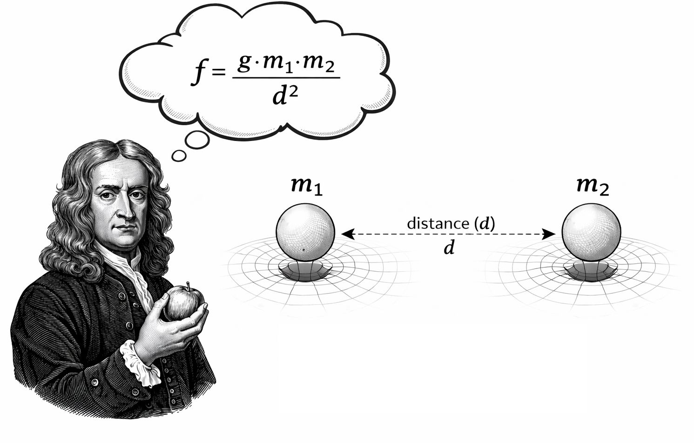
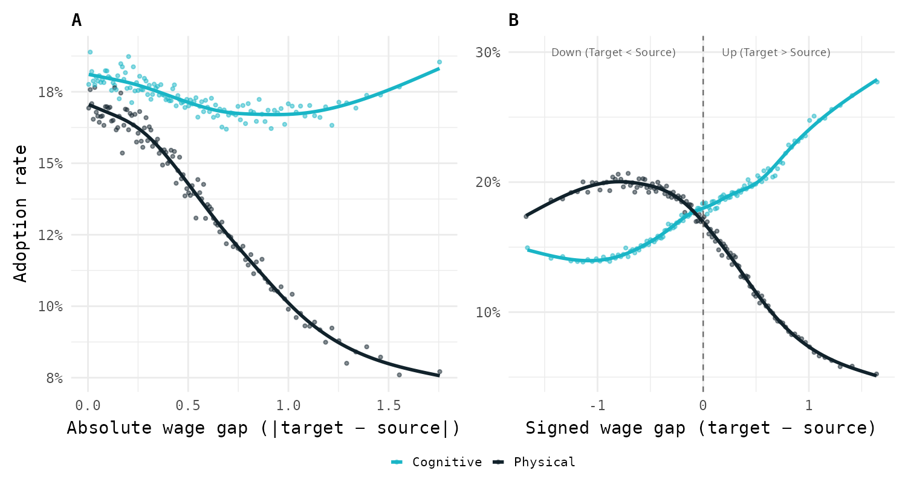
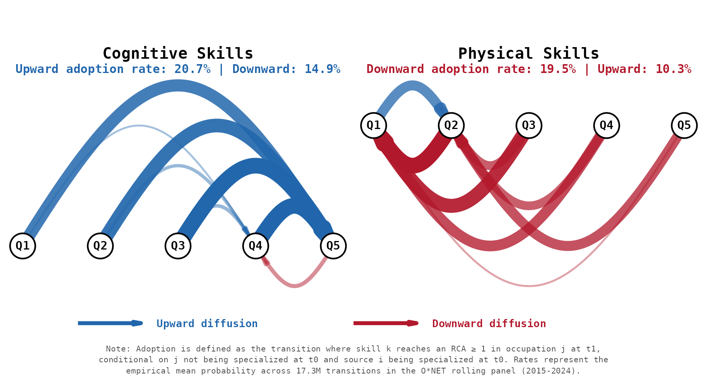
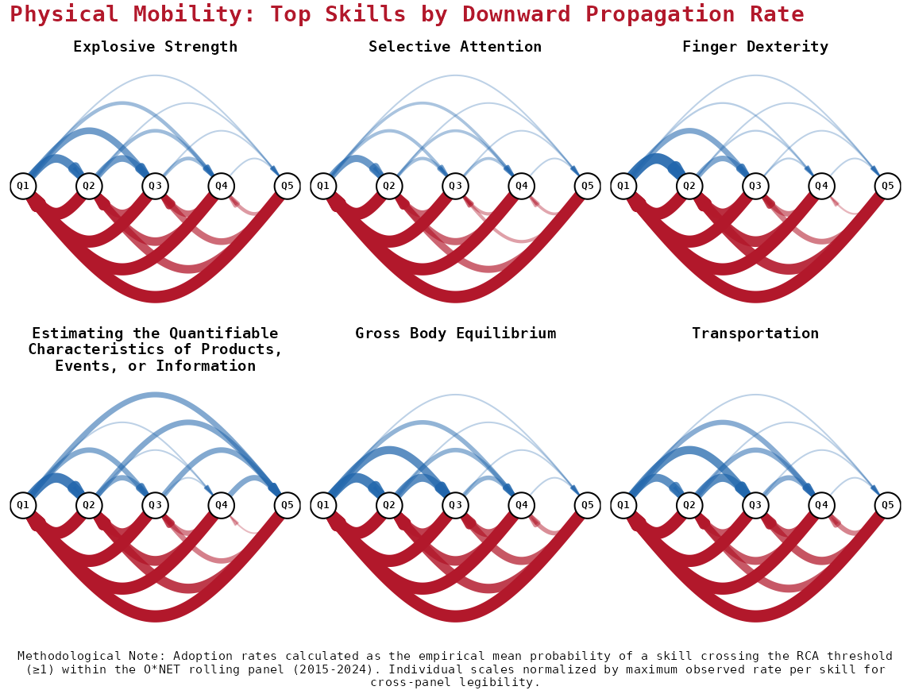
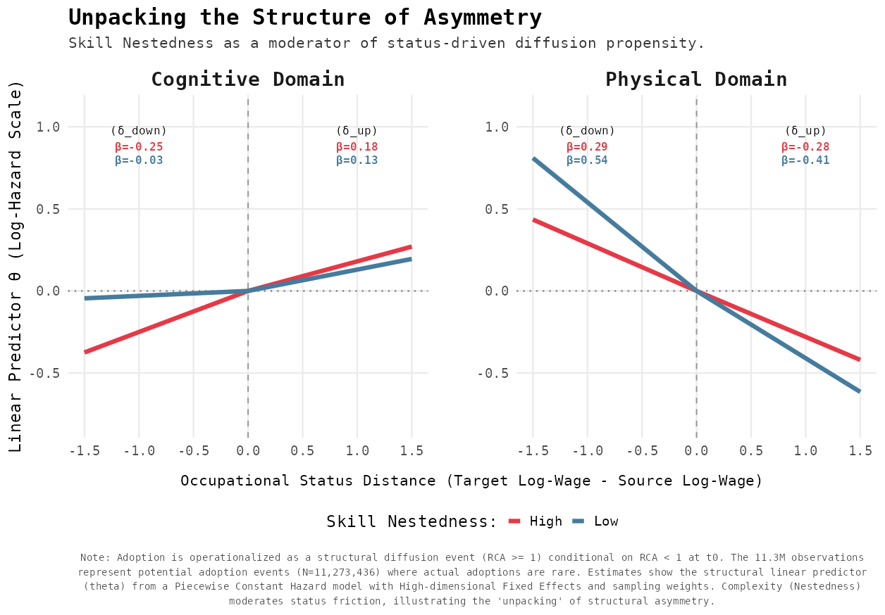
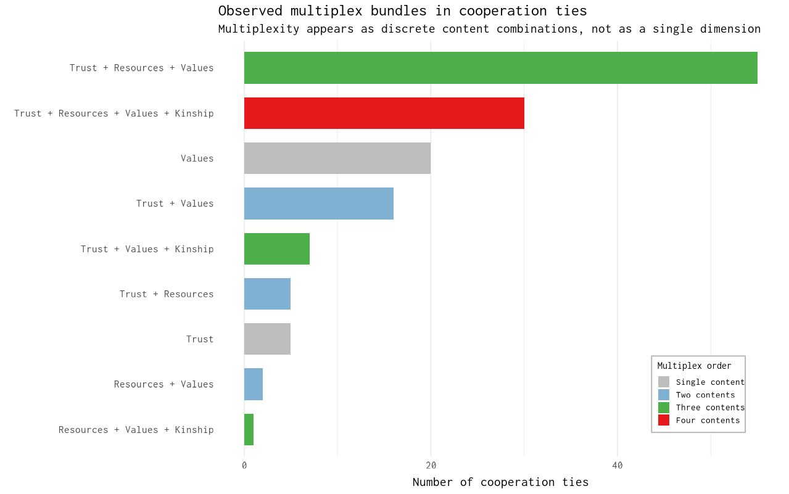
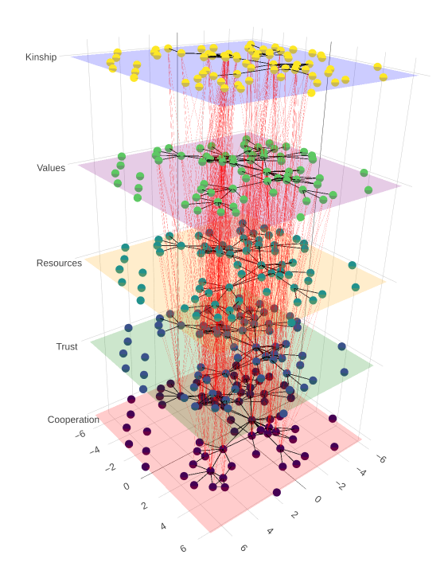
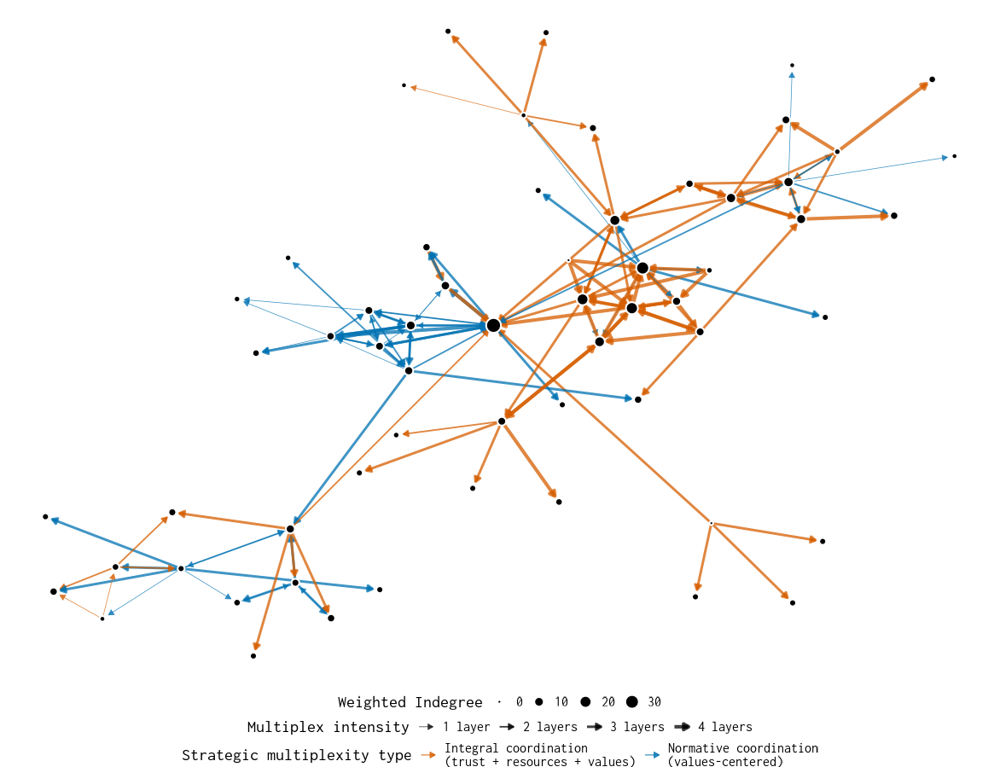

## The Research Program 


:::{style="font-size: 26px; margin-top: 3em;"}

> **Unifying Logic** 
> Diffusion is not a neutral process. Whether we look at skills in a labor market or protest in a city, **structure acts as a selective filter**.

* **Mechanism:** Diffusion potential is shaped by "structural gravity" and relational multiplexity.
* **Outcome:** These filters do not just slow down change; they **reproduce inequality** by channeling flows into specific orbits.
* **Dual Focus:** 
    1. *Occupational Space:* Asymmetric flow of skills (Paper 1). 
    2. *Organizational Space:* Strategic multiplexity in high-risk protest (Paper 2).

::: 

# PAPER 1: Structurally Conditioned Diffusion of Skills {background-color="#14b1ab"}


## The Puzzle: Static vs. Dynamic

:::{style="font-size: 26px; margin-top: 3em;"}

* **What we know:** Skill systems are polarized (Cognitive vs. Physical) and hierarchically nested. 
* **The Gap:** Most accounts are *architectural* (where skills are), but we don't know how requirements propagate. 
* **The Question:** How do skill requirements travel between occupations and why does this reproduce hierarchies? 

:::


##

:::{style="font-size: 26px; margin-top: 3em; text-align: center;"}

{width="70%"}

:::

```{r tabla_computacion, echo=FALSE, message=FALSE, warning=FALSE}
library(knitr)
library(tidyverse)
library(kableExtra)

# Crear el data frame
datos_computacion <- data.frame(
  Occupation = c("Secretary", "Nurse"),
  `1990` = c("✓", "✗"),
  `2010` = c("✓", "✓"),
  check.names = FALSE
)


datos_computacion %>%
  kbl() %>%
  kable_styling(bootstrap_options = c("striped", "hover", "condensed"))
```


# I. A GRAVITY MODEL FOR SKILL DIFFUSION  {.center .middle background-color="#0a4e58"}


## Standard gravity  


:::{style="font-size: 5px; margin-top: 10em; text-align: center;"}

{width="80%"}
:::

## Gravity Logic for Skill Diffusion {.smaller}

:::{style="font-size: 23px; margin-top: 3em;"}

Adapting standard gravity models traditionaly used in economics, we understand the probability $P_{ijk}$ that skill $k$ diffuses from occupation $i$ (source) to $j$ (target) is given by: 

<br>

$$P_{ijk} \;\propto\;
\frac{M_i \cdot M_j \cdot \color{red}{S_k}}{\color{blue}{D_{ij}^{\gamma}}} $$

:::{style="font-size: 20px; margin-top: 3em;"}

- $M_i: \text{Emissive capacity of the source occupation y $M_j$ absortuve capacity of the target occupation}$
- $\color{red}{S_k: \text{Skills differ in how easily they travel across occupations)}}$
- $\color{blue}{D_{ij}: \text{Distance between occupations (eg. wage gap, task relatedness)}}$

:::

:::{style="font-size: 25px; margin-top: 2em;"}

Our theory focuses on the the interaction between skill attributes and role of distance between occupations (above and beyond the role of mass)

:::

:::

## Our theory: Asimmetric trayectory channeling 


:::{style="font-size: 25px; margin-top: 2em;"}

- Distance **$(D)$** determines who is within reach; occupational status **$(S)$** determines which skills are allowed in.
Jobs that are close to each other can easily exchange requirements, but higher-status jobs selectively filter what they accept.

<br>

ATC is what happens when closeness meets inequality.

- **Cognitive skills** move upward because high-status jobs value and can afford them—especially when they build on prior skills.

- **Physical skills** are often blocked even between similar jobs, so they mostly flow sideways or downward, especially when they do not rely on prior capabilities.

- **Aggregate polarization dynamic**: complex, cognitive skills climb the job ladder, while simple, physical skills get trapped in lateral or downward paths.

:::


# III. FINDINGS {.center .middle background-color="#0a4e58"}

## Raw Patterns {.smaller}

::: {style="text-align: center;"}
{width="100%"}
:::


## Polarized Diffusion: Flow Networks {.smaller}

:::{style="font-size: 26px; margin-top: 1em;"}
{width="100%"}
:::


## The Asymmetry: Directional Friction by Domain {.smaller}

::: {style="font-size: 22px; margin-top: 4em; margin-bottom: 2em;"}
**Asymmetry** means skills face different "friction" when diffusing up vs.  down the wage ladder.  The direction of this friction **reverses** between cognitive and physical skills. 
:::

::: {style="font-size: 22px;"}

| | Cognitive | Physical | Interpretation |
|---|:---:|:---:|---|
| **Upward rate** | **20.2%** | 11.1% | Cognitive climbs easily |
| **Downward rate** | 15.6% | **19.0%** | Physical falls easily |
| **Gap (Up − Down)** | **+4. 7 p.p.** | **−8.0 p. p.** | Opposite signs |
| **Implication** | Facilitates ascent | Blocks ascent | Polarizing force |

:::

::: {style="font-size: 20px; text-align: center; margin-top: 1em;"}
Physical skills face **1.7× more friction** going up than going down
:::


## 

::: {style="text-align: center;"}
{width="85%"}
:::


## 

::: {style="text-align: center;"}
{width="85%"}
:::


# III. REGRESSION RESULTS {.center .middle background-color="#0a4e58"}


## 

::: {style="text-align: center; margin-bottom: 6em;"}
{width="75%"}
:::


## 

::: {style="text-align: center;"}
{width="95%"}
:::


## Key Magnitudes {.smaller}

:::{style="font-size: 24px; margin-top: 4em; text-align: left;"}

**Coefficients (wage gap, cloglog scale):**

| Term | Cognitive | Physical | Interaction |
|:-----|:----------|:---------|:------------|
| Upward | +0.08. | −0.34 | −0.42*** |
| Downward | +0.13 (ns) | +0.65 | +0.52** |
| Distance | −1.90*** | −3.23 | −1.33* |

**Interpretation:**

- Upward gap **slightly boosts** cognitive adoption, **penalizes** physical
- Downward gap has **no effect** on cognitive, **strongly boosts** physical
- Distance decay is **70% steeper** for physical skills

:::


## Robustness Summary {.smaller}

:::{style="font-size: 25px; margin-top: 4em;"}

| Test | Specification | Result |
|------|---------------|--------|
| Thresholds | RCA 0.9, 1.0, 1.1 | Pattern unchanged |
| Distances | Shortest path, resistance, cosine | Same relative slopes |
| Periods | 2015-18, 2019-21, 2022-24 | ATC persists |
| Bootstrap | Node-level B=1000 vs clustered SE | Ratio around 1.0 |
| Representation | Skill-skill vs occ-occ network | Ordinal match |


:::{style="font-size: 25px; margin-top: 2em;"}

The asymmetry is **not** an artifact of thresholds, distance measures, or time periods. 

:::
:::


# IV. IMPLICATIONS {.center .middle background-color="#0a4e58"}

## What This Tells Us {.smaller}

:::{style="font-size: 22px; margin-top: 2em;"}

**The asymmetry is structural, not incidental:**

- Physical skills don't just *happen* to stay low — they face systematic friction
- Cognitive skills don't just *happen* to climb — the path is smoother
- Nestedness *amplifies* these differences

**This reframes polarization:**

> Not just *what* skills exist where, but *how* skill requirements **flow** — and why certain flows are blocked

**Open questions:**

- Does reducing occupational distance (via training, credentialing) actually change diffusion? 
- Which specific skills are "near the boundary" and most amenable to intervention? 
- How do firm-level decisions interact with these macro patterns?

:::


# PAPER 2: Strategic Multiplexity in Urban Protest {background-color="#14b1ab"}


## The Puzzle: Coordination under Risk


:::{style="font-size: 26px; margin-top: 5em;"}

* Participation entails credible costs (repression, sanction, retaliation).
* Attitudinal sympathy is insufficient.
* Organizations must solve simultaneously:
  - **Legitimacy:** Is coordination shareable?
  - **Capacity:** Is coordination feasible?

> **Claim:** Scaling protest under risk depends on **Strategic Multiplexity**.

:::

## 

::: {style="text-align: center; margin-top: 2em;"}
{width="100%"}
:::


## Strategic Multiplexity (Core Idea)


:::{style="font-size: 26px; margin-top: 5em;"}

> Multiplexity is not “more layers.”  
> It is the **specific composition** of relational contents embedded in cooperation.

* Layers are asymmetric.
* Contents matter only when embedded in coordination.
* Reinforcement is qualitative, not additive.

:::

## Theoretical Core: Conditional Multiplexity


:::{.columns}
:::{.column width="45%"}
:::{style="font-size: 26px; margin-top: 5em;"}

* **Backbone:** Cooperation network.
* **Overlays:** Trust, resources, values, kinship.
* These are **edge attributes**, not parallel layers.

$$
Y_{ij} = \big(y_{ij}^{(1)}, y_{ij}^{(2)}, \dots, y_{ij}^{(K)}\big)
$$

:::
:::


:::{.column width="55%"}
::: {style="text-align: center;"}
{width="80%"}
:::
:::
:::


## Contribution to Diffusion Theory

:::{style="font-size: 26px; margin-top: 5em;"}

* Not all exposures are equivalent.
* Reinforcement depends on *which* contents overlap.
* **Wide bridges** are wide because they carry heterogeneous guarantees.

> Contribution: an operational specification of complex contagion infrastructure.

:::

## Identification Strategy

:::{style="font-size: 26px; margin-top: 5em;"}

> **Design:** Egocentric, snowball-based multiplex data.

* Cooperation elicited via name generators.
* Multiplex contents observed **conditional on cooperation**.
* Separation:
  - Structural formation
  - Strategic composition

:::

## Methods Overview

:::{style="font-size: 26px; margin-top: 5em;"}

* Backbone inference under egocentric observation.
* Multiplexity modeled as conditional edge attributes (LCA and MGLMM).
* Structural formation and diffusion dynamics kept distinct.
* Simulations
  * Not predictive.
  * Logical test of whether observed structure can sustain diffusion.
  * Evaluates implications of multiplex architecture.

:::


# RESULTS {background-color="#14b1ab"} 


##

::: {style="text-align: center;"}
{width="80%"}
:::


## Mechanism: Activation Potential

:::{style="font-size: 26px; margin-top: 5em;"}

$$
E_i(t)
=
\underbrace{\sum_{\ell} w_{\ell}\, x_{i\ell}(t)}_{\text{isolated signals}}
\;+\;
\underbrace{\sum_{\ell < m} w_{\ell m}\, x_{i\ell}(t)\, x_{im}(t)}_{\text{strategic synergy}}
$$

- $E_i(t)$ denotes the activation potential of organization $i$ at time $t$, defined as the combined influence of relational signals arriving through existing cooperation ties.
- The first term captures the accumulation of \emph{isolated signals} across relational contents, while the second term represents \emph{strategic synergy}: co-occurring contents jointly increase activation potential beyond their additive effects.
- Activation follows a threshold rule: organization $i$ becomes active when $E_i(t)$ exceeds a fixed threshold, generating non-linear diffusion dynamics.

::: 


## Counterfactual Diffusion Experiments

:::{style="font-size: 26px; margin-top: 5em;"}

* **Threshold Dynamics:** Multiplex reinforcement is most consequential in **moderate-threshold regimes** (where risk is significant).
* **"Wide Bridges":** Bridges that concentrate overlap between Trust, Cooperation, and Resources are systematically more cascade-enabling.
* **Redundant Validation:** Overlap resolves the coordination dilemma by providing both **moral validation** (trust) and **practical capacity** (resources).

:::


## Takeaway

:::{style="font-size: 26px; margin-top: 5em;"}


* Diffusion under risk depends on **how ties are composed**.
* Structure acts as a selective filter.
* Strategic multiplexity specifies the micro-foundations of complex contagion in contentious contexts.

:::

## Roadmap & Next Steps


:::{style="font-size: 22px; margin-top: 5em;"}

### Current Status
* **Paper 1:** Full draft completed. Accepted for **INAS 2025**. 
* **Paper 2:** Descriptive results finalized; simulations in final development.

### Timeline
* **Jan - March 2026:** Finalize Paper 2 simulation surfaces.
* **May 2026:** Thesis defense preparation.

:::


## Thank You


:::{style="font-size: 22px; margin-top: 5em;"}

**Roberto Cantillan**  
rcantillan@uc.cl | rcantillan.github.io  

::: {style="font-size:0.8em; margin-top:2em; color:#14b1ab"}
Replication materials and drafts available upon request.
:::

:::{style="font-size: 22px; margin-top: 5em;"}


