```{r setup, include=FALSE}
options(htmltools.dir.version = FALSE)
options(kableExtra.latex.load_packages = FALSE)
knitr::opts_chunk$set(echo = TRUE)
library(kableExtra)
```

```{r xaringan-themer, include=FALSE}
library(xaringanthemer)
style_duo_accent(
  footnote_font_size = "0.5em",
  primary_color = "#28282B",
  #primary_color = "#7393B3",
  secondary_color = "#2c8475",
  black_color = "#424242",
  white_color = "#FFF",
  base_font_size = "22px",
  # text_font_family = "Jost",
  # text_font_url = "https://indestructibletype.com/fonts/Jost.css",
  header_font_google = google_font("Libre Franklin", "200", "400"),
  header_font_weight = "200",
  inverse_header_color = "#eaeaea",
  title_slide_text_color = "#FFFFFF",
  text_slide_number_color = "#9a9a9a",
  text_bold_color =  "#355E3B", #"#4169e1", # "#810541", # "#f79334",
  code_inline_color = "#B56B6F",
  code_highlight_color = "transparent",
  link_color = "#2c8475",
  table_row_even_background_color = lighten_color("#345865", 0.9),
  extra_fonts = list(
    "https://indestructibletype.com/fonts/Jost.css",
    google_font("Amatic SC", "400")
  ),
  colors = c(
    green = "#31b09e",
    "green-dark" = "#2c8475",
    highlight = "#87f9bb",
    purple = "#887ba3",
    pink = "#B56B6F",
    orange = "#D462FF",# "#810541", # "#f79334",
    red = "#dc322f",
    `blue-dark` = "#002b36",
    `text-dark` = "#202020",
    `text-darkish` = "#424242",
    `text-mild` = "#606060",
    `text-light` = "#9a9a9a",
    `text-lightest` = "#eaeaea"
  ),
  extra_css = list(
    ".remark-slide-content h3" = list(
      "margin-bottom" = 0, 
      "margin-top" = 0
    ),
    ".smallish, .smallish .remark-code-line" = list(`font-size` = "0.7em")
  )
)
xaringanExtra::use_xaringan_extra(c("tile_view", "animate_css", "tachyons", "share_again"))
xaringanExtra::use_extra_styles()
```

```{r metadata, echo=FALSE}
library(metathis)
meta() %>% 
  meta_description("The science of sustainability: An approach to the Latin American network, qcs2, Junio, 2024") %>% 
  meta_social(
    title = "The science of sustainability: An approach to the Latin American network",
    url = "https://github.com/rcantillan/slides/tree/main/sna_ses_lab/index",
    image = "https://github.com/rcantillan/slides/tree/main/sna_ses_lab/intro/home_screen.png",
    twitter_card_type = "summary_large_image",
    twitter_creator = "ricantillan"
  )
```

```{r components, include=FALSE}
slides_from_images <- function(
  path,
  regexp = NULL,
  class = "hide-count",
  background_size = "contain",
  background_position = "top left"
) {
  if (isTRUE(getOption("slide_image_placeholder", FALSE))) {
    return(glue::glue("Slides to be generated from [{path}]({path})"))
  }
  if (fs::is_dir(path)) {
    imgs <- fs::dir_ls(path, regexp = regexp, type = "file", recurse = FALSE)
  } else if (all(fs::is_file(path) && fs::file_exists(path))) {
    imgs <- path
  } else {
    stop("path must be a directory or a vector of images")
  }
  imgs <- fs::path_rel(imgs, ".")
  breaks <- rep("\n---\n", length(imgs))
  breaks[length(breaks)] <- ""

  txt <- glue::glue("
  class: {class}
  background-image: url('{imgs}')
  background-size: {background_size}
  background-position: {background_position}
  {breaks}
  ")

  paste(txt, sep = "", collapse = "")
}
options("slide_image_placeholder" = FALSE)
```

class: left title-slide
background-image: url('saira-ahmed-Luwt8bd3bIs-unsplash.jpg')
background-size: cover
background-position: left


[ricantillan]: https://twitter.com/ricantillan
[rbind]: https://rcantillan.rbind.io

#  

.side-text[
[&commat;ricantillan][ricantillan] | [sna-ssla.netlify.app][rbind]
]

.title-where[
### **The science of sustainability:** 
### **An approach to the Latin American network**
Roberto Cantillan / Julien Vanhulst FONDECYT program N°1220560 <br> 
Junio, 2024
]

```{css echo=FALSE}
.title-slide h1 {
  font-size: 70px;
  font-family: Jost, sans;
  animation-name: title-text;
  animation-direction: alternate;
  animation-iteration-count: infinite;
}

.side-text {
  color: white;
  transform: rotate(90deg);
  position: absolute;
  font-size: 18px;
  top: 150px;
  right: -110px;
  transition: opacity 0.5s ease-in-out;
  animation-name: enter-right;
  animation-direction: alternate;
  animation-iteration-count: infinite;
}

.side-text:hover {
  opacity: 1;
}

.side-text a {
  color: white;
}

.title-where {
  font-family: Jost, sans;
  font-size: 30px;
  position: absolute;
  bottom: 30px;
  animation-name: enter-left;
  animation-direction: alternate;
  animation-iteration-count: infinite;
  animation-timing-function: ease-in-out;
}
```


```{r logo, echo=FALSE}
library(xaringanExtra)
use_logo(
  image_url = "ins--sociologia-traz-04.png",
  exclude_class = c("title-slide","hide_logo","inverse"),
  width = "150px",
  height = "150px")
```

---

class: left middle

### **The project**

- Project Fondecyt N°1220560 “Scientific networks and knowledge production of science of/for sustainability in Latin America”

- Main goal: analyze the production of scientific knowledge in sustainability science in the Latin American region in the last 30 years, considering the structuring of the research network (between scientific actors, but also between scientific and non-scientific actors).

- First stage: 
  - Define the field of sustainability science in Latin America
  - Identify actors and centers of scientific knowledge production
  - Define the relationships between actors and production centers
  - Build the map of the production network (macro level)

---
class: left middle

### **What is sustainability science?**

- "Sustainability science is one convenient term for the research community’s contributions to the informed agitation required to address the challenges of sustainable development” (Clark & Harley 2020)

- Sustainability science focus on understanding human–environment interactions linking knowledge to action

- Beginning in the 1990s:
  - New global and multidisciplinary programs (IGBP, IHDP, IAI, Future Earth, etc.)
  - New areas of knowledge (Ecological economics, agroecology, climate, etc.)
  - Late 1990s: proposal of a new scientific specialty: sustainability science (journals, events, training programs, etc.)


---

class: left middle title-slide
background-image: url('saira-ahmed-Luwt8bd3bIs-unsplash.jpg')
background-size: cover

### **First and foremost: Data**
  
---
class: left middle

### **Three main sources**

- **Bibliographic data**
- Surveys
- Interviews

---

class: left middle

#### **Bibliographic data: two sources and process**

.w-50.fl[
### 

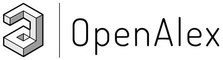
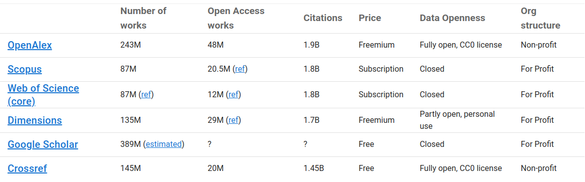
]

.w-50.fr[
### 

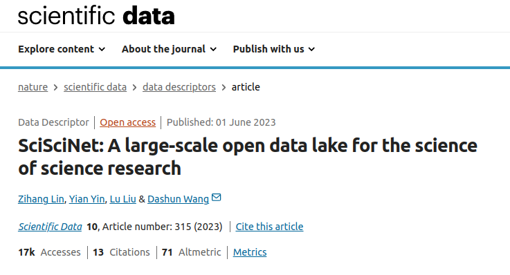


]


---

class: center middle


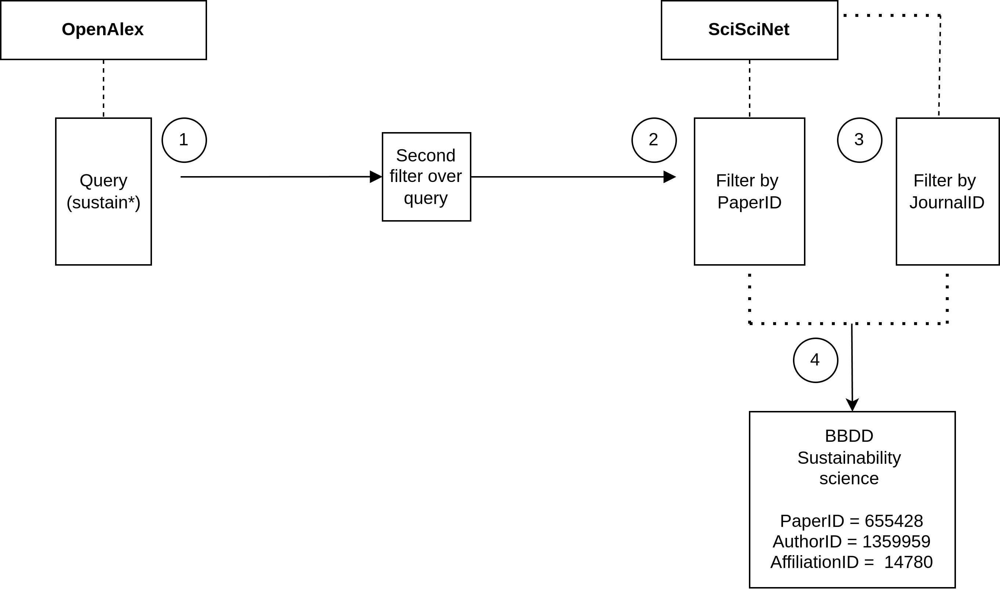


---

class: center middle


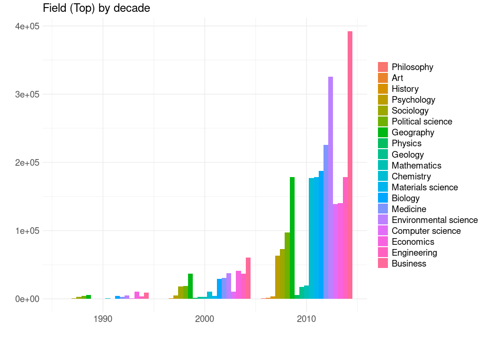

---

class: center middle


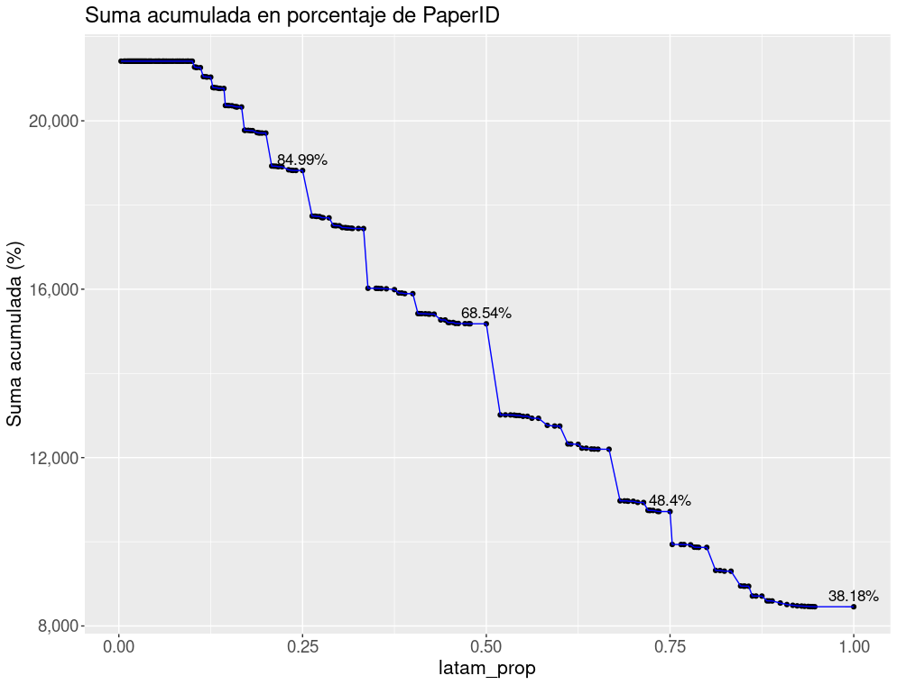


---
class: center middle

#### **Descripción de variables**

<div class="kable-holder">

```{r, echo=FALSE, results='asis', howChoro1}
# Cargar el objeto .RData
load("/home/rober/Documents/sna-ses/tabla_variables.RData")

# Imprimir la tabla usando kable
library(knitr)
library(kableExtra)

kable(tabla_variables, row.names = FALSE, caption = "") %>%
  kable_styling(bootstrap_options = c("striped", "hover", "condensed"), full_width = F) %>%
  row_spec(0, bold = T, color = "white", background = "#355E3B") %>%
  scroll_box(width = "100%", height = "500px")
```


---
class: left middle

#### **Filter by latam** 
```{r, eval=FALSE}
sci_latam <- sci_latam %>%
  filter(DocType == "Journal") %>%
  group_by(PaperID) %>%
  filter(latam_prop >= 0.5 |
           any(AuthorSequenceNumber == 1 & is_latam == 1)) %>%
  ungroup()
```


- `filter(latam_prop >= 0.5 | any(AuthorSequenceNumber == 1 & is_latam == 1)) %>%`: This line applies a second filter to the grouped data. The filter has two conditions:

- `latam_prop >= 0.5`: It keeps records where the proportion of Latin American authors (latam_prop) is greater than or equal to 0.5.

- `any(AuthorSequenceNumber == 1 & is_latam == 1)`: For each group (i.e., for each PaperID), it keeps records where at least one author (any) is the first author (AuthorSequenceNumber == 1) and is from Latin America (is_latam == 1)."


---


class: center middle

.w-50.fl[
### 

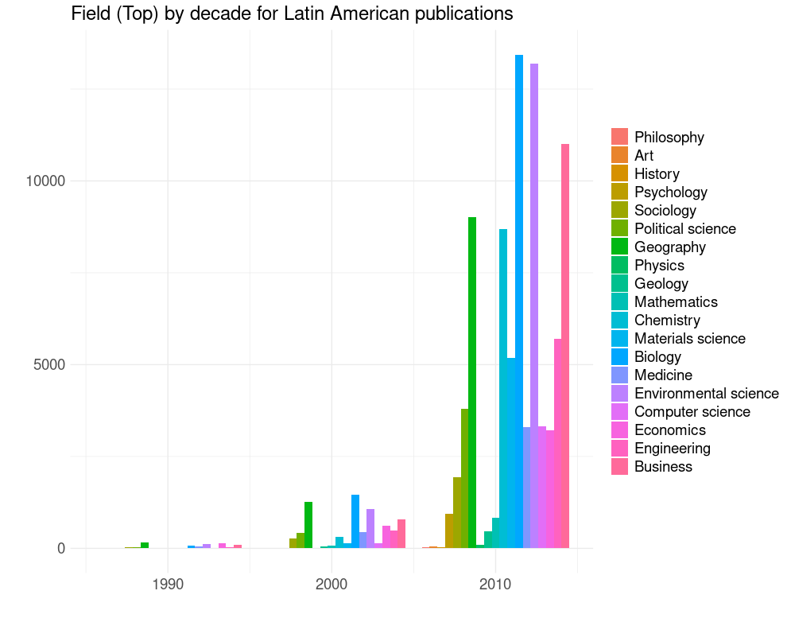
]

.w-50.fr[
### 

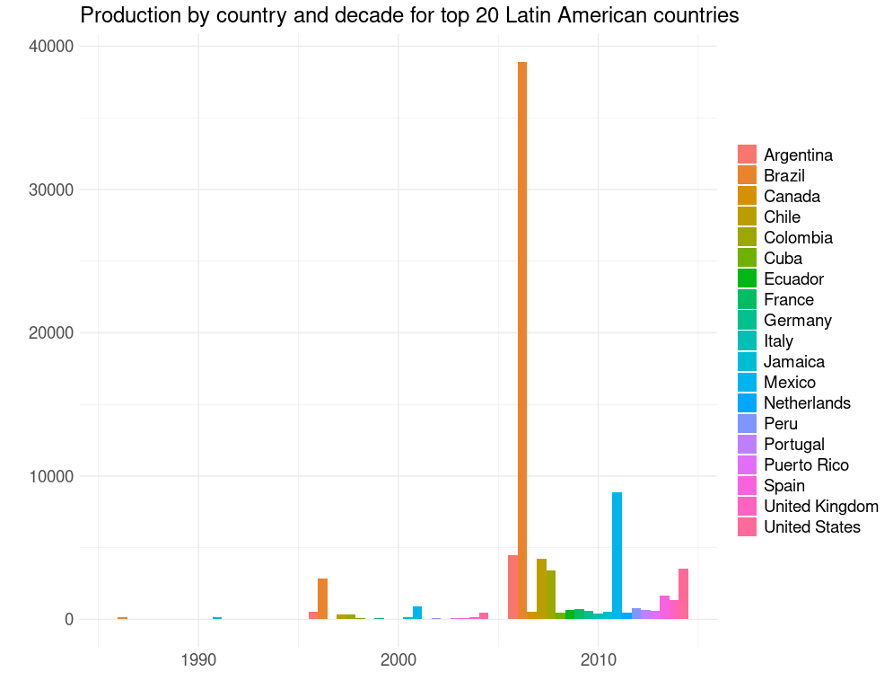


]


---

class: center middle


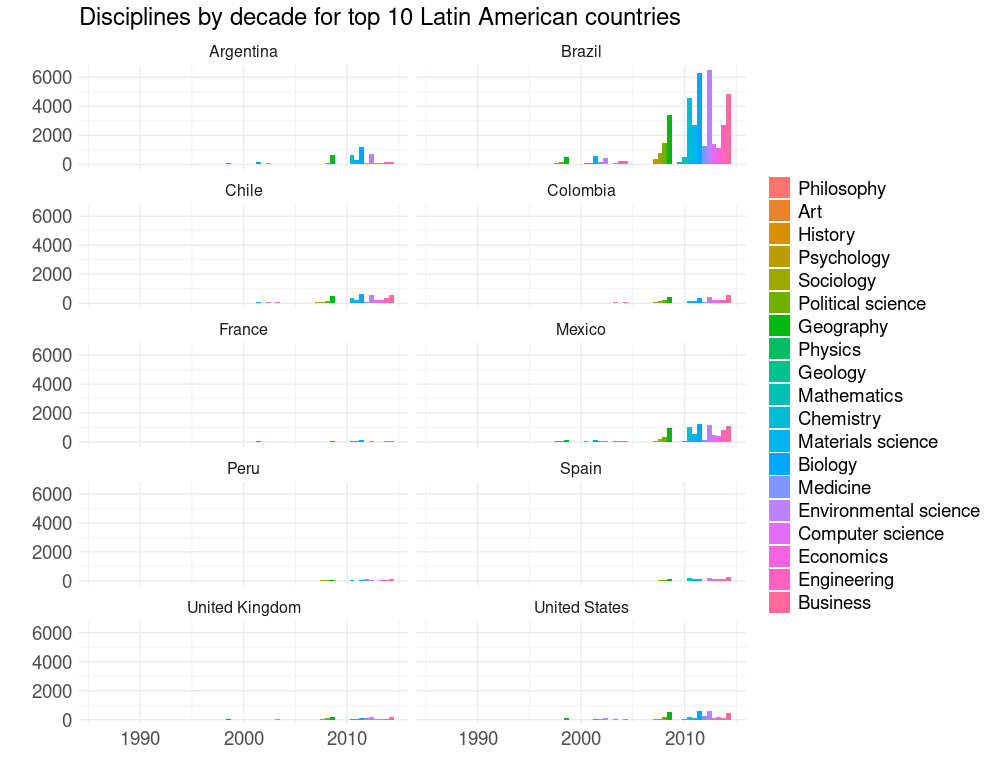


---

class: middle right
background-image: url('saira-ahmed-Luwt8bd3bIs-unsplash.jpg')
background-size: cover

### **Mutlidisciplinary or interdisciplinary:** 
### **Network approach**

---
class: center middle

#### **Two mode approach**

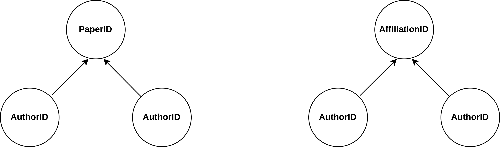

---

class: center middle

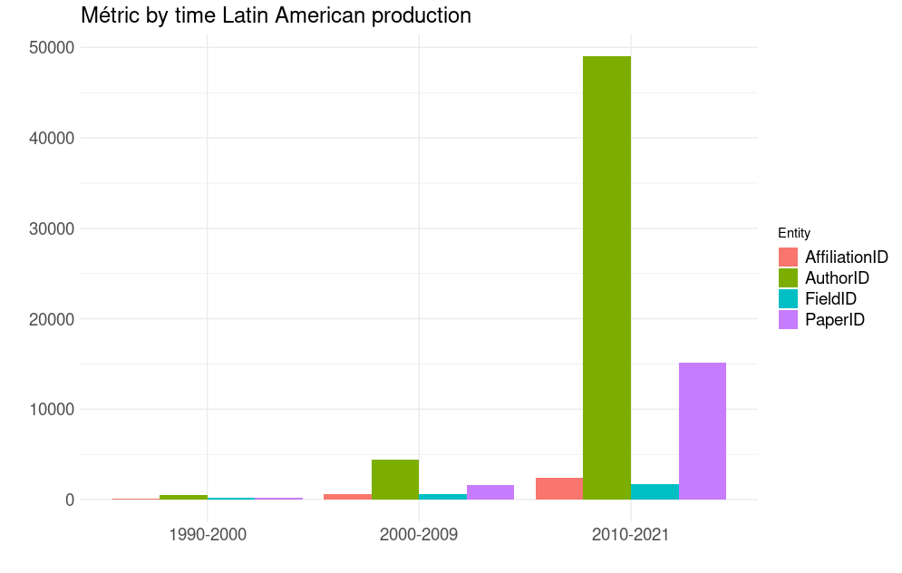

---

class: middle right
background-image: url('saira-ahmed-Luwt8bd3bIs-unsplash.jpg')
background-size: cover

### **Hypotheses and modeling** 

---
class: left middle


#### **General Level (Controls)**

  - Early centralization.
  - Clustering.
  
#### **Author Collaboration in Papers**

  - In sustainability science, greater interdisciplinarity is expected (create aggregated discipline measures: STEM vs. others).
  - Probability of gender homophily.
  - Expected fragmentation due to geographical distance and regional barriers.
  
#### **Multiple Affiliation and Institutional Integration**

  - Institutional Barriers: National science policies promote organizational forms in the shape of national clusters.
  - Language Barrier (especially in the case of Brazil).
  - Greater geographical distance reduces the probability of interaction.
  - Preferential attachment.
  - Some organizations may have a higher propensity to work and publish in certain disciplines.
  - Issue: Organizations are very large, preventing identification of specialized centers.

---
class: left middle

#### **Fundamental parameters**

.w-50.fl[
### 

- `gwb1degree`, `gwb2degree`: Geometrically weighted degree distribution for the first and second modes in a bipartite network. 

- `b1factor`, `b2factor`: number of times that nodes with a given level of a categorical attribute appear within the set of edges.

- `b1nodematch`,` b2nodematch`: This term is introduced in Bomiriya et al (2014), it is a two-star statistic based on homophily. In our case the term adds multiple network statistics to the model, one for each of the unique values of the attribute. 

]

.w-50.fr[
### 

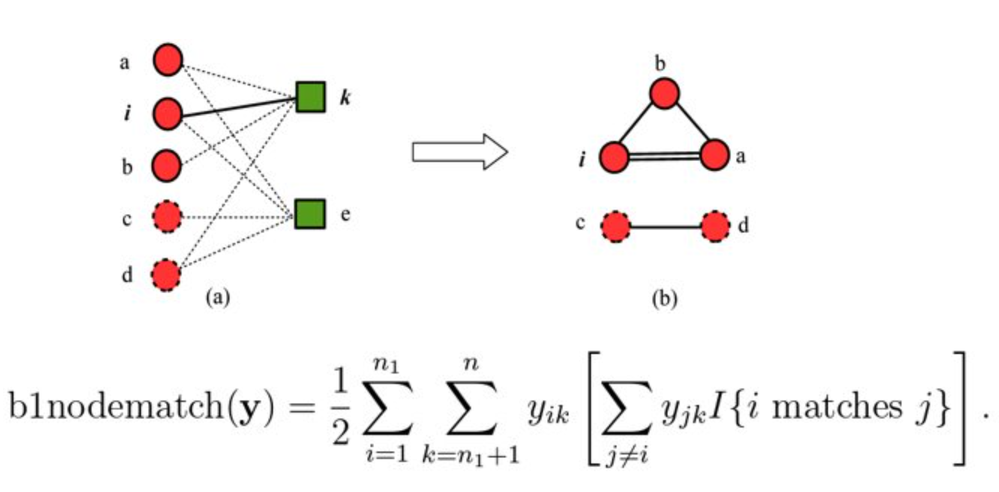


]


---
class: middle right
background-image: url('saira-ahmed-Luwt8bd3bIs-unsplash.jpg')
background-size: cover

### **Muchas Gracias**
#### **Esta presentación fue realizada con el paquete [Xaringan](https://slides.yihui.org/xaringan), diseñado para entorno  [R](https://www.r-project.org/)** 


