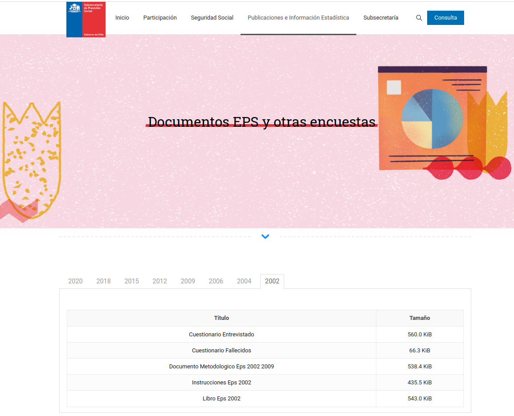
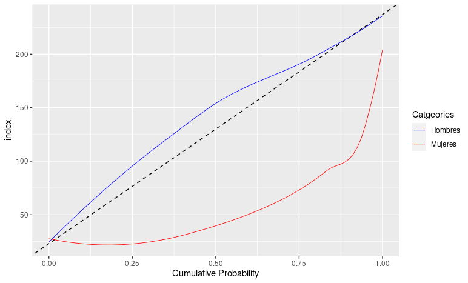
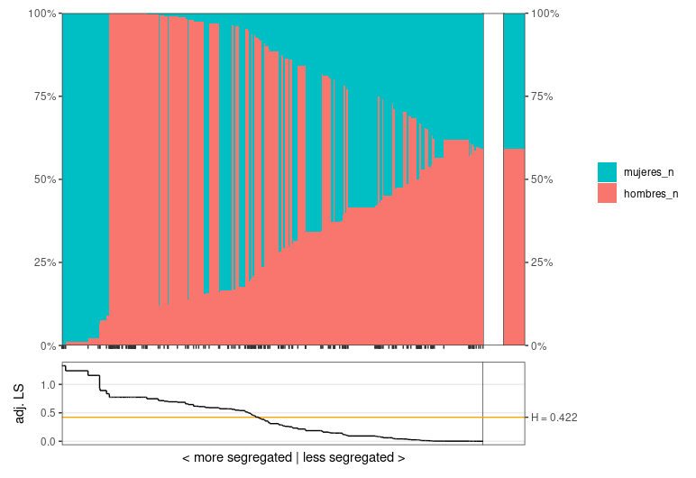
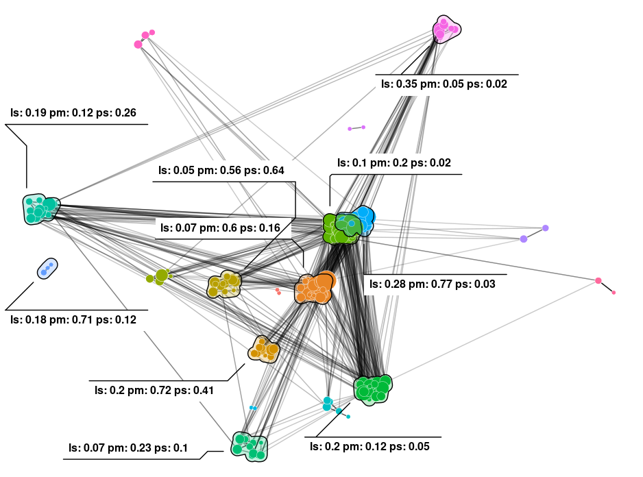

```{r setup, include=FALSE}
options(htmltools.dir.version = FALSE)
```

```{r xaringan-themer, include=FALSE}
library(xaringanthemer)
style_duo_accent(
  footnote_font_size = "0.5em",
  primary_color = "#28282B",
  #primary_color = "#7393B3",
  secondary_color = "#2c8475",
  black_color = "#4242424",
  white_color = "#FFF",
  base_font_size = "22px",
  # text_font_family = "Jost",
  # text_font_url = "https://indestructibletype.com/fonts/Jost.css",
  header_font_google = google_font("Libre Franklin", "200", "400"),
  header_font_weight = "200",
  inverse_header_color = "#eaeaea",
  title_slide_text_color = "#FFFFFF",
  text_slide_number_color = "#9a9a9a",
  text_bold_color = "#D462FF", # "#810541", # "#f79334",
  code_inline_color = "#B56B6F",
  code_highlight_color = "transparent",
  link_color = "#2c8475",
  table_row_even_background_color = lighten_color("#345865", 0.9),
  extra_fonts = list(
    "https://indestructibletype.com/fonts/Jost.css",
    google_font("Amatic SC", "400")
  ),
  colors = c(
    green = "#31b09e",
    "green-dark" = "#2c8475",
    highlight = "#87f9bb",
    purple = "#887ba3",
    pink = "#B56B6F",
    orange = "#D462FF",# "#810541", # "#f79334",
    red = "#dc322f",
    `blue-dark` = "#002b36",
    `text-dark` = "#202020",
    `text-darkish` = "#424242",
    `text-mild` = "#606060",
    `text-light` = "#9a9a9a",
    `text-lightest` = "#eaeaea"
  ),
  extra_css = list(
    ".remark-slide-content h3" = list(
      "margin-bottom" = 0, 
      "margin-top" = 0
    ),
    ".smallish, .smallish .remark-code-line" = list(`font-size` = "0.7em")
  )
)
xaringanExtra::use_xaringan_extra(c("tile_view", "animate_css", "tachyons", "share_again"))
xaringanExtra::use_extra_styles()
```

```{r metadata, echo=FALSE}
library(metathis)
meta() %>% 
  meta_description("Movilidad ocupacional intrageneracional en Chile: Segregación y contagio (2009 - 2020), ISUC, Enero 26, 2024") %>% 
  meta_social(
    title = "Movilidad ocupacional intrageneracional en Chile: Segregación y contagio (2009 - 2020)",
    url = "https://github.com/rcantillan/slides/tree/main/thesis_proposal/index",
    image = "https://github.com/rcantillan/slides/tree/main//thesis_proposal/intro/home_screen.png",
    twitter_card_type = "summary_large_image",
    twitter_creator = "ricantillan"
  )
```

```{r components, include=FALSE}
slides_from_images <- function(
  path,
  regexp = NULL,
  class = "hide-count",
  background_size = "contain",
  background_position = "top left"
) {
  if (isTRUE(getOption("slide_image_placeholder", FALSE))) {
    return(glue::glue("Slides to be generated from [{path}]({path})"))
  }
  if (fs::is_dir(path)) {
    imgs <- fs::dir_ls(path, regexp = regexp, type = "file", recurse = FALSE)
  } else if (all(fs::is_file(path) && fs::file_exists(path))) {
    imgs <- path
  } else {
    stop("path must be a directory or a vector of images")
  }
  imgs <- fs::path_rel(imgs, ".")
  breaks <- rep("\n---\n", length(imgs))
  breaks[length(breaks)] <- ""

  txt <- glue::glue("
  class: {class}
  background-image: url('{imgs}')
  background-size: {background_size}
  background-position: {background_position}
  {breaks}
  ")

  paste(txt, sep = "", collapse = "")
}
options("slide_image_placeholder" = FALSE)
```

class: left title-slide
background-image: url('marc-sendra-martorell-2BrdNFxW0UY-unsplash.jpg')
background-size: cover
background-position: left


[ricantillan]: https://twitter.com/ricantillan
[rbind]: https://rcantillan.rbind.io

#  

.side-text[
[&commat;ricantillan][ricantillan] | [rcantillan.rbind.io][rbind]
]

.title-where[
### Movilidad ocupacional intrageneracional en Chile: 
### Segregación y contagio (2009 - 2020) 

Instituto de Sociología PUC <br> 
Enero 26, 2024
]

```{css echo=FALSE}
.title-slide h1 {
  font-size: 80px;
  font-family: Jost, sans;
  animation-name: title-text;
  animation-direction: alternate;
  animation-iteration-count: infinite;
}

.side-text {
  color: white;
  transform: rotate(90deg);
  position: absolute;
  font-size: 22px;
  top: 150px;
  right: -130px;
  transition: opacity 0.5s ease-in-out;
  animation-name: enter-right;
  animation-direction: alternate;
  animation-iteration-count: infinite;
}

.side-text:hover {
  opacity: 1;
}

.side-text a {
  color: white;
}

.title-where {
  font-family: Jost, sans;
  font-size: 25px;
  position: absolute;
  bottom: 10px;
  animation-name: enter-left;
  animation-direction: alternate;
  animation-iteration-count: infinite;
  animation-timing-function: ease-in-out;
}
```


```{r logo, echo=FALSE}
library(xaringanExtra)
use_logo(
  image_url = "ins--sociologia-traz-04.png",
  exclude_class = c("title-slide","hide_logo","inverse"),
  width = "150px",
  height = "150px")
```

```{css, echo = F}
table {
  font-size: 12px;     
}
```

```{css, echo = F}
.regression table {
  font-size: 12px;     
}
```

---

class: left middle

### **Temas** 


- Introducción

--

- Teoría  

--

- Evidencia reciente

--

- Propuestas de estudios

--

- Avances 

---

class: middle right
background-image: url('sarah-dao-GFIou2AVG3Q-unsplash.jpg')
background-size: cover

### ** Introducción**

---


class: middle left

### **Introducción**


- **Movilidad ocupacional intrageneracional**: La movilidad ocupacional intrageneracional constituye una dimensión crucial pero sub-explorada para comprender barreras contemporáneas a la progresión profesional y oportunidades diferenciales dentro del propio ciclo vital de los trabajadores (Jarvis & Song, 2017; Kalleberg & Mouw, 2018).

- Se define como los cambios hacia posiciones económicas ocupacionales más altas o más bajas a lo largo de la vida laboral (Kalleberg & Mouw, 2018). Su estudio aporta discernimientos únicos sobre limitaciones estructurales y de agencia que enfrentan distintos grupos sociodemográficos.

---

class: middle left

### **Introducción II**

- **Análisis de redes para estudiar desigualdades**: El análisis de redes aplicado a movilidad ocupacional permite conceptualizar el mercado laboral como un sistema dinámico (intercambio generalizado) (Bearman, 1997) en donde las posiciones se influencian mutuamente (Cheng & Park, 2020). Esto supera visiones de ocupaciones como categorías estáticas.

- Asimismo, captura interdependencias entre grupos indetectables con métodos tradicionales, identificando mecanismos subyacentes a la persistencia de segregación, brechas de habilidades y desigualdad multidimensional (Arvidsson et al., 2021; Block, 2022).

- El enfoque relacional facilita el mapeo de trayectorias completas dentro de la red ocupacional. Sus resultados tienen implicancias directas para el diseño de políticas públicas efectivas hacia la equidad.


---

class: middle left

### **Motivación** 

- La principal motivación de esta investigación es examinar los mecanismos que subyacen a la segregación ocupacional multidimensional y las barreras a la movilidad ocupacional intrageneracional en Chile.

- Estudiar la movilidad ocupacional dentro del ciclo laboral de los trabajadores mediante técnicas de análisis de redes permitirá examinar mecanismos subyacentes que perpetúan la segregación (multidimensional) del mercado ocupacional (Reskin, 1993; Arvidsson et al., 2021). 

- Estos mecanismos implican interdependencias antes indetectables entre las decisiones laborales de movilidad de diferentes grupos sociodemográficos (Arvidsson et al., 2021; ), y dinámicas ecológicas complejas (homofilia, contagio, etc.) de organización y estratificación de los mercados ocupacionales (Cheng y Park, 2020; Lin y Hung, 2022). 

- También permite estudiar de manera innovadora las brechas entre oferta y demanda de habilidades en ciertos sectores (Handel, 2003).


---

class: middle right
background-image: url('sarah-dao-GFIou2AVG3Q-unsplash.jpg')
background-size: cover

### ** Teoría**

---

class: middle left

### **Teoría I**

- Movilidad intrageneracional como clave en dinámicas contemporáneas. Barreras y oportunidades dentro de la vida laboral (Kalleberg & Mouw, 2018). Está relacionada con movilidad intergeneracional, desigualdad salarial y comportamientos micro del mercado laboral (Jarvis & Song, 2017).

- La perspectiva de redes sociales y de sistemas de intercambio generalizado (Bearman, 1997; Cheng & Park, 2020) enfatiza en la naturaleza relacional y dinámica de las estructuras. Y, resalta la coevolución dinámica de atributos y flujos de trabajadores, en donde la diferenciación (en términso de similitudes y diferencias) facilitan y constriñen el intercambio laboral. 

- La noción de ocupaciones conectadas entre sí (Breiger, 1990; Lambert & Griffiths, 2018) captura los contornos efectivos de movilidad. Flujos desproporcionados entre ciertos pares ocupacionales indican fronteras.


---

class: middle left

### **Teoría II**

- La teoría sobre isomorfismo, diferenciación y contagio entre entidades interdependientes (DiMaggio & Powell, 1983; Centola & Macy, 2007), se aplica para entender convergencia local de atributos, así como refuerzo y propagación de distancias entre segmentos.

- La perspectiva de competencia ecológica combinada con dinámicas históricas de contagio homofílico (McPherson, 2004), explica la consolidación asimétrica de distancias culturales y estructurales entre ocupaciones con grados previos variados de similitud.

- La noción de mismatch ocupacional (Handel, 2003) se vincula con divergencias dinámicas entre habilidades de trabajadores y requerimientos técnicos de ocupaciones. Se relaciona con rigidez de movilidad.


---

class: middle right
background-image: url('sarah-dao-GFIou2AVG3Q-unsplash.jpg')
background-size: cover

### **Evidencia**


---

class: middle left

### **Evidencia I** 

- La evidencia muestra una disminución progresiva pero lenta de la segregación de género en EEUU, especialmente desde la década de 1990 (Blau et al, 2013; Weeden, 2018), parcialmente atribuida a la entrada al mercado laboral de cohortes de mujeres mejor educadas y sujetas a menor discriminación respecto a sus predecesoras (Blau et al, 2013). Sin embargo, los niveles siguen siendo importantes explicando cerca del 28% de las brechas salariales entre millennials (Weeden, 2018). 

- Asimismo, estudios recientes indican que eliminar segregación educativa por género no sería suficiente para reducir segmentación ocupacional (Zheng & Weeden, 2023). Por otro lado, la evolución del fenómeno a lo largo del ciclo vital sigue un patrón en U invertida, con un peak en torno a los 30 años (Guinea-Martin et al., 2018), relacionado con transiciones laborales de mujeres en etapas de crianza.

---

class: middle left

### **Evidencia II: polarización del mercado laboral** 

- Recientes investigaciones proveen evidencia mixta sobre las tendencias en el mercado laboral chileno. Por una parte, estudios reportan creciente rigidez en la estructura social en la última década, con menor movilidad instra e intergeneracional, así como aislamiento de los grupos en los extremos superior e inferior (Espinoza et al., 2013; Torche, 2014). Este patrón de polarización ocupacional presenta similitudes respecto a EEUU.

- Sin embargo, los factores subyacentes difieren en aspectos importantes entre ambos países. Mientras en EEUU la polarización se asocia fuertemente a discriminación racial, en Chile los impulsores están mayormente vinculados con brechas persistentes de participación laboral y remuneraciones entre hombres y mujeres, alta informalidad laboral y rotación entre empleos precarios (Dwyer & Olin Wright, 2019; Espinoza et al., 2013). 


---

class: middle left 

### **Evidencia III: Redes y (des) segregación**

- Incorporando técnicas de análisis de redes, Arvidsson et al. (2021) introducen el “mecanismo del caballo de Troya”, encontrando que redes de movilidad laboral pueden en realidad reducir la segregación al contrarrestar la homofilia. 

- Mientras que Block (2023) muestra que los hombres abandonan ocupaciones al incrementarse la proporción de mujeres que ingresan a ellas, fenómeno que explicaría cerca de un 25% de la segregación observada.


---

class: middle right
background-image: url('sarah-dao-GFIou2AVG3Q-unsplash.jpg')
background-size: cover

### **Estudios de redes y mercado laboral**

---

class: middle left

### **Redes y mercados laborales**

- Toubøl y Larsen (2017) también modelan la movilidad ocupacional como una red. Identifican categorías sociales intra-generacionales emergentes en Dinamarca, validadas en términos de atributos como ingresos y acción política.

- Villarreal (2020) representa flujos entre ocupaciones como una red, encontrando un aumento en la segmentación del mercado laboral estadounidense entre 1996 y 2016.

- Cheng y Park (2020) extienden el concepto de flujos y fronteras ocupacionales. Detectan comunidades cambiantes de movilidad en EEUU entre 1989-2015, revelando una creciente rigidización indetectable con enfoques tradicionales.

- Lin y Hung (2022) conciben la red ocupacional como sistema adaptativo donde atributos y movilidad se influencian mutuamente. Encuentran mayor fragmentación en EEUU impulsada por diferenciación en skills y composición demográfica. También evidencian contagio de salarios entre ocupaciones conectadas.


---

class: middle left

### **Mi propuesta I**

- Los estudios previos analizados constituyen un punto de partida valioso al demonstrar la utilidad del enfoque de redes para examinar dinámicas contemporáneas claves en los mercados laborales como: **1) creciente segmentación, 2) rigidización de fronteras, y 3) especialización del trabajo**. Sin embargo, existen aún áreas poco exploradas donde esta investigación puede realizar aportes originales.

- En primer lugar, la evidencia revisada se ha centrado principalmente en el contexto estadounidense. Extender el análisis a la red de movilidad ocupacional chilena puede revelar mecanismos y configuraciones distintivas dados los procesos locales de cambio tecnológico, globalización económica y evolución institucional durante las últimas décadas.

---

class: middle left

### **Mi propuesta II**

- En segundo término, un foco novedoso es el estudio específico de dinámicas de segregación ocupacional de género desde una óptica de redes e interdependencia entre decisiones laborales. Ello permitirá examinar cómo flujos entre ocupaciones conectadas pueden reforzar o transformar los niveles compartidos de paridad de género a través de mecanismos como contagio e imitación.

- Por último, la consideración explícita del fenómeno de desajuste entre habilidades y requerimientos técnicos a nivel ocupacional también constituye una extensión original que puede arrojar luz sobre rigidización de la movilidad.

---


class: middle right
background-image: url('sarah-dao-GFIou2AVG3Q-unsplash.jpg')
background-size: cover

### **Propuesta de estudios**


---

class: middle left


.w-50.fl[

### **Datos y ocupaciones** 

- Utilizo datos de la Encuesta de Protección Social EPS

- La encuesta busca obtener información detallada sobre diferentes áreas de protección social, como empleo, educación, salud, vivienda y otros aspectos del bienestar.

- Encuesta panel con muestra probabilística para toda la población chilena. 

- Considerando los 3 años (2009, 2015, 2020) utilizo un N total de 36400 individuos. 

- Con esto construyo dos marcos de datos con los cuales realizo los análisis: 1) panel de 345746 diadas ocupacionales, 2) panel de 848 ocupaciones. 

- Para todos los años utlizo la muestra completa (Panel y refresco) 

- CIUO 88 - 08 

]

.w-40.fr[
### 




.footnote[
[1] https://previsionsocial.gob.cl/datos-estadisticos/documentos-eps-y-otras-encuestas/
]
]

---

class: middle left

### **Estudio 1 (Nivel macro)**
#### **Mecanismo de desconexión relacional (+ consolidación - conectividad intercluster)** 

- **Objetivo general** 

  - Examinar la evolución de la estructura ocupacional chilena entre 2009 y 2020 desde una perspectiva de redes, identificando configuraciones y fronteras sistémicas subyacentes a procesos de segregación multidimensional y delimitación de oportunidades diferenciales de movilidad intrageneracional.

- **Objetivos específicos**

  - Detectar clusters o comunidades de ocupaciones intensamente interconectadas en la red de movilidad laboral, analizando cambios en su número y composición.
  - Evaluar disparidades y dinámicas de segregación de género entre y dentro de estos clusters ocupacionales.
Examinar heterogeneidad en las configuraciones de la red de movilidad y de clusters por género, contrastando patrones sistémicos subyacentes entre trabajadoras y trabajadores.


---

class: middle left 

### **Estudio 2 (Nivel meso)**


- **Objetivo general**

  - Analizar los mecanismos de contagio subyacentes a la configuración de oportunidades de movilidad y a la convergencia/similitud entre ocupaciones del mercado laboral chileno.

- **Objetivos específicos**

  - Evaluar el efecto de distancias en composición de género sobre los flujos de movilidad observados entre pares de ocupaciones.
  - Examinar la correlación entre niveles compartidos de segregación de género y mayor homogeneidad interna en las ocupaciones conectadas.
  - Explorar estrategias de modelamiento de contagio complejo para representar difusión endógena de prácticas entre ocupaciones interdependientes.

---

class: middle left 

### **Estudio 3 (Nivel meso)**
#### **Mecanismo de desacople funcional**

- **Objetivo general**

  - Evaluar la evolución y magnitud del fenómeno de desajuste entre habilidades disponibles y requerimientos técnicos a nivel ocupacional en Chile, identificando áreas críticas y dinámicas sistémicas mediante un abordaje innovador de redes temporales.

- **Objetivos específicos**

  - Construir dos redes ocupacionales representando flujos de trabajadores y brechas en habilidades respectivamente.
  - Contrastar topológicamente la convergencia dinámica entre ambas redes durante la última década.
  - Detectar áreas en la red exhibiendo grandes divergencias crecientes entre skills poseídas por trabajadores y requerimientos técnicos de las ocupaciones.
  
---

class: middle left

### **Estudio 4 (Nivel micro)**

- **Objetivo general**

  - Evaluar la presencia y los contornos contextuales de los mecanismos del “caballo de Troya” y “reemplazo” como generadores dinámicos de transformación o refuerzo de patrones de segregación ocupacional de género en Chile.

- **Objetivos específicos**

  - Estimar efectos diferenciados de dichos mecanismos considerando heterogeneidad por subgrupos según sector económico, nivel educativo y etapa del ciclo laboral.
  - Explorar la robustez de los hallazgos mediante estrategias como medidas repetidas, diseños cuasiexperimentales y análisis de sensibilidad.
  - Examinar microfundaciones a nivel psicosocial e interaccional detrás de estos mecanismos sistémicos.

---

class: middle right
background-image: url('sarah-dao-GFIou2AVG3Q-unsplash.jpg')
background-size: cover

### **Avances**
#### **Estudio 1: Segregación y clases de movilidad**
---

class: middle left

### **Intercambio entre ocupaciones** 


Para capturar el grado de intercambio entre pares de ocupaciones $i$ y $j$, se sigue la aproximación desarrollada por Lin y Hung (2022) y se construye una medida de intercambio ponderado  basada en las transiciones observadas:


$$E_{A \leftrightarrow B} = \frac{C_{A \rightarrow B} + C_{B \rightarrow A}}{O_A + O_B}$$

Donde:

- $E_{A \leftrightarrow B}$: Intercambio ponderado entre las ocupaciones $A$ y $B$
- $C_{A \rightarrow B}$: Número ponderado de trabajadores que cambiaron de la ocupación $A$ a la $B$
- $C_{B \rightarrow A}$: Número ponderado de trabajadores que cambiaron de la ocupación $B$ a la $A$
- $O_A$: Tamaño de la ocupación $A$ en el período previo
- $O_B$: Tamaño de la ocupación $B$ en el período previo


De esta forma, se obtiene un índice simétrico de intercambio entre dos ocupaciones, expresado como promedio de las tasas de cambio de cada ocupación, ponderadas por el tamaño relativo para evitar sobrerrepresentación de categorías pequeñas.

---

class: middle left

### **Clases de movilidad**

- Se aplica algoritmo Louvain (detalles en Lin y Hung, 2022).
- **Se obtienen 20 "clases de movilidad" para el año 2009 con una modularidad de 0.57** (alta)
- Se analiza la segregación "local" de género a nivel de ocupaciones y de "clases de movilidad". 

---

class: middle left

### **Segregación de género**


.w-50.fl[
### 



.footnote[
[1] Las curvas de segregación miden el nivel de segregación o separación entre dos grupos a lo largo de algunas unidades geográficas o demográficas.

[2] Duncan, O. D., & Duncan, B. (1955). A methodological analysis of segregation indexes. American Sociological Review, 20(2), 210–217.

]

]

.w-50.fr[




]

---

class: middle left

### **Segregación I**

```{r, echo=FALSE, message=FALSE,  results='asis'}
options("kableExtra.html.bsTable" = T)
options(knitr.table.format = "html") 

library(tidyverse)
library(kableExtra)
load(file = "/home/rober/Documents/slides/thesis_proposal/intro/top_segregados.RData")
top_segregados %>%
kbl(caption = "Segregación local por ocupación 2009") %>%
  kable_classic(full_width = F, html_font = "Cambria") %>%
  scroll_box(width = "100%", height = "500px")

```


---

class: middle left

### **Segregación II**

```{r echo=FALSE, message=FALSE,  results='asis'}
load(file = "/home/rober/Documents/slides/thesis_proposal/intro/data_modulos.RData")
data_modulos %>%
kbl(caption = "Segregación local por módulo 2009") %>%
  kable_classic(full_width = F, html_font = "Cambria") %>%
  scroll_box(width = "100%", height = "500px")

```


---

class: middle left

### **Segregación III**




---

class: middle left

### **Segregación IV**


---

class: middle left

### **¿Que indica la exploración?** 

- 18 comunidades y alta modularidad (0.57)  
- Existen modulos con mayoría de mujeres y bajos niveles de estatus educativo que contribuyen sign. a la segregación, en comparación con cluster similares con mayoría de hombres. 
- Modulos con mayoría de mujeres, son diversos en términos de estatus educativo. 
- Esto puede ser indicativo de trayectorias laborales con altos y bajos marcados. 
- Esto puede estar relacionado a transiciones laborales que obedecen a cambios en los ciclos vitales dde las mujeres. 


---

class: middle right
background-image: url('sarah-dao-GFIou2AVG3Q-unsplash.jpg')
background-size: cover

### **Avances**
#### **Estudio 2: Diferenciación y contagio**
---

class: middle left

### **Diferenciación diádica**

.w-50.fl[
### 

```{r, echo=FALSE, results='asis', message=FALSE}
xfun::file_string('/home/rober/Documents/slides/thesis_proposal/intro/r1.html')
```


]

.w-50.fr[


]


---

class: middle left

### **Contagio**

.w-50.fl[
### 

- Modelo Pooled OLS: Linked_dissimilarity es positivo y altamente significativo. Un aumento en la segregación compartida se asocia con mayor segregación local. Pero al no considerar la estructura de datos panel, no podemos hacer inferencias dentro de las ocupaciones.

- Modelo Efectos Aleatorios: Linked_dissimilarity también es positivo y significativo, consistente con el modelo pooled.
Permite considerar parte de la variabilidad entre ocupaciones (39.5%) además de dentro de las mismas (60.5%).
Pero viola el supuesto de no correlación con variables explicativas de acuerdo al test de Hausman.

- Modelo Efectos Fijos: Aunque linked_dissimilarity no es significativo, este modelo cumple mejor los supuestos para la pregunta de interés.
Al considerar efectos fijos de ocupación, permite aislar más limpiamente la variabilidad dentro de las mismas.

]

.w-50.fr[

```{r, echo=FALSE, results='asis', message=FALSE}
xfun::file_string('/home/rober/Documents/slides/thesis_proposal/intro/r2.html')
```

]

---

class: middle left

### **Sustantivamente**
#### **Mecanismo de contagio distinto nivel**


- **Modelo Pooled OLS**: Sugiere que existe una correlación incondicional positiva entre la segregación ocupacional compartida (linked_dissimilarity) y la segregación local (ls_name) cuando se agrupan todas las ocupaciones.

- **Modelo Efectos Aleatorios**: Indica que parte importante de esta correlación puede deberse a diferencias inherentes entre las mismas ocupaciones en sus niveles promedios de segregación local y compartida (efecto entre grupos). Pero también existe todavía correlación dentro de las ocupaciones.

- **Modelo Efectos Fijos**: Al controlar por diferencias sistemáticas entre ocupaciones, no encuentra correlación significativa  dentro de las mismas entre linked_dissimilarity y ls_name.


Esto sugeriría que los mecanismos que conectan estas dos formas de segregación operan principalmente a un nivel agregado entre ocupaciones, no dentro de una ocupación específica.

---


class: middle right
background-image: url('sarah-dao-GFIou2AVG3Q-unsplash.jpg')
background-size: cover

### **Muchas Gracias**
#### **Esta presentación fue realizada con el paquete  [Xaringan](https://slides.yihui.org/xaringan), diseñado para entorno  [R](https://www.r-project.org/)** 


---

class: middle left

### **Anexo I: Segregación local**

.w-50.fl[
La idea detrás de la segregación local es calcular un indice de segregación para cada unidad geográfica o demográfica por separado. Por ejemplo, se podría calcular un indice de segregación para cada escuela.

La ecuación para el indice de segregación local $L_u$ para la unidad $u$ es:

$$L_u = \sum_{g=1}^G p_{g|u} \log\left(\frac{p_{g|u}}{p_{\cdot g}}\right)$$

- $p_{g|u}$ es la probabilidad condicional de pertenecer al grupo $g$ dado que se está en la unidad $u$
- $p_{\cdot g}$ es la probabilidad marginal de pertenecer al grupo $g$
- $G$ es el número total de grupos


]

.w-50.fr[

- Permite estudiar la segregación a un nivel más desagregado, identificando unidades específicas que contribuyen más a la segregación total.

- Al estudiar cada unidad por separado, controla mejor por las distribuciones marginales de grupos y unidades. La disimilitud no controla bien por esas distribuciones.

- Tiene una base teórica más sólida basada en la entropya de la información mutua entre grupos y unidades.

- Permite descomposiciones analíticas, por ejemplo entre componentes dentro y entre unidades de un nivel superior.

]


---

class: middle left

### **Anexo II: ¿Por que usar Louvain?** 


- **Simplicidad y facilidad de interpretación**: Louvain identifica una cantidad más parsimoniosa de comunidades versus Infomap. Esto hace que la estructura detectada sea más fácil de interpretar y describir cualitativamente.

- **Alto rendimiento en modularidad**: En las pruebas realizadas, Louvain consistentemente encontró las particiones con los puntajes de modularidad más altos en comparación con los otros algoritmos. Esto indica que las divisiones hechas por Louvain son muy efectivas bloqueando intercambios dentro de comunidades.

- **Comparaciones previas**: Estudios previos de simulación mostraron que Louvain funciona bien recuperando comunidades conocidas en redes complejas, superando a algoritmos como Infomap.

- **Robustez**: Aunque Louvain encuentra menos comunidades, estas comunidades reflejan divisiones que también son identificadas por los otros algoritmos. Es decir, la estructura gruesa detectada por Louvain también está presente en particiones más finas.

.footnote[
[1] Lancichinetti, A. and Fortunato, S., 2009. Community detection algorithms: A comparative analysis. Physical review E, 80(5), p.056117.

[2] Yang, Z., Algesheimer, R. and Tessone, C.J., 2016. A comparative analysis of community detection algorithms on artificial networks. Scientific reports, 6(1), pp.1-16.
]


