# I. THE MACRO PUZZLE {background-color="#2c3e50" color="white" .center .middle}

## The Macro Puzzle: Labor Market Dynamics & Persistent Inequality

::: {.callout-important style="font-size: 28px;"}
Contemporary labor markets are characterized by unprecedented dynamism: technological advancements, globalization, and evolving industrial landscapes continually reshape the world of work [@kalleberg2011; @autor2015].

Despite this flux, foundational structures of occupational hierarchy and socio-economic inequality exhibit remarkable **persistence and adaptive resilience** [@tilly1998].
:::

::: {.r-fit-text style="font-size: 42px; text-align: center; margin-top: 1em;"}
**How are these stratification patterns actively (re)produced and transformed by the very flows and interactions that define these dynamic systems?**
:::

::: notes
This slide sets the broad sociological context. The key is the tension between change and persistence, inviting a focus on underlying mechanisms.
:::

## A Relational Ecology: The Occupational Skill Space

- To investigate these mechanisms, we adopt a **process-relational and ecological perspective**, conceptualizing the labor market as a multi-dimensional **"Occupational Skill Space"**:

  - This space is analogous to a **"Blau Space"** [@blau1977; @mcpherson_blau_2004], where dimensions are defined by   distributions of critical resources and characteristics – primarily **skills**, but also   associated educational prerequisites and wage levels.
  
  - Within this space, **occupations function as "niches"** [@popielarz2007], each defined by its   unique bundle of skill requirements and its position within the broader status hierarchy.
  
  - **Skills (defined as O\*NET KSA - Knowledge, Skills, Abilities)** are dynamic resources that   **flow (diffuse)** along specific **trajectories** between these occupational niches   [@alabdulkareem2018].

## Our Empirical Lens: Skill Diffusion as Occupational Adaptation

* Our primary dependent variable, `diffusion = 1`, identifies when an **occupation shows evidence of newly adopting or increasing its effective utilization of a specific skill**. 

* This is determined by changes in Revealed Comparative Advantage (RCA) of the skill for the occupation between 2015 and 2023 [@alabdulkareem2018].

* This operationalization primarily captures **shifts in occupational skill demand and utilization patterns.**

* It's crucial to recognize that these demand-side shifts (occupations needing/using skills) and supply-side dynamics (workers moving and carrying skills) are **co-constitutive forces**. While our current analysis focuses on the former, future integration of Current Population Survey (CPS) data on worker transitions will explicitly address supply-side mobility.

## The Core Research Question:

::: {.callout-important style="font-size: 45px;"}
**Through what *mechanisms* do these differentiated skill diffusion trajectories across the Occupational Skill Space lead to the (re)articulation of occupational boundaries and the (re)production of hierarchical structures?**
:::

# II. THEORETICAL FRAMEWORK {background-color="#34495e" color="white" .center .middle}

## Advancing Theory: Skill Trajectories, Boundary Articulation, & Value Co-evolution

Existing theories offer vital insights but often treat skill values or occupational boundaries as relatively static, or don't fully specify how diffusion *itself* is a transformative process for both skills and structure.

| Theory | Standard Focus | Our Framework's Emphasis |
| :--- | :--- | :--- |
| **Human Capital** | Individual returns to static skill sets | How skill **value transforms** as skills traverse occupational trajectories |
| **Social Closure** | Group-level boundary maintenance [@weeden2002] | How **diffusion pathways themselves** (e.g., "educational escalators") function as *implicit, dynamic boundary filters* |
| **Network Diffusion** | How structure channels flow of pre-defined items | How skill **trajectories co-evolve with skill valuation** and structural properties of the occupational space |
| **Skill Dependencies** | Prerequisite chains for skill acquisition [@hosseinioun2025] | How different *types* of skills navigate these dependencies and what this implies for boundary permeability and status |

## Our Contribution

::: {.callout-tip style="font-size: 45px;"}
We theorize that skill diffusion is not just movement but a **process that actively shapes and is shaped by occupational boundaries and skill valuations.** The *trajectories* of skills are key to understanding how technical distinctions become, or fail to become, durable social boundaries.
:::

## Theoretical Framework: Skill Trajectories & Boundary Articulation

::: {.columns}

::: {.column width="60%"}
::: {.callout-important style="font-size: 28px;"}
## Skill Trajectories and Boundary Articulation 
We propose **STeBA** to explain how skill-based stratification is dynamically (re)produced.

**Core Idea:** Skill diffusion occurs along specific, status-conditioned **trajectories**. These trajectories don't just move skills between static positions of pre-defined value; the trajectories themselves, and the resulting accumulation of skills in new occupational niches, actively **(re)valuate the skills** and **(re)articulate the boundaries** between occupational groups, often sharpening existing hierarchies.
:::
:::

::: {.column width="27%"}
{out-width="30%"}

:::

:::

# Key Analytical Mechanisms of STeBA {background-color="#2c3e50" color="white" .center .middle}

## 1. How Do Skills Move? Pathways and Filters
*(Trajectory Channeling & Filtration)*

:::nonincremental
The movement of skills between jobs isn't random. It follows certain "pathways" or routes, influenced by:
:::

:::incremental
-   **Existing Job Hierarchies:**
    -   Differences in required education.
    -   Differences in pay levels.
    *(e.g., It's often easier to move to jobs with similar requirements than to make big leaps in education or status).*

-   **Job Similarity (Structural Affinity):**
    -   How similar the skill profiles are between one job and another.
    *(e.g., It's more common to move to a job that requires skills you already have or very related ones).*
:::

## 2. Job Boundaries: How Are They Shaped by Skill Movements?
*(Boundary Articulation via Trajectories)*

:::nonincremental
The way skills move between jobs helps define or change the "boundaries" between different types of occupations:
:::

:::incremental
-   **Clearer Boundaries (Sharpening):**
    -   When dominant skill movements involve big "leaps" (e.g., requiring much more education or a significant status change).

-   **Stronger Boundaries (Reinforcement):**
    -   When skills primarily transfer between very similar types of jobs.

-   **Crossable Boundaries (Bridging/Permeation):**
    -   When highly transferable skills allow people to move between quite different types of jobs.
:::

## 3. Skill Value: How Does It Change Based on Its "Journey"?
*(Positional Revaluation *through* Trajectories)*

:::nonincremental
The value (both economic and symbolic) of a skill can change based on the paths it takes as it moves between jobs or as people acquire it:
:::

:::incremental
-   **Pathways Matter:** A skill's value is affected by how it predominantly moves or is acquired in the labor market.

-   **Example: "Educational Escalation"**
    -   If a skill starts to be primarily learned through higher education (e.g., a university degree), society may see it as more valuable or prestigious.
:::

## STeBA in Dialogue with Sociological Theory

| Primary Theoretical Theme     | Specific Theory/Concept             | Key Scholars (Examples)                      | STeBA's Connection / Contribution                                                                                                 |
| :---------------------------- | :---------------------------------- | :----------------------------------------------- | :-------------------------------------------------------------------------------------------------------------------------------- |
| **Status, Closure & Fields** | Weberian Status Theory & Closure    | [@weber1978; @weeden2002; @ridgeway2014]         | STeBA's "educational escalation" trajectories show pathways acting as *de facto* credentials, reinforcing status & enabling occupational closure. |
|  | Bourdieusian Field Theory           | [@bourdieu1984]                                  | STeBA views the skill space as a field; skill trajectories alter their "capital" value based on movement patterns.                     |
| **Relationality & Structure** | Relational Inequality               | [@tomaskovic-devey2019; @tilly1998]              | STeBA illustrates how patterned skill trajectories reproduce durable inequalities & reinforce categorical distinctions.                     |
| | Ecological Niches & Blau Space      | [@popielarz2007; @blau1977]                      | Skill trajectories (movements between niches) explain complex inter-niche dynamics & varied structural permeability.                   |
| **Contemporary Skill Research** | Skill Polarization & Dependencies   | [@alabdulkareem2018; @hosseinioun2025]           | Differentiated trajectories explain how skill mobility & valuation vary across domains; "escalation" trajectories navigate dependencies. |

# III. HYPOTHESES {background-color="#2c3e50" color="white" .center .middle}

## From STeBA to Hypotheses

::: {.callout-important style="font-size: 28px;"}
## Core Thesis: Differentiated Skill Escalation & Boundary Articulation

The diffusion of skills through the occupational structure is a primary mechanism in the dynamic (re)production and transformation of status hierarchies and occupational boundaries. This diffusion is predominantly characterized by a net **"escalation"** of skills towards positions of higher socio-economic status (especially educational). However, the **specific pathways of this escalation, their capacity to permeate or reinforce structural and status boundaries, and their impact on skill valuation are fundamentally heterogeneous**, varying systematically by the **type (cluster) of the skill** in question.
:::

## Key Testable Implications

 | Hypothesis                                            | Core Sociological Concept                             | Key Implication (Simplified)                                                                                                                               |
| :---------------------------------------------------- | :---------------------------------------------------- | :--------------------------------------------------------------------------------------------------------------------------------------------------------- |
| **H1a:**   Educational Ladders & Boundary Sharpening | Stratification &   Educational Credentialism      | The likelihood of a skill moving between occupations is highest with an **optimal educational increase** (inverted U-shape effect). This "ideal jump" varies by general skill type. |
| **H1b:**   Wage Trajectories & Revaluation            | Income Inequality &   Human Capital Value          | **Wage changes** when a skill moves between occupations will differ by general skill type. Foundational/broadly applicable skills would tend to improve wages; others (more specific) might not. |
| **H1c:**   Structural Permeability & Boundary Dynamics | Occupational Space Structure &   Social Closure/Bridging | The effect of **structural distance** (dissimilarity of skill profiles) on skill movement will vary by general skill type. Transferable skills can "bridge" distant domains; other more specific skills will reinforce existing boundaries. |

# IV. METHODOLOGY {background-color="#34495e" color="white" .center .middle}

## Methodology: Data, Network Construction, and Key Variables

### 1. Data Sources:
- O\*NET Database (2015 & 2023): Skill requirements (Importance & Level) for 160 O\*NET elements
- Occupational Attributes (2015 & 2023): Median wages, required education levels (Bureau of Labor Statistics)

### 2. Constructing the Occupational Skill Space & Skill Networks:
- **Occupational Skill Profiles:** For each occupation, a vector of skill importance/level values (from O\*NET)
- **Revealed Comparative Advantage (RCA):** Calculated for each skill-occupation pair for 2015 and 2023
  - RCA > 1 indicates a skill is effectively used in that occupation
  - RCA < 1 indicates a skill is not effectively used in that occupation
- **Skill Network & Clusters (`skill_type`):**
  - A skill-skill complementarity network based on the co-occurrence of effectively used skills
  - Louvain community detection yielded three primary clusters: `NetCluster_1` (Socio-Cognitive/Managerial), `NetCluster_2` (Sensory-Physical/Technical), and `NetCluster_3` (Mathematics)

## Key Variables for Modeling Skill Diffusion Trajectories

::: {style="font-size: 18px;"}
| Variable Category | Variable Name(s) in Model | Operationalization & Description | Role in STeBA Thesis Testing |
|:------------------|:--------------------------|:----------------------------------|:------------------------------|
| **Dependent Variable** | `diffusion` | Binary (1/0): Skill newly adopted (RCA > 1 in 2023, not in 2015) by target occupation from a 2015 source. | The outcome of skill trajectories. |
| **Skill Characteristics** | `skill_type` | Factor: `NetCluster_1`, `NetCluster_2`, `NetCluster_3`. | Source of heterogeneity in diffusion mechanisms & boundary effects. |
| | `skill_status` | Factor: Low/Medium/High (based on avg. occ. wage/edu of skill users in 2023). | Control for intrinsic skill valuation. |
| **Edu. Status Differential** | `education_diff_abs_dir_std`, `I(education_diff_abs_dir_std^2)` | Std. (Target Edu - Source Edu), and its square. | Tests H1a (Educational Escalators, optimal jumps, boundary sharpening). |
| **Wage Status Differential** | `wage_diff_abs_dir_std`, `I(wage_diff_abs_dir_std^2)` | Std. (Target Wage - Source Wage), and its square (quadratic used if sig.). | Tests H1b (Divergent Wage Trajectories, value reconfiguration). |
| **Structural Proximity** | `structural_distance_std` | Std. Jaccard distance on RCA-based occupational skill profiles (2023/2015 fallback). | Tests H1c (Variable Structural Permeability, boundary dynamics). |
| **Source Occ. Attributes** | `source_education_std`, `source_wage_std` | Std. education and wage of the source occupation. | Controls for origin effects on skill trajectories. |
| **Control** | `target_wage_imputed_indicator` | Factor/Binary: Indicates if target occupation's wage was imputed. | Accounts for data imputation. |
:::

## Modeling Skill Diffusion: A Logistic Regression Framework

To empirically test our "Differentiated Skill Escalation & Boundary Articulation" thesis, we model the **probability** of a skill diffusing from a source occupation (in 2015) to a target occupation (by 2023).

 

Our core analytical tool is **logistic regression** applied to these dyadic skill diffusion events.

 

::: {.center style="font-size: 30px; margin-top: 20px; margin-bottom: 20px;"}
$Logit(P(Diffusion_{s,t,k}=1)) = \beta_0 + \Sigma (\beta_i X_i) + \epsilon$
:::

 

Where $P(Diffusion_{s,t,k}=1)$ is the probability of skill $k$ diffusing between source occupation $s$ and target occupation $t$.

The key predictors ($X_i$) include:

* **Occupational Status Differentials** (Education, Wage)
* **Structural Proximity** (Skill profile similarity)
* **Skill Characteristics** (Type/Cluster, Intrinsic Status)
* **Source Occupation Attributes** (Education, Wage)
* *Control Variables*

---

## Methodology: Analytical Plan

::: {.panel-tabset style="font-size: 20px;"}

### 1. Descriptive & Foundational Analysis
* **Diffusion Rates:** Calculate by individual skill, `skill_type` (cluster), and `skill_status`.
* **Skill Network & Cluster Characterization:**
    * Construction: RCA for skill utilization (Alabdulkareem et al. 2018); Skill-skill complementarity network; Louvain community detection for `skill_type`.
    * Qualitative analysis of skills within each cluster.
    * `SkillStatus` composition of each `skill_type`.
* **Data Preparation:** Imputation for missing wages (e.g., `source_wage`, `target_wage`), creation of difference and standardized variables. *Ongoing attention to NA diagnostics.*

### 2. Global Diffusion Models
* Fit logistic regression models (`glm`) to the **entire dataset** (`all_events_final`).
* **Goal:** Identify overall patterns of "skill escalation" and the average effects of status differentials, structural distance, and skill characteristics (e.g., `model3` results already discussed).
* Establish baseline effects before examining heterogeneity.

### 3. Segmented Diffusion Models (by `skill_type`)
* Fit separate logistic regression models for each major skill cluster (`NetCluster_1`, `NetCluster_2`, `NetCluster_3` - e.g., `model_c1`, `model_c2`, `model_c3`).
* **Primary Goal:** Empirically test for **heterogeneous diffusion mechanisms** and boundary effects as postulated by the "Differentiated Skill Escalation & Boundary Articulation" thesis (H1a, H1b, H1c).
* Compare coefficients for key predictors across these segmented models.

### 4. Visualization of Effects
* Plot predicted probabilities from global and segmented models.
* **Goal:** Visually represent and compare the shapes of relationships (e.g., educational/wage diffusion curves, effect of structural distance) across different skill types and overall.

### 5. Future Work (Supply-Side Integration)
* Integrate **Current Population Survey (CPS) worker flow data**.
* **Goal:** Explicitly model supply-side mechanisms (worker mobility) and their co-constitutive interplay with the observed demand-side skill adoption patterns, offering a more complete picture of STeBA.

:::

# V. RESULTS {background-color="#34495e" color="white" .center .middle}

## Descriptive Findings (1): Which Individual Skills Diffuse Most (and Least)?

::: {.columns}

::: {.column width="40%"}

- We begin by examining the raw diffusion rates for each of the 160 O*NET elements (Knowledge, Skills, Abilities, collectively termed "skills") used in this study:

- **Skill Diffusion Rate = (Actual Successful Diffusions) / (Total Potential Diffusion Events)**

- The plot below shows the Top 10 and Bottom 10 diffusing skills, considering only those skills with at least 1,000 potential diffusion events to ensure rate stability.

:::

::: {.column width="60%"}
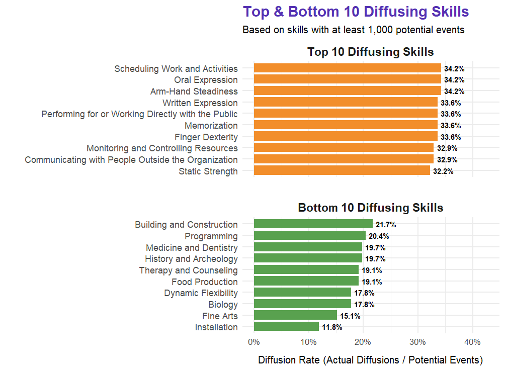{out-width="100%"}

:::

:::

## Descriptive Findings (2): Diffusion Rates by Skill Type (Cluster)

::: {.columns}

::: {.column width="60%"}
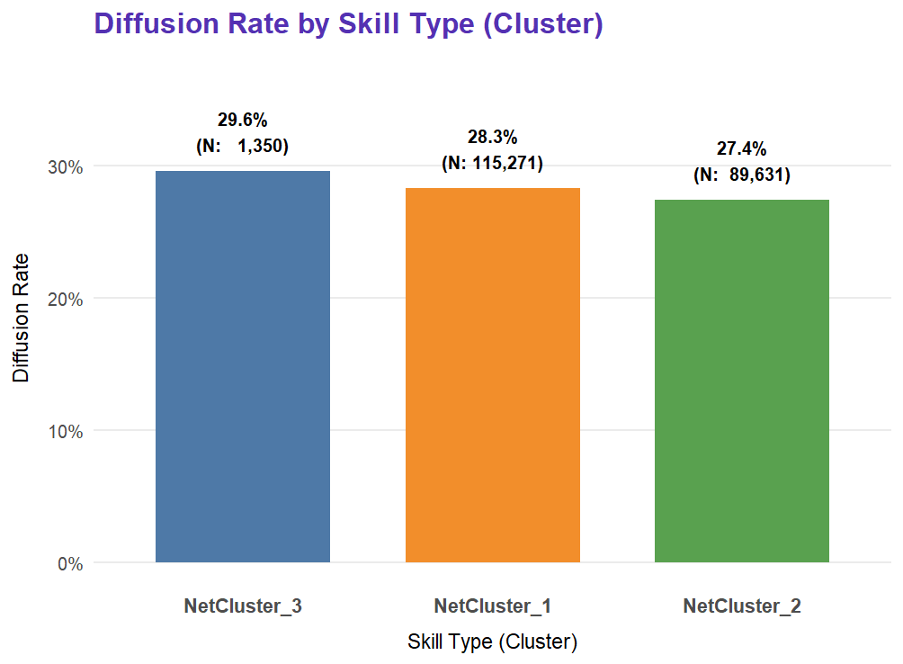{out-width="100%"}

:::

::: {.column width="40%"}
* **Relative Diffusiveness:**
    * `NetCluster_3` ("Mathematics"): **~29.6%** (1,350 actual / 4,560 potential events)
    * `NetCluster_1` (Socio-Cognitive/Managerial): **~28.3%** (115,271 actual / 406,904 potential events)
    * `NetCluster_2` (Sensory-Physical/Technical): **~27.4%** (89,631 actual / 326,648 potential events)

:::

:::

## Descriptive Findings (3): Diffusion Rates by Skill Status
::: {.columns}

::: {.column width="40%"}
**Key Insights & Observations:**

* **Similar Raw Rates:**
    * `MediumStatus` Skills: **~28.3%** (59,340 actual / 209,608 potential)
    * `HighStatus` Skills: **~27.9%** (66,351 actual / 237,880 potential)
    * `LowStatus` Skills: **~27.7%** (80,561 actual / 290,624 potential)
:::

::: {.column width="60%"}
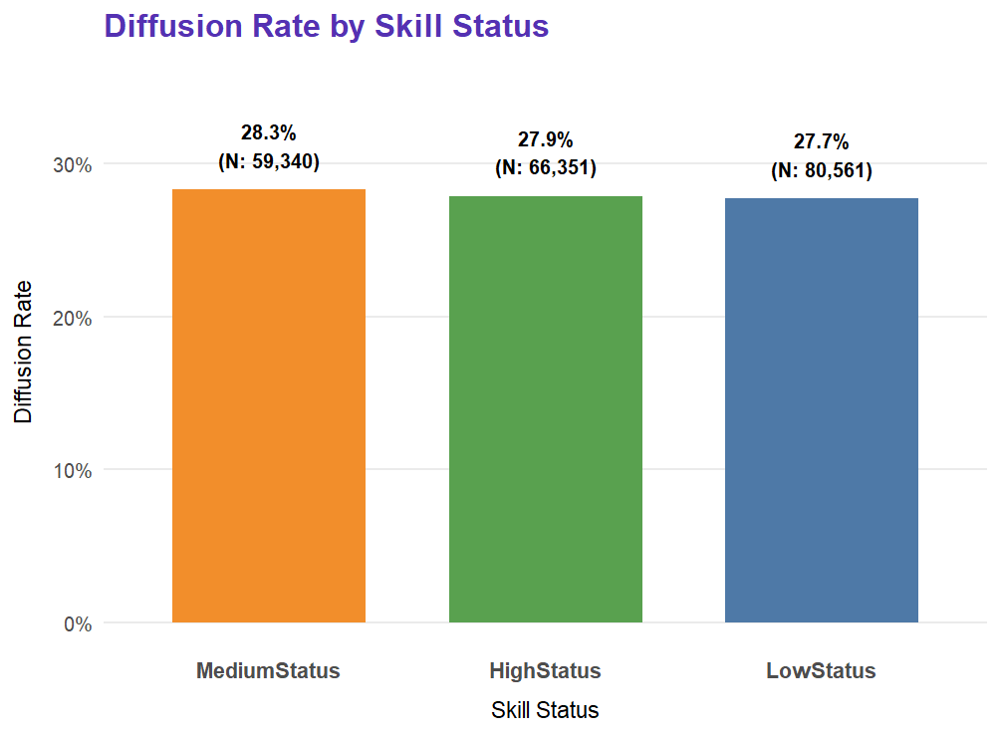{out-width="100%"}
:::

:::

## Descriptive Findings (4): Skill Cluster Characterization - Status Composition

::: {.columns}
::: {.column width="60%"}

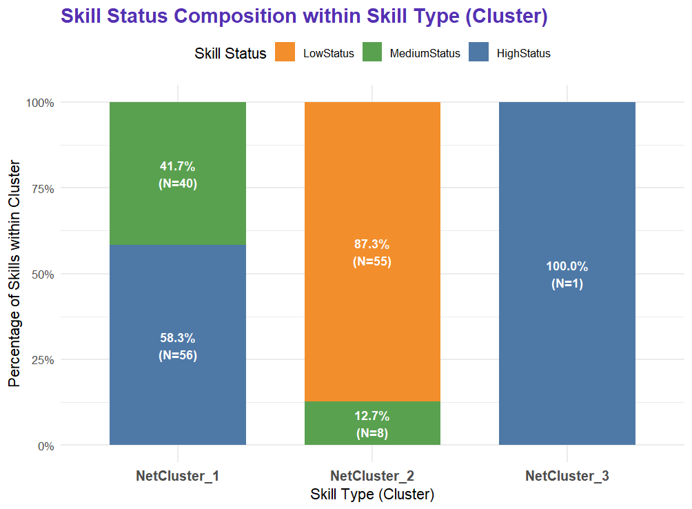{out-width="100%"}

:::

::: {.column width="40%"}
* **`NetCluster_1` (Socio-Cognitive & Managerial; 96 skills):**
    * Composed **exclusively of `HighStatus` (58.3%, N=56) and `MediumStatus` (41.7%, N=40) skills.**

* **`NetCluster_2` (Sensory-Physical, Technical & Operative; 63 skills):**
    * Overwhelmingly comprised of **`LowStatus` skills (87.3%, N=55)**, with a smaller component of `MediumStatus` skills (12.7%, N=8). 

* **`NetCluster_3` ("Mathematics"; 1 skill):**
    * The single skill, "Mathematics," is classified as **`HighStatus`**.
:::
:::

## Global Diffusion Patterns: Evidence for "Skill Escalation" 

::: {.columns}

::: {.column width="50%"}
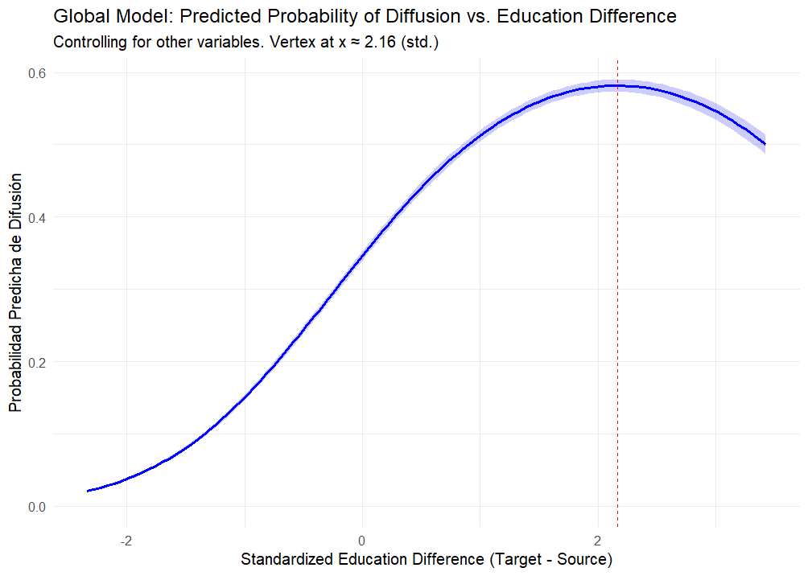{out-width="100%"}

* **Key Finding (H1a):** Diffusion probability peaks when target occupations are **~2.16 SDs higher in education** than source occupations (inverted U-shape).
* **Implication:** Skills predominantly "climb" educational hierarchies, sharpening boundaries around higher-education roles.

:::

::: {.column width="50%"}
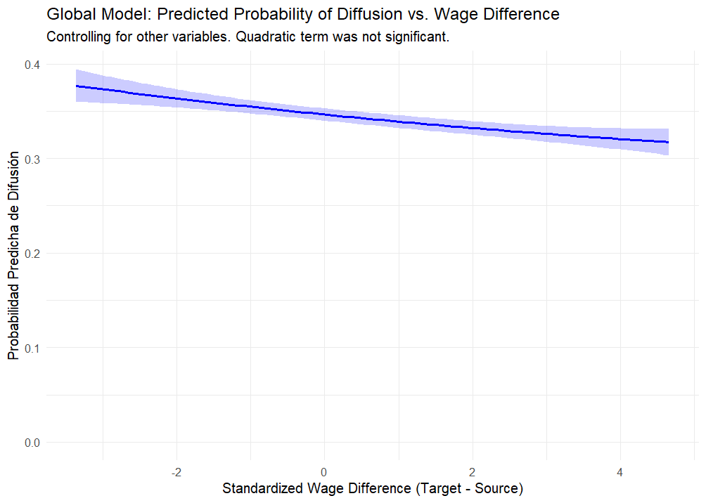{out-width="100%"}

* **Key Finding (H1b nuanced):** Globally, quadratic effect for wage difference was not significant. The linear term suggests a slight **decrease** in diffusion probability with larger *upward* wage gaps (Target earns more).
* **Implication:** No strong global evidence for wage "escalation" as the primary mode for the average skill; suggests heterogeneity (explored next).

:::

:::

## Heterogeneous Pathways (1): NetCluster_1 (Socio-Cognitive & Managerial Skills)

We now examine the diffusion dynamics specifically for skills within `NetCluster_1`. This cluster predominantly comprises **`HighStatus` (58%) and `MediumStatus` (42%) socio-cognitive and managerial skills.**

::: {.columns}
::: {.column width="50%"}
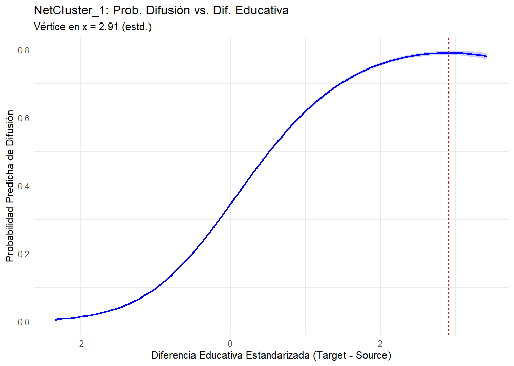{out-width="100%"}
:::

::: {.column width="50%"}
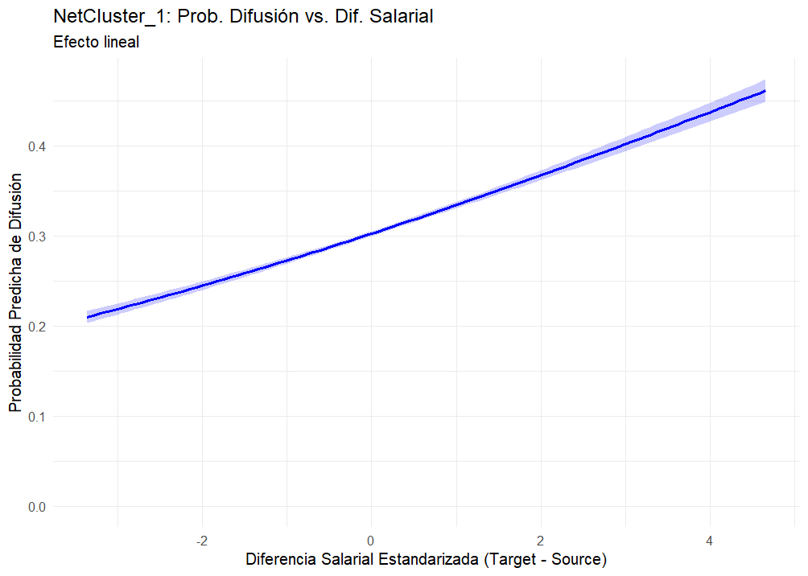{out-width="100%"}

:::
:::

## Heterogeneous Pathways (1): NetCluster_1 (Socio-Cognitive & Managerial Skills)

* **Key Finding (H1a):** A pronounced **inverted U-shape (∩)**. Diffusion probability is maximized when target occupations are **+2.91 SDs higher in education** than source occupations.

* **Insight:** Socio-cognitive skills exhibit the **largest optimal upward educational jump** among all clusters, strongly defining and sharpening educational boundaries for accessing roles that demand these high-level competencies.

* **Key Finding (H1b):** A clear **positive linear relationship**. Diffusion of these skills is significantly more probable towards target occupations with **higher wages** than the source.

* **Insight:** `NetCluster_1` skills are strongly associated with "wage escalation," suggesting they are key conduits to, or components of, higher-paying occupational roles.

* Skills in this socio-cognitive/managerial cluster are powerful "escalators" in the occupational hierarchy, associated with significant upward jumps in both education and wages. Their ability to diffuse across greater structural distances, especially when originating from high-status (education and wage) sources, points to their critical role in enabling significant career and occupational transformations.

## Heterogeneous Pathways (2): NetCluster_2 (Sensory-Physical, Technical & Operative Skills)

Next, we analyze skill diffusion dynamics for `NetCluster_2`. This cluster is predominantly composed of **`LowStatus` (87%) and some `MediumStatus` (13%) sensory-physical, technical, and operative skills.**

::: {.columns}
::: {.column width="50%"}
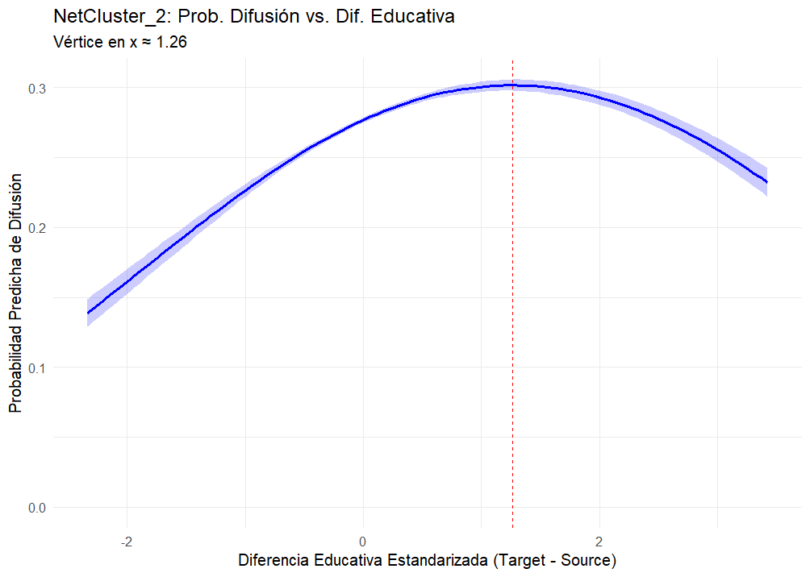{out-width="100%"}

:::

::: {.column width="50%"}
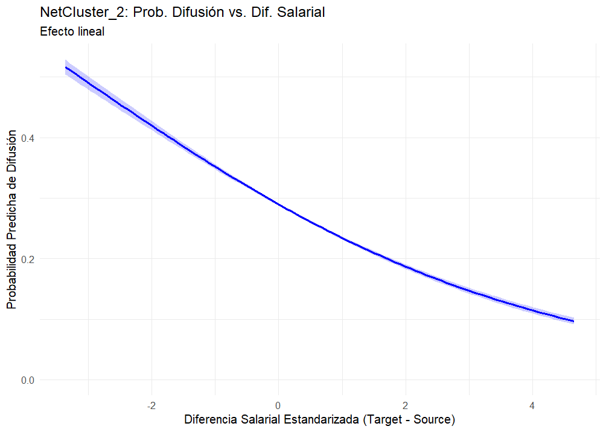{out-width="100%"}

:::

:::

## Heterogeneous Pathways (2)

* **Key Finding (H1a):** Still an **inverted U-shape (∩)**, but flatter and peaking earlier. Diffusion probability is maximized when target occupations are **+1.26 SDs higher in education**. Max probability is ~0.31.

* **Principal Insight:** While still favoring upward educational trajectories, `NetCluster_2` skills are associated with the **smallest optimal educational jump**. This suggests more incremental educational pathways or a lesser role for large formal educational gaps in their diffusion, potentially reinforcing boundaries differently than C1 skills.

* **Key Finding (H1b):** A clear **negative linear relationship**. Diffusion of `NetCluster_2` skills is significantly more probable towards target occupations with **lower (or similar) wages** than the source.

* **Principal Insight:** This contrasts sharply with C1/C3. These skills do not show "wage escalation"; their diffusion is associated with movements into less or similarly remunerated roles, suggesting a different value configuration process.

Skills in this sensory-physical/technical cluster follow a distinct diffusion logic: they exhibit a modest "educational escalator" effect but are associated with **horizontal or downward wage trajectories**. Unlike socio-cognitive skills, their diffusion is strongly constrained by structural similarity (they don't easily "bridge" distant domains) and is more likely if they originate from source occupations that are not at the top end of the wage scale for this cluster. 

## Heterogeneous Pathways (3): NetCluster_3 (Mathematics Skills)

Finally, we examine `NetCluster_3`, which uniquely consists of a single, foundational skill: **"Mathematics," classified as `HighStatus`**.

::: {.columns}
::: {.column width="50%"}
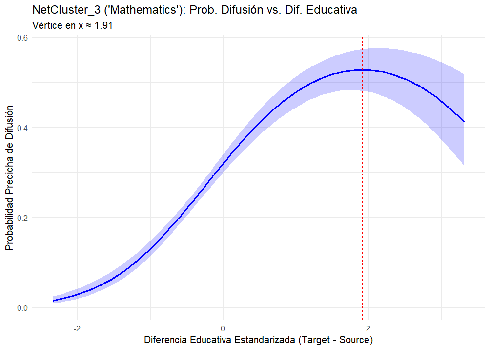{out-width="100%"}

:::

::: {.column width="50%"}
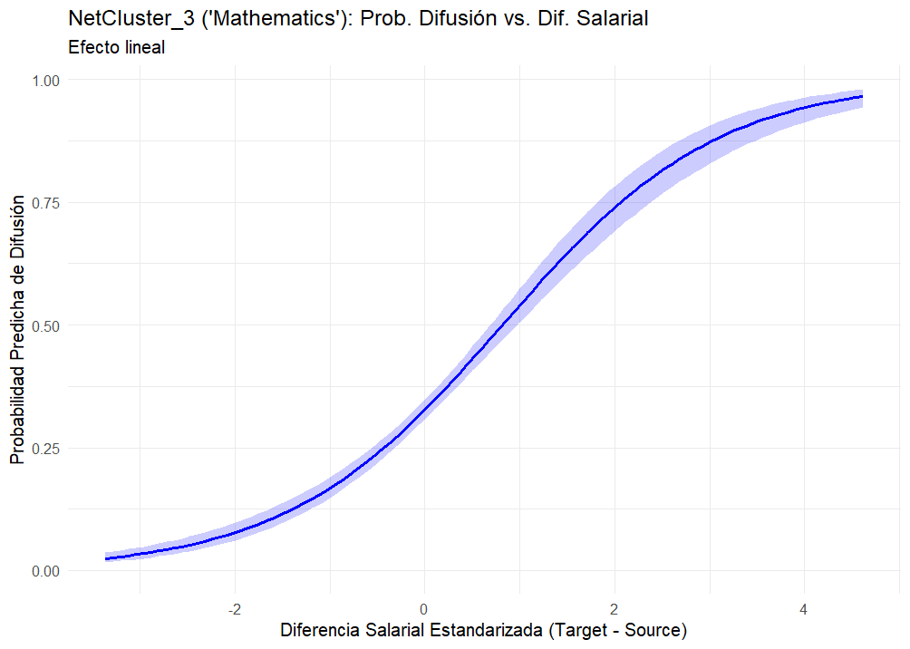{out-width="100%"}

:::
:::

## Heterogeneous Pathways (3)

* **Key Finding (H1a):** A clear **inverted U-shaped (∩)** relationship. Diffusion probability for "Mathematics" is maximized when target occupations are **+1.91 SDs higher in education**. Max probability is ~0.55.

* **Principal Insight:** Even for this foundational skill, diffusion is not simply horizontal but follows an "educational escalator," peaking at a significant upward jump. This reinforces the idea of educational boundaries being sharpened by the adoption of critical, high-status skills.

* **Key Finding (H1b):** A very strong **positive linear relationship**. The diffusion of "Mathematics" is overwhelmingly more probable towards target occupations with substantially **higher wages**.

* **Principal Insight:** "Mathematics" exhibits the most potent "wage escalation" tendency among the clusters. Its adoption is strongly tied to roles with significantly higher economic rewards, highlighting its high market valuation.

As a foundational, high-status skill, "Mathematics" exhibits powerful "escalator" dynamics, diffusing most effectively to roles representing significant advancements in both education and, especially, wages. Its ability to transcend structural distance, particularly when originating from high-status sources, highlights its critical role as a transferable and highly valued competency in the labor market, capable of reconfiguring skill demands across diverse occupational niches.

## Synthesizing Model Findings: Differentiated Skill Escalation in Action

Our regression models (global, and segmented) provide robust evidence for our "Differentiated Skill Escalation & Boundary Articulation" thesis. **Key Finding:** The "rules" governing skill diffusion and its impact on occupational hierarchies are not uniform but are **highly contingent on the type of skill (cluster)**.

::: {style="font-size: 17px;"}
| Diffusion Predictor                      | Global Model (`model3`) | `NetCluster_1` (Socio-Cog.) | `NetCluster_2` (Sensory-Phys.) | `NetCluster_3` (Mathematics) |
| :--------------------------------------- | :----------------------: | :--------------------------: | :-----------------------------: | :---------------------------: |
| **Educational Difference (Target-Source)** | **∩** (Peak at +2.16 SD) | **∩** (Peak at +2.91 SD)     | **∩** (Peak at +1.26 SD)      | **∩** (Peak at +1.91 SD)      |
| *Implication for H1a* | Strong Upward Escalator  | Strongest Upward Escalator   | Modest Upward Escalator       | Strong Upward Escalator       |
| **Wage Difference (Target-Source)** | **-** (Linear, weak)     | **+** (Linear, strong)       | **--** (Linear, strong)         | **++** (Linear, very strong)  |
| *Implication for H1b* | Ambiguous Globally       | Clear Wage Escalation        | Wage De-escalation/Horizontal | Strongest Wage Escalation     |
| **Structural Distance (Dissimilarity)** | **--** (Barrier)         | **+** (Bridge, Unexpected!)  | **--** (Strong Barrier)         | **+** (Bridge, Unexpected!)   |
| *Implication for H1c* | Barrier Overall          | Boundary Permeation          | Boundary Reinforcement        | Boundary Permeation           |
| **Source Education (Higher is better)** | **++** | **+++** | **+** | **++** |
| **Source Wage (Higher is better)** | NS                       | **+** | **--** | **++** |
| **Skill Status (LowStatus is ref.)** | Med (-), High (--)       | High (-) vs. Med             | Med (-) vs. Low/High          | (Omitted)                     |
:::

## Summary of Findings I

1.  **Universal "Educational Escalator" with Varying Intensity (H1a):**
    * All skill types predominantly diffuse "upwards" to target occupations requiring significantly higher education. This suggests a widespread mechanism of skill-based upskilling and credential-based boundary sharpening.
    * The *magnitude* of this optimal upward jump varies systematically: largest for Socio-Cognitive skills (C1), intermediate for Mathematics (C3), and smallest for Sensory-Physical skills (C2).

2.  **Divergent Wage Trajectories & Value Reconfiguration (H1b):**
    * Socio-Cognitive (C1) and Mathematics (C3) skills are associated with significant "wage escalation," flowing to higher-paying target occupations.
    * In stark contrast, Sensory-Physical (C2) skills tend to diffuse to occupations with similar or *lower* wages than their source.
    * *Importance:* This reveals different economic valuation pathways. C1 & C3 skills appear to be key assets for accessing higher economic rewards, while C2 skills do not function this way.

## Summary of Findings I

3.  **Heterogeneous Permeability of Structural Boundaries (H1c):**
    * For Sensory-Physical skills (C2), greater structural dissimilarity (occupations being very different in their overall skill profiles) strongly *hinders* diffusion, as expected. These skills move between similar niches.
    * Counter-intuitively, for Socio-Cognitive (C1) and Mathematics (C3) skills, greater structural dissimilarity is associated with *higher* diffusion probability.
    * *Importance:* This suggests that C1 and C3 skills are highly transferable, can act as "bridges" between disparate occupational domains, or are "pulled" into diverse roles undergoing transformation. This challenges simple notions of homophily-driven diffusion for these skill types and points to different mechanisms of boundary articulation.

4.  **The Power of Origin:** Skills originating from higher-education sources are generally more diffusive (strongest for C1/C3). The effect of source wage varies: positive for C1/C3, but negative for C2.

**Overall Theoretical Implication:** The diffusion of skills is not a monolithic process. It is a set of **differentiated "value cascades" or "escalation trajectories"** whose rules, mechanisms, and outcomes are contingent on the *type* of skill and its interplay with the existing occupational structure. This provides a nuanced understanding of how skill-based stratification is dynamically reproduced and reconfigured.

## Strategic Next Steps for this Research Program:

1.  **Integrating Supply-Side Dynamics (Theoretical & Empirical Deepening):**
    * Process **IPUMS CPS data to construct inter-occupational worker flow metrics** for the 2015-2023 period.
    * Incorporate worker flow as a predictor (and potentially an outcome) in diffusion models to distinguish and analyze the **co-constitutive interplay of demand-side (skill adoption by occupations) and supply-side (worker mobility) mechanisms**.
2.  **Further Exploration of Heterogeneity & Mechanisms:**
    * **Deep Dive into the "Positive Structural Distance" Effect:** For C1 & C3 skills, further investigate why diffusion to *more dissimilar* occupations is more likely. Are these skills "bridging" previously disconnected parts of the Skill Blau Space? What are the characteristics of these distant target occupations?
    * **Test H2 (Filtration Effect) & H3 (Positional Valuation):** Operationalize and test your remaining hypotheses, potentially segmenting by `skill_type`.
    * **Analyze H4 (Temporal Intensification of Modularity):** Requires constructing skill/occupation networks for earlier periods (e.g., 2005 from O\*NET) and calculating modularity.
3.  **Exploring Further Dimensions of Inequality:**
    * Investigate how **gender composition** of source/target occupations (or gender of transitioning workers, once CPS data is integrated) moderates skill diffusion trajectories and valuation.

# REFERENCES {background-color="#2c3e50" color="white" .center .middle}

## References {.scrollable}

::: {#refs}
:::