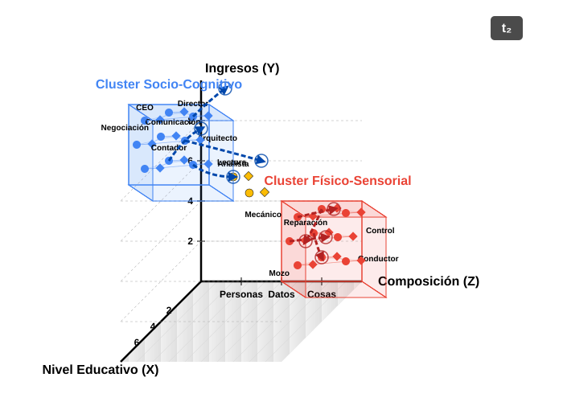

# I. THE PUZZLE {background-color="#2c3e50" color="white" .center .middle}

## The Puzzle: Labor Market Dynamics & Persistent Inequality

::: {.r-fit-text style="font-size: 60px; text-align: center; margin-top: 4em;"}
- Contemporary labor markets are characterized by unprecedented dynamism: technological advancements, globalization, and evolving industrial landscapes continually reshape the world of work [@kalleberg2011; @autor2015].

- Despite this flux, foundational structures of occupational hierarchy and socio-economic inequality exhibit remarkable **persistence and adaptive resilience** [@tilly1998].

:::


## The polarization of the labor market

::: {.r-fit-text style="font-size: 60px; text-align: center; margin-top: 2em;"}
- The **polarization of the labor market** is a well-documented phenomenon, where the demand for high-skill and low-skill jobs increases, while middle-skill jobs decline.

- This polarization is often attributed to **technological change** and **globalization**, which have led to the **devaluation of certain skills** and the **revaluation of others**.

- U.S. job growth from the 1980s to 2010s was characterized by the outsized growth of low-wage service jobs, particularly for women and nonwhite workers

- However, the **mechanisms** underlying these processes remain poorly understood, particularly in terms of how they interact with **occupational boundaries** and **status hierarchies**.
:::


## The question

::: {.r-fit-text style="font-size: 60px; text-align: center; margin-top: 4em;"}
- How does the interplay between skill diffusion, occupational boundaries, and skill valuations actively (re)produce and transform social stratification within dynamic ocupational markets?
:::


## The Occupational Skill Space

- To investigate these mechanisms, we adopt a **process-relational and ecological perspective**, conceptualizing the labor market as a multi-dimensional **"Occupational Skill Space"**:

  - This space is analogous to a **"Blau Space"** [@blau1977; @mcpherson_blau_2004], where dimensions are defined by   distributions of critical resources and characteristics – primarily **skills**, but also   associated educational prerequisites and wage levels.
  
  - Within this space, **occupations function as "niches"** [@popielarz2007], each defined by its   unique bundle of skill requirements and its position within the broader status hierarchy.
  
  - **Skills (defined as O\*NET KSA - Knowledge, Skills, Abilities)** are dynamic resources that   **flow (diffuse)** along specific **trajectories** between these occupational niches   [@alabdulkareem2018].


## The Occupational Skill Space II


::: {.columns style="font-size: 200px; text-align: center; margin-top: 6em;"}

::: {.column width="50%"}
{out-width="100%"}

:::

::: {.column width="50%"}
{out-width="100%"}

:::
:::


## 1. How Do Skills Move? Pathways and Filters
*(Trajectory Channeling & Filtration)*

:::nonincremental
The movement of skills between jobs isn't random. It follows certain "pathways" or routes, influenced by:
:::

:::incremental
-   **Existing Job Hierarchies:**
    -   Differences in required education.
    -   Differences in pay levels.
    *(e.g., It's often easier to move to jobs with similar requirements than to make big leaps in education or status).*

-   **Job Similarity (Structural Affinity):**
    -   How similar the skill profiles are between one job and another.
    *(e.g., It's more common to move to a job that requires skills you already have or very related ones).*
:::


## 2. Job Boundaries: How Are They Shaped by Skill Movements?
*(Boundary Articulation via Trajectories)*

:::nonincremental
The way skills move between jobs helps define or change the "boundaries" between different types of occupations:
:::

:::incremental
-   **Clearer Boundaries (Sharpening):**
    -   When dominant skill movements involve big "leaps" (e.g., requiring much more education or a significant status change).

-   **Stronger Boundaries (Reinforcement):**
    -   When skills primarily transfer between very similar types of jobs.

-   **Crossable Boundaries (Bridging/Permeation):**
    -   When highly transferable skills allow people to move between quite different types of jobs.
:::


## 3. Skill Value: How Does It Change Based on Its "Journey"?
*(Positional Revaluation *through* Trajectories)*

:::nonincremental
The value (both economic and symbolic) of a skill can change based on the paths it takes as it moves between jobs or as people acquire it:
:::

:::incremental
-   **Pathways Matter:** A skill's value is affected by how it predominantly moves or is acquired in the labor market.

-   **Example: "Educational Escalation"**
    -   If a skill starts to be primarily learned through higher education (e.g., a university degree), society may see it as more valuable or prestigious.
:::


# II. METHODOLOGY {background-color="#2c3e50" color="white" .center .middle}

## Data Source 

::: {.r-fit-text style="font-size: 60px; text-align: center; margin-top: 2em;"}
  - We will use the **O\*NET database**, which provides detailed information on job requirements, including skills, education, and wages.
  - We will also use the **U.S. Census Bureau's American Community Survey (ACS)** to analyze labor market dynamics and occupational mobility.
  - **IPUMS-CPS** data will be used to analyze the educational and occupational trajectories of individuals in the labor market.
:::


## Occupational - Skill Space

* **Occupational Skill Profiles:**
    * Each occupation $j$ is defined by a quantitative vector of O\*NET skill importance/level values, $onet(j,s)$, representing its reliance on each skill $s$.
    * **Intuition:** This vector acts as a "skill fingerprint" for each occupation, detailing its specific demands.

* **Revealed Comparative Advantage (RCA):**
    * **Purpose:** To measure an occupation's *relative specialization* in a skill, identifying if it uses that skill more intensively than the average occupation.
    * **Calculation:** For skill $s$ in occupation $j$:
        $$rca(j,s) = \frac{\text{Share of skill } s \text{ in occupation } j\text{'s total skill needs}}{\text{Share of skill } s \text{ in the entire system's total skill needs}}$$
        Where:
        * Numerator: $(onet(j,s) / \sum_{s' \in S} onet(j,s'))$
        * Denominator: $(\sum_{j' \in J} onet(j',s) / \sum_{j' \in J, s'' \in S} onet(j',s''))$

## Occupational - Skill Space II

* **Interpretation:**
        * $rca(j,s) > 1$: Occupation $j$ has a comparative advantage in skill $s$; the skill is "overexpressed" or "effectively used" (denoted $e(j,s)=1$). This highlights skills that distinctively characterize the occupation.
        * $rca(j,s) \le 1$: The skill is not a distinctive specialty for occupation $j$ relative to the average.
    * **Benefit:** Normalizes raw O\*NET scores to filter out ubiquitous skills and spotlight an occupation's key distinguishing skill requirements.


## Skill Networks

* **Clusters (`skill_type`):**
    * **Skill-Skill Complementarity Network (Skillscape):** A network is constructed where nodes are skills. The weight of an edge between two skills, $\theta(s,s')$, represents their complementarity. This is calculated as the minimum of the conditional probabilities that both skills are effectively used together in the same occupations:
        $$\theta(s,s') = \frac{\sum_{j \in J} e(j,s) \cdot e(j,s')}{max(\sum_{j \in J} e(j,s), \sum_{j \in J} e(j,s'))}$$
        This captures how skills support each other, either by boosting productivity or through ease of simultaneous acquisition.
    * **Louvain Community Detection:** This unsupervised algorithm is applied to the skill complementarity network to identify clusters of skills (skill types). It works by greedily optimizing modularity, comparing the density of connections within a community to that between communities, without pre-specifying the number of clusters. 


## Identifying Diffusion Events (`diffusion = 1`)

* **Core Idea:** A skill diffuses from an occupation already using it (source) to an occupation that newly adopts it (target) between a `start_year` and `end_year`.

* **Process:**
    1.  **Effective Skill Use:** Determine if a skill is "effectively used" in each occupation for both start and end years (Revealed Comparative Advantage - RCA > 1).
    2.  **Identify Sources:** List occupations effectively using the skill in the `start_year`.
    3.  **Identify New Adopters (Targets):** List occupations effectively using the skill in the `end_year` BUT NOT in the `start_year`.
    4.  **Positive Event:** For a given skill, a positive diffusion event (`diffusion = 1`) is created for every pair of (source occupation, new adopter target occupation).


## Constructing Non-Diffusion Events (`diffusion = 0`)

* **Core Idea:** A skill does *not* diffuse from a source occupation to a target occupation if the target fails to effectively use the skill by the `end_year`.

* **Process:**
    1.  **Effective Skill Use & Sources:** Same as for positive events (RCA > 1 in `start_year` for sources).
    2.  **Identify Potential Non-Adopters (Targets):** List all relevant occupations that are NOT effectively using the skill in the `end_year`.
    3.  **Negative Event:** For a given skill, a negative diffusion event (`diffusion = 0`) is created for every pair of (source occupation, potential non-adopter target occupation).
    4.  **Exhaustive Generation:** The script generates *all* such possible negative (non-diffusion) events.


## Key Variables for Modeling Skill Diffusion Trajectories

::: {style="font-size: 16px;"}
| Variable Category        | Variable Name(s) in Data (Model version might be transformed, e.g., standardized) | Operationalization & Description                                                                                                                               |
| :----------------------- | :--------------------------------------------------------------------------------- | :------------------------------------------------------------------------------------------------------------------------------------------------------------- |
| **Dependent Variable** | `diffusion`                                                                        | Binary (1/0): Indicates if a skill was newly adopted (RCA > 1 in 2023, but not effectively used in 2015) by the target occupation, from a 2015 source occupation. |
| **Skill Characteristics**| `skill_type`                                                                       | Factor: Classification of the skill (e.g., `NetCluster_1`, `NetCluster_2`, `NetCluster_3` based on network analysis, or other types like `empirical_high_use`, `no_clasificada`). |
|                          | `skill_status`                                                                     | Factor: Categorical status (e.g., `LowStatus`, `MediumStatus`, `HighStatus`, `UnknownStatus`) based on the average wage/education of occupations effectively using the skill in 2023. |
| **Edu. Status Differential** | `education_diff_abs` <br> (`education_diff_rel`)                                   | Numeric: Absolute difference (Target Edu - Source Edu). `education_diff_rel` is ((Target Edu / Source Edu) - 1). Often standardized for modeling (e.g., `education_diff_abs_dir_std`) and potentially squared. |
| **Wage Status Differential** | `wage_diff_abs` <br> (`wage_diff_rel`)                                              | Numeric: Absolute difference (Target 2023 Wage - Source 2015 Wage). `wage_diff_rel` is ((Target Wage / Source Wage) - 1). Often standardized for modeling (e.g., `wage_diff_abs_dir_std`) and potentially squared. |
| **Structural Proximity** | `structural_distance`                                                              | Numeric: Jaccard distance calculated on binarized (RCA > 1) occupational skill profiles. Skill profiles for distance use 2023 data with 2015 as fallback. Often standardized for modeling (e.g., `structural_distance_std`). |
| **Source Occ. Attributes**| `source_education`                                                                 | Numeric: Education score (e.g., `Edu_Score_Weighted`) of the source occupation. Often standardized for modeling (e.g., `source_education_std`).                      |
|                          | `source_wage`                                                                      | Numeric: Median wage of the source occupation in the `year_emission` (2015). Often standardized for modeling (e.g., `source_wage_std`).                          |
| **Control** | `target_wage_imputed_indicator`                                                    | Factor/Binary: Indicates if the target occupation's wage for `year_adoption` (2023) was imputed. (Presence depends on upstream `occupation_attributes_global` data). |
:::


## Hypothetical Data Example 


```{r}

#| warning: false
#| include: false

library(knitr)
library(tibble)

all_events_sample <- tribble(
  ~source,      ~target,      ~skill_name,         ~skill_type,     ~diffusion, ~year_emission, ~year_adoption, ~data_value_source, ~data_value_target, ~source_education, ~source_wage, ~target_education, ~target_wage, ~structural_distance, ~education_diff_abs, ~wage_diff_abs, ~skill_status,
  "11-1011.00", "13-1111.00", "Critical Thinking",   "NetCluster_1",  1,          2015,            2023,            4.5,                  4.2,                  4.8,                120000,        4.5,                95000,         0.35,                   -0.3,                  -25000,           "HighStatus",
  "11-1011.00", "15-1252.00", "Critical Thinking",   "NetCluster_1",  0,          2015,            2023,            4.5,                  1.5,                  4.8,                120000,        4.7,                110000,        0.62,                   -0.1,                  -10000,           "HighStatus",
  "11-1011.00", "29-1141.00", "Active Listening",    "NetCluster_1",  1,          2015,            2023,            4.2,                  4.0,                  4.8,                120000,        5.0,                85000,         0.40,                   0.2,                   -35000,           "HighStatus",
  "13-1111.00", "11-1011.00", "Judgment",            "NetCluster_1",  0,          2015,            2023,            4.0,                  3.0,                  4.5,                95000,         4.8,                120000,        0.35,                   0.3,                   25000,            "MediumStatus",
  "13-1111.00", "15-1252.00", "Complex Prblm Solv",  "NetCluster_1",  1,          2015,            2023,            3.8,                  4.1,                  4.5,                95000,         4.7,                110000,        0.28,                   0.2,                   15000,            "MediumStatus",
  "27-1021.00", "27-1024.00", "Arm-Hand Steadiness", "NetCluster_2",  1,          2015,            2023,            4.7,                  4.5,                  3.5,                65000,         3.6,                70000,         0.15,                   0.1,                   5000,             "LowStatus",
  "27-1021.00", "49-9071.00", "Arm-Hand Steadiness", "NetCluster_2",  0,          2015,            2023,            4.7,                  2.0,                  3.5,                65000,         3.0,                55000,         0.75,                   -0.5,                  -10000,           "LowStatus",
  "49-9071.00", "51-2092.00", "Manual Dexterity",    "NetCluster_2",  1,          2015,            2023,            4.9,                  4.8,                  3.0,                55000,         2.8,                52000,         0.22,                   -0.2,                  -3000,            "LowStatus",
)

# To print the table in your Quarto document, you can use knitr::kable or other table printing packages
# For example:
knitr::kable(all_events_sample, caption = "")
# Or simply let Quarto render it if it's the last expression in the chunk

```


# REFERENCES {background-color="#2c3e50" color="white" .center .middle}

## References {.scrollable}

::: {#refs}
:::


