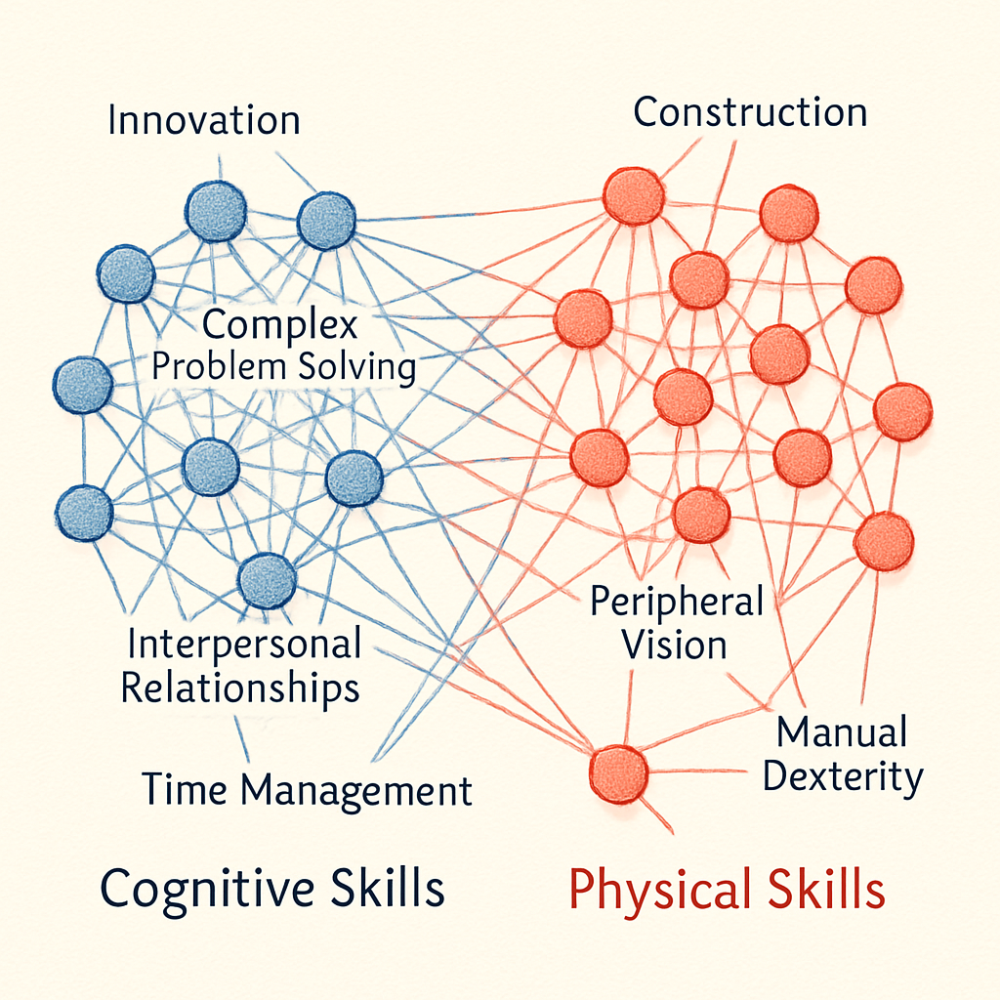
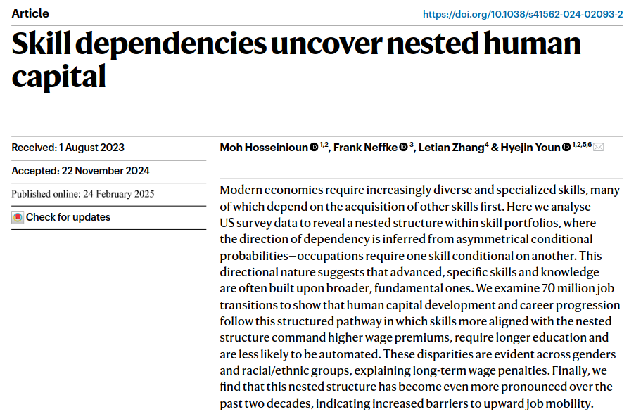
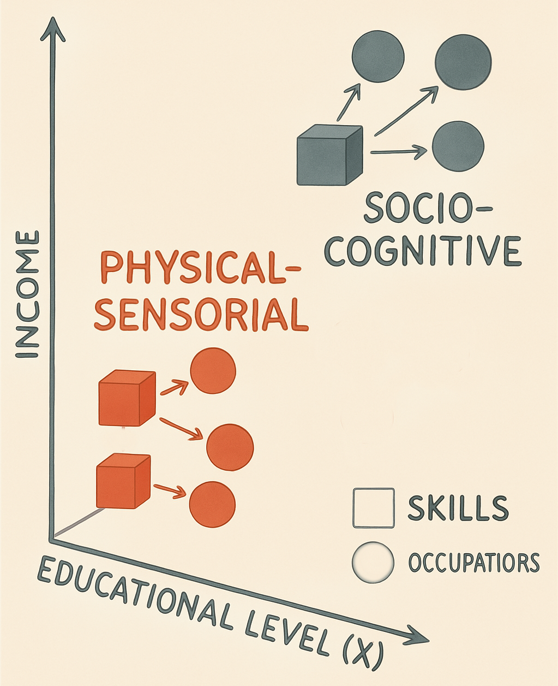
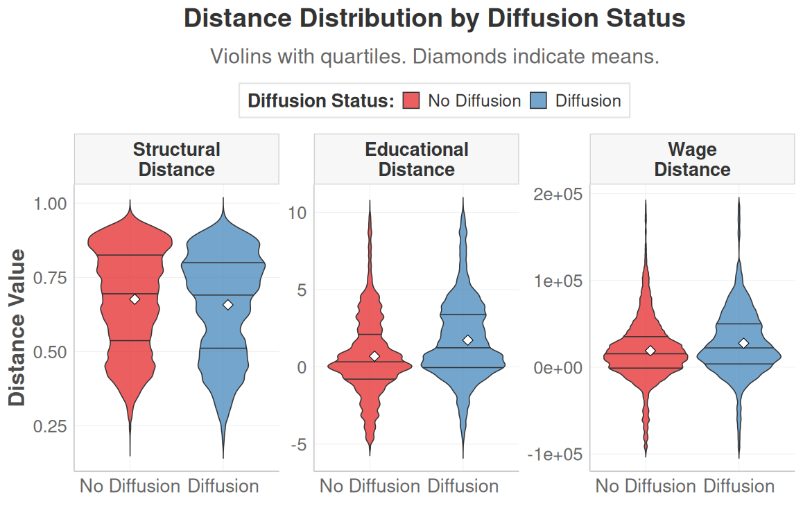
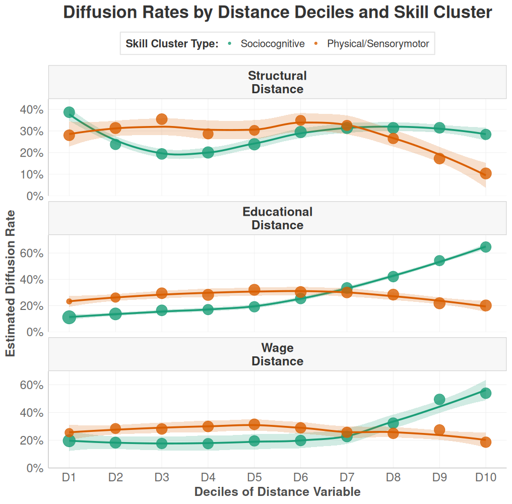
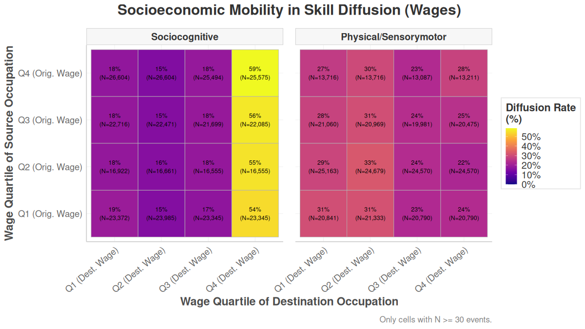
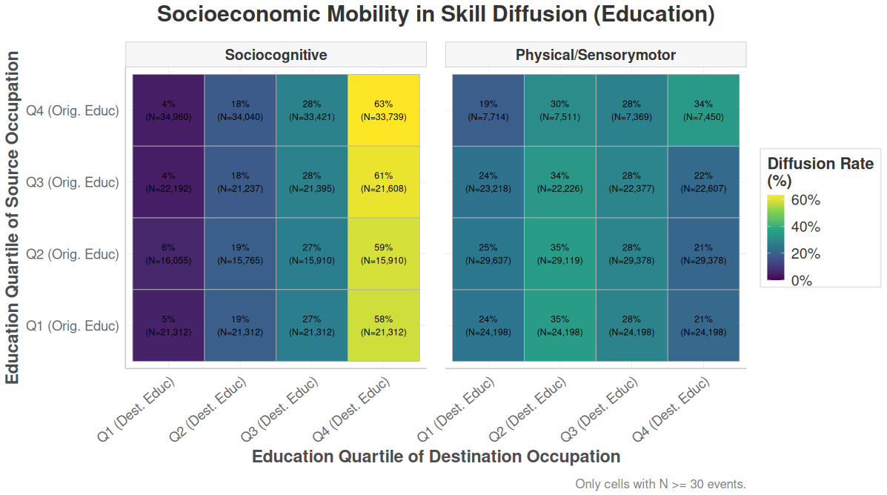
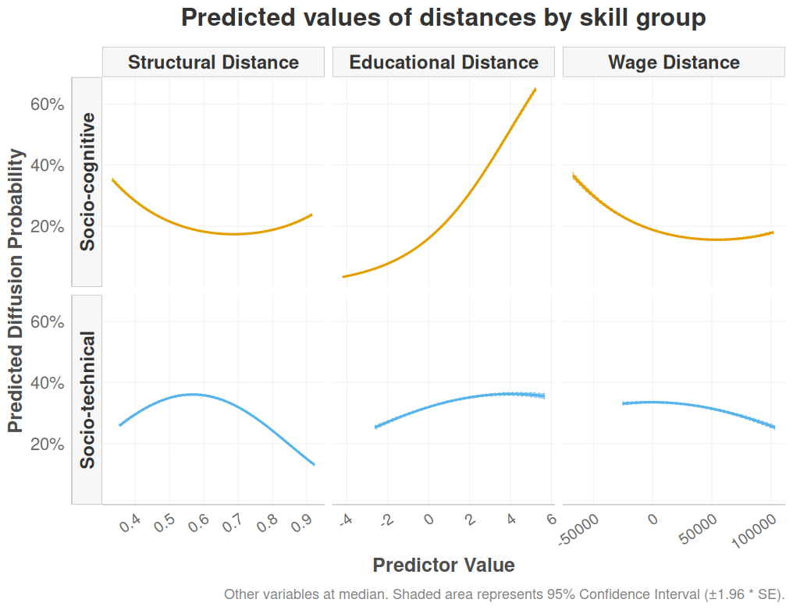

# I. THE PUZZLE {background-color="#2c3e50" color="white" .center .middle}

## The Puzzle: Labor Market Dynamics & Persistent Inequality

::: {.div style="font-size: 25px; text-align: left; margin-top: 3em;"}
- Contemporary labor markets are characterized by unprecedented dynamism: technological advancements, globalization, and evolving industrial landscapes continually reshape the world of work [@kalleberg2011; @autor2015].

- Despite this flux, foundational structures of occupational hierarchy and socio-economic inequality exhibit remarkable persistence and adaptive resilience [@tilly1998].
:::

## The polarization of the labor market

::: {.columns}
::: {.column width="50%"}
::: {.div style="font-size: 25px; text-align: left; margin-top: 5em;"}
- Demand for high-skill and low-skill jobs is increasing, while middle-skill jobs are declining. This is often referred to as job polarization.
- This polarization is attributed to technological change and globalization, which devalue certain skills and revalue others.
:::
:::

::: {.column width="50%"}
{out-width="100%"}
:::
:::

## Polarization of the labor market II 
#### Based on Alabdulkareem, et al. (2018)

{out-width="90%"}


## Some recent references

::: {.r-fit-text style="font-size: 50px; text-align: center; margin-top: 2em;"}
::: {.columns}
::: {.column width="50%"}
{out-width="100%"}
:::
::: {.column width="50%"}
{out-width="100%"}
:::
:::
:::


## The question

::: {.div style="font-size: 25px; text-align: center; margin-top: 4em;"}
How does the interplay between **skill diffusion**, **occupational boundaries**, and **skill valuations** actively (re)produce and transform social stratification within dynamic occupational markets?
:::


## Supply and Demand Dynamics
::: {.r-fit-text style="font-size: 25px; text-align: left; margin-top: 2em;"}

::: {.columns}
::: {.column width="50%"}

#### **Workers adapt to markets**

*"How do workers adapt to changing skill demands?"*

- Individual career decisions
- Skill acquisition choices  
- Job search strategies
- Human capital investment

:::


::: {.column width="50%"}

#### **Markets reshape themselves** 

*"How do skill demands create structured mobility opportunities?"*

- Occupational skill requirements
- **Systematic diffusion patterns**
- Structural adoption logics
- Semi-autonomous from individual choices

:::
:::
:::


## Demand-Side Patterns Shape Supply-Side Possibilities 

::: {.r-fit-text style="font-size: 25px; text-align: left; margin-top: 3em;"}
- If skill diffusion follows structured patterns → **mobility opportunities are structurally predetermined**

- If different skill types have distinct diffusion logics → **career destinies depend on skill type, not just skill possession**

- **Implication**: The skill diffusion process itself becomes a **stratification engine** that sorts workers into persistent hierarchies.
::: 


## The Occupational Skill Space

::: {.columns}
::: {.column width="45%"}

{out-width="30%" fig-align="center"} 

:::

::: {.column width="50%"}
::: {.div style="font-size: 22px; text-align: left; margin-top: 4em;"}

- This space is analogous to a **"Blau Space"**, where dimensions are defined by distributions of critical resources and characteristics – primarily **skills**, but also associated educational prerequisites and wage levels.

- Within this space, **occupations function as "niches"**, each defined by its unique bundle of skill requirements and its position within the broader status hierarchy.
:::
:::
:::


## Core Idea: From Static Structure to Dynamic Process

::: {.div style="font-size: 25px; text-align: left; margin-top: 4em;"}
- **Previous Research:** Shows WHAT the structure (e.g., polarization) looks like.

- **This Research:** Reveals HOW boundaries are actively constructed and status is assigned. **Through the lens of skill diffusion *between occupations***.

- **Central Insight:** Occupational boundaries and hierarchies aren't just maintained—they're dynamically (re)produced through differentiated skill adoption patterns on the demand side.
:::


## Theoretical Framework: Skill Diffusion as Boundary Work

::: {.div style="font-size: 25px; text-align: left; margin-top: 3em;"}

Our research focuses on three key aspects of how skill diffusion shapes occupational stratification:

1.  **How Skills Move:** Pathways and Filters (Trajectory Channeling & Filtration)
2.  **Job Boundaries:** How They Are Shaped by Skill Movements (Boundary Articulation via Trajectories)
3.  **Skill Value:** How It Changes Based on Its "Journey" (Positional Revaluation *through* Trajectories)

:::

## 1. How Do Skills Move? Pathways and Filters
*(Trajectory Channeling & Filtration)*

:::nonincremental
The movement of skills between jobs isn't random. It follows certain "pathways" or routes, influenced by:
:::

:::incremental
-   **Existing Job Hierarchies (Status Differentials):**
    -   Differences in required education (Educational Gatekeeping 🎓).
    -   Differences in pay levels (Economic Stratification 💰).
    *(e.g., It's often easier for skills to move to jobs with similar requirements than to make big leaps in education or status, but the *nature* of these jumps differs by skill type).*

-   **Job Similarity (Structural Affinity/Closure 🔒):**
    -   How similar the overall skill profiles are between one job and another.
    *(e.g., It's more common for skills to move to a job that requires related skills, but some skills might be better "boundary spanners" than others).*
:::

## 2. Job Boundaries: How Are They Shaped by Skill Movements?
*(Boundary Articulation via Trajectories)*

:::nonincremental
The way skills move between jobs helps define or change the "boundaries" between different types of occupations:
:::

:::incremental
-   **Clearer Boundaries (Sharpening):**
    -   When dominant skill movements involve big "leaps" (e.g., requiring much more education or a significant status change for certain skill types). This can heighten credential-based barriers.

-   **Stronger Boundaries (Reinforcement):**
    -   When skills primarily transfer between very similar types of jobs, maintaining occupational silos.

-   **Crossable Boundaries (Bridging/Permeation):**
    -   When highly transferable skills (typically cognitive/abstract) allow occupations to adopt skills from, or diffuse skills to, quite different types of jobs, potentially transforming occupational roles.
:::

## 3. Skill Value: How Does It Change Based on Its "Journey"?
*(Positional Revaluation *through* Trajectories)*

:::nonincremental
The value (both economic and symbolic) of a skill, and by extension the occupation adopting it, can change based on the paths it takes as it moves between jobs or as occupations adopt it:
:::

:::incremental
-   **Pathways Matter:** A skill's association with upward or stagnant mobility trajectories influences its perceived and actual value.
    -   **Cognitive/Sociocognitive Skills:** Tend to diffuse along paths of educational and wage escalation, reinforcing their high status.
    -   **Physical/Sensorimotor Skills:** Often diffuse along paths of lateral or stagnant mobility, contributing to their lower or less dynamic valuation.

-   **Example: "Educational Escalation"**
    -   If a skill type (e.g., cognitive) consistently diffuses towards occupations with higher educational requirements, this reinforces the idea that these skills are "elite" and their adoption signals an occupational upgrade.
:::

## Hypothesis

::: {.div style="font-size: 30px; text-align: center; margin-top: 3em;"}
Cognitive and physical skills follow fundamentally different diffusion logics regarding educational, economic, and structural distances. These differentiated patterns actively (re)produce and potentially intensify occupational polarization and stratification.
:::


# II. METHODOLOGY {background-color="#2c3e50" color="white" .center .middle}

## Data Source 

::: {.div style="font-size: 25px; text-align: left; margin-top: 3em;"}
  - We will use the **O\*NET database**, which provides detailed information on job requirements, including skills, education, and wages.
  - We will also use the **U.S. Census Bureau's American Community Survey (ACS)** to analyze labor market dynamics and occupational mobility.
  - **IPUMS-CPS** data will be used to analyze the educational and occupational trajectories of individuals in the labor market.
:::


## Occupational - Skill Space

* **Occupational Skill Profiles:**
    * Each occupation $j$ is defined by a quantitative vector of O\*NET skill importance/level values, $onet(j,s)$, representing its reliance on each skill $s$.
    * **Intuition:** This vector acts as a "skill fingerprint" for each occupation, detailing its specific demands.

* **Revealed Comparative Advantage (RCA):**
    * **Purpose:** To measure an occupation's *relative specialization* in a skill, identifying if it uses that skill more intensively than the average occupation.
    * **Calculation:** For skill $s$ in occupation $j$:
        $$rca(j,s) = \frac{\text{Share of skill } s \text{ in occupation } j\text{'s total skill needs}}{\text{Share of skill } s \text{ in the entire system's total skill needs}}$$
        Where:
        * Numerator: $(onet(j,s) / \sum_{s' \in S} onet(j,s'))$
        * Denominator: $(\sum_{j' \in J} onet(j',s) / \sum_{j' \in J, s'' \in S} onet(j',s''))$

## Occupational - Skill Space II

* **Interpretation:**
        * $rca(j,s) > 1$: Occupation $j$ has a comparative advantage in skill $s$; the skill is "overexpressed" or "effectively used" (denoted $e(j,s)=1$). This highlights skills that distinctively characterize the occupation.
        * $rca(j,s) \le 1$: The skill is not a distinctive specialty for occupation $j$ relative to the average.
    * **Benefit:** Normalizes raw O\*NET scores to filter out ubiquitous skills and spotlight an occupation's key distinguishing skill requirements.


## Skill Networks

* **Clusters (`skill_type`):**
    * **Skill-Skill Complementarity Network (Skillscape):** A network is constructed where nodes are skills. The weight of an edge between two skills, $\theta(s,s')$, represents their complementarity. This is calculated as the minimum of the conditional probabilities that both skills are effectively used together in the same occupations:
        $$\theta(s,s') = \frac{\sum_{j \in J} e(j,s) \cdot e(j,s')}{max(\sum_{j \in J} e(j,s), \sum_{j \in J} e(j,s'))}$$
        This captures how skills support each other, either by boosting productivity or through ease of simultaneous acquisition.
    * **Louvain Community Detection:** This unsupervised algorithm is applied to the skill complementarity network to identify clusters of skills (skill types). It works by greedily optimizing modularity, comparing the density of connections within a community to that between communities, without pre-specifying the number of clusters. 


## Identifying Diffusion Events (`diffusion = 1`)

* **Core Idea:** A skill diffuses from an occupation already using it (source) to an occupation that newly adopts it (target) between a `start_year` and `end_year`.

* **Process:**
    1.  **Effective Skill Use:** Determine if a skill is "effectively used" in each occupation for both start and end years (Revealed Comparative Advantage - RCA > 1).
    2.  **Identify Sources:** List occupations effectively using the skill in the `start_year`.
    3.  **Identify New Adopters (Targets):** List occupations effectively using the skill in the `end_year` BUT NOT in the `start_year`.
    4.  **Positive Event:** For a given skill, a positive diffusion event (`diffusion = 1`) is created for every pair of (source occupation, new adopter target occupation).


## Constructing Non-Diffusion Events (`diffusion = 0`)

* **Core Idea:** A skill does *not* diffuse from a source occupation to a target occupation if the target fails to effectively use the skill by the `end_year`.

* **Process:**
    1.  **Effective Skill Use & Sources:** Same as for positive events (RCA > 1 in `start_year` for sources).
    2.  **Identify Potential Non-Adopters (Targets):** List all relevant occupations that are NOT effectively using the skill in the `end_year`.
    3.  **Negative Event:** For a given skill, a negative diffusion event (`diffusion = 0`) is created for every pair of (source occupation, potential non-adopter target occupation).
    4.  **Exhaustive Generation:** The script generates *all* such possible negative (non-diffusion) events.

## Data struture 

```{r}

#| warning: false
#| include: true

library(knitr)
library(tibble)

all_events_sample <- tribble(
  ~source,      ~target,      ~skill_name,            ~skill_type,    ~diffusion, ~year_emission, ~year_adoption, ~data_value_source, ~data_value_target, ~source_education, ~source_wage, ~target_education, ~target_wage, ~structural_distance, ~education_distance, ~wage_distance, ~skill_status,  ~total_flux_workers, ~prob_transition_workers,
  "11-1011.00", "13-1111.00", "Critical Thinking",    "NetCluster_1", 1,          2015,           2023,           4.5,                4.2,                4.8,               120000,       4.5,               95000,        0.35,                 -0.3,                -25000,       "HighStatus",   550,                 0.18,
  "11-1011.00", "15-1252.00", "Critical Thinking",    "NetCluster_1", 0,          2015,           2023,           4.5,                1.5,                4.8,               120000,       4.7,               110000,       0.62,                 -0.1,                -10000,       "HighStatus",   230,                 0.06,
  "11-1011.00", "29-1141.00", "Active Listening",     "NetCluster_1", 1,          2015,           2023,           4.2,                4.0,                4.8,               120000,       5.0,               85000,        0.40,                 0.2,                 -35000,       "HighStatus",   710,                 0.22,
  "13-1111.00", "11-1011.00", "Judgment",             "NetCluster_1", 0,          2015,           2023,           4.0,                3.0,                4.5,               95000,        4.8,               120000,       0.35,                 0.3,                 25000,        "MediumStatus", 480,                 0.14,
  "13-1111.00", "15-1252.00", "Complex Prblm Solv",   "NetCluster_1", 1,          2015,           2023,           3.8,                4.1,                4.5,               95000,        4.7,               110000,       0.28,                 0.2,                 15000,        "MediumStatus", 650,                 0.19,
  "27-1021.00", "27-1024.00", "Arm-Hand Steadiness",  "NetCluster_2", 1,          2015,           2023,           4.7,                4.5,                3.5,               65000,        3.6,               70000,        0.15,                 0.1,                 5000,         "LowStatus",    1150,                0.33,
  "27-1021.00", "49-9071.00", "Arm-Hand Steadiness",  "NetCluster_2", 0,          2015,           2023,           4.7,                2.0,                3.5,               65000,        3.0,               55000,        0.75,                 -0.5,                -10000,       "LowStatus",    820,                 0.11,
  "49-9071.00", "51-2092.00", "Manual Dexterity",     "NetCluster_2", 1,          2015,           2023,           4.9,                4.8,                3.0,               55000,        2.8,               52000,        0.22,                 -0.2,                -3000,        "LowStatus",    1400,                0.28,
)

# Imprimir la tabla usando kable
knitr::kable(all_events_sample, caption = "")
```

## Model 


# III. Results {background-color="#2c3e50" color="white" .center .middle}

## Descriptives I

{out-width="100%"}


## Descriptives II

::: {.columns}
::: {.column width="50%"}
::: {.div style="font-size: 20px; text-align: left; margin-top: 2em;"}

- **Sociocognitive Skills** (Green): Exhibit remarkable resilience and 'jump' capability. They maintain diffusion across structural distances and significantly increase when crossing larger educational and wage distances. For them, distance is an opportunity.

- **Physical/Sensorymotor Skills** (Orange): Are highly sensitive and constrained by distance. Their diffusion plummets with structural distance and stagnates or falls across educational and wage distances. For them, distance is a barrier.

:::
:::

::: {.column width="50%"}
{out-width="120%"}
:::
:::


## Descriptives III

{out-width="100%"}

## Descriptives IV

{out-width="100%"}

## Descriptives V

**Two Divergent Trajectories**

- Sociocognitive Skills ("The Escalator"): Overwhelmingly flow upwards into the top socioeconomic quartile (Q4) for wages and education, regardless of their starting point. They act as a "gravitational pull" to elite occupations.
- Physical/Sensorymotor Skills ("The Lateral Drift"): Primarily circulate sideways within lower/middle quartiles (Q1-Q3), facing a "glass ceiling" that blocks significant upward mobility into Q4.

**Mechanisms at Play**

- These flows illustrate "opportunity hoarding" (Social Closure), where cognitive skills act as credentials for elite access.

- We observe a "skill gentrification" effect, as cognitive skills elevate occupational requirements, potentially displacing physical skills.

**Consequences & Key Takeaway**

- Polarization Ratchet: Skill diffusion isn't just a symptom of polarization; its directionality actively deepens it.

- Skill Type, Not Origin, Dictates Destination: Cognitive skills from any origin are "pulled" to Q4, while physical skills remain largely in lateral networks.


## Model diffusion

{out-width="40%" fig-align="center"} 

## Model diffusion II

**Sociocognitive Skills (Orange) = "Upward Educational & Moderate Structural Association"**:

- Diffusion probability increases sharply with positive educational distances (target > source).
- The relationship with structural distance is U-shaped, with the highest probability observed at moderate levels of difference.
- Diffusion shows a weak or slightly negative association with large positive wage distances.
- Observed Pattern: Diffusion is most probable under conditions of upward educational shifts and moderate structural change, largely independent of significant wage increases.

**Socio-technical Skills (Blue) = "Structural Proximity & Educational Stasis"**:

- Diffusion probability decreases consistently as structural distance grows.
- The relationship with educational distance is largely flat, indicating limited diffusion across educational divides.
- The highest probability occurs at zero or slightly negative wage distances, decreasing for larger positive distances.
- Observed Pattern: Diffusion is most probable under conditions of high structural similarity and is associated with lateral or downward wage mobility, showing strong educational constraints.


# IV. Discussion {background-color="#2c3e50" color="white" .center .middle}


## Key Findings

- Skill diffusion is not random; it exhibits asymmetric patterns strongly linked to structural conditions and skill type. 

- Higher probabilities for cognitive skill diffusion are associated with educational increases, while higher probabilities for technical skill diffusion depend heavily on structural similarity. 

- These differing structural propensities result in distinct mobility pathways, which can create 'mobility traps' and reinforce labor market inequality.

## So What?


## References {.scrollable}

::: {#refs}
:::


