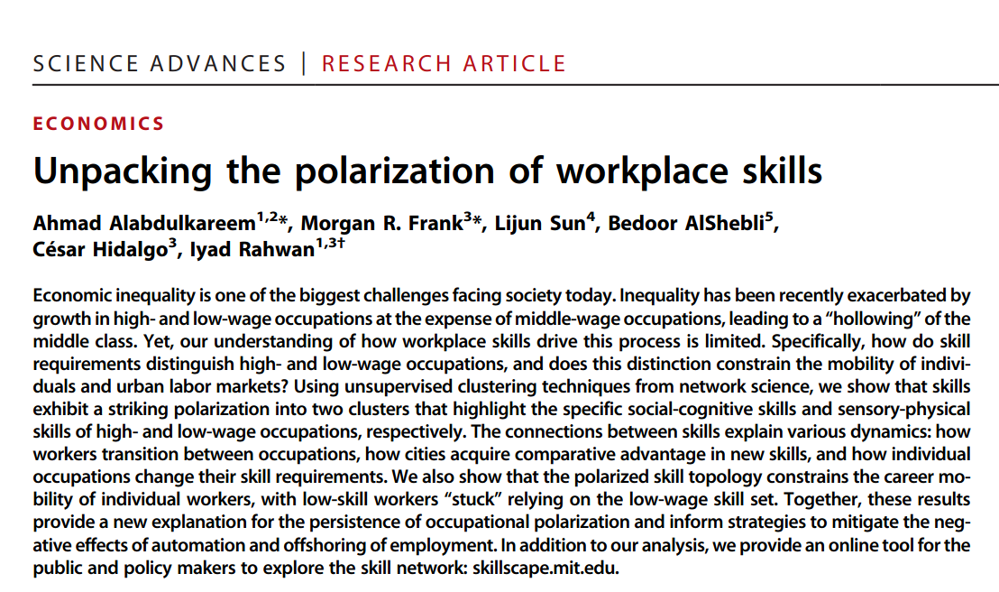
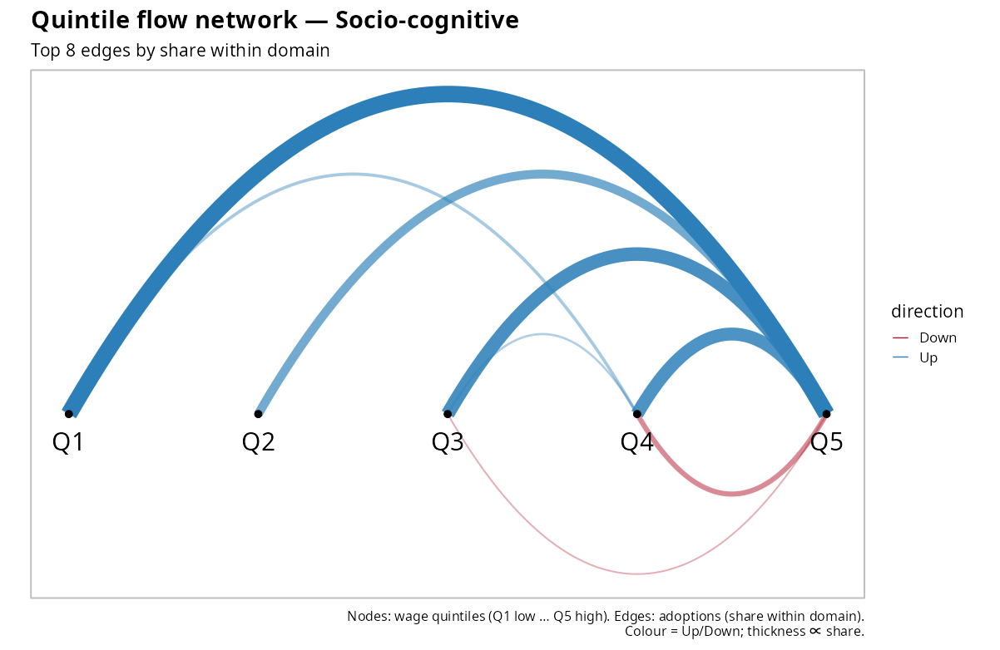
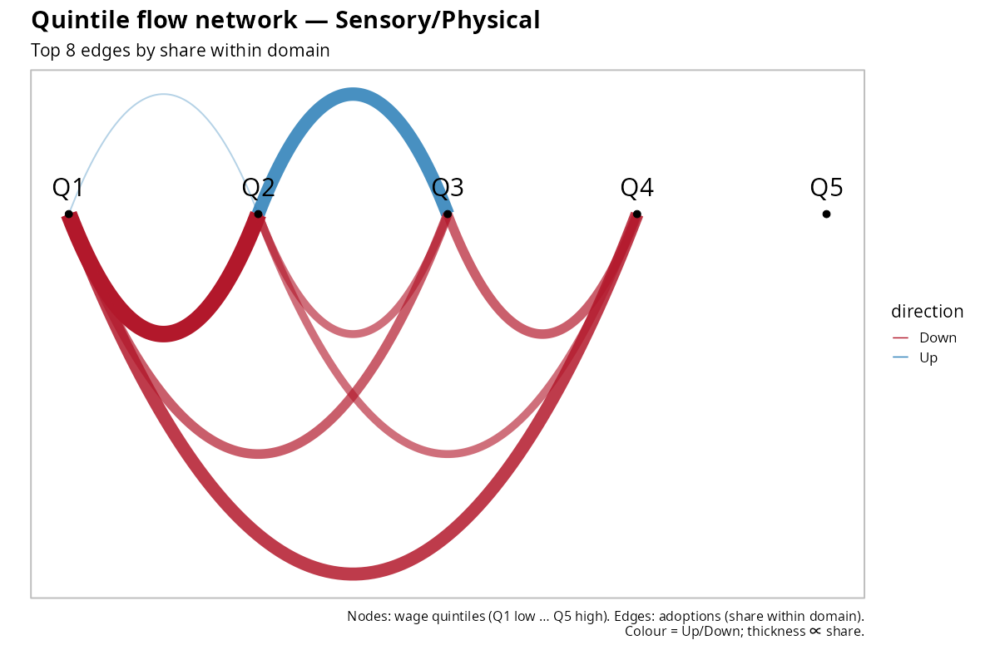
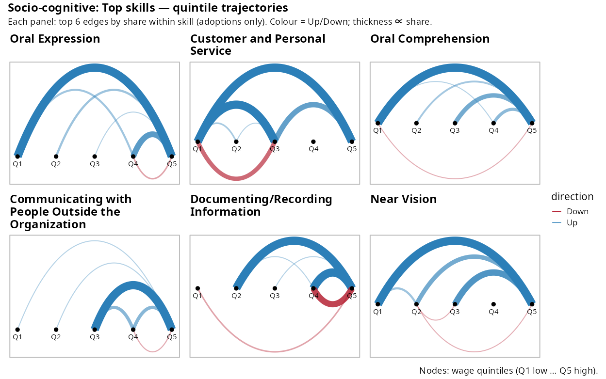
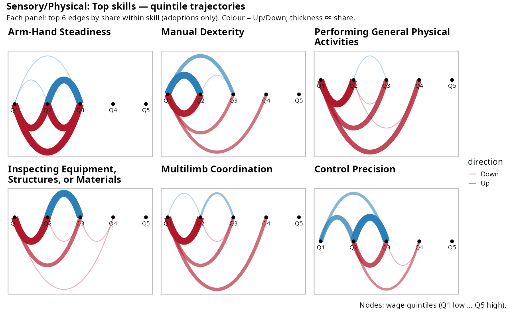
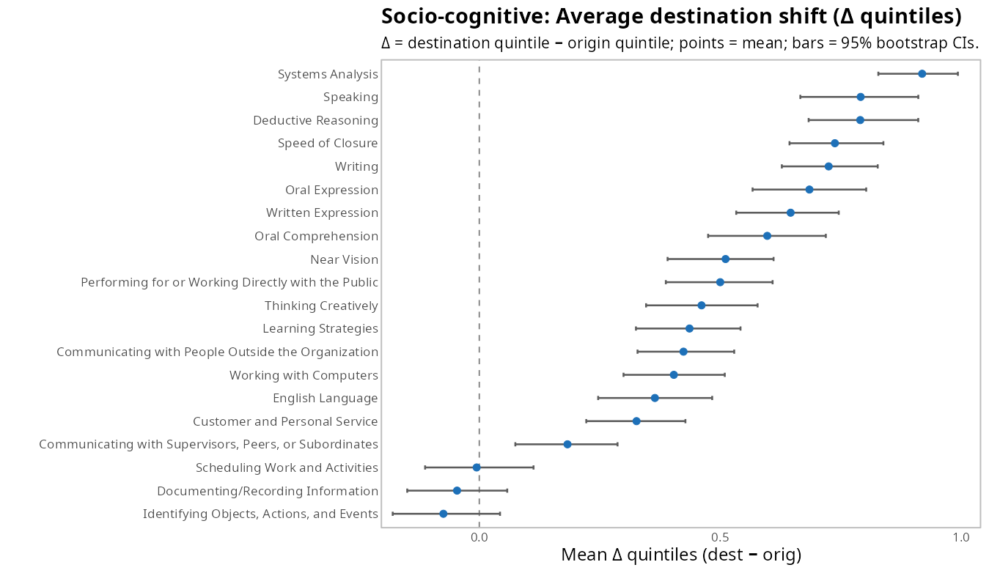
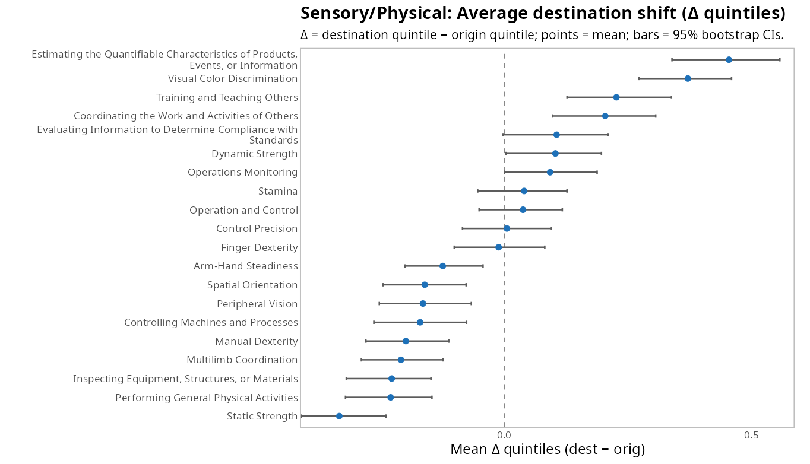
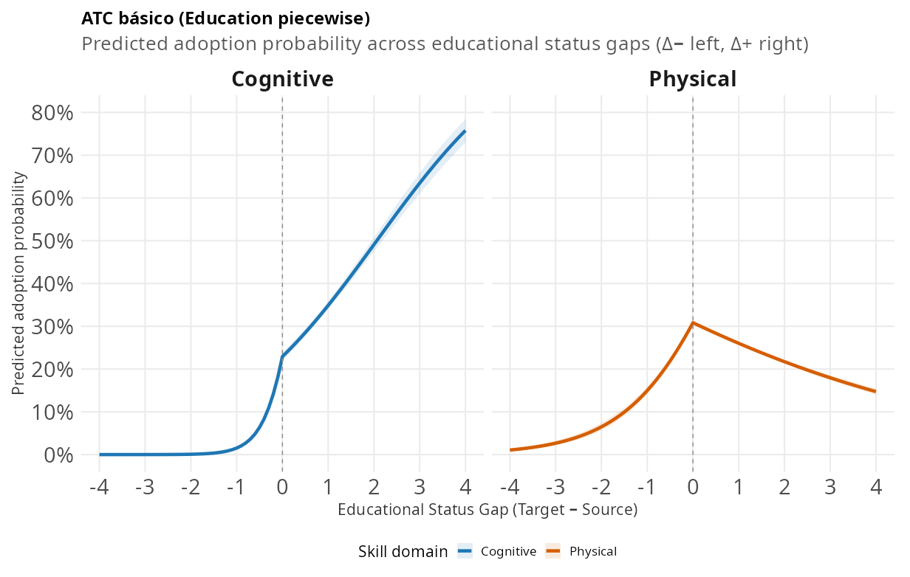
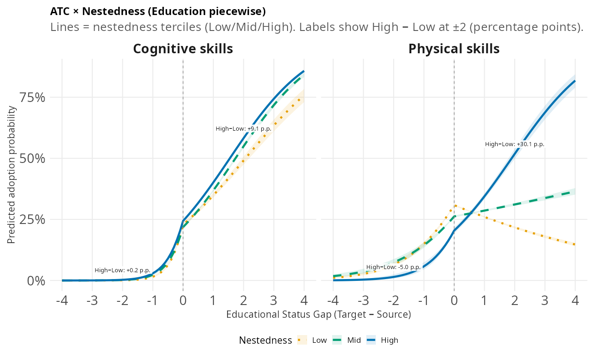

## EL PUZZLE 

::: {.div style="font-size: 28px; text-align: left; margin-top: 2.2em;"}
- El cambio **tecnológico y organizacional** redistribuye la **demanda por tareas** de forma desigual entre ocupaciones.
- Aun con mayor productividad, **la desigualdad puede aumentar**: algunos perfiles suben en demanda y salarios, otros no.
- Sabemos mapear el **paisaje estático** (polarización, fronteras, anidamiento), pero no **la regla que lo activa**.

**Pregunta central**  
> ¿Cómo y por qué ciertos requerimientos **llegan** a unas ocupaciones y **no** a otras cuando cambia la demanda, y **por qué** ese proceso **reproduce** jerarquías de estatus?
:::


## Polarización
::: {.columns}
::: {.column width="50%"}
::: {.div style="font-size: 25px; text-align: left; margin-top: 3em;"}

{out-width="100%"}
:::
:::
::: {.column width="50%"}
::: {.div style="font-size: 25px; text-align: left; margin-top: 3em;"}
{out-width="100%"}
:::
:::
:::

## Anidamiento y jerarquía
::: {.columns}
::: {.column width="50%"}
::: {.div style="font-size: 25px; text-align: left; margin-top: 3em;"}

{out-width="100%"}
:::
:::
::: {.column width="50%"}
::: {.div style="font-size: 25px; text-align: left; margin-top: 3em;"}
{out-width="100%"}
:::
:::
:::
      
      
## Qué falta en la literatura

::: {.div style="font-size: 27px; text-align: left; margin-top: 2.2em;"}
- Sabemos mucho del **mapa estático**:

  - **Polarización** de habilidades (socio-cognitivas vs sensorial/físicas) alineada con educación y salarios.
  - **Fronteras de movilidad** ocupacional: límites, fragmentación, diferenciación.
  - **Anidamiento (nestedness)**: cadenas asimétricas de dependencia (algunas habilidades actúan como “andamiaje”).
  
- **Pregunta abierta (dinámica):** ¿Por **qué regla de propagación** viajan los requisitos ocupación→ocupación, y **cómo** esa regla **reproduce** la jerarquía del mapa?
:::

## Nuestra contribución 

::: {.div style="font-size: 27px; text-align: left; margin-top: 2.2em;"}
- Especificamos y estimamos una **regla de propagación** de adopción $(i\!\to\!j,s)$ con:

  - **Penalidades direccionales** por estatus: $\Delta_{ij}^{+}$ (subida), $\Delta_{ij}^{-}$ (bajada).
  - **Exposición estructural** $\mathbf{X}_{ij}$: complementariedad de skills, relatedness ocupacional, industria, “reach”, co-adopción.
  
- Mostramos un **regularidad macro**: **Asymmetric Trajectory Channeling (ATC)**  
  — *las habilidades socio-cognitivas suben con menor penalidad y menor fricción; las sensorial/físicas quedan lateralizadas y son más sensibles a la distancia*.
  
- La **selectividad aumenta con el anidamiento** de la habilidad (alto $c_s$/reach ⇒ menor penalidad de subida, mayor retorno a la exposición).
:::

## Predicciones preregistradas (teaser)

::: {.div style="font-size: 27px; text-align: left; margin-top: 3em;"}
- **H1 — Penalidad ascendente:** menor para socio-cognitivas que para sensorial/físicas.  
- **H2 — Distancia estructural:** la adopción cae con la distancia; la pendiente es **más fuerte** en sensorial/físicas.
- **H3 — Consecuencia:** la atenuación selectiva de la subida en sensorial/físicas contribuye al **“middle hollowing”** en los portafolios de destino.
:::


# II. QUÉ MEDIMOS: LA “MOLÉCULA” DEL EVENTO {.center .middle background-color="#0a4e58" color="white"}

## Definición (I): unidades y conjuntos 
::: {.div style="font-size: 25px; text-align: left; margin-top: 3em;"}

**Unidad y tiempos.** Tripletas **(origen, destino, requerimiento)** $(i \to j, s)$ entre cortes $t_0$ (línea base) y $t_1$ (seguimiento).

**Conjuntos por $s$:**
$$
S_s=\{\,i:\mathrm{RCA}_{t_0}(i,s)>1\,\}\quad\text{(especialistas en $t_0$)}
$$
$$
A_s=\{\,j:\mathrm{RCA}_{t_1}(j,s)>1\,\}\quad\text{(usuarios en $t_1$)}
$$
$$
N_s=A_s\setminus S_s\quad\text{(nuevos adoptantes)}
$$

**Lectura operativa.** Para cada $s$, $S_s$ “emite” y $N_s$ “recibe” entre $t_0\!\to\!t_1$.

:::

## Definición (II): eventos de difusión 

::: {.div style="font-size: 25px; text-align: left; margin-top: 3em;"}

**Evento positivo (adopción observada):**
$$
E_s^{+}=\{(i,j,s):\, i\in S_s,\ j\in N_s,\ i\neq j\}.
$$

**Evento negativo (oportunidad no realizada):**
$$
E_s^{-}=\{(i,j,s):\, i\in S_s,\ j\notin A_s,\ i\neq j\}.
$$

**Notas.**

- Se evalúa **por descriptor $s$** y **entre $t_0\!\to\!t_1$**.
- $E_s^{+}$ y $E_s^{-}$ forman el **riesgo diádico** para modelar $Y_{i\to j,s}\in\{0,1\}$.

:::

## Definición (III): brechas y exposición {.smaller}

::: {.div style="font-size: 22px; text-align: left; margin-top: 2em;"}

**Brechas direccionales de estatus** (z-score anual: educación o salario):
$$
\Delta_{ij}^{+}=\max\{0,\,\mathrm{status}(j)-\mathrm{status}(i)\},\qquad
\Delta_{ij}^{-}=\max\{0,\,\mathrm{status}(i)-\mathrm{status}(j)\}.
$$
**Propiedades:**
$$
\Delta_{ij}^{+}\Delta_{ij}^{-}=0,\qquad
\Delta_{ij}^{+}+\Delta_{ij}^{-}=|\mathrm{status}(j)-\mathrm{status}(i)|.
$$

**Exposición estructural $\mathbf{X}_{ij}$ (medida en $t_0$):**

- superposición de especialistas (Jaccard),
- **relatedness** occ–occ (coseno, NAICS),
- **historial de co-adopción**. (*)
- **nestedness** \(c_s\): contribución de \(s\) al patrón anidado del sistema  
- **reach**: alcance de dependencia *(tamaño del conjunto alcanzable en la red dirigida de dependencias)*  (*)
- *(controles)* frecuencia (popularidad) / entropía (dispersión) del skill

:::

## La molécula que observamos
::: {.div style="font-size: 25px; text-align: center; margin-top: 5em;"}

```{mermaid}
%% Mermaid v11 – diagrama estilizado
%% Curvas suaves y etiquetas HTML activadas
%% Colores combinados con tu paleta (teal / azul petróleo)
%%{init: {
  "theme": "base",
  "themeVariables": {
    "fontFamily": "Inconsolata, monospace",
    "primaryColor": "#e8f3f6",
    "primaryBorderColor": "#0a6d7c",
    "primaryTextColor": "#0a4e58",
    "lineColor": "#0a6d7c",
    "noteBkgColor": "#fff8e6",
    "noteTextColor": "#374151"
  },
  "flowchart": { "htmlLabels": true, "curve": "basis" }
}}%%
flowchart LR

  %% --- Columnas: t0 a la izquierda, t1 a la derecha ---
  subgraph T0["<b>t₀</b> · línea base"]
    direction TB
    I["<b>i</b>: especialista en <b>s</b>"]
    J["<b>j</b>: no usa <b>s</b>"]
  end

  subgraph T1["<b>t₁</b> · seguimiento"]
    direction TB
    JP["<b>j</b>: ¿adopta <b>s</b>?"]
  end

  %% --- Flechas y anotaciones ---
  I -- "&#160;" --> J
  J -- "&#160;" --> JP

  %% Nota sobre la flecha principal (exposición + brechas)
  M:::note --- J
  M["<b>Exposición</b> (X<sub>ij</sub>)<br/><span style='opacity:.85'>
  Jaccard, 
  dist. skill–skill, 
  relatedness occ–occ, 
  misma NAICS, 
  reach, 
  co-adopción</span><br/><b>brechas</b> (status): Δ<sup>+</sup>, Δ<sup>−</sup>"]

  %% --- Estilos de nodos y subgráficos ---
  classDef box fill:#ffffff,stroke:#0a6d7c,stroke-width:2px,color:#0a4e58;
  classDef group fill:#f4f8fb,stroke:#d9e2ec,stroke-width:1px,color:#0a4e58;
  classDef note fill:#fff8e6,stroke:#f5d48a,stroke-width:1px,color:#374151;

  class I,J,JP box;
  class T0,T1 group;

  %% --- Estilos de enlaces (más gruesos; el segundo punteado) ---
  linkStyle 0 stroke:#0a6d7c,stroke-width:3px;
  linkStyle 1 stroke:#0a6d7c,stroke-width:3px,stroke-dasharray:6 5;

```
:::

# III. DATOS Y DISEÑO {.center .middle background-color="#0a4e58" color="white"}

## Fuentes y universo
::: {.div style="font-size: 25px; text-align: left; margin-top: 3em;"}

- **O-NET SKA (2015–2024)**: 161 descriptores unificados (Skills–Knowledge–Abilities).
- **BLS**: salarios y educación ocupacionales (anuales, z‑score).
- **NAICS**: control por industria; **teletrabajabilidad** y **exposición a IA** para interacciones temporales.

**Unidad de análisis (oportunidad de difusión).** Un triplete $(i\!\to\! j, s)$ tal que, en $t_0$, el **origen** $i$ ya especializa $s$ y el **destino** $j$ aún no: $i\in S_s,\; j\notin S_s,\; i\neq j$, donde
$S_s=\{i:\mathrm{RCA}_{t_0}(i,s)>1\}$.

**Adopción (materialización de la oportunidad).** La oportunidad se concreta si, en $t_1$, el destino $j$ pasa a especializar $s$: $j\in A_s$, con
$A_s=\{j:\mathrm{RCA}_{t_1}(j,s)>1\}$.

:::

## Diagnóstico temporal y calidad

::: {.div style="font-size: 25px; text-align: left; margin-top: 3em;"}
- Cambios sustantivos en la mayoría de pares ocupación–requerimiento.
- Construimos versiones de tres cortes cuando el panel lo permite y verificamos consistencia con la rotación O*NET (eventos de **primera adopción**, intervalo‑censurados).
:::

# IV. QUÉ PASA EN LOS DATOS {.center .middle background-color="#0a4e58" color="white"}

## 
::: {class="plot-slide"}
{.fullbleed}
:::

## 
::: {class="plot-slide"}
{.fullbleed}
:::

## 
::: {class="plot-slide"}
{.fullbleed}
:::

## 
::: {class="plot-slide"}
{.fullbleed}
:::

## 
::: {class="plot-slide"}
{.fullbleed}
:::

## 
::: {class="plot-slide"}
{.fullbleed}
:::

## 
::: {class="plot-slide"}
{.fullbleed}
:::


# V. MODELOS {.center .middle background-color="#0a4e58" color="white"}

## Especificación de dos cortes (logit)
::: {.div style="font-size: 25px; text-align: left; margin-top: 3em;"}
Modelamos la probabilidad de adopción $Y_{i\to j,s}\in\{0,1\}$ con **efectos fijos del origen**:

$$
\operatorname{logit}\,\Pr\!\big(Y_{i\to j,s}=1\big)
= \alpha_c + \boldsymbol{\gamma}_c^{\top}\mathbf{X}_{ij}
- \beta_c^{+}\,\Delta_{ij}^{+}
- \beta_c^{-}\,\Delta_{ij}^{-}
+ \mu_i,
$$

donde $c \in \{\text{socio-cognitivo},\, \text{sensorial/físico}\}$.

**Asimetría direccional** del tipo $c$: $\ \beta_c^{-}-\beta_c^{+}$.

**Interpretación:**

- $\Delta_{ij}^{+}$: “subida” de estatus (destino $>$ origen).  
- $\Delta_{ij}^{-}$: “bajada” de estatus (origen $>$ destino).  
- $\mathbf{X}_{ij}$: exposición/afinidad estructural en $t_0$.  
- $\mu_i$: FE(origen) captura rasgos invariables del emisor (industria, recursos, historia).
:::


## Variante de destino (susceptibilidad a adoptar)
::: {.div style="font-size: 25px; text-align: left; margin-top: 5em;"}

$$
\operatorname{logit}\,\Pr(Y=1)
= \alpha_c + \boldsymbol{\gamma}_c^{\top}\mathbf{X}_{ij}
- \beta_c^{+}\,\Delta_{ij}^{+}
- \beta_c^{-}\,\Delta_{ij}^{-}
+ \nu_j,
$$

y una versión **condicional** con $\mu_i$ y $\nu_j$ (doble FE en estratos diádicos; ver SI).

:::

# VI. RESULTADOS (RESUMEN) {.center .middle background-color="#0a4e58" color="white"}

## 
::: {class="plot-slide"}
{.fullbleed}

:::

## 

::: {class="plot-slide"}
{.fullbleed}

<div class="caption">
Líneas = terciles de nestedness (Low/Mid/High); bandas = IC. La selectividad del ATC se intensifica con el anidamiento, especialmente en habilidades físicas.
</div>
:::

## Lectura rápida (modelo → resultados) 

::: {.div style="font-size: 27px; text-align: left; max-width: 1180px; margin: 0 auto; margin-top: 3em;"}
- **ATC básico:** en **socio-cognitivas**, Δ⁺ eleva la adopción; en **sensoriales/físicas**, la subida se frena y se vuelve frágil.
- **ATC × nestedness:** mayor **anidamiento** ⇒ **más selectividad** (pendientes Δ⁺ más empinadas en físicas; amplificación moderada en cognitivas).
- **Implicancia:** embudo hacia extremos y **middle hollowing** en portafolios de destino.
:::


## Hechos estilizados

::: {.div style="font-size: 25px; text-align: left; margin-top: 3em;"}

- **ATC**: para socio‑cognitivas, **penalidad ascendente atenuada** y **baja sensibilidad a la distancia**; para sensoriales/físicas, **contención lateral** y **alta sensibilidad a la distancia**.
- El patrón persiste con FE(origen), FE(destino) (falta: hazards con intervalos).

:::


## Magnitudes representativas (educación; log-odds) {.smaller}

::: {.div style="font-size: 25px; text-align: left; margin-top: 3em;"}

**FE dual (μᵢ, νⱼ)**

- **Δ⁺ (subida):** Cognitivas **+0.434** (p<1e−8) vs Físicas **−0.786** (int.=−1.22, p<1e−30).  
  ⇒ Subir **favorece** cognitivas y **penaliza** físicas (**H1**).

- **Δ⁻ (bajada):** Cognitivas **+0.045** (ns) vs Físicas **+1.975** (int.=+1.93, p<1e−4).  
  ⇒ Físicas exhiben **sesgo a bajadas/lateralización**.

- **Brecha direccional:** (β⁻−β⁺) Cognitivas **−0.389**; Físicas **+2.76**.

<div class="caption">
Notas: log-odds; controles $\mathbf{X}_{ij}$ y FE de origen/destino incluidos.  
</div>
:::

## Robustez
::: {.div style="font-size: 25px; text-align: left; margin-top: 3em;"}

- **Umbrales:** RCA 0.9/1.0/1.1 y top-$k$ → patrón ordinal **inalterado**.
- **Distancias:** caminos mínimos / resistencia (skill–skill) y coseno (occ–occ) → **mismas pendientes relativas**.
- **Periodos:** 2015–2018 / 2019–2021 / 2022–2024 → **persistencia** del ATC.
- **Representaciones:** habilidad–habilidad y ocupación–ocupación → **coinciden ordinalmente**.
:::

# VII. IMPLICANCIAS {.center .middle background-color="#0a4e58" color="white"}

## Lectura sustantiva

::: {.div style="font-size: 25px; text-align: left; margin-top: 3em;"}
- ATC **traduce** mapas estáticos (polarización, fronteras de movilidad) en **reproducción dinámica**: quién puede subir cuando cambian los requerimientos.
- Identifica **palancas**: reducir penalidades ascendentes o **distancia efectiva** para habilidades sensoriales/físicas conlleva **mayor capilaridad** hacia destinos medios/altos.
:::

## Próximos pasos

::: {.div style="font-size: 25px; text-align: left; margin-top: 3em;"}
- Hazards con intervalos (cloglog, offset de duración, FE de ola) para explotar la rotación O*NET y modelar primera adopción
- validaciones externas (ESCO, UK)
- contrafactuales de “puentes” (co‑especializaciones, pipelines de credenciales).
:::

# GRACIAS {.center .middle background-color="#0a4e58" color="white"}

Roberto Cantillan — <rcantillan@uc.cl>  
Mauricio Bucca — <mbucca@uc.cl>


# Q&A {.center .middle background-color="#0a4e58" color="white"}

## Espacio ocupacional de habilidades

**Ventaja Comparativa Revelada (RCA):**
$$
\mathrm{RCA}(j,s)=
\frac{\mathrm{onet}(j,s)\big/\sum_{s'\in S}\mathrm{onet}(j,s')}
{\sum_{j'\in J}\mathrm{onet}(j',s)\big/\sum_{j'\in J,\;s''\in S}\mathrm{onet}(j',s'')}
$$

- **Lectura:**
  - **Numerador:** proporción de la habilidad $s$ dentro del total de requisitos de la ocupación $j$.
  - **Denominador:** proporción de la habilidad $s$ en toda la economía (todas las ocupaciones).
  - **Criterio:** $\mathrm{RCA}>1 \Rightarrow$ $j$ tiene **ventaja comparativa** en $s$ (uso efectivo).

**Red de complementariedad entre habilidades** *(Leiden → 2 clústeres principales)*:
$$
\theta(s,s') \;=\;
\frac{\sum_{j\in J} e(j,s)\,e(j,s')}
{\max\!\Big(\sum_{j\in J} e(j,s),\ \sum_{j\in J} e(j,s')\Big)}
$$

- $e(j,s)$ indica especialización/uso efectivo de $s$ en $j$ (p.ej., $e=1$ si $\mathrm{RCA}>1$).
- $\theta(s,s')$ mide cuán frecuentemente **co-especializan** $s$ y $s'$ (normalizado por la habilidad más común).


## Construcción de eventos de difusión

::: {.div style="font-size: 25px; text-align: left; margin-top: 3em;"}
**Eventos positivos** *(diffusion = 1)*:

1. **Fuentes:** $S_s=\{\,j:\mathrm{RCA}_{2015}(j,s)>1\,\}$.
2. **Usuarios finales:** $A_s=\{\,j:\mathrm{RCA}_{2024}(j,s)>1\,\}$.
3. **Nuevos adoptantes:** $N_s=A_s\setminus S_s$.
4. **Eventos +:** $\{\, (i,j,s):\ i\in S_s,\ j\in N_s,\ i\neq j \,\}$.

**Eventos negativos** *(diffusion = 0)*:

1. **No adoptantes:** $\overline{A_s}=J\setminus A_s$ (ocupaciones que **no** usan $s$ en 2024).
2. **Eventos −:** $\{\, (i,j,s):\ i\in S_s,\ j\in \overline{A_s},\ i\neq j \,\}$.

**Resultado:** un dataset diádico **exhaustivo** de todas las **oportunidades de difusión** posibles para cada $s$ entre 2015→2024 (positivas y negativas).
:::

## ¿Qué es “nestedness” (1/2) — Operativo 


**Que es:**

- Construimos la matriz binaria de **presencia** $M_{o\times s}$ (ocupación × skill) para un año $t$  
  — presencia por **umbral/RCA** (como en el paper).
- Calculamos la **nestedness observada** $\mathrm{NODF}_{\text{obs}}$ del bipartito.
- Para cada **skill** $s$: fijamos su **grado** $k_s$ (nº de ocupaciones que requieren $s$) y **aleatorizamos su columna** muchas veces manteniendo $k_s$ para obtener la **distribución nula** $\{\mathrm{NODF}^{(s)}_{\text{rand}}\}$.
- Con esa nula, medimos el **aporte marginal** de $s$ a la nestedness del sistema.

**Cómo leerlo:**

- $c_s$ **alto** $\Rightarrow$ $s$ **hace más anidada** la red (actúa como **andamiaje**: p.ej., analítica, gestión, comunicación).
- $c_s$ **bajo** (o negativo) $\Rightarrow$ $s$ **terminal/angosta**; su presencia no estructura el tejido (p.ej., técnica muy específica).

**Parámetros prácticos:**

- Iteraciones $B$: *fast-pass* bajo para exploración; alto en el pase final.
- Presencia por **umbral/RCA**; reportamos robustez.
- Opcional: usar “**reach**”/conectividad para filtrar columnas extremas.


## Q&A • ¿Qué es “nestedness” (2/2) 

**Definición formal (z-score por skill):**
$$
c_s \;=\;
\frac{\mathrm{NODF}_{\text{obs}} - \mathbb{E}\!\left[\mathrm{NODF}^{(s)}_{\text{rand}}\right]}
{\mathrm{sd}\!\left[\mathrm{NODF}^{(s)}_{\text{rand}}\right]}
$$

**Pseudocódigo (idea):**

1. $M \leftarrow$ matriz de presencia $o\times s$ en $t$.  
2. $\mathrm{NODF}_{\text{obs}} \leftarrow \mathrm{NODF}(M)$.  
3. **Para cada** $s$:  
   a. $k_s \leftarrow \sum_o M_{os}$ (grado).  
   b. **Repetir** $b=1,\dots,B$: muestrear $k_s$ ocupaciones, construir $M^{(b)}$ con la columna $s$ permutada a grado fijo $\Rightarrow$ $\mathrm{NODF}^{(b)}$.  
   c. $c_s \leftarrow$ z-score con $\{\mathrm{NODF}^{(b)}\}_{b=1}^B$.

**Interpretación rápida:**

- $c_s$ alto $\Rightarrow$ “**abre escalones**” y **reduce huecos** (andamiaje).
- $c_s$ bajo $\Rightarrow$ **capacidad terminal** (poco efecto en la arquitectura).


